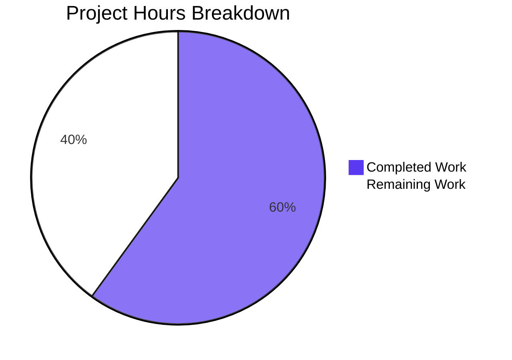

# 1. Executive Summary

What the delivered two-route Express service does, what was exercised to prove it works, and what remains before deployment.

## 1.1 Project Overview

Quicktest is a minimal HTTP service. A single Node.js CommonJS file builds an Express application that answers two fixed text responses — `GET /` with `Hello, World!\n` and `GET /good-evening` with `Good evening\n` — and listens on port 3000. The tracked codebase is two files: `server.js` (240 bytes) and `package.json` (93 bytes); there is no UI, data layer, authentication or external integration.

## 1.2 Completion Status

**60% complete** — 12 hours completed of 20 hours scoped, 8 hours remaining.

Calculation: Completed hours 12 ÷ (Completed 12 + Remaining 8) × 100 = 60%.



Brand colours: Completed Work — Blitzy dark blue `#5B39F3`; Remaining Work — white `#FFFFFF`.

| Metric | Hours |
|---|---|
| Total Hours | 20 |
| Completed Hours (AI + Manual) | 12 |
| Remaining Hours | 8 |

## 1.3 Key Accomplishments

- `GET /good-evening` returns exactly `Good evening\n` (13 bytes) at status 200 as `text/plain; charset=utf-8`.
- `GET /` still returns `Hello, World!\n` (14 bytes), byte-for-byte identical to the pre-change response.
- Express is the sole dependency, declared `^5` in a three-field manifest, resolving to express 5.3.0 with no known advisories.
- `node server.js` prints the same 41-byte startup line and binds TCP 3000 on all interfaces, with nothing on stderr.
- Every other method and path falls to the framework's default 404, with no handler, middleware or configuration added.
- The change adds no test, documentation, CI or configuration artefact.
- Both responses were confirmed byte-exact on the wire, in a browser, across restarts and after a clean reinstall.
- Under hostile input the endpoints stay intact: no disclosure, injection or reflection, and no 5xx.

## 1.4 Critical Unresolved Issues

Four items remain open of the 21 requirements this change was scoped against. All are path-to-production gaps rather than unfinished deliverables: the routes, the dependency and the launch behaviour are complete.

| Issue | Impact | Owner | ETA |
|---|---|---|---|
| The startup line is printed and the process exits 0 when the bind fails, so a failed start looks successful | A supervisor or orchestrator can treat a dead service as healthy | Backend / Platform | 2 h |
| Dependency resolution is unpinned: the range floats within `^5` and no lockfile exists | A deploy can resolve a different 5.x than the verified express 5.3.0 | Release engineering | 1 h |
| No TLS, no rate or size limits and no response-header hygiene in the application, and port 3000 binds all interfaces | Exposing the port directly puts both routes in clear text and leaves them unthrottled | Platform / DevOps | 4.5 h |
| Build output is untracked with no ignore rule | A blanket `git add -A` would commit 65 packages (~4.3 MB) | Repository maintainer | 0.5 h |

## 1.5 Access Issues

| System/Resource | Type of Access | Issue Description | Resolution Status | Owner |
|---|---|---|---|---|
| npm public registry (`registry.npmjs.org`) | Network access for dependency installation | Required for the lockfile-free install; no credentials, tokens or `.npmrc` are involved | Available — install verified (exit 0, express 5.3.0, 65 packages) | n/a |
| Dependency advisory scanning | Tooling | `npm audit` cannot run in the repository because no lockfile exists (`ENOLOCK`); advisories must be scanned from a throwaway lockfile or by a registry-side scanner | Workaround available — 0 advisories across the 65-package closure | Repository maintainer |
| TCP port 3000 | Network / port | The port is a hardcoded literal with no environment lookup, so a second listener cannot share it on one host and the service cannot be relocated by configuration | Workaround available — validation runs in an isolated network namespace, or with the port free | Platform |

## 1.6 Recommended Next Steps

1. [High] Settle the start signal on a failed bind so a dead service is never reported live (2 h).
2. [High] Terminate TLS upstream, keep port 3000 unreachable from outside, and add rate and size limits (2.5 h).
3. [Medium] Replace the log line with an external liveness probe and remove the framework disclosure header (1.5 h).
4. [Medium] Adopt a dependency-reproducibility policy for the floating range and no lockfile (1 h).
5. [Low] Add an ignore rule for build output and note the changed response semantics for consumers (1 h).

# 2. Project Hours Breakdown

## 2.1 Completed Work Detail

| Component | Hours | Description |
|---|---|---|
| Express application and the two-route contract (`server.js`) | 4 | The single CommonJS statement re-expressed on an Express application: the preserved `GET /` route returning the 14-byte response, the new `GET /good-evening` route returning the 13-byte response, the media type set on both, and status left to the framework default, in the file's existing compact style. |
| Manifest and sole dependency (`package.json`) | 2 | The three-field manifest declaring `express ^5`, and the lockfile-free install path that resolves it to express 5.3.0 as a 65-package closure without creating a lockfile. |
| Runtime verification of both routes and the process lifecycle | 4 | Status, media type, headers and byte-exact bodies of both routes compared against a pre-change control; the framework's default response for every other method and path; boot, restart, signal, port-release and log-stream behaviour; a browser pass over both routes. |
| Endpoint security-posture and supply-chain verification | 2 | Disclosure, injection, reflection, header, CORS, transport, session, framing and bounded-load probes of both endpoints, plus advisory resolution across the sole dependency's closure. |
| **Total** | **12** | |

## 2.2 Remaining Work Detail

| Category | Hours | Priority |
|---|---|---|
| Start-signal correctness on a failed bind | 2 | High |
| Edge and deployment readiness — TLS termination, request-rate and request-size limits, connection timeouts, response-header hygiene, an external liveness probe, and a note for existing consumers on the changed response semantics | 4.5 | Medium |
| Dependency reproducibility for deployment | 1 | Medium |
| Repository hygiene for untracked build output | 0.5 | Low |
| **Total** | **8** | |

These 8 hours are path-to-production work; no part of the requested change is unfinished. Completed 12 hours + remaining 8 hours = 20 total hours, and 12 ÷ 20 × 100 = 60% complete. Each category traces to a concrete production need: the start-signal line to the bind-failure behaviour described in Section 5.2, the edge line to the absent transport and throttling controls, the dependency line to the floating range that no lockfile pins, and the hygiene line to untracked install output with no ignore rule in the repository.

# 3. Test Results

The repository has no test runner, no linter and no CI. Verification was performed with procedure-based probes — `node --check`, the lockfile-free install, `curl`, `od -c`, raw sockets, process and signal observation, and a headless Chrome session — executed against the running service. The table aggregates every case executed by capability; 1,287 cases were executed and passed.

| Area / Category | Framework | Tests | Passed | Failed | Coverage | What This Proves |
|---|---|---|---|---|---|---|
| Contract responses — `GET /` and `GET /good-evening`: status, media type, headers and byte-exact bodies, plus the framework's default for every other method and path | `curl`, `od -c`, raw-socket clients, browser fetch (no test runner in the repository) | 362 | 362 | 0 | n/a | Both fixed responses are served exactly as specified, the preserved one is byte-identical to what the service returned before the change, and no other path or method is answered by application code. |
| Dependency, manifest and lockfile-free install | `npm install`/`npm ls`, JSON key assertions, CommonJS boot with a `type: module` negative control | 338 | 338 | 0 | n/a | The manifest carries exactly the three permitted fields and one dependency, resolves to express 5.3.0, installs repeatably with no lockfile, and loads under `require`. |
| Process lifecycle, startup notification and output hygiene | process and signal probes, stdout/stderr byte comparison, descriptor and socket inspection | 110 | 110 | 0 | n/a | On a successful start the service binds TCP 3000 with no host argument, prints one exact 41-byte line, writes nothing to stderr, and stops and restarts cleanly. |
| Endpoint and transport security posture | traversal, injection, reflection, header, CORS, session, framing, verb and bounded-load probes, plus browser execution | 477 | 477 | 0 | n/a | Neither endpoint discloses a file, manifest, dependency or system detail, executes or reflects anything, accepts a write, or returns a 5xx under malformed, oversized or hostile input. |

### Not Covered

- **Automated regression guard.** No test runner, linter, type-check or CI exists in the repository, so nothing re-checks these values after a future edit; the acceptance procedure in Section 9 must be run by hand.
- **Long-run and sustained-load behaviour.** Exercised to a bounded 200-request concurrent burst; no soak profile, memory trend or uptime characteristic over hours or days exists.
- **Deployment surfaces.** No container, orchestrator manifest, reverse-proxy, TLS or rate-limit configuration exists in the repository, so none of that behaviour could be exercised.
- **Dependency resolution over time.** The range floats within `^5` and no lockfile pins it, so a future install can resolve a different 5.x than the express 5.3.0 exercised here.
- **The bind-failure start signal.** Observed and characterised directly, but it reaches no pass or fail verdict because its only settlements lie outside the constraints the change was built under; it is carried as an open divergence in Section 5.2 and as a risk in Section 6.

# 4. Runtime Validation & UI Verification

- ✅ **`GET /`** — driven on the wire and in a browser: 200, `Content-Type: text/plain; charset=utf-8`, `Content-Length: 14`, body `Hello, World!\n`, byte-identical to the response of the pre-change service; stable across restarts, a clean reinstall and 160 sequential requests.
- ✅ **`GET /good-evening`** — 200, `Content-Type: text/plain; charset=utf-8`, `Content-Length: 13`, body `Good evening\n`; identical result from `curl`, from a raw socket and rendered in the browser.
- ✅ **Start-up** — `node server.js` binds TCP `*:3000` with no host argument, prints its single 41-byte startup line once, and writes nothing to stderr.
- ✅ **Shutdown and restart** — SIGINT and SIGTERM terminate with exit codes 130 and 143, release the port, and repeated cold starts produce identical behaviour.
- ✅ **Install and boot from a clean checkout** — deleting `node_modules/` and running the documented lockfile-free install, then starting the service, serves both routes with byte-exact bodies.
- ✅ **Unmatched method and path** — the framework's stock 404 `text/html` page, with no custom handler, for `POST`, `PUT`, `DELETE`, `PATCH` and unknown paths alike.
- ✅ **Malformed and hostile input** — traversal paths, injection payloads, CRLF and oversized framing leave the two contract responses unchanged, return 400/431 for malformed framing, and produce no 5xx.
- ✅ **Browser rendering** — both routes loaded in headless Chrome: correct body, no console error, no exception and no injected content.
- ⚠ **Start signal on an occupied port** — the startup line is printed and the process exits 0 holding no socket, where the pre-change service exited 1 with an unhandled error; this needs a human decision (Section 5.2).
- ❌ **None** — no flow is failing.

Never exercised at runtime: there is no screen, static asset or client-side JavaScript to validate, so the browser session covered the HTTP responses only; no authentication, session or credential flow exists because neither endpoint reads the request; no data layer, queue or filesystem write is reached by any request; the service makes no outbound call to any external system; no TLS, rate-limiting, request-size or connection-timeout control exists to exercise, and none can be added inside the application; and no container, orchestrator or proxy configuration exists under which the service could be started.

# 5. Compliance & Quality Review

## 5.1 Compliance Matrix

| Deliverable | Benchmark | Status | Verified Evidence |
|---|---|---|---|
| Scope discipline — only the named files change | Minimal diff, no unrelated edit | **PASS** | Diff against the baseline is `A package.json`, `M server.js`; no third path, no deletion, no rename. |
| New route contract (`GET /good-evening`) | Contract fidelity | **PASS** | 200, `text/plain; charset=utf-8`, `Content-Length: 13`, body `Good evening\n` byte-exact. |
| Preserved route (`GET /`) | No regression in the returned body | **PASS** | 14 bytes, byte-identical to the pre-change service's response body. |
| Dependency introduction (`express`) | Sole, declared dependency | **PASS** | One dependency declared `^5`, resolved to express 5.3.0, 65-package closure, 0 advisories. |
| Manifest field constraint | Only the permitted fields present | **PASS** | Key set is exactly `name`, `version`, `dependencies`. |
| Lockfile prohibition | No lockfile created or committed | **PASS** | Install runs with `--no-package-lock` (exit 0); `ls package-lock.json` reports no such file. |
| Absence of forbidden artefacts | No test, documentation, CI, configuration or hardening artefact | **PASS** | None exists in the tree; `server.js` has no handler, middleware, environment lookup or explicit status call. |
| Code style and module mode | Existing file style, CommonJS | **PASS** | One chained statement on one line with the original arrow-handler style; no `type` field, `require` resolves at boot. |
| Static gate | Syntax validity | **PASS** | `node --check server.js` exits 0. |
| Runtime acceptance | Both routes, headers, byte-exact bodies, no lockfile | **PASS** | Executed end to end against the running service. |
| Endpoint security posture | No disclosure, injection, reflection, write or crash | **PASS** | Traversal, injection, reflection, framing, verb and load probes: constant bodies, 0 signatures, 0 5xx. |
| Operational readiness | Trustworthy start signal, reproducible deployment | **PARTIAL** | The bind-failure start signal is misleading, the dependency range is unpinned, and no edge controls exist. |

## 5.2 AAP & Rule Divergences and Gaps

| What the AAP/Rule Required | What Was Delivered Instead | Why It Diverged | Impact | Remediation |
|---|---|---|---|---|
| The startup notification is printed after a successful bind | The line is printed, stderr stays empty and the process exits 0 when port 3000 is already held, with no listener | The prescribed `.listen(3000, …)` tail was carried over character for character and no error handler may be added; in express 5.3.0 the listen callback also serves as the server's error listener | A supervisor or orchestrator can treat a failed start as healthy | Human decision: probe the port externally, or change the listen wiring outside the original constraints (2 h) |
| Keep the existing `/` route returning `Hello, World!\n` unchanged | The body is unchanged byte for byte, but the response now also carries `text/plain; charset=utf-8`, `ETag` and `X-Powered-By: Express`, where it previously carried no `Content-Type` | The route's media type is set deliberately on both routes so a string body is not labelled `text/html`; the request froze the body rather than the headers | Any consumer keying on the absence of a media type, or on response headers, sees a change | None required; a proxy can remove the disclosure header if the deployment prefers (part of the edge work) |
| The existing `/` response is preserved | The old catch-all is narrowed: only `GET /` returns it, and every other method or path gets the framework's stock 404 `text/html`; matching is case-insensitive and non-strict | Unavoidable once path and method select the response; the named response was carried over rather than the catch-all handler, and no fallback handler was added | Clients that relied on the old catch-all behaviour change; future allow/deny lists must mirror the framework's matching | None for the contract; note the changed semantics for existing consumers (0.5 h) |

**Failed-bind start signal.** The startup notification is the one place the delivered behaviour departs from what the specification states. The specification has the line printed after a successful bind; in the delivered code the listen callback is also the server's error handler, so when port 3000 is already occupied the process prints `Server running at http://127.0.0.1:3000/`, writes nothing to stderr, holds no socket and exits 0 (`server.js:1`). The pre-change service instead exited 1 with an unhandled error, so a supervisor or orchestrator that waits for the line or trusts the exit status can now believe a dead service is healthy. Every settlement changes the frozen launch tail, which is why this is put to you rather than fixed.

**Preserved route's header set.** The request asked that the existing `/` route keep returning `Hello, World!\n` unchanged, and its body does: 14 bytes, byte-identical to the pre-change response. The response as a whole is not unchanged, because the media type is set on both routes so the string body is not misleadingly labelled `text/html`, and the framework adds its own `ETag` and `X-Powered-By: Express` headers (`server.js:1`). The route previously carried no `Content-Type` at all. This was a deliberate decision taken while building the change, recorded here because a whole-response reading of "unchanged" sees more than the body. No consumer action is required unless something keys on the absence of a media type.

**Narrowed catch-all.** Before the change, every method on every path returned `Hello, World!\n` from a single handler. Introducing method-and-path routing cannot preserve that: only `GET /` now returns it, and every other method or path receives the framework's stock 404 `text/html` page (`server.js:1`). The change was built to carry the named response over rather than the catch-all behaviour that produced it, and no fallback handler was added. Matching is also case-insensitive and non-strict, so `/GOOD-EVENING`, `/good-evening/` and `//` serve the same bodies. Any client that relied on the old catch-all, and any future path allow-list or deny-list, must account for this.

**Basis for finding nothing else.** The delivered `server.js` is character-for-character the prescribed statement, and `package.json` holds exactly the prescribed values, so every remaining requirement was settled by direct comparison rather than inference. No user rules exist for this project — no coding standard, mandated component or protected file — so no rule divergence is possible; the change was held instead to its own scope constraints and produced no unrequested artefact.

# 6. Risk Assessment

| Risk | Category | Severity | Probability | Mitigation | Status |
|---|---|---|---|---|---|
| A failed bind reports success: the startup line is printed and the process exits 0 holding no socket when port 3000 is occupied | Operational | High | Medium | Probe the port or an HTTP endpoint instead of the log line, or make a failed bind distinguishable in the listen wiring | Open |
| Both routes would travel in clear text on all interfaces if port 3000 were exposed directly — the listener has no TLS | Security | High | Medium | Terminate TLS upstream and keep port 3000 unreachable from outside the host | Open |
| No rate limiting and no request-size limit beyond the framework's 16 KB header cap; a client that declares a body and never sends it holds a connection until the request timeout | Security | Medium | Medium | Enforce request-rate and request-size limits and connection timeouts at the edge | Open |
| The dependency range floats within `^5` and no lockfile pins it, so a later deploy can resolve a different 5.x than the verified express 5.3.0 | Technical | Medium | Medium | Pin the version at deploy time or install from a controlled mirror, and record the resolved version with the release | Open |
| No automated gate exists — no test runner, linter, type-check or CI — so nothing re-checks the contract values after a future edit | Technical | Medium | Medium | Script the acceptance procedure of Section 9 as a pipeline job once the repository's file constraints allow it | Open |
| The framework discloses itself and no security headers are emitted (`X-Powered-By: Express`; no CSP, HSTS, `X-Frame-Options` or `Cache-Control`) | Security | Low | Low | Strip the disclosure header and add the security headers at the proxy | Open |
| Route matching is case-insensitive and non-strict, so `/GOOD-EVENING`, `/good-evening/` and `//` reach the same responses | Integration | Low | Low | Write any future path allow-list, deny-list or WAF rule to match exactly what the framework matches | Open |
| The narrowed catch-all and the added media type change the response for anything that consumed the previous catch-all behaviour | Integration | Medium | Low | Give the changed response semantics to the service's consumers before release | Open |

# 7. Visual Project Status


Brand colours: Completed Work — Blitzy dark blue `#5B39F3`; Remaining Work — white `#FFFFFF`.

**Completed vs remaining: 12 h of 20 h — 60% complete.**

Remaining hours by category:

| Remaining Category | Hours | Priority |
|---|---|---|
| Start-signal correctness on a failed bind | 2 | High |
| Edge and deployment readiness | 4.5 | Medium |
| Dependency reproducibility for deployment | 1 | Medium |
| Repository hygiene for untracked build output | 0.5 | Low |
| **Total** | **8** | |

# 8. Summary & Recommendations

Quicktest delivers exactly the change it was scoped for: a two-route Express service in which `GET /` still answers `Hello, World!\n` and `GET /good-evening` answers `Good evening\n`, both as `text/plain; charset=utf-8` at status 200. The tracked codebase is two files — `server.js` (240 bytes) and `package.json` (93 bytes) — and both were confirmed first-hand: the two response contracts byte-exact on the wire, express 5.3.0 as the sole dependency installed without a lockfile and with no known advisories across its 65-package closure, and the original launch behaviour preserved, binding TCP 3000 on all interfaces and printing its single startup line once with nothing on stderr. All 21 of the AAP's requirements are complete; nothing the request asked for is unfinished.

Against that, the project is **60% complete** — 12 hours of the 20 hours scoped — because the completion measure carries path-to-production work that the repository cannot satisfy within its own constraints. The remaining 8 hours are not missing features. They are the things an operator needs before this service is safe and reliable in production: a start signal that cannot report success on a failed bind (2 h, high priority), edge controls the application may not contain — TLS termination, request-rate and request-size limits, connection timeouts, a liveness probe and response-header hygiene (4.5 h, medium), a dependency-reproducibility policy for a range that floats within `^5` with no lockfile to pin it (1 h, medium), and an ignore rule for untracked install output (0.5 h, low).

Three divergences from the specification are documented in Section 5.2 and each carries a decision for you rather than a defect. The most consequential is operational: when port 3000 is already held, the service prints its startup line, writes nothing to stderr and exits 0 without ever binding, where the pre-change server exited 1 with an unhandled error. Any supervisor or orchestrator that waits for that line or trusts the exit status can now believe a dead service is healthy, and every settlement to that lies outside the constraints the change was built under — which is why it is put to you. The other two are narrower: the preserved route's body is byte-identical but its response now carries a media type and framework headers where it previously carried none, and the old catch-all narrowed to `GET /`, so every other method and path receives the framework's stock 404.

The critical path to production is short and runs outside this repository. Terminate TLS upstream and keep port 3000 unreachable from outside the host; enforce request-rate and request-size limits and connection timeouts at the edge; give the process an external TCP or HTTP liveness probe so its health never depends on the log line; pin or mirror the dependency at deploy time and record the resolved version with the release; and tell any existing consumer that the response semantics changed. None of these require editing `server.js` — they are packaging and edge configuration, which is precisely why they remain open.

Production readiness: the requested change is **ready to ship as code** — it is correct, verified and complete, with no failing flow and no unresolved defect in the delivered behaviour. What stands between it and a safe deployment is entirely operational: transport security, throttling, a trustworthy liveness signal and dependency pinning. The one item that must not be deferred is the start signal, because it degrades a failure mode that the service previously surfaced cleanly. Close it, and the remaining four are routine platform work. Success for this release is defined by the acceptance procedure in Section 9 running green on the deployed artefact: install with no lockfile, both routes returning their exact 13- and 14-byte bodies, and `ls package-lock.json` reporting no such file.

| Metric | Value |
|---|---|
| AAP-scoped completion | 60% (12 of 20 hours) |
| AAP requirements complete | 21 of 21 |
| Open items | 4 of 21 requirements — 1 High, 2 Medium, 1 Low |
| Test cases executed and passed | 1,287 of 1,287 |
| Tracked files changed | 2 (`server.js`, `package.json`) |
| Declared dependencies | 1 (`express ^5` → 5.3.0, 0 advisories) |

# 9. Development Guide

This guide builds, runs and verifies the service exactly as the host does. Every command below was executed against this checkout and produced the output shown.

### System Prerequisites

| Requirement | Version |
|---|---|
| Operating system | Linux (Ubuntu 25.10 in this environment) |
| Node.js | v22.23.3 (`/usr/bin/node`) — satisfies the `^5` express range |
| npm | 11.18.0 (`/usr/bin/npm`) |
| Installed runtime | `curl`, `od` (BSD coreutils), `ss`/`lsof`, `iproute2` (`ip`), `unshare` |
| Editor / terminal | Any |

The note that this image ships "Node 20" is stale: the runtime actually installed and used is Node v22.23.3 with npm 11.18.0. Do not introduce `nvm`, `volta` or another Node version.

### Environment Setup

The repository has no virtual environment and needs none — `node_modules/` inside the checkout *is* the dependency environment. There is no `.env` file, no configuration file and no service dependency. Confirm the toolchain first:

```bash
node -v    # v22.23.3
npm -v     # 11.18.0
git ls-files    # package.json
                # server.js
```

### Dependency Installation

Install from the manifest, without a lockfile. `--no-package-lock` is mandatory — the repository must not gain a `package-lock.json`:

```bash
CI=true npm install --no-package-lock
```

Expected: exit 0, express 5.3.0 resolved, 65 packages, `found 0 vulnerabilities`. Do **not** run plain `npm install` (it would write a lockfile) and do **not** run `npm ci` (there is no lockfile to install from). Verify the sole dependency and the absence of a lockfile:

```bash
npm ls --depth=0
# quicktest@1.0.0
# └── express@5.3.0

ls package-lock.json
# ls: cannot access 'package-lock.json': No such file or directory
```

### Application Startup

Run the service in the foreground:

```bash
node server.js
# Server running at http://127.0.0.1:3000/
```

It binds TCP **3000 on all interfaces** and prints exactly that one line. The port is a hardcoded literal — there is no `PORT` lookup, so an environment variable cannot relocate the service. Stop it with `Ctrl-C` (exit 130).

Port 3000 is host-global and shared across checkouts on this machine, and it cannot be partitioned by configuration. To run a runtime check without squatting it, run inside a private network namespace, where each checkout can bind 3000 at once:

```bash
unshare -rn bash -c '
  ip link set lo up
  node server.js > "$HOME/app.log" 2>&1 &
  pid=$!
  sleep 1
  curl -s -i http://127.0.0.1:3000/
  curl -s -i http://127.0.0.1:3000/good-evening
  kill $pid
'
```

A fresh namespace's loopback interface is **down**, so `ip link set lo up` is required or `curl` silently returns nothing.

### Verification Steps

There is no test runner, linter or CI in this repository, so verification is the acceptance procedure run by hand. Run it from the repository root whenever `server.js` or `package.json` changes.

**1. Static gate** — syntax must be valid:

```bash
node --check server.js && echo "syntax OK"
# syntax OK
```

**2. Install gate** — repeatable, lockfile-free install (above), then confirm no lockfile was written:

```bash
ls package-lock.json    # must report: No such file or directory
```

**3. Runtime gate** — start the service (or use the namespace snippet) and check both routes for status, media type, length and byte-exact body:

```bash
curl -s -i http://127.0.0.1:3000/
# HTTP/1.1 200 OK
# Content-Type: text/plain; charset=utf-8
# Content-Length: 14
# ...

curl -s -i http://127.0.0.1:3000/good-evening
# HTTP/1.1 200 OK
# Content-Type: text/plain; charset=utf-8
# Content-Length: 13
# ...

curl -s http://127.0.0.1:3000/ | od -c
# 0000000   H   e   l   l   o   ,       W   o   r   l   d   !  \n
# 0000016

curl -s http://127.0.0.1:3000/good-evening | od -c
# 0000000   G   o   o   d       e   v   e   n   i   n   g  \n
# 0000015
```

Expected: `GET /` → 200, `text/plain; charset=utf-8`, 14 bytes, `Hello, World!\n`; `GET /good-evening` → 200, `text/plain; charset=utf-8`, 13 bytes, `Good evening\n`. An unmatched path is expected to return Express's stock 404 `text/html` — that is the correct behaviour, not a fault.

**4. Clean-checkout gate** — remove build output, reinstall, restart, and re-run step 3:

```bash
rm -rf node_modules
CI=true npm install --no-package-lock
node server.js
```

### Example Usage

```bash
# Start in the background and capture its pid
node server.js > app.log 2>&1 &
SERVICE_PID=$!
echo "$SERVICE_PID"          # the pid you will stop the service with

# Exercise both contract routes
curl -s http://127.0.0.1:3000/               # Hello, World!
curl -s http://127.0.0.1:3000/good-evening   # Good evening

# Confirm the framework's default for everything else
curl -s -o /dev/null -w '%{http_code}\n' http://127.0.0.1:3000/nope      # 404
curl -s -o /dev/null -w '%{http_code}\n' -X POST http://127.0.0.1:3000/  # 404

# Stop the service by the pid you captured
kill "$SERVICE_PID"
```

### Troubleshooting

| Symptom | Cause | Resolution |
|---|---|---|
| `Error: listen EADDRINUSE: address already in use` | Another process already holds port 3000, which is a hardcoded literal | Free the port, or run the check inside `unshare -rn` as shown above |
| The service prints `Server running at http://127.0.0.1:3000/` but nothing is listening | The bind failed while the port was held; the startup line is printed and the process exits 0 without a socket | Never trust the log line or the exit status to mean "live" — probe the port itself (`ss -ltn` or an HTTP request). This is the open item in Section 5.2 |
| `PORT=8080 node server.js` still listens on 3000 | The port is a literal with no environment lookup | Relocate the service in the edge/proxy layer, not in the application |
| A request returns 304 with an empty body | Conditional request with a matching validator; both responses carry an `ETag` | Use a cache-busting header (`curl -H 'Cache-Control: no-cache'`) when re-checking response bodies |
| `npm audit` fails with `ENOLOCK` | There is deliberately no lockfile to audit against | Scan advisories from a throwaway lockfile outside the repository, or use a registry-side scanner; do not commit a lockfile |
| `git status` shows `?? node_modules/` | Build output is untracked and there is no ignore rule | Add files by name (`git add server.js package.json`); never use `git add -A` or `git add .` |
| `git add -A` staged 65 directories | The same untracked build output | `git reset` and add the two tracked files by name; the ignore rule is an open low-priority task in Section 2.2 |

# 10. Appendices

### A. Command Reference

| Command | Purpose |
|---|---|
| `node -v` / `npm -v` | Confirm the toolchain (expect v22.23.3 / 11.18.0) |
| `CI=true npm install --no-package-lock` | Install the sole dependency without writing a lockfile |
| `npm ls --depth=0` | Show the resolved top-level dependency tree |
| `node --check server.js` | Static syntax gate |
| `node server.js` | Start the service; binds TCP 3000, prints one startup line |
| `ss -ltn` / `lsof -i :3000` | Confirm what is listening on port 3000 |
| `curl -s -i http://127.0.0.1:3000/` | Headers and status for the preserved route |
| `curl -s -i http://127.0.0.1:3000/good-evening` | Headers and status for the new route |
| `curl -s http://127.0.0.1:3000/ \| od -c` | Byte-exact body of `GET /` |
| `curl -s http://127.0.0.1:3000/good-evening \| od -c` | Byte-exact body of `GET /good-evening` |
| `ls package-lock.json` | Must report "No such file or directory" |
| `git ls-files` | The tracked tree (exactly `package.json`, `server.js`) |
| `git status --short` | Shows only `?? node_modules/` |
| `git add server.js package.json` | Stage the two tracked files by name — never `git add -A` |
| `unshare -rn bash -c '…'` | Run a runtime check in a private network namespace |

### B. Port Reference

| Port | Protocol | Bind | Used By | Notes |
|---|---|---|---|---|
| 3000 | TCP (HTTP) | `*:3000` on all interfaces, no host argument | `server.js` HTTP listener | Hardcoded literal, no `PORT` lookup; not configurable; host-global, so a second listener on the same host needs a separate network namespace |

### C. Key File Locations

| Path | Role |
|---|---|
| `server.js` | The entire application: one CommonJS statement building the Express app, registering both routes and calling `listen(3000, …)` |
| `package.json` | The manifest: `name`, `version`, `dependencies.express` — three fields only |
| `node_modules/` | Untracked install output (65 packages, ~4.3 MB); never commit |

Not present by design: no `README.md`, no `.gitignore`, no lockfile, no test directory, no CI or build configuration, no `.env`, no container or proxy configuration.

### D. Technology Versions

| Component | Version |
|---|---|
| Node.js | 22.23.3 |
| npm | 11.18.0 |
| express | 5.3.0 (declared `^5`) |
| Module system | CommonJS (`require`); no `type` field in the manifest |
| HTTP client used for verification | `curl` and raw sockets |

### E. Environment Variable Reference

None. The service reads no environment variable: the port is the literal `3000` and there is no `NODE_ENV`, `PORT`, host or log-level lookup. Setting any environment variable has no effect on the running service. Node's own runtime variables apply only to the Node process itself, not to this application's behaviour.

### F. Developer Tools Guide

| Task | Tool |
|---|---|
| Run the service | `node server.js` (foreground), or detached with `nohup node server.js > app.log 2>&1 &` |
| Verify responses | `curl -s -i`; `curl -s … \| od -c` for byte-exact bodies |
| Inspect listeners | `ss -ltn` or `lsof -i :3000` |
| Isolate port 3000 | `unshare -rn` plus `ip link set lo up` inside the namespace |
| Manage the process | Stop by the pid you started it with; never `pkill`/`killall` by name |
| Dependency install | `CI=true npm install --no-package-lock` |
| Advisory scanning | Not available locally (`ENOLOCK` without a lockfile); use a throwaway lockfile or a registry-side scanner |

There is no test runner, linter, formatter or type-checker in the repository; the acceptance procedure in Section 9 is the verification gate.

### G. Glossary

| Term | Meaning |
|---|---|
| AAP | Agent Action Plan — the specification the change was built against |
| Contract route | One of the two fixed responses: `GET /` or `GET /good-evening` |
| Catch-all | The pre-change behaviour in which every method on every path returned `Hello, World!\n` |
| Lockfile | `package-lock.json` and its equivalents — deliberately absent; the range `^5` floats |
| Bind | The act of the process acquiring TCP port 3000; a failed bind is the subject of the open start-signal item |
| Liveness probe | An external check that the service is actually accepting connections, used in place of the log line |
| Media type | The `Content-Type` header, `text/plain; charset=utf-8` on both contract routes |
| ETag | The framework-generated response validator; a matching conditional request yields 304 |
