# Technical Specification

# 1. Introduction

## 1.1 Executive Summary

### 1.1.1 Project Overview

QuickTest is a minimal Node.js HTTP server. The whole system is one source file, `server.js`, which holds a single 142-character line of JavaScript. **The repository is nearly empty.** It has no package manifest, README, tests, configuration files, build scripts, or documentation. The name "QuickTest" comes from the repository directory and from the original `README.md`. That file contained only the heading `# QuickTest`, and commit `3d00f47` ("Delete README.md") removed it.

`server.js` uses Node.js's built-in `http` module to open a listener on TCP port 3000. It answers every request with the fixed text `Hello, World!\n`, whatever the method, path, query, headers, or body. The `main` and `Quicktestbranch1` branches have identical content.

| Attribute | Value | Evidence |
|---|---|---|
| Project name | QuickTest | Deleted `README.md` (commit `3e40029`) |
| Language / module system | JavaScript, CommonJS (`require`) | `server.js` |
| Runtime | Node.js; no version declared | `server.js`; no `package.json` |
| Source size | 1 file, 1 line, 142 characters | `server.js` |
| Third-party dependencies | None | `server.js` imports only `http` |
| Listening port | 3000, hard-coded | `server.js` |
| Response payload | `Hello, World!\n` (14 bytes) for every request | `server.js`; runtime verification |
| Commit history | 3 commits by a single author | Git history |

### 1.1.2 Core Business Problem

The repository does not state a business problem, and there is no product or domain logic. The code and its naming point to one purpose: a "Hello, World" smoke-test fixture. Running it shows three things:

- A Node.js runtime is installed and can run a CommonJS script.
- The host lets a process bind TCP port 3000.
- HTTP clients can reach the host and get a predictable response.

Any broader business purpose is undocumented. Treat it as unknown rather than implied.

### 1.1.3 Key Stakeholders and Users

The repository has no ownership, stakeholder, or user documentation. Only the following groups can be identified from the code and the version history.

| Stakeholder / User | Interaction with the System | Basis |
|---|---|---|
| Repository contributor | Created the repository, uploaded `server.js`, then deleted `README.md`. All three commits come from one author. | Git history |
| Developers / operators | Start the process with `node server.js` and read the one-line startup message on stdout | `server.js` |
| HTTP clients (browsers, `curl`, automated probes) | Send any HTTP request to port 3000 and get the same `200 OK` response | `server.js`; runtime verification |

### 1.1.4 Expected Business Impact and Value Proposition

The system's value is fast, reliable environment verification. It has no business functionality.

| Value Driver | Description |
|---|---|
| Zero setup | Built-in modules only, so there is no install step, lockfile, or dependency risk |
| Deterministic output | Every request gets status `200`, `Content-Length: 14`, and body `Hello, World!\n`, so pass/fail checks are simple |
| Minimal footprint | One line of code is easy to audit, copy, and run anywhere Node.js is installed |
| Bounded impact | No data storage, no outbound calls, and no state, so running it causes no side effects beyond holding port 3000 |

It has no production business value: it processes no data, serves no domain users, and integrates with no other systems.

## 1.2 System Overview

### 1.2.1 Project Context

#### 1.2.1.1 Business Context and Market Positioning

QuickTest is not a market-facing product, and the repository has no positioning, competitive, or roadmap material. Its whole content is a standard "Hello, World" HTTP server, so it works as a test fixture or starting scaffold, not an application. There is no evidence that it replaces or upgrades an earlier system. The first commit (`3e40029`, "Initial commit") created the repository from scratch.

#### 1.2.1.2 Current System Limitations

No legacy system is being replaced. The current implementation does have the following limitations, each confirmed from `server.js` and by running it.

| Limitation | Detail | Consequence |
|---|---|---|
| Bind address does not match the log message | `listen(3000)` passes no host, so Node.js binds the unspecified address `[::]:3000` (all interfaces, dual-stack). The startup log still prints `http://127.0.0.1:3000/`. | The server can be reached from outside the host, not only on loopback as the log suggests |
| Hard-coded port | Port `3000` is a literal. No environment variable, CLI flag, or config file is read. | It cannot run on another port without editing the code |
| No error handling | No `'error'` listener on the server. A port conflict raises `listen EADDRINUSE: address already in use :::3000` as an unhandled `'error'` event. | The process crashes with exit code `1` |
| No routing or method handling | The handler never reads `req` | Every method and path gets the same response |
| No `Content-Type` header | The response sends only Node.js defaults (`Date`, `Connection: keep-alive`, `Keep-Alive: timeout=5`, `Content-Length`) | Clients have to guess the media type |
| No package manifest | No `package.json`, so no `engines` field, npm scripts, or metadata | The supported Node.js version and launch command are undocumented |
| No tests, CI, or documentation | Only `server.js` is tracked; `README.md` was deleted | Correct behavior is neither specified nor automatically verified |

#### 1.2.1.3 Integration with Existing Enterprise Landscape

The system does not integrate with any enterprise system. It makes no outbound network calls and uses no database, cache, message broker, identity provider, or file system. Its only external interface is inbound HTTP/1.1 on TCP port 3000. Its only other output is one line written to stdout at startup.

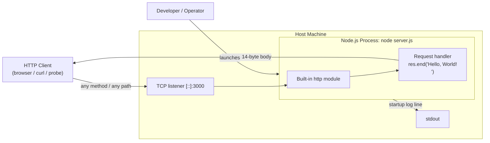
```mermaid
flowchart LR
    Client["HTTP Client<br/>(browser / curl / probe)"]
    Operator["Developer / Operator"]
    subgraph Host["Host Machine"]
        subgraph NodeProc["Node.js Process: node server.js"]
            HttpMod["Built-in http module"]
            Handler["Request handler<br/>res.end('Hello, World!\n')"]
        end
        Port["TCP listener [::]:3000"]
        Stdout["stdout"]
    end
    Operator -->|"launches"| NodeProc
    NodeProc -->|"startup log line"| Stdout
    Client -->|"any method / any path"| Port
    Port --> HttpMod
    HttpMod --> Handler
    Handler -->|"200 OK, 14-byte body"| Client
```

### 1.2.2 High-Level Description

#### 1.2.2.1 Primary System Capabilities

| Capability | Behavior | Evidence |
|---|---|---|
| HTTP listener | Binds TCP port 3000 on all interfaces | `server.js` `listen(3000, ...)`; listener seen on `[::]:3000` |
| Uniform response | Returns `HTTP/1.1 200 OK` with body `Hello, World!\n` for GET, POST, PUT, DELETE, and HEAD on any path | `server.js` handler; runtime verification |
| Startup notification | Prints `Server running at http://127.0.0.1:3000/` once the listener is bound | `server.js` listen callback |
| Persistent connections | Uses Node.js's default keep-alive (`Keep-Alive: timeout=5`) | Observed response headers |

#### 1.2.2.2 Major System Components

The whole system is a single chained expression. Its logical components, in execution order:

| Component | Code Construct | Responsibility |
|---|---|---|
| HTTP module loader | `require('http')` | Loads Node.js's built-in HTTP implementation |
| Server instance | `.createServer(...)` | Creates the `http.Server` object |
| Request handler | `(req,res)=>res.end('Hello, World!\n')` | Ends every response with the constant body; ignores the request |
| Network listener | `.listen(3000, ...)` | Binds the server to TCP port 3000 |
| Startup callback | `()=>console.log(...)` | Logs a ready message after the bind succeeds |

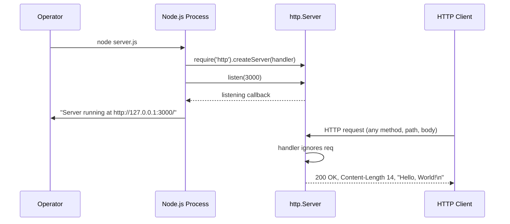
```mermaid
sequenceDiagram
    participant Op as Operator
    participant Node as Node.js Process
    participant Srv as http.Server
    participant Cli as HTTP Client
    Op->>Node: node server.js
    Node->>Srv: require('http').createServer(handler)
    Node->>Srv: listen(3000)
    Srv-->>Node: listening callback
    Node->>Op: "Server running at http://127.0.0.1:3000/"
    Cli->>Srv: HTTP request (any method, path, body)
    Srv->>Srv: handler ignores req
    Srv-->>Cli: 200 OK, Content-Length 14, "Hello, World!\n"
```

#### 1.2.2.3 Core Technical Approach

- **Single-expression design:** module loading, server creation, request handling, and binding happen in one method-chained CommonJS statement, with no named functions, exports, or module-level variables.

```javascript
require('http').createServer((req,res)=>res.end('Hello, World!\n'))
  .listen(3000,()=>console.log('Server running at http://127.0.0.1:3000/'));
```

- **Zero dependencies:** only the Node.js standard library is used, so no install step is needed.
- **Relies on runtime defaults:** status code (`200`), `Content-Length`, `Date`, keep-alive, and the bind address all come from Node.js defaults, not explicit code.
- **Stateless, event-driven processing:** each request is handled on Node.js's event loop with no shared state, I/O, or blocking work.

### 1.2.3 Success Criteria

The repository defines no objectives, acceptance tests, service levels, or metrics. The criteria below come from the code's observable behavior. They are verification targets, not documented project commitments.

#### 1.2.3.1 Measurable Objectives

| Objective | Measurement | Expected Result |
|---|---|---|
| Process starts | stdout after `node server.js` | `Server running at http://127.0.0.1:3000/` |
| Port is bound | Listening sockets on the host | Listener on port 3000 (`[::]:3000`) |
| Requests succeed | HTTP status for any method or path | `200 OK` |
| Payload is correct | Response body and length | `Hello, World!\n`, `Content-Length: 14` (header omitted for HEAD) |

#### 1.2.3.2 Critical Success Factors

| Factor | Requirement |
|---|---|
| Runtime availability | A Node.js runtime that supports CommonJS `require` and arrow functions. No version is pinned; behavior was verified on Node.js v22.23.3. |
| Port availability | TCP port 3000 must be free, or startup fails with `EADDRINUSE` and exit code `1` |
| Network reachability | Clients need a network path to the host on port 3000 |
| Process supervision | Nothing restarts the process after a crash; an external tool must do so if needed |

#### 1.2.3.3 Key Performance Indicators

The code emits no metrics, request logs, or traces, and defines no KPIs. Where QuickTest is used as a smoke test, these indicators can be measured externally:

| KPI | Definition | Target Implied by Code |
|---|---|---|
| Startup success rate | Share of launches that print the startup line | 100% when port 3000 is free |
| Response success rate | Share of requests that return `200 OK` | 100% (no code path returns another status) |
| Payload match rate | Share of responses whose body equals `Hello, World!\n` | 100% (the body is a constant) |

## 1.3 Scope

### 1.3.1 In-Scope

#### 1.3.1.1 Core Features and Functionalities

**Must-have capabilities.** `server.js` implements exactly these three:

| Capability | Implementation | Verified Behavior |
|---|---|---|
| Bind an HTTP listener | `listen(3000)` on an `http.Server` | Listener on `[::]:3000` |
| Return a constant response | `res.end('Hello, World!\n')` | `200 OK`, 14-byte body for every method and path |
| Announce readiness | `console.log` in the listen callback | Prints `Server running at http://127.0.0.1:3000/` once |

**Primary user workflows.**

| Workflow | Steps | Outcome |
|---|---|---|
| Start the server | Run `node server.js` from the repository root | The listener binds and the startup line is printed |
| Send a request | Send any HTTP request to port 3000 on the host | `200 OK` with body `Hello, World!\n` |
| Stop the server | End the process (for example, Ctrl+C) | The process exits; the code has no shutdown logic |

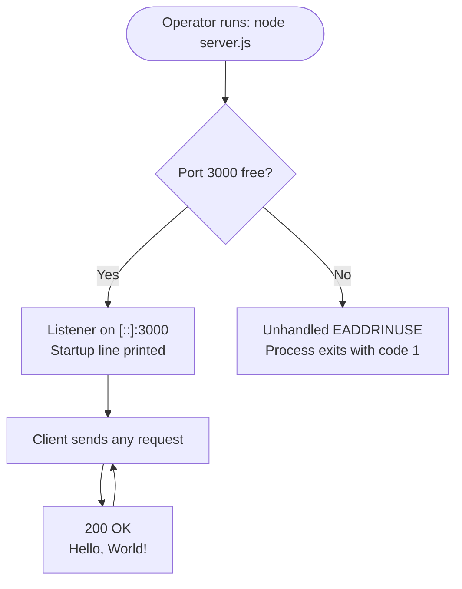
```mermaid
flowchart TD
    Start(["Operator runs: node server.js"]) --> Bind{"Port 3000 free?"}
    Bind -->|"Yes"| Ready["Listener on [::]:3000<br/>Startup line printed"]
    Bind -->|"No"| Crash["Unhandled EADDRINUSE<br/>Process exits with code 1"]
    Ready --> Req["Client sends any request"]
    Req --> Resp["200 OK<br/>Hello, World!\n"]
    Resp --> Req
```

**Essential integrations.**

| Integration | Role | Notes |
|---|---|---|
| Node.js runtime | Runs the script | Required; no version declared |
| Node.js built-in `http` module | Server and HTTP/1.1 protocol handling | The only module imported |
| Host TCP/IP stack | Socket bind on port 3000 | Dual-stack unspecified address (`::`) |
| Process stdout | Startup message | No other logging |

**Key technical requirements.**

| Requirement | Value | Source |
|---|---|---|
| Runtime | Node.js with CommonJS `require`; verified on v22.23.3 | `server.js`; runtime check |
| Launch command | `node server.js` (no npm script exists) | Repository contents |
| Network port | TCP 3000, hard-coded | `server.js` |
| Dependencies | None; no install step | No `package.json` |
| Protocol | HTTP/1.1 with keep-alive, `timeout=5` | Observed response headers |

#### 1.3.1.2 Implementation Boundaries

| Boundary | Coverage |
|---|---|
| System boundary | One Node.js process from one file, `server.js`. Input comes only from inbound HTTP on port 3000; output is HTTP responses plus one stdout line. No file, database, or outbound network I/O. |
| User groups covered | Developers or operators who launch the process, and anonymous HTTP clients. Clients are not authenticated and are all treated the same. |
| Geographic / market coverage | None defined. No localization; the response is a fixed English string. The server can be reached wherever the host's network allows traffic to port 3000. |
| Data domains included | None. Request data is ignored, nothing is stored, and the only data produced is the constant response body and the startup message. |

### 1.3.2 Out-of-Scope

#### 1.3.2.1 Excluded Features and Capabilities

The repository does not implement the following. Each item was confirmed missing from `server.js` and from the repository tree.

| Category | Excluded Capability |
|---|---|
| Request handling | Routing, method-specific behavior, and parsing of path, query, headers, or body |
| Response handling | `Content-Type` headers, content negotiation, non-`200` status codes, dynamic or file-based content |
| Configuration | Environment variables, CLI arguments, config files, configurable host or port |
| Reliability | Server `'error'` handling, client-error handling, graceful shutdown, clustering, restart supervision |
| Security | TLS/HTTPS, authentication, authorization, rate limiting, CORS, loopback-only binding |
| Observability | Request logging, metrics, tracing, dedicated health or readiness endpoints |
| Persistence | Databases, caches, sessions, file-system storage |
| Packaging and delivery | `package.json`, lockfile, `engines` constraint, Dockerfile, deployment manifests |
| Quality engineering | Unit or integration tests, linting, CI/CD pipelines |
| Documentation | README (deleted in commit `3d00f47`), API documentation, contribution guidelines |

#### 1.3.2.2 Future Phase Considerations

The repository has no roadmap, issue references, `TODO`/`FIXME` comments, or diverging branch work (`Quicktestbranch1` matches `main`), so no future phases are documented. The gaps below follow from the current code. They are not planned work.

| Gap | Current State | What a Future Phase Would Address |
|---|---|---|
| Bind address vs. log message | Binds `[::]:3000`; log says `127.0.0.1` | Pass an explicit host, or correct the log message |
| Port configurability | Literal `3000` | Read the port from configuration |
| Startup failure handling | Unhandled `EADDRINUSE` crash | Add a server `'error'` listener |
| Runtime declaration | No manifest | Add `package.json` with `engines` and a `start` script |
| Response metadata | No `Content-Type` | Set `Content-Type: text/plain` explicitly |
| Verification | No tests or CI | Automate the checks in Section 1.2.3 |

#### 1.3.2.3 Integration Points Not Covered

- Data stores: relational or NoSQL databases, caches, object storage.
- Messaging: message queues, event streams, webhooks.
- External services: third-party or internal APIs; the server makes no outbound requests.
- Identity: SSO, OAuth/OIDC providers, API gateways.
- Infrastructure: reverse proxies, load balancers, service discovery, container orchestration. The repository has no configuration for any of these.
- Monitoring: log aggregation, APM, metrics backends.

#### 1.3.2.4 Unsupported Use Cases

| Use Case | Reason Unsupported |
|---|---|
| Serving an application or API | The handler returns one constant body and has no routing or data access |
| Secure (HTTPS) traffic | Only the plain `http` module is used |
| Loopback-only or isolated deployment | The server binds all interfaces even though the log names `127.0.0.1` |
| Several instances on one host | The fixed port causes `EADDRINUSE` and a crash for every instance after the first |
| Clients that require a declared media type | No `Content-Type` header is sent |
| Unattended production operation | No error handling, supervision, logging, or graceful shutdown |
| Health checks that must detect failure | Every request gets `200 OK`, so there is no failing state to report |

## 1.4 References

- `server.js`: the whole system implementation. It establishes the CommonJS module system, the sole dependency on the built-in `http` module, the constant `Hello, World!\n` handler, the hard-coded port `3000`, the omitted host argument, the startup log text `Server running at http://127.0.0.1:3000/`, and the absence of error handling, configuration, and routing.
- `/` (repository root): contains only `server.js`. Establishes that there is no `package.json`, README, tests, CI, configuration, Dockerfile, or `.blitzyignore`.
- Git history of the repository: commits `3e40029` ("Initial commit", added a `README.md` containing `# QuickTest`), `6a39be4` ("Add files via upload", added `server.js`), and `3d00f47` ("Delete README.md"), all by one author. Branches `main` and `Quicktestbranch1` have identical content.
- Runtime verification of `server.js` on Node.js v22.23.3: confirmed `200 OK` for GET/POST/PUT/DELETE/HEAD on any path, response headers (`Date`, `Connection: keep-alive`, `Keep-Alive: timeout=5`, `Content-Length: 14`, no `Content-Type`), the listener on `[::]:3000`, and the unhandled `EADDRINUSE` crash with exit code `1` when the port is already in use.

# 2. Product Requirements

## 2.1 Feature Catalog

This catalog lists every feature in the repository's only source file, `server.js`. That file holds one chained CommonJS statement:

```javascript
require('http').createServer((req,res)=>res.end('Hello, World!\n'))
  .listen(3000,()=>console.log('Server running at http://127.0.0.1:3000/'));
```

The repository assigns no priorities, statuses, or requirement IDs. The values below were derived as follows:

- **Status:** every feature is **Completed**, because each one is fully implemented and was confirmed by running `server.js` on Node.js v22.23.3.
- **Priority:** reflects each feature's role in the code path. A feature without which the process serves nothing is **Critical**.
- **Scope:** gaps that are not implemented (configurable port, `Content-Type`, error handling) are not listed as features. Section 1.3.2.2 records that no future work is planned, so these gaps appear as constraints and deviations in Sections 2.4 and 2.6.

| ID | Feature Name | Category | Priority |
|---|---|---|---|
| F-001 | HTTP Server Initialization and Port Binding | Network / Server Lifecycle | Critical |
| F-002 | Uniform Constant Response | Request Handling | Critical |
| F-003 | Startup Readiness Notification | Operability | Medium |
| F-004 | Runtime-Provided HTTP/1.1 Protocol Behavior | Protocol Conformance | Low |

### 2.1.1 F-001: HTTP Server Initialization and Port Binding

#### 2.1.1.1 Feature Metadata

| Attribute | Value |
|---|---|
| Unique ID | F-001 |
| Feature Name | HTTP Server Initialization and Port Binding |
| Feature Category | Network / Server Lifecycle |
| Priority Level | Critical |
| Status | Completed |

#### 2.1.1.2 Description

- **Overview:** `require('http').createServer(...)` creates an `http.Server` object, and `.listen(3000, ...)` binds it to TCP port 3000. No host argument is passed, so Node.js binds the unspecified address. The listener was observed on `[::]:3000`, which covers all interfaces in dual-stack mode. If the port is already taken, the unhandled `'error'` event (`EADDRINUSE`) ends the process with exit code `1`.
- **Business Value:** Shows that the host can run a Node.js process and that the process can claim a TCP port. This is the environment check described in Section 1.1.2.
- **User Benefits:** Operators start it with one command, `node server.js`. There is no install step, configuration, or dependency to resolve.
- **Technical Context:** Uses only the Node.js standard library. The server object is never stored in a variable; it exists only inside the method chain. The port is the numeric literal `3000`.

#### 2.1.1.3 Dependencies

| Dependency Type | Dependency | Notes |
|---|---|---|
| Prerequisite Features | None | Root of the feature graph |
| System Dependencies | Node.js runtime with CommonJS `require`; built-in `http` module | No version pinned; verified on v22.23.3 |
| External Dependencies | Host TCP/IP stack; TCP port 3000 free | No third-party packages; no `package.json` |
| Integration Requirements | Clients must have a network path to the host on port 3000 | All interfaces are bound |

### 2.1.2 F-002: Uniform Constant Response

#### 2.1.2.1 Feature Metadata

| Attribute | Value |
|---|---|
| Unique ID | F-002 |
| Feature Name | Uniform Constant Response |
| Feature Category | Request Handling |
| Priority Level | Critical |
| Status | Completed |

#### 2.1.2.2 Description

- **Overview:** The handler `(req,res)=>res.end('Hello, World!\n')` never reads `req`. Every well-formed request gets `200 OK` and the 14-byte body `Hello, World!\n`, whatever its method, path, query string, headers, or body. This was verified for GET, POST, PUT, DELETE, PATCH, OPTIONS, and HEAD.
- **Business Value:** A fixed, known response makes pass/fail checks trivial for smoke tests and connectivity probes.
- **User Benefits:** HTTP clients such as browsers, `curl`, and automated probes need no knowledge of routes or payloads; any request succeeds.
- **Technical Context:** The code never sets the status code or any headers. The `200` status and `Content-Length: 14` come from Node.js defaults. No `Content-Type` header is sent.

#### 2.1.2.3 Dependencies

| Dependency Type | Dependency | Notes |
|---|---|---|
| Prerequisite Features | F-001 | The handler is registered through `createServer(...)` and only runs once the listener is bound |
| System Dependencies | `http.ServerResponse.end()` from the built-in `http` module | Default status and length framing |
| External Dependencies | None | No I/O, storage, or outbound calls |
| Integration Requirements | Any HTTP/1.1 client | No authentication or headers required |

### 2.1.3 F-003: Startup Readiness Notification

#### 2.1.3.1 Feature Metadata

| Attribute | Value |
|---|---|
| Unique ID | F-003 |
| Feature Name | Startup Readiness Notification |
| Feature Category | Operability |
| Priority Level | Medium |
| Status | Completed |

#### 2.1.3.2 Description

- **Overview:** The `listen` callback runs `console.log('Server running at http://127.0.0.1:3000/')` once, after a successful bind. When the bind fails, this line is not printed.
- **Business Value:** It is the only signal the system emits to show it is ready to serve.
- **User Benefits:** Operators and launch scripts can wait for this line before sending traffic.
- **Technical Context:** The message is a hard-coded string. Its host (`127.0.0.1`) does not match the actual bind address (`::`, all interfaces). Its port (`3000`) is a separate literal from the `listen` argument. The process does no other logging.

#### 2.1.3.3 Dependencies

| Dependency Type | Dependency | Notes |
|---|---|---|
| Prerequisite Features | F-001 | Runs only after the `'listening'` event fires |
| System Dependencies | `console.log` → process stdout | — |
| External Dependencies | None | — |
| Integration Requirements | Whatever reads stdout (terminal, supervisor, log collector) | Plain text, not structured |

### 2.1.4 F-004: Runtime-Provided HTTP/1.1 Protocol Behavior

#### 2.1.4.1 Feature Metadata

| Attribute | Value |
|---|---|
| Unique ID | F-004 |
| Feature Name | Runtime-Provided HTTP/1.1 Protocol Behavior |
| Feature Category | Protocol Conformance |
| Priority Level | Low |
| Status | Completed (inherited from the Node.js `http` module) |

#### 2.1.4.2 Description

- **Overview:** Clients receive these behaviors, but `server.js` writes no code for them; they all come from the `http` module:
  - `Date`, `Connection: keep-alive`, and `Keep-Alive: timeout=5` headers on responses.
  - Automatic `Content-Length` framing.
  - Rejection of a malformed request line (`GARBAGE`) with `HTTP/1.1 400 Bad Request` and `Connection: close`. The application handler is never invoked for such a request.
- **Business Value:** Clients get standards-compliant HTTP/1.1 framing and connection reuse with no application code.
- **User Benefits:** Repeated probes can reuse a single TCP connection. Malformed input gets a clear rejection instead of a hang.
- **Technical Context:** These behaviors depend on the Node.js version in use. The repository pins no version, so a different runtime could change them.

#### 2.1.4.3 Dependencies

| Dependency Type | Dependency | Notes |
|---|---|---|
| Prerequisite Features | F-001 | Applies to connections accepted by the listener |
| System Dependencies | Built-in `http` module defaults (parser, keep-alive, default client-error handling) | Observed on Node.js v22.23.3 |
| External Dependencies | None | — |
| Integration Requirements | HTTP/1.1 clients | Keep-alive is optional for clients |

For the context, component, and workflow diagrams of these features, see Section 1.2.1.3 (system context), Section 1.2.2.2 (startup and request sequence), and Section 1.3.1.1 (operator workflow flowchart).

## 2.2 Functional Requirements

Each requirement states behavior `server.js` actually exhibits. All acceptance criteria were checked by running the server on Node.js v22.23.3. The repository has no automated tests, so each criterion is a manual or scriptable check. Requirement priority uses Must-Have, Should-Have, or Could-Have, and complexity uses High, Medium, or Low. Both appear in a single combined column.

### 2.2.1 F-001 Requirements: HTTP Server Initialization and Port Binding

#### 2.2.1.1 Requirement Details

| Requirement ID | Description | Acceptance Criteria | Priority / Complexity |
|---|---|---|---|
| F-001-RQ-001 | Create the HTTP server using only the built-in `http` module | `server.js` contains one `require`, `require('http')`. `node server.js` starts with no install step. | Must-Have / Low |
| F-001-RQ-002 | Bind TCP port 3000 | While the process runs, a listener exists on port 3000 (`/proc/net/tcp6` entry `...:0BB8`, state `0A` LISTEN) | Must-Have / Low |
| F-001-RQ-003 | Bind the unspecified address (no host argument) | The listener's local address is `::`, all interfaces, dual-stack | Should-Have / Low |
| F-001-RQ-004 | Terminate when the port is unavailable | Starting a second instance prints `Error: listen EADDRINUSE: address already in use :::3000` to stderr and exits with code `1` | Should-Have / Low |
| F-001-RQ-005 | Stop on an operator signal | Sending `SIGTERM` ends the process with status `143`. No shutdown logic runs. | Could-Have / Low |

#### 2.2.1.2 Technical Specifications

| Aspect | Specification |
|---|---|
| Input Parameters | None. The port `3000` is a literal. No environment variables, CLI arguments, or config files are read. |
| Output / Response | A bound TCP listener on `[::]:3000`. On bind failure, an uncaught `EADDRINUSE` error (errno `-98`, syscall `listen`) and a stack trace on stderr. |
| Performance Criteria | None defined in the repository. Startup completed within the 1-second wait used during verification. |
| Data Requirements | None. No state, storage, or files. |

#### 2.2.1.3 Validation Rules

| Rule Type | Rule |
|---|---|
| Business Rules | Exactly one listener per process, on port 3000. A port conflict is fatal. |
| Data Validation | Not applicable; there is no configurable input to validate |
| Security Requirements | None implemented. The listener is reachable on every host interface, over plain HTTP without TLS. |
| Compliance Requirements | None defined in the repository |

### 2.2.2 F-002 Requirements: Uniform Constant Response

#### 2.2.2.1 Requirement Details

| Requirement ID | Description | Acceptance Criteria | Priority / Complexity |
|---|---|---|---|
| F-002-RQ-001 | Return `200 OK` for every well-formed request | GET, POST, PUT, DELETE, PATCH, OPTIONS, and HEAD on any path return `HTTP/1.1 200 OK`. 200 of 200 sequential requests to distinct paths returned `200`. | Must-Have / Low |
| F-002-RQ-002 | Return the exact body `Hello, World!\n` | The body is byte-for-byte `Hello, World!` followed by LF, 14 bytes, with `Content-Length: 14` | Must-Have / Low |
| F-002-RQ-003 | Ignore all request attributes | Varying the method, path, query (`?q=1`), and request body (`-d 'abc'`) gives an identical status and body | Must-Have / Low |
| F-002-RQ-004 | Send no body on HEAD responses | HEAD returns `200 OK` with `Date`, `Connection`, and `Keep-Alive` headers, no `Content-Length`, and an empty body | Should-Have / Low |

#### 2.2.2.2 Technical Specifications

| Aspect | Specification |
|---|---|
| Input Parameters | Any HTTP/1.1 request; `req` is never read |
| Output / Response | Status `200`; headers `Date`, `Connection: keep-alive`, `Keep-Alive: timeout=5`, `Content-Length: 14`; body `Hello, World!\n`. No `Content-Type` header. |
| Performance Criteria | None defined in the repository. Informal loopback measurement: about 0.2–0.8 ms per request total time across 5 samples. This is not a service-level commitment. |
| Data Requirements | One constant string literal. Nothing is persisted, cached, or logged per request. |

#### 2.2.2.3 Validation Rules

| Rule Type | Rule |
|---|---|
| Business Rules | The response never depends on the request. The handler has no code path for a non-`200` status. |
| Data Validation | The application does none. Only the runtime's HTTP parser (F-004) checks requests. |
| Security Requirements | None implemented: no authentication, authorization, CORS, or rate limiting. Request data is never echoed back, so the handler cannot reflect injected content. |
| Compliance Requirements | None defined. The code does not store or log request data. |

### 2.2.3 F-003 Requirements: Startup Readiness Notification

#### 2.2.3.1 Requirement Details

| Requirement ID | Description | Acceptance Criteria | Priority / Complexity |
|---|---|---|---|
| F-003-RQ-001 | Print a readiness line once the listener is bound | stdout contains exactly one line, `Server running at http://127.0.0.1:3000/` | Should-Have / Low |
| F-003-RQ-002 | Print nothing to stdout when binding fails | On `EADDRINUSE`, stdout is empty and the error goes to stderr | Should-Have / Low |

#### 2.2.3.2 Technical Specifications

| Aspect | Specification |
|---|---|
| Input Parameters | The `'listening'` event from F-001 |
| Output / Response | One plain-text line on stdout |
| Performance Criteria | Printed once per process lifetime. No other log output. |
| Data Requirements | A hard-coded message string. The host and port in the message are literals and are not derived from the actual bind. |

#### 2.2.3.3 Validation Rules

| Rule Type | Rule |
|---|---|
| Business Rules | The message is emitted only after a successful bind |
| Data Validation | None. The message URL is not checked against the actual bind address (see deviation DV-001 in Section 2.6). |
| Security Requirements | None. The message suggests loopback-only access, but the bind is on all interfaces. |
| Compliance Requirements | None defined |

### 2.2.4 F-004 Requirements: Runtime-Provided HTTP/1.1 Protocol Behavior

#### 2.2.4.1 Requirement Details

| Requirement ID | Description | Acceptance Criteria | Priority / Complexity |
|---|---|---|---|
| F-004-RQ-001 | Support persistent connections | Responses carry `Connection: keep-alive` and `Keep-Alive: timeout=5` | Could-Have / Low |
| F-004-RQ-002 | Include a `Date` header | Every response, HEAD included, carries an RFC 1123 `Date` header | Could-Have / Low |
| F-004-RQ-003 | Reject malformed requests | Sending the raw request line `GARBAGE` returns `HTTP/1.1 400 Bad Request` with `Connection: close` | Should-Have / Low |

#### 2.2.4.2 Technical Specifications

| Aspect | Specification |
|---|---|
| Input Parameters | Raw TCP bytes on accepted connections |
| Output / Response | Default protocol headers on valid responses; a `400` with `Connection: close` for unparsable requests |
| Performance Criteria | Idle keep-alive connections time out after 5 s, as advertised in the header |
| Data Requirements | None |

#### 2.2.4.3 Validation Rules

| Rule Type | Rule |
|---|---|
| Business Rules | Protocol behavior is whatever the installed Node.js version provides. `server.js` overrides none of it. |
| Data Validation | The request line and headers are checked only by the runtime's HTTP parser |
| Security Requirements | Runtime defaults only. No custom `clientError` handling, timeouts, or header limits are configured. |
| Compliance Requirements | None defined |

## 2.3 Feature Relationships

All four features live in one statement in `server.js`. They relate only through the method chain and through the `http.Server` object it creates. Nothing else ties them together.

### 2.3.1 Feature Dependencies Map

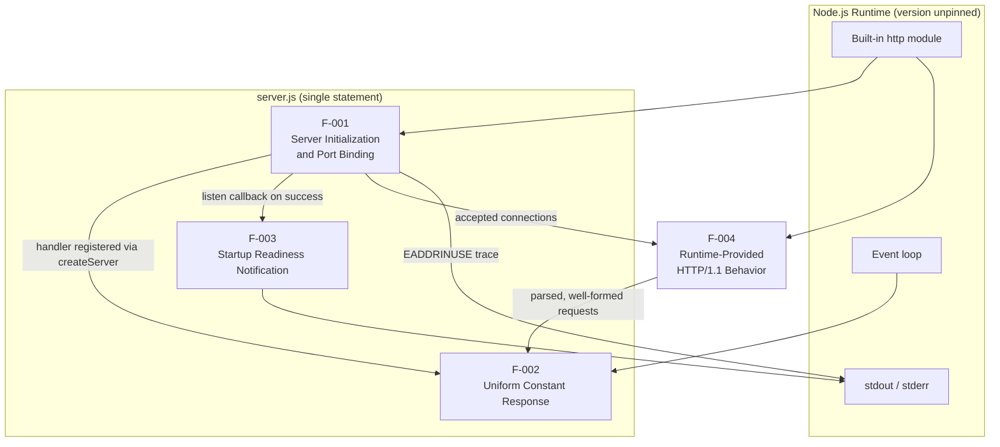
```mermaid
flowchart TD
    subgraph Runtime["Node.js Runtime (version unpinned)"]
        HttpMod["Built-in http module"]
        EventLoop["Event loop"]
        StdStreams["stdout / stderr"]
    end
    subgraph App["server.js (single statement)"]
        F001["F-001<br/>Server Initialization<br/>and Port Binding"]
        F002["F-002<br/>Uniform Constant Response"]
        F003["F-003<br/>Startup Readiness Notification"]
    end
    F004["F-004<br/>Runtime-Provided<br/>HTTP/1.1 Behavior"]
    HttpMod --> F001
    HttpMod --> F004
    F001 -->|"handler registered via createServer"| F002
    F001 -->|"listen callback on success"| F003
    F001 -->|"accepted connections"| F004
    F004 -->|"parsed, well-formed requests"| F002
    F003 --> StdStreams
    F001 -->|"EADDRINUSE trace"| StdStreams
    EventLoop --> F002
```

| Feature | Depends On | Dependency Mechanism |
|---|---|---|
| F-001 | Built-in `http` module | `require('http').createServer(...)`, `.listen(3000, ...)` |
| F-002 | F-001, F-004 | Registered as the `createServer` request listener. Called only for requests that the runtime parser accepts. |
| F-003 | F-001 | Passed as the `listen` callback; runs only on a successful bind |
| F-004 | F-001, built-in `http` module | Applies to connections accepted by the F-001 listener |

### 2.3.2 Integration Points

The diagram below shows how a single request flows through the features. A request the runtime cannot parse never reaches the application handler.

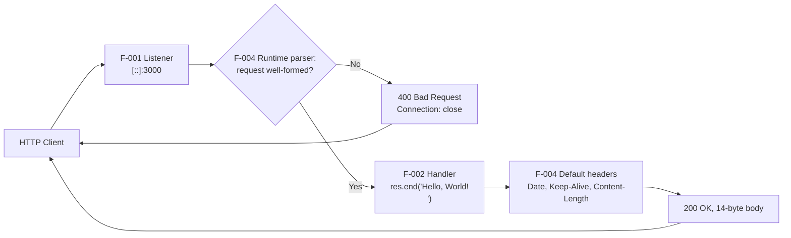
```mermaid
flowchart LR
    Client["HTTP Client"] --> Listener["F-001 Listener<br/>[::]:3000"]
    Listener --> Parse{"F-004 Runtime parser:<br/>request well-formed?"}
    Parse -->|"No"| Reject["400 Bad Request<br/>Connection: close"]
    Parse -->|"Yes"| Handler["F-002 Handler<br/>res.end('Hello, World!\n')"]
    Handler --> Defaults["F-004 Default headers<br/>Date, Keep-Alive, Content-Length"]
    Defaults --> Ok["200 OK, 14-byte body"]
    Reject --> Client
    Ok --> Client
```

| Integration Point | Features | Interface |
|---|---|---|
| Inbound HTTP on TCP 3000 | F-001, F-002, F-004 | HTTP/1.1 over TCP on all interfaces |
| `createServer` request listener | F-001 → F-002 | `(req, res)` callback; `req` is unused |
| `listen` completion callback | F-001 → F-003 | Zero-argument callback fired on `'listening'` |
| Process stdout / stderr | F-003, F-001 | Startup line (stdout); unhandled-error trace (stderr) |

### 2.3.3 Shared Components

| Shared Component | Used By | Notes |
|---|---|---|
| `http.Server` instance | F-001, F-002, F-003, F-004 | Created inline and never assigned to a variable, so no other code can reach it (for example, to attach an `'error'` listener) |
| Port value `3000` | F-001, F-003 | Written as two separate literals, one in `listen(3000, ...)` and one in the log text. They are not linked, so changing one leaves the other stale. |
| Host value | F-001, F-003 | Not shared. F-001 passes no host (binds `::`); F-003 prints `127.0.0.1`. |

### 2.3.4 Common Services

| Service | Consumers | Provided By |
|---|---|---|
| Event loop scheduling | F-002, F-003 | Node.js runtime |
| HTTP parsing and response framing | F-002, F-004 | Built-in `http` module |
| Standard output streams | F-001 (stderr on failure), F-003 (stdout) | Node.js process |

The application defines no shared utilities, middleware, configuration service, or logging framework.

## 2.4 Implementation Considerations

The considerations below come from the `server.js` source and from how it behaved when run on Node.js v22.23.3. The repository documents none of them. It has no README, `package.json`, or configuration.

### 2.4.1 F-001: HTTP Server Initialization and Port Binding

| Consideration | Detail |
|---|---|
| Technical Constraints | The port is the literal `3000`, and no host argument is passed. No environment variable, CLI flag, or config file can override either one. The server object exists only inside the method chain, so an `'error'` listener can't be attached without restructuring the statement. |
| Performance Requirements | None specified. One process with one event loop; no `cluster` or worker threads. |
| Scalability Considerations | Only one instance can run per host network namespace, because a second instance crashes with `EADDRINUSE`. Running more instances needs separate hosts, containers, or a code edit to change the port. |
| Security Implications | The `[::]:3000` bind exposes the server on every interface. Traffic is plain HTTP with no TLS. Whether the server is reachable depends entirely on host firewall or network policy. |
| Maintenance Requirements | No `engines` field or lockfile, so the Node.js version is unpinned. Nothing supervises or restarts the process after a crash. No tests cover bind behavior. |

### 2.4.2 F-002: Uniform Constant Response

| Consideration | Detail |
|---|---|
| Technical Constraints | The body is a fixed string literal. No `Content-Type` is set. There is no routing, method handling, or status variation. |
| Performance Requirements | Constant-time work per request with no I/O; informal loopback timings were under 1 ms. No throughput or latency targets are defined. |
| Scalability Considerations | Stateless and side-effect free. Identical instances behind a load balancer would all return the same response. |
| Security Implications | Application code never parses input, so its attack surface is minimal. There is no authentication, and every reachable client gets `200 OK`. |
| Maintenance Requirements | Any change to the response means editing the one-line expression. Monitoring cannot use the response to detect failure, because no code path returns anything but `200`. |

### 2.4.3 F-003: Startup Readiness Notification

| Consideration | Detail |
|---|---|
| Technical Constraints | The message text is hard-coded. The host it names (`127.0.0.1`) differs from the real bind (`::`). |
| Performance Requirements | Written once at startup; no runtime cost after that. |
| Scalability Considerations | Not applicable. The process emits no per-request logs. |
| Security Implications | The message can mislead operators into thinking the server is reachable only on loopback. |
| Maintenance Requirements | The port literal in the message must be kept in sync with the `listen` argument by hand. Output is unstructured plain text. |

### 2.4.4 F-004: Runtime-Provided HTTP/1.1 Protocol Behavior

| Consideration | Detail |
|---|---|
| Technical Constraints | All of this behavior comes from the installed Node.js version. `server.js` configures no timeouts, header limits, or `clientError` handler. |
| Performance Requirements | Keep-alive lets clients reuse connections. Idle connections close after the advertised 5 s timeout. |
| Scalability Considerations | Each idle keep-alive connection holds a socket for up to 5 s. No connection limits are configured. |
| Security Implications | Malformed requests are rejected by the default `400` handling. Every other hardening setting is a runtime default. |
| Maintenance Requirements | Upgrading Node.js may change header defaults or parser behavior, and no tests would catch the change. |

## 2.5 Traceability Matrix

Each requirement is mapped to its implementing code in `server.js`, the check that confirms it, and the related specification sections. Character offsets point into the single 142-character line of `server.js`. The `listen` call sits at column 69, which matches the stack frame `server.js:1:69` in the `EADDRINUSE` trace.

### 2.5.1 Requirement-to-Implementation Traceability

| Requirement ID | Implementing Code (`server.js`) | Verification Method | Related Sections |
|---|---|---|---|
| F-001-RQ-001 | `require('http').createServer(...)` | Inspect source for imports; run `node server.js` with no install step | 1.1.1, 1.3.1.1 |
| F-001-RQ-002 | `.listen(3000, ...)` | Check for a LISTEN socket on port 3000 (`0BB8`) | 1.2.2.1, 1.2.3.1 |
| F-001-RQ-003 | No host argument passed to `listen` | Confirm the local address is `::` (`[::]:3000`) | 1.2.1.2 |
| F-001-RQ-004 | No `'error'` listener on the server | Start a second instance; expect `EADDRINUSE` and exit code `1` | 1.2.3.2, 1.3.1.1 |
| F-001-RQ-005 | No signal handlers | Send `SIGTERM`; expect exit status `143` | 1.3.1.1 |
| F-002-RQ-001 | `(req,res)=>res.end(...)` | Send all seven methods to arbitrary paths; expect `200` | 1.2.2.1, 1.2.3.1 |
| F-002-RQ-002 | `'Hello, World!\n'` literal | Compare the body byte for byte; expect `Content-Length: 14` | 1.1.1, 1.2.3.1 |
| F-002-RQ-003 | `req` parameter is never read | Vary the path, query, and body; expect an identical response | 1.3.1.2 |
| F-002-RQ-004 | `res.end(...)` with HEAD semantics from the runtime | Send HEAD; expect headers, no body, and no `Content-Length` | 1.2.3.1 |
| F-003-RQ-001 | `()=>console.log('Server running at http://127.0.0.1:3000/')` | Capture stdout after startup | 1.2.3.1, 1.3.1.1 |
| F-003-RQ-002 | Callback runs only on `'listening'` | On a port conflict, confirm stdout is empty | 1.3.1.1 |
| F-004-RQ-001 | Runtime default (no code) | Check the `Connection` and `Keep-Alive` response headers | 1.2.2.1, 1.3.1.1 |
| F-004-RQ-002 | Runtime default (no code) | Check the `Date` response header | 1.2.1.2 |
| F-004-RQ-003 | Runtime default `clientError` handling (no code) | Send the raw line `GARBAGE`; expect `400 Bad Request` | — (first documented here) |

### 2.5.2 Feature-to-Workflow Traceability

| Feature | Workflow (Section 1.3.1.1) | Process Diagram Reference |
|---|---|---|
| F-001 | Start the server; stop the server | Section 1.3.1.1 workflow flowchart (decision "Port 3000 free?") |
| F-002 | Send a request | Section 1.2.2.2 sequence diagram; Section 2.3.2 request flow |
| F-003 | Start the server | Section 1.2.2.2 sequence diagram (startup log message) |
| F-004 | Send a request | Section 2.3.2 request flow (parser decision) |

## 2.6 Assumptions, Constraints, and Requirement Versioning

### 2.6.1 Assumptions

| ID | Assumption | Basis |
|---|---|---|
| A-001 | The system is meant to be a smoke-test or scaffold fixture, not a business application | Project name "QuickTest", the "Hello, World" content, and no domain logic (Section 1.1.2) |
| A-002 | Requirements describe the code as it is today, because no external specification exists | No README (deleted in commit `3d00f47`), issues, or design documents |
| A-003 | Observed runtime behavior is representative of Node.js v22.23.3 | No `engines` field; this was the only version verified |
| A-004 | Network exposure is controlled outside the application, for example by the host firewall | The code binds all interfaces and implements no access control |

### 2.6.2 Constraints

| ID | Constraint | Affected Features |
|---|---|---|
| C-001 | Port `3000` is hard-coded, with no configuration mechanism | F-001, F-003 |
| C-002 | Zero third-party dependencies; standard library only | F-001, F-002, F-003, F-004 |
| C-003 | The whole implementation is one statement, with no retained references or exports | F-001, F-003 |
| C-004 | No automated tests or CI. Acceptance criteria must be checked manually or with external scripts. | All |
| C-005 | Protocol behavior is tied to the unpinned Node.js runtime version | F-004 |

### 2.6.3 Known Deviations and Open Issues

These are discrepancies in the current code. The repository does not track them as planned work.

| ID | Deviation | Requirements Involved | Observed Effect |
|---|---|---|---|
| DV-001 | The log message names `127.0.0.1`, but the server binds `::` (all interfaces) | F-001-RQ-003, F-003-RQ-001 | The server is reachable from outside the host, contrary to what the message implies |
| DV-002 | No `Content-Type` header on responses | F-002-RQ-002 | Clients must infer the media type |
| DV-003 | Bind errors are unhandled | F-001-RQ-004 | The process crashes with a stack trace instead of a controlled error message |
| DV-004 | The port is duplicated as two separate literals | F-001-RQ-002, F-003-RQ-001 | Editing one literal without the other makes the log message wrong |

### 2.6.4 Requirement Version Tracking

| Version | Baseline | Scope | Status |
|---|---|---|---|
| 1.0 | `server.js` as added in commit `6a39be4` ("Add files via upload"), unchanged at HEAD `3d00f47` on `main` and `Quicktestbranch1` | F-001 to F-004; 18 requirements (F-001-RQ-001 to F-004-RQ-003) | Baseline; all requirements met by the current code |

Changes to `server.js` should produce a new requirement version, with affected requirement IDs updated and new requirements given the next free `F-XXX-RQ-YYY` number. The existing IDs are kept stable for traceability.

### 2.6.5 Baseline Requirement Inventory

The version 1.0 baseline has **14 requirements**. This corrects the figure of 18 given in Section 2.6.4.

| Feature | Requirement IDs | Count |
|---|---|---|
| F-001 | F-001-RQ-001 to F-001-RQ-005 | 5 |
| F-002 | F-002-RQ-001 to F-002-RQ-004 | 4 |
| F-003 | F-003-RQ-001 to F-003-RQ-002 | 2 |
| F-004 | F-004-RQ-001 to F-004-RQ-003 | 3 |
| **Total** | — | **14** |

| Priority | Requirement IDs | Count |
|---|---|---|
| Must-Have | F-001-RQ-001, F-001-RQ-002, F-002-RQ-001, F-002-RQ-002, F-002-RQ-003 | 5 |
| Should-Have | F-001-RQ-003, F-001-RQ-004, F-002-RQ-004, F-003-RQ-001, F-003-RQ-002, F-004-RQ-003 | 6 |
| Could-Have | F-001-RQ-005, F-004-RQ-001, F-004-RQ-002 | 3 |

## 2.7 References

- `server.js`: the whole implementation of F-001 to F-004. Source of the built-in `http` import, the `createServer` handler `res.end('Hello, World!\n')`, the literal port `3000` with no host argument, the `listen` callback log text `Server running at http://127.0.0.1:3000/`, and the absence of error handlers, configuration, routing, `Content-Type`, and signal handling.
- `/` (repository root): contains only `server.js`. Shows there is no `package.json`, lockfile, README, tests, CI, configuration, or `.blitzyignore`. The basis for constraints C-002 and C-004.
- Git history: commits `3e40029` ("Initial commit"), `6a39be4` ("Add files via upload", which added `server.js`), and `3d00f47` ("Delete README.md"). Branches `main` and `Quicktestbranch1` are identical. Defines the requirement baseline in Section 2.6.4.
- Runtime verification of `server.js` on Node.js v22.23.3. Confirmed the following:
  - `200 OK` and the 14-byte body for GET, POST, PUT, DELETE, PATCH, OPTIONS, and HEAD on any path.
  - Headers `Date`, `Connection: keep-alive`, `Keep-Alive: timeout=5`, and `Content-Length: 14`, with no `Content-Type`; HEAD has no `Content-Length`.
  - A listener on `[::]:3000`.
  - On a port conflict, an `EADDRINUSE` error with exit code `1` and empty stdout.
  - `400 Bad Request` for the malformed request line `GARBAGE`.
  - Exit status `143` on `SIGTERM`.
  - 200 of 200 sequential requests succeeded, with informal loopback latency under 1 ms.
- Section 1.1 Executive Summary: project identity and smoke-test purpose (assumption A-001).
- Section 1.2 System Overview: current limitations, capability and component tables, the system context diagram (1.2.1.3), and the startup and request sequence diagram (1.2.2.2).
- Section 1.3 Scope: in-scope capabilities, the operator workflow flowchart (1.3.1.1), out-of-scope items, and the future-gap list used to separate features from deviations.
- Section 1.4 References: consistency check against the evidence base of Section 1.

# 3. Technology Stack

## 3.1 Programming Languages

QuickTest is written in one language. Its only tracked file, `server.js`, is a single JavaScript statement that Node.js executes. The repository has no other source, script, or configuration language.

### 3.1.1 Languages by Component

| Component | Language | Dialect and Module System | Evidence |
|---|---|---|---|
| HTTP server (`server.js`) | JavaScript | ECMAScript 2015+ syntax (two arrow functions), CommonJS `require` | `server.js` |
| Build, test, and automation scripts | None | — | No `package.json`, shell scripts, or CI files exist |
| Infrastructure definitions | None | — | No Dockerfile, Terraform, or other IaC files exist |
| Web, mobile, or native clients | None | — | No client code exists; the only interface is inbound HTTP (Section 1.2.1.3) |

### 3.1.2 Language Feature Usage and Minimum Requirements

`server.js` uses a small set of language features. Together they set the minimum language and runtime support needed.

| Feature | Use in `server.js` | Requirement It Imposes |
|---|---|---|
| CommonJS `require` | `require('http')` loads the built-in HTTP module | The file must load as a CommonJS module. With no `package.json`, Node.js treats `.js` files as CommonJS by default. |
| Arrow functions (ES2015) | Request handler `(req,res)=>...` and listen callback `()=>...` | The engine must support ECMAScript 2015 |
| Method chaining on return values | `createServer(...).listen(...)` | None, but no reference to the server is kept (constraint C-003, Section 2.6.2) |
| String literal with escape | `'Hello, World!\n'` response body | None |

The file passes `node --check` and parses as a classic script on Node.js v22.23.3. It contains no TypeScript, JSX, ES module `import`/`export`, top-level `await`, or other syntax that needs a transpiler or a particular module mode.

### 3.1.3 Selection Rationale

The repository does not record why JavaScript was chosen. The code shows these reasons:

- **No build step.** Plain JavaScript runs directly with `node server.js`. No compiler, bundler, or transpiler configuration is needed, and none exists.
- **The standard library is enough.** Node.js's built-in `http` module provides a complete HTTP/1.1 server, so the whole application fits in one statement (Section 1.2.2.3).
- **It suits the fixture's purpose.** A dependency-free, one-file JavaScript server suits a smoke-test or scaffold fixture (assumption A-001, Section 2.6.1).

### 3.1.4 Constraints and Dependencies

| Constraint | Detail | Impact |
|---|---|---|
| Tied to the Node.js runtime | `require` and the `http` module exist only in Node.js-compatible runtimes, not in browsers | Execution needs a Node.js installation on the host |
| Must stay CommonJS | Adding a `package.json` with `"type": "module"`, or renaming the file to `.mjs`, would make `require` undefined | Future packaging must keep CommonJS mode or switch to `import` |
| No static typing | Plain JavaScript without type checking or linting | Low risk today, because the code never reads the request. Risk grows if logic is added. |

**Security implications.** The code never reads the method, path, headers, or body, so no input-handling code runs in JavaScript (Section 2.4.2). Language-level risks such as injection or prototype pollution therefore have nothing to act on in the current implementation.

### 3.1.5 Alignment with the Default Technology Stack (Languages)

| Default Stack Language | Status in QuickTest | Observation |
|---|---|---|
| Python (backend) | Not adopted | The backend is JavaScript on Node.js |
| TypeScript (web and React-Native) | Not adopted | No `.ts` files and no `tsconfig.json` |
| Swift, Kotlin, Objective-C (native) | Not adopted | No iOS, Android, or macOS projects exist |

## 3.2 Frameworks & Libraries

QuickTest uses no application framework and no external library. The only platform is the Node.js runtime, and the only APIs called are the core `http` module and the global `console`.

### 3.2.1 Runtime Platform

The repository pins no Node.js version: there is no `engines` field, `.nvmrc`, or `.node-version`. All verified behavior was observed on the runtime below. The bundled component versions are those reported by that binary's `process.versions`, not versions chosen or declared by the repository.

| Component | Verified Version | Role in QuickTest |
|---|---|---|
| Node.js | 22.23.3 (`process.release.lts` = "Jod") | Executes `server.js`; provides the `http` and `console` APIs |
| V8 | 12.4.254.21-node.57 | JavaScript engine that runs the statement and its arrow functions |
| llhttp | 9.4.3 | HTTP/1.1 parser behind the `http` module; rejects malformed requests with `400 Bad Request` (F-004) |
| libuv | 1.51.0 | Event loop and TCP socket I/O, including the dual-stack `[::]:3000` listener (F-001) |

### 3.2.2 Core Modules and APIs Used

| Module or Global | APIs Called | Purpose | Features |
|---|---|---|---|
| `http` (built-in) | `createServer(handler)`, `server.listen(3000, cb)`, `res.end(body)` | Creates the HTTP/1.1 server, binds the port, and sends the constant body | F-001, F-002, F-004 |
| `console` (global) | `console.log(message)` | Writes the startup line to stdout | F-003 |

The `http` module also supplies, without any code configuring it, the default `200` status, the `Date`, `Content-Length`, `Connection: keep-alive`, and `Keep-Alive: timeout=5` headers, and the bind to all interfaces when no host is given (Section 2.4.4).

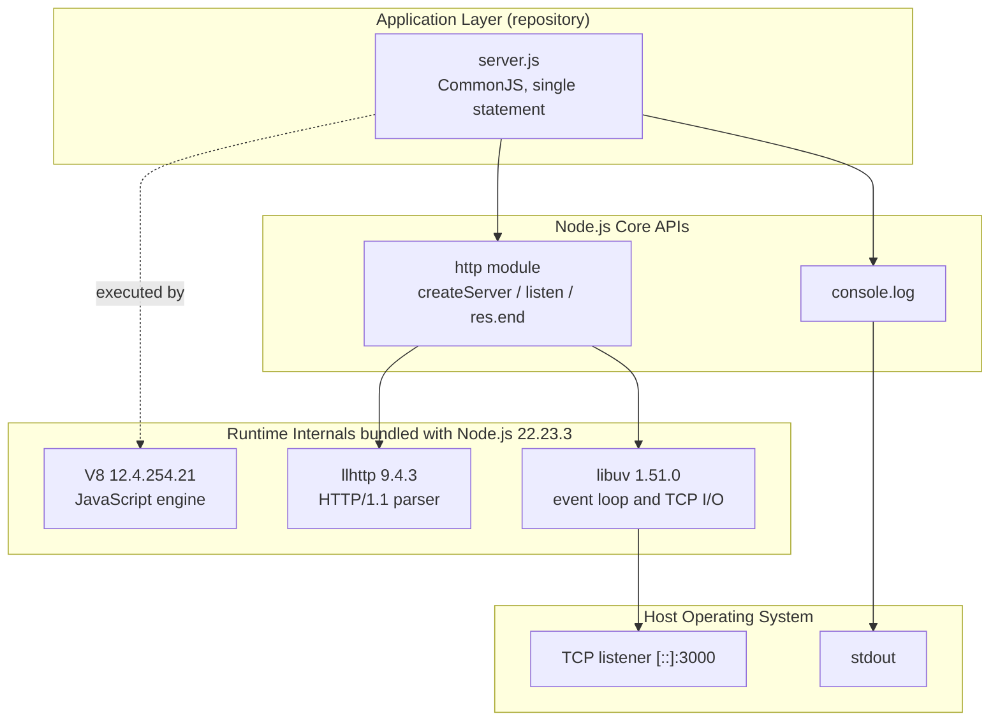
```mermaid
flowchart TB
    subgraph AppLayer["Application Layer (repository)"]
        ServerJs["server.js<br/>CommonJS, single statement"]
    end
    subgraph CoreApi["Node.js Core APIs"]
        HttpModule["http module<br/>createServer / listen / res.end"]
        ConsoleApi["console.log"]
    end
    subgraph Internals["Runtime Internals bundled with Node.js 22.23.3"]
        V8Engine["V8 12.4.254.21<br/>JavaScript engine"]
        Llhttp["llhttp 9.4.3<br/>HTTP/1.1 parser"]
        Libuv["libuv 1.51.0<br/>event loop and TCP I/O"]
    end
    subgraph OsLayer["Host Operating System"]
        TcpStack["TCP listener [::]:3000"]
        StdoutStream["stdout"]
    end
    ServerJs -.->|"executed by"| V8Engine
    ServerJs --> HttpModule
    ServerJs --> ConsoleApi
    HttpModule --> Llhttp
    HttpModule --> Libuv
    Libuv --> TcpStack
    ConsoleApi --> StdoutStream
```

### 3.2.3 Framework Selection Rationale

| Decision | Justification from the Code | Trade-off |
|---|---|---|
| No web framework (such as Express, Fastify, or Koa) | One constant response needs no routing, middleware, body parsing, or templating | Features a framework would provide are missing: routing, error middleware, and `Content-Type` handling (DV-002, Section 2.6.3) |
| Core `http` module only | Present in every Node.js installation, with no install step | Behavior follows Node.js defaults, which can change between runtime versions (C-005) |
| `console.log` for output | The only output is one readiness line | No log levels, structure, or per-request logging (Section 2.4.3) |

### 3.2.4 Compatibility Requirements

| Requirement | Detail |
|---|---|
| Runtime version | Any Node.js release with CommonJS and ES2015 arrow functions should run the file. Only v22.23.3 has been verified (A-003). |
| Module mode | The file must load as CommonJS (Section 3.1.4) |
| Protocol defaults | The keep-alive timeout, default headers, parser strictness, and bind address all come from the runtime. A different Node.js version may change them, and no test would catch it (Section 2.4.4). |
| Network stack | With no host argument, Node.js listens on `::` when IPv6 is available (as verified) and on `0.0.0.0` otherwise. Either way, every interface is exposed. |

**Security implications.** The server's hardening is whatever the installed Node.js provides: header-size limits, request parsing, and timeout defaults. `server.js` sets none of these. Security fixes for the HTTP stack arrive only when the host's Node.js is upgraded.

### 3.2.5 Alignment with the Default Technology Stack (Frameworks)

| Default Stack Framework | Status in QuickTest | Observation |
|---|---|---|
| Flask | Not adopted | The server uses Node.js's `http` module |
| Langchain | Not adopted | No AI or LLM functionality exists |
| React with TailwindCSS | Not adopted | No web front end exists |
| React-Native, ElectronJS | Not adopted | No mobile or desktop client exists |

## 3.3 Open Source Dependencies

QuickTest declares no third-party dependencies (constraint C-002, Section 2.6.2). Its only open-source dependency is the Node.js runtime it runs on, together with the components bundled inside that runtime.

### 3.3.1 Declared Package Dependencies

| Ecosystem | Manifest | Lockfile | Declared Dependencies |
|---|---|---|---|
| npm (JavaScript) | `package.json` absent | `package-lock.json`, `yarn.lock`, `pnpm-lock.yaml` absent | 0 (`npm ls` reports `(empty)`) |
| Any other package ecosystem | No manifest present | No lockfile present | 0 |

No package registry is used. No commit in the repository's history has ever added a manifest or a `node_modules` directory; the history contains only `README.md` (since deleted) and `server.js`.

### 3.3.2 Implicit Open-Source Dependencies

| Dependency | Version Source | How It Is Obtained |
|---|---|---|
| Node.js runtime | Unpinned; verified on v22.23.3 | Installed on the host before launch; the repository does not provision it |
| V8, llhttp, libuv | Bundled with the Node.js binary (versions in Section 3.2.1) | Come with Node.js, so they change whenever Node.js is upgraded |
| npm | Ships with Node.js (11.18.0 in the verified environment) | Present on the host but never invoked: there are no scripts or packages to install |

### 3.3.3 Supply-Chain and Security Implications

- **No third-party package risk.** With no packages, there are no transitive vulnerabilities, install-time scripts, or registry compromises to consider, and `npm audit` has nothing to scan.
- **Patching means upgrading the runtime.** All security fixes come from the host's Node.js installation. The runtime version is unpinned, so the patch level of any deployment depends entirely on the host.
- **Reproducibility.** No lockfile is needed today. If dependencies are added, a `package.json` with an `engines` field and a committed lockfile would be needed to keep installs reproducible (Section 1.2.1.2).

## 3.4 Third-Party Services

QuickTest uses no third-party services at runtime. `server.js` makes no outbound network calls and reads no credentials, API keys, or environment variables. Its only interfaces are inbound HTTP on TCP port 3000 and one line written to stdout (Section 1.2.1.3).

| Service Category | Status | Evidence and Implication |
|---|---|---|
| External APIs and integrations | None | No HTTP client usage or SDKs; the request handler only calls `res.end` |
| Authentication services | None (Auth0 from the default stack is not adopted) | No identity provider or access check; every client that can reach the port gets `200 OK` (Section 2.4.2) |
| Monitoring and observability | None | No metrics, tracing, APM agent, or log shipping. The startup line on stdout is the only output (Section 1.2.3.3). |
| Cloud services | None (AWS from the default stack is not adopted) | No cloud SDK, IaC, or deployment descriptors |
| Source hosting (development only) | GitHub | The `origin` remote is `github.com/brichardsblitzy/QuickTest`, and all three commits were made through the GitHub web interface. GitHub is not used at runtime. |

**Security implications.** No secrets are stored or handled, so nothing can leak from configuration. The other side of this is that the system has no authentication and no TLS. Access control and encryption must come from outside the application, such as a host firewall, reverse proxy, or load balancer (assumption A-004, Section 2.6.1).

## 3.5 Databases & Storage

QuickTest is fully stateless. It has no database, cache, or storage, and does not use the file system. The response body is a string literal compiled into the handler, so no data is read, written, or kept between requests or across restarts.

| Storage Concern | Status | Evidence |
|---|---|---|
| Primary and secondary databases | None (MongoDB from the default stack is not adopted) | No database driver, connection string, or schema |
| Data persistence strategy | Not applicable | No state exists; a restart loses nothing |
| Caching | None | No in-memory or external cache; the constant body needs none |
| File and object storage | None | No `fs` usage and no cloud storage SDK |
| Log persistence | None in the application | `console.log` writes one line to stdout. Keeping it is up to whatever launches the process. |

**Security implications.** The service stores no data at rest and processes no user data, so it has no data-protection, backup, or encryption-at-rest requirements.

## 3.6 Development & Deployment

QuickTest has no development tooling, build system, container definition, or CI/CD pipeline. Development consists of editing `server.js` and committing it to GitHub. Deployment consists of running that file with a Node.js runtime that is already on the host.

### 3.6.1 Development Tools

| Tool Category | Status | Evidence |
|---|---|---|
| Runtime and version manager | Node.js required but unpinned | No `engines` field, `.nvmrc`, or `.node-version`. Verified on v22.23.3. |
| Package manager and scripts | Not used | No `package.json`, so no `npm start` or `npm test` |
| Linting and formatting | None | No ESLint or Prettier configuration |
| Type checking and transpiling | None | No `tsconfig.json` or Babel configuration |
| Testing framework | None | No test files or test runner (constraint C-004) |
| Version control | Git, hosted on GitHub | Branches `main` and `Quicktestbranch1` have identical trees. Commits were made through the GitHub web UI, for example "Add files via upload". |

### 3.6.2 Build System

There is no build. The file that is committed is the file that runs: no compilation, bundling, minification, or install step happens before launch.

```bash
node server.js
# Server running at http://127.0.0.1:3000/

```

The launch command is undocumented: there is no `package.json` script and the README has been deleted. It follows from the file name and from Node.js convention.

### 3.6.3 Containerization

The repository has no Dockerfile, `docker-compose.yml`, or `.dockerignore`, so Docker from the default stack is not adopted. Anyone packaging the server in a container later should know how the current code behaves:

| Behavior in `server.js` | Effect Inside a Container |
|---|---|
| Binds all interfaces (`[::]:3000`) | Works with container port publishing, which a loopback-only bind would not |
| Port hard-coded to `3000` | The container port must be `3000`; only the host-side port mapping can differ |
| No signal handlers | Outside a container, SIGTERM ends the process with status 143. Running as PID 1, Node.js does not get the kernel's default SIGTERM action, so an init process (such as `docker run --init`) is needed for a clean stop. |
| No health endpoint | Any path returns `200`, so the root path can serve as a basic liveness probe. It cannot report degraded states. |

### 3.6.4 CI/CD

No CI/CD exists: there is no `.github/workflows/` directory, `.gitlab-ci.yml`, or `Jenkinsfile`. GitHub hosts the code but runs no GitHub Actions. Linting, testing, building, releasing, and deploying all happen by hand, if at all. No Terraform or other IaC provisions an environment, and no process supervisor restarts the server after a crash (Section 1.2.3.2).

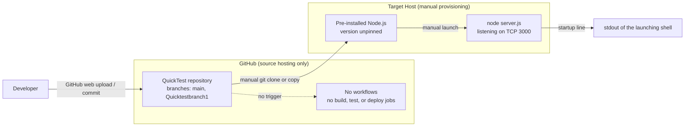
```mermaid
flowchart LR
    Dev["Developer"]
    subgraph GitHubHost["GitHub (source hosting only)"]
        Repo["QuickTest repository<br/>branches: main, Quicktestbranch1"]
        NoCi["No workflows<br/>no build, test, or deploy jobs"]
    end
    subgraph TargetHost["Target Host (manual provisioning)"]
        NodeRt["Pre-installed Node.js<br/>version unpinned"]
        Proc["node server.js<br/>listening on TCP 3000"]
    end
    Dev -->|"GitHub web upload / commit"| Repo
    Repo -.->|"no trigger"| NoCi
    Repo -->|"manual git clone or copy"| NodeRt
    NodeRt -->|"manual launch"| Proc
    Proc -->|"startup line"| Logs["stdout of the launching shell"]
```

### 3.6.5 Deployment Integration Requirements

| Requirement | Detail | Related Item |
|---|---|---|
| Node.js on the host | Must be installed before launch; the repository does not provision it | Section 3.2.1 |
| Port 3000 free | Otherwise startup fails with `EADDRINUSE` and exit code `1` | F-001, DV-003 |
| Network exposure controlled externally | The server binds every interface and serves plain HTTP. A firewall must restrict access, and a reverse proxy or load balancer must terminate TLS where needed. | A-004 |
| stdout captured | The startup line is the only readiness signal | F-003 |
| External supervision | A supervisor, orchestrator, or init system must restart the process if it exits | Section 1.2.3.2 |

### 3.6.6 Alignment with the Default Technology Stack (Infrastructure)

| Default Stack Item | Status in QuickTest | Consequence |
|---|---|---|
| AWS (cloud platform) | Not adopted | No defined hosting target |
| Docker (containerization) | Not adopted | No reproducible runtime image; the Node.js version depends on the host |
| Terraform (IaC) | Not adopted | Environments are provisioned by hand |
| GitHub Actions (CI/CD) | Not adopted, although the code is hosted on GitHub | Changes go unverified, with no automated tests, linting, or deployment |

## 3.7 References

**Repository files and folders**

- `server.js`: the only source file. Shows the language (JavaScript, CommonJS `require`, ES2015 arrow functions), the use of only the built-in `http` module and `console.log`, the hard-coded port `3000`, and the constant response body. Also shows that there are no third-party dependencies, services, storage, or configuration.
- `` (repository root): contains only `server.js`. Confirms that there is no `package.json`, lockfile, `.nvmrc`/`.node-version`, Dockerfile, `docker-compose.yml`, `.github/` workflows, `.gitlab-ci.yml`, `Jenkinsfile`, lint/format configuration, or `tsconfig.json`.

**Repository metadata**

- Git history (`3e40029` Initial commit, `6a39be4` Add files via upload, `3d00f47` Delete README.md): only `README.md` (later deleted) and `server.js` were ever committed. All commits were made through the GitHub web interface.
- Git remote `origin` (`github.com/brichardsblitzy/QuickTest`): GitHub is the source host. Branches `main` and `Quicktestbranch1` exist.

**Runtime verification (verified environment, not declared by the repository)**

- Node.js v22.23.3 (`process.release.lts` "Jod"), V8 12.4.254.21-node.57, llhttp 9.4.3, libuv 1.51.0, npm 11.18.0. These are the versions reported by the runtime used to verify behavior.
- `node --check server.js` and `npm ls --depth=0`: the file has valid CommonJS syntax, and the dependency tree is empty.
- Live run of `node server.js`: startup line, `HTTP/1.1 200 OK`, and the default `Date`, `Connection: keep-alive`, `Keep-Alive: timeout=5`, and `Content-Length: 14` headers.

**Cross-referenced Technical Specification sections**

- Section 1.2 System Overview: current limitations, integration landscape, core technical approach, and critical success factors.
- Section 2.4 Implementation Considerations: per-feature constraints and security implications for F-001 to F-004.
- Section 2.6 Assumptions, Constraints, and Requirement Versioning: assumptions A-001, A-003, and A-004, constraints C-002 to C-005, and deviations DV-002 and DV-003.

# 4. Process Flowchart

## 4.1 System Workflows

QuickTest's entire runtime behavior comes from one chained statement in `server.js`:

```javascript
require('http').createServer((req,res)=>res.end('Hello, World!\n'))
  .listen(3000,()=>console.log('Server running at http://127.0.0.1:3000/'));
```

That statement yields three workflows: server startup, request handling, and server termination. The application code has **no conditional branches**. The request handler always does the same thing, and the listen callback only runs after a successful bind. Every decision point in these workflows is therefore made by the Node.js `http` module or by the host operating system, not by `server.js`. The behavior below was verified by running `server.js` on Node.js v22.23.3. The diagrams for each workflow are in Section 4.4.

### 4.1.1 Core Business Processes

#### 4.1.1.1 End-to-End User Journeys

| ID | Workflow | Actor and Trigger | Outcome |
|---|---|---|---|
| W-01 | Server Startup | An operator runs `node server.js` from the repository root | Listener on `[::]:3000` and one readiness line on stdout (F-001, F-003). On a port conflict the process exits with code `1`. |
| W-02 | Request Handling | Any HTTP client sends a request to TCP port 3000 on any host interface | `200 OK` with body `Hello, World!\n` (F-002, F-004). The runtime answers `400`, `431`, or `408` for invalid or stalled requests. |
| W-03 | Server Termination | An operator or supervisor signals the process (SIGTERM, or Ctrl+C per Section 1.3.1.1) | The process ends without running any shutdown logic. SIGTERM gives exit status `143` (F-001-RQ-005). |

**W-01 Server Startup steps**

1. Node.js loads `server.js` as a CommonJS script. No install or build step comes first (Section 3.6.2).
2. `require('http')` resolves the built-in `http` module. No other module is loaded (C-002).
3. `createServer(handler)` builds an `http.Server` and registers the arrow function as its `'request'` listener. No variable keeps a reference to the server (C-003).
4. `.listen(3000, callback)` asks the OS to bind port 3000 on the unspecified address. The callback is registered as a one-time `'listening'` listener.
5. If the bind succeeds, `'listening'` fires and `console.log` prints `Server running at http://127.0.0.1:3000/`. The server is now ready.
6. If the bind fails, the server emits `'error'` (`EADDRINUSE`). No listener is registered for it, so the error is thrown, a stack trace goes to stderr, and the process exits with code `1`.

**W-02 Request Handling steps**

1. A client opens a TCP connection to port 3000. All interfaces are bound, so the port is reachable from outside the host (DV-001).
2. The runtime's HTTP parser reads the request line and headers, and enforces three checks: the request must be well-formed, the headers must not exceed 16,384 bytes, and the headers must arrive within 60 s.
3. Once a request is valid, the runtime emits `'request'` and calls the handler `(req,res)=>res.end('Hello, World!\n')`. The handler never reads `req`.
4. `res.end()` sends status `200` (the default), the runtime's default headers, and the 14-byte body. For HEAD requests the body is omitted.
5. The connection stays open (keep-alive). A further request reuses it, and if none arrives the server closes the idle socket after about 5 s.

**W-03 Server Termination steps**

1. A termination signal reaches the process.
2. `server.js` registers no signal handler, so the default OS action ends the process right away. Open connections are dropped without draining, and port 3000 is released.
3. SIGTERM gives exit status `143`. When Node.js runs as PID 1 in a container, an init process is needed for SIGTERM to stop it (Section 3.6.3).

#### 4.1.1.2 System Interactions

| Interaction | From → To | Mechanism | Verified Result |
|---|---|---|---|
| Launch | Operator → Node.js runtime | `node server.js` (no npm script exists) | Process starts in under 1 s |
| Module load | `server.js` → Node.js `http` module | `require('http')` | Built-in module, so nothing is installed |
| Socket bind | `http.Server` → host TCP/IP stack | `listen(3000)` with no host argument | Listener `[::]:3000`, in state LISTEN, dual-stack |
| Readiness signal | listen callback → process stdout | `console.log(...)` | One plain-text line per process lifetime |
| Request/response | HTTP client ↔ `http.Server` | HTTP/1.1 over TCP with keep-alive | `200 OK`, `Content-Length: 14` |
| Fatal error report | Node.js runtime → stderr and exit code | Unhandled `'error'` event | Stack trace pointing at `server.js:1:69`, exit `1` |

#### 4.1.1.3 Decision Points

| ID | Decision | Decided By | Outcomes |
|---|---|---|---|
| DP-01 | Can port 3000 be bound? | OS socket layer (`server.js` does no check) | Yes: W-01 continues to the readiness log. No: `EADDRINUSE` crash with exit `1`. |
| DP-02 | Is the request line or header block well-formed? | `http` module parser | Yes: continue. No: `400 Bad Request` with `Connection: close`, and the handler is never called. |
| DP-03 | Are the headers at most 16,384 bytes (`http.maxHeaderSize`)? | Runtime default | Yes: continue. No: `431` (observed with a 20,000-byte header). |
| DP-04 | Do the headers arrive within `headersTimeout` (60,000 ms)? | Runtime default | Yes: continue. No: `408 Request Timeout` and the socket is closed (observed at about 89 s). |
| DP-05 | Is the method HEAD? | Runtime response writer | Yes: headers only, without `Content-Length`. No: 14-byte body. |
| DP-06 | Does another request arrive within `keepAliveTimeout` (5,000 ms)? | Runtime default | Yes: the connection is reused. No: the server closes the idle socket (observed at about 6 s). |
| DP-07 | Has a termination signal arrived? | OS default signal action | Yes: immediate termination (`143` for SIGTERM). |

The handler has no decision points at all: method, path, query, headers, and body never change the response (F-002-RQ-003).

#### 4.1.1.4 Error Handling Paths

| Path | Trigger | Result | Recovery |
|---|---|---|---|
| E-01 | Port 3000 already in use | Uncaught `EADDRINUSE`, stack trace on stderr, nothing on stdout (F-003-RQ-002), exit `1` | Manual: free the port, then relaunch |
| E-02 | Malformed request | Runtime sends `400` and closes the connection | Client sends a valid request on a new connection |
| E-03 | Header block over 16 KiB | Runtime sends `431` | Client reduces header size |
| E-04 | Headers incomplete after 60 s | Runtime sends `408` and closes the socket | Client reconnects |
| E-05 | Termination signal | Process ends with in-flight connections dropped | Manual or external-supervisor restart (Section 3.6.5) |

Section 4.3.2 covers retry, fallback, and notification behavior, and Section 4.4.3 has the error flowcharts.

### 4.1.2 Integration Workflows

#### 4.1.2.1 Data Flow Between Systems

QuickTest only receives connections; it makes no outbound calls. It has no database, cache, file I/O, message broker, or external API (Sections 1.3.2.3 and 3.5). These are all the data flows:

| Flow | Source → Destination | Payload | Handling |
|---|---|---|---|
| Inbound request | HTTP client → `http.Server` | Request line, headers, optional body | The runtime parses it and the handler ignores it. Nothing is stored or echoed back. |
| Outbound response | `http.Server` → HTTP client | `HTTP/1.1 200 OK`, the `Date`, `Connection`, `Keep-Alive`, and `Content-Length` headers, and the body `Hello, World!\n` | Generated identically for every valid request |
| Readiness log | Process → stdout | `Server running at http://127.0.0.1:3000/` | Printed once. Whoever launched the process decides whether it is kept. |
| Fatal diagnostics | Node.js runtime → stderr and exit status | Error message and stack trace; exit `1` | Printed only on a startup failure |

#### 4.1.2.2 API Interactions

The server exposes one implicit catch-all endpoint and has no routing.

| Attribute | Value |
|---|---|
| Base URL | `http://<any-host-interface>:3000` (plain HTTP; no TLS) |
| Paths and query | Any; ignored |
| Methods | Any. GET, POST, PUT, DELETE, PATCH, OPTIONS, and HEAD were verified. |
| Request prerequisites | None: no authentication, required headers, or body schema |
| Success response | `200 OK` with `Date`, `Connection: keep-alive`, `Keep-Alive: timeout=5`, and `Content-Length: 14` (`Content-Length` is absent on HEAD). No `Content-Type` is sent (DV-002). |
| Response body | `Hello, World!\n`, 14 bytes; empty for HEAD |
| Runtime error responses | `400` (malformed), `431` (headers too large), `408` (headers timeout) |
| Versioning and contract docs | None |

```bash
curl -i -X POST -d '{"a":1}' http://127.0.0.1:3000/api   # → HTTP/1.1 200 OK … Hello, World!
```

#### 4.1.2.3 Event Processing Flows

All work runs on the single Node.js event loop. The handler is synchronous and does no I/O, so a request is finished as soon as `res.end()` returns.

| Event | Emitter | Listener Registered by `server.js` | Effect |
|---|---|---|---|
| `'listening'` | `http.Server` | Yes: the `listen` callback, called once | Prints the readiness line (F-003) |
| `'request'` | `http.Server` | Yes: the `createServer` arrow function | Sends the constant response (F-002) |
| `'error'` | `http.Server` | No | `EventEmitter` throws, and the process exits with `1` (DV-003) |
| Parser and timeout failures | `http` module | No (runtime default client-error handling) | `400`, `431`, or `408`, then the connection closes (F-004) |
| `SIGTERM` / `SIGINT` | Process | No | Default termination, with no cleanup |

Under load the event loop handled 100 requests issued 20 at a time, and all of them returned `200`.

#### 4.1.2.4 Batch Processing Sequences

None. `server.js` defines no scheduled jobs, timers, queues, or bulk operations. The only periodic activity is internal to the runtime: `http.Server` checks open connections every 30,000 ms (`connectionsCheckingInterval`) to enforce `headersTimeout` and `requestTimeout`. Because of that interval, a stalled header block was rejected at about 89 s instead of exactly 60 s.

## 4.2 Flowchart Requirements

This section lists the elements each workflow flowchart in Section 4.4 contains, the timing values that govern those workflows, and the validation that happens at each step. The repository defines no SLAs, KPIs, or timeout settings. Every timing value below is a Node.js v22.23.3 default that `server.js` does not override.

### 4.2.1 Workflow Flowchart Elements

#### 4.2.1.1 Element Inventory per Workflow

| Element | W-01 Server Startup | W-02 Request Handling | W-03 Server Termination |
|---|---|---|---|
| Start point | Operator runs `node server.js` | Client opens a TCP connection to port 3000 | A signal reaches the process |
| End points | Ready (listening), or exit `1` | `200` response, runtime `400`/`431`/`408`, or idle socket closed | Process exited (`143` for SIGTERM) |
| Process steps | Load script → `require('http')` → `createServer` → `listen(3000)` → `console.log` | Parse → emit `'request'` → `res.end()` → keep-alive wait | Default signal action → sockets dropped → port released |
| Decision diamonds | DP-01 | DP-02 to DP-06 | DP-07 |
| System boundaries | Operator shell, Node.js process, host OS | HTTP client, network, Node.js process (`http` runtime and `server.js` handler) | OS or supervisor, Node.js process |
| User touchpoints | Launch command; reading stdout or stderr | Sending an HTTP request; reading the response | Ctrl+C or `kill`; reading the exit status |
| Error states | E-01 `EADDRINUSE` | E-02 `400`, E-03 `431`, E-04 `408` | E-05 abrupt termination |
| Recovery paths | Manual: free the port and relaunch | Client corrects or retries the request | Manual or external restart |

Notation used in Section 4.4: stadium shapes mark start and end points, rectangles mark process steps, diamonds mark decisions, and subgraphs mark swim lanes (actors and system boundaries). Nodes labeled *runtime* show behavior that the Node.js `http` module provides and `server.js` does not implement.

#### 4.2.1.2 Timing and SLA Considerations

The repository states no service-level targets (Section 1.2.3). The table lists the timing values that actually govern each workflow.

| Parameter | Value | Workflow / Decision | Observed |
|---|---|---|---|
| Startup to readiness | Not specified | W-01 | Readiness line printed within the 1 s verification wait |
| Per-request processing | Not specified | W-02 | About 0.2–0.8 ms total on loopback (informal; Section 2.2.2.2) |
| `keepAliveTimeout` | 5,000 ms | W-02 / DP-06 | Idle socket closed after about 6,007 ms |
| `headersTimeout` | 60,000 ms | W-02 / DP-04 | `408` sent at about 89,083 ms |
| `requestTimeout` | 300,000 ms | W-02 (whole request) | Default value only; not exercised |
| `connectionsCheckingInterval` | 30,000 ms | W-02 timeout enforcement | Explains the 60–90 s window for `408` |
| `server.timeout` (socket inactivity) | 0 (disabled) | W-02 | No inactivity timeout beyond those above |
| `maxRequestsPerSocket` | 0 (unlimited) | W-02 / DP-06 | A connection can be reused indefinitely |
| `http.maxHeaderSize` | 16,384 bytes | W-02 / DP-03 | A 20,000-byte header produced `431` |
| Shutdown drain period | None | W-03 | Termination is immediate; there is no grace period |

These values depend on the Node.js version, which the repository does not pin (constraint C-005). Another runtime version could change them without any edit to `server.js`.

### 4.2.2 Validation Rules

#### 4.2.2.1 Business Rules at Each Step

| Step | Business Rule | Source |
|---|---|---|
| W-01 bind | Each process has exactly one listener, on port 3000. A port conflict is fatal. | F-001 validation rules (Section 2.2.1.3) |
| W-01 readiness | The readiness line is printed only after a successful bind, and never on failure | F-003-RQ-001, F-003-RQ-002 |
| W-01 readiness | The message's host and port are literals and are not checked against the actual bind | DV-001, DV-004 |
| W-02 handler | The response never depends on the request, and the handler has no code path for a non-`200` status | F-002 validation rules (Section 2.2.2.3) |
| W-02 protocol | Protocol behavior is whatever the installed runtime provides, with no overrides | F-004 validation rules (Section 2.2.4.3) |
| W-03 stop | No shutdown logic exists, so termination is never refused or deferred | F-001-RQ-005 |

#### 4.2.2.2 Data Validation Requirements

`server.js` performs no data validation. The only checks are the Node.js runtime defaults on inbound bytes.

| Checkpoint | Rule | Enforced By | On Violation |
|---|---|---|---|
| Request syntax | Valid HTTP/1.1 request line and header block | `http` module parser (llhttp) | `400 Bad Request` and `Connection: close`; the handler is not called |
| Header size | Total headers no larger than 16,384 bytes | `http.maxHeaderSize` | `431` |
| Header arrival | Header block complete within 60,000 ms | `headersTimeout` | `408 Request Timeout`, then the socket closes |
| Full request arrival | Request complete within 300,000 ms | `requestTimeout` | Runtime timeout response (not exercised) |
| Method, path, query, headers, body | None | — | Accepted; always `200` |
| Configuration input | None exists: no environment variables, CLI arguments, or files (C-001) | — | — |

#### 4.2.2.3 Authorization Checkpoints

The workflows contain no authorization checkpoints.

| Control | Status | Implication |
|---|---|---|
| Authentication | None | Every client is anonymous and treated the same |
| Authorization and roles | None | Every request is served |
| Network scope | Binds every interface (`[::]:3000`) despite the `127.0.0.1` log text | Reachable from outside the host (DV-001) |
| Rate limiting, CORS, IP filtering | None | Must be enforced outside the application (A-004) |
| Transport security | Plain HTTP only | TLS must be terminated by a proxy or load balancer if required (Section 3.6.5) |

#### 4.2.2.4 Regulatory Compliance Checks

The repository defines no compliance checks. Neither workflow stores, logs, or echoes request data. The only output is a constant body and one startup line, so no personal-data, retention, or audit-trail checkpoint applies (Section 3.5). Because traffic is unencrypted HTTP, any compliance requirement for encryption in transit or access auditing must be met by infrastructure outside the repository.

## 4.3 Technical Implementation

### 4.3.1 State Management

`server.js` holds no application state. It declares no variables, keeps no reference to the server object (C-003), and returns a string literal. The only state that exists belongs to the Node.js runtime: the listening handle and the per-connection socket and parser state. All of it disappears when the process exits.

#### 4.3.1.1 State Transitions

**Process lifecycle**

| State | Entered When | Next States | Evidence |
|---|---|---|---|
| Not Running | Before launch, or after any exit | Loading | Port 3000 is free and connections are refused |
| Loading | `node server.js` starts evaluating the script | Binding | `require('http')`, then `createServer(...)` |
| Binding | `.listen(3000, ...)` is called | Listening, or Crashed | The result depends on whether the port is available (DP-01) |
| Listening (Ready) | `'listening'` fires | Terminated | Readiness line on stdout; `[::]:3000` in state LISTEN |
| Crashed | `'error'` (`EADDRINUSE`) has no listener | Not Running | Stack trace on stderr; exit `1` |
| Terminated | A signal arrives while listening | Not Running | SIGTERM gives exit `143`; the port is released |

**Connection lifecycle (managed by the runtime)**

| State | Entered When | Next States |
|---|---|---|
| Accepted | The TCP connection is established on port 3000 | Reading Headers |
| Reading Headers | Request bytes arrive | Handling; or Rejected on bad syntax, oversized headers, or 60 s timeout |
| Handling | `'request'` is emitted and the handler runs | Response Sent (synchronously, in the same event-loop turn) |
| Response Sent | `res.end()` completes | Idle Keep-Alive |
| Idle Keep-Alive | The response is finished and the connection is kept open | Reading Headers (next request), or Closed (idle for 5 s, or the client closes) |
| Rejected | The runtime sends `400`, `431`, or `408` | Closed |
| Closed | The socket is destroyed | — |

Section 4.4.5 shows both lifecycles as state diagrams.

#### 4.3.1.2 Data Persistence Points

There are none.

| Candidate Persistence Point | Status |
|---|---|
| Request data | Never read, stored, or logged |
| Response content | A constant string compiled into the handler |
| State across requests | None; every request is handled the same way |
| State across restarts | None; a restart loses nothing and needs no restore |
| Logs | One stdout line. Retention is up to whatever launched the process (Section 3.5). |

#### 4.3.1.3 Caching Requirements

There is no caching layer, in memory or external, and the constant body needs none. Responses carry no caching directives: the only headers are `Date`, `Connection`, `Keep-Alive`, and `Content-Length`. Clients and intermediaries therefore get no guidance from the server on caching. The only reuse mechanism is HTTP keep-alive, which reuses the TCP connection rather than the data.

#### 4.3.1.4 Transaction Boundaries

The system has no data transactions. The unit of work is one request/response exchange, which ends with a single synchronous `res.end()` call in one event-loop turn. With no side effects, there is nothing to commit and nothing that can be left half-done or rolled back. A keep-alive connection can carry many independent exchanges. The process itself is the outermost boundary, and exiting discards all runtime state.

### 4.3.2 Error Handling

The only error handling `server.js` gets comes from Node.js defaults. It registers no `'error'`, `'clientError'`, `uncaughtException`, or signal listener.

#### 4.3.2.1 Error Catalog

| Error | Detection Point | Current Handling | Handled By |
|---|---|---|---|
| E-01 `EADDRINUSE` on port 3000 | `listen()` during W-01 | `'error'` is thrown with no listener; stack trace on stderr; exit `1` | Node.js `EventEmitter` default (DV-003) |
| E-02 Malformed request | HTTP parser during W-02 | `400 Bad Request` with `Connection: close`; the handler is skipped | Runtime client-error default |
| E-03 Headers over 16,384 bytes | HTTP parser during W-02 | `431` | Runtime default |
| E-04 Headers not complete within 60 s | Connection sweep every 30 s | `408 Request Timeout`, then the socket closes | Runtime default |
| E-05 SIGTERM or SIGINT | OS signal delivery | Immediate termination with no drain; SIGTERM gives `143` | OS default action |
| Uncaught exception | Anywhere in the process | No process-level handler, so the process terminates | Node.js default; the handler itself performs no operation expected to throw |

#### 4.3.2.2 Retry Mechanisms

`server.js` retries nothing. A failed bind is not retried, no other port is tried, and no supervisor restarts the process (Section 3.6.4). Clients can retry safely: the server keeps no state and has no side effects, so repeating any request, POST included, gives the same result.

#### 4.3.2.3 Fallback Processes

There is no fallback: no degraded mode, alternate port or host, or static fallback content. The runtime's `400`, `431`, and `408` responses are the only alternate outcomes. Every valid request gets `200`, so a liveness probe can tell only "process up" from "connection refused" and cannot detect a degraded state (Section 3.6.3).

#### 4.3.2.4 Error Notification Flows

| Channel | Content | Emitted When | Consumer |
|---|---|---|---|
| stderr | `Error: listen EADDRINUSE: address already in use :::3000` plus a stack trace | E-01 | Operator terminal or log collector |
| Exit status | `1` (crash) or `143` (SIGTERM) | Process exit | Launching shell or supervisor |
| Missing readiness line | No stdout output | E-01 (F-003-RQ-002) | Launch scripts that wait for the readiness line |
| HTTP status | `400`, `431`, or `408` | E-02 to E-04 | The requesting client only |

The system has no alerting, metrics, structured logging, or per-request logging (Section 1.3.2.1).

#### 4.3.2.5 Recovery Procedures

1. **Port conflict (E-01).** Confirm the `EADDRINUSE` message on stderr. Find and stop whatever holds TCP port 3000, then run `node server.js` again. Moving to another port means editing both literals in `server.js` (C-001, DV-004).
2. **Unexpected exit (E-05 or a crash).** Relaunch. The service is stateless, so no data needs restoring.
3. **Client-side rejections (E-02 to E-04).** The client sends a well-formed request with headers under 16 KiB promptly, on a new connection.
4. **Containerized stop.** Run with an init process, for example `docker run --init`, so that SIGTERM ends the process (Section 3.6.3).
5. **Verify recovery.** The readiness line appears on stdout, and a request returns `200` with `Hello, World!`:

```bash
curl -i http://127.0.0.1:3000/   # expect: HTTP/1.1 200 OK, Content-Length: 14
```

## 4.4 Required Diagrams

Each diagram below matches behavior observed when running `server.js` on Node.js v22.23.3. Nodes and lanes labeled *runtime* show Node.js `http` module or OS behavior that `server.js` does not implement.

| Diagram | Type | Workflows | Features / Requirements |
|---|---|---|---|
| 4.4.1 High-Level System Workflow | Swim-lane flowchart | W-01, W-02, W-03 | F-001 to F-004 |
| 4.4.2 Detailed Process Flows | Flowcharts, one per feature | W-01, W-02 | F-001, F-002, F-003, F-004 |
| 4.4.3 Error Handling Flowcharts | Swim-lane flowcharts | E-01 to E-05 | F-001-RQ-004, F-001-RQ-005, F-004-RQ-003 |
| 4.4.4 Integration Sequence Diagrams | Sequence diagrams | W-01, W-02, E-01, E-02, E-04 | F-001 to F-004 |
| 4.4.5 State Transition Diagrams | State diagrams | Process and connection lifecycles | Section 4.3.1.1 |

### 4.4.1 High-Level System Workflow

This diagram shows all three workflows across the four actors. Startup (W-01) runs from the Operator lane through the Node.js process to the OS. Request handling (W-02) runs from the Client lane through the runtime checks to the handler. Termination (W-03) is a single edge from the Operator into the process.

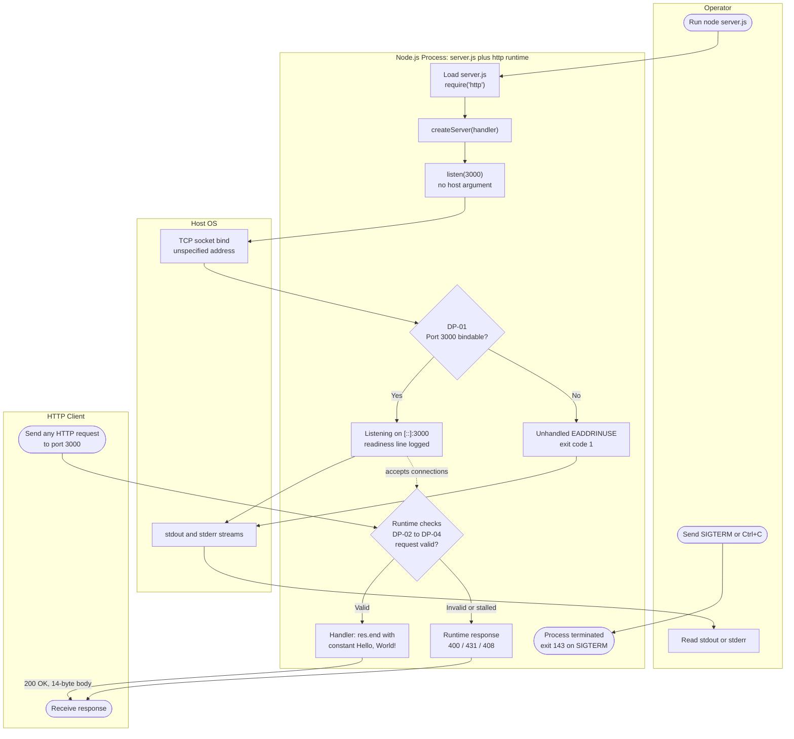
```mermaid
flowchart TB
    subgraph LaneOperator["Operator"]
        OpStart(["Run node server.js"])
        OpRead["Read stdout or stderr"]
        OpStop(["Send SIGTERM or Ctrl+C"])
    end
    subgraph LaneProcess["Node.js Process: server.js plus http runtime"]
        Load["Load server.js<br/>require('http')"]
        Create["createServer(handler)"]
        Listen["listen(3000)<br/>no host argument"]
        BindOk{"DP-01<br/>Port 3000 bindable?"}
        Ready["Listening on [::]:3000<br/>readiness line logged"]
        Crash["Unhandled EADDRINUSE<br/>exit code 1"]
        Parse{"Runtime checks<br/>DP-02 to DP-04<br/>request valid?"}
        Handler["Handler: res.end with<br/>constant Hello, World!"]
        Reject["Runtime response<br/>400 / 431 / 408"]
        Exit(["Process terminated<br/>exit 143 on SIGTERM"])
    end
    subgraph LaneOS["Host OS"]
        Sock["TCP socket bind<br/>unspecified address"]
        Streams["stdout and stderr streams"]
    end
    subgraph LaneClient["HTTP Client"]
        Send(["Send any HTTP request<br/>to port 3000"])
        Recv(["Receive response"])
    end
    OpStart --> Load
    Load --> Create
    Create --> Listen
    Listen --> Sock
    Sock --> BindOk
    BindOk -->|"Yes"| Ready
    BindOk -->|"No"| Crash
    Ready --> Streams
    Crash --> Streams
    Streams --> OpRead
    Ready -.->|"accepts connections"| Parse
    Send --> Parse
    Parse -->|"Valid"| Handler
    Handler -->|"200 OK, 14-byte body"| Recv
    Parse -->|"Invalid or stalled"| Reject
    Reject --> Recv
    OpStop --> Exit
```

### 4.4.2 Detailed Process Flows for Each Core Feature

#### 4.4.2.1 F-001 HTTP Server Initialization and Port Binding

Related requirements: F-001-RQ-001 to F-001-RQ-004; deviation DV-003.

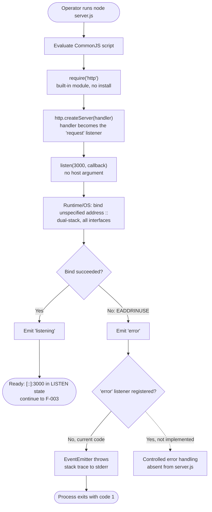
```mermaid
flowchart TD
    A(["Operator runs node server.js"]) --> B["Evaluate CommonJS script"]
    B --> C["require('http')<br/>built-in module, no install"]
    C --> D["http.createServer(handler)<br/>handler becomes the 'request' listener"]
    D --> E["listen(3000, callback)<br/>no host argument"]
    E --> F["Runtime/OS: bind unspecified address ::<br/>dual-stack, all interfaces"]
    F --> G{"Bind succeeded?"}
    G -->|"Yes"| H["Emit 'listening'"]
    H --> I(["Ready: [::]:3000 in LISTEN state<br/>continue to F-003"])
    G -->|"No: EADDRINUSE"| J["Emit 'error'"]
    J --> K{"'error' listener registered?"}
    K -->|"No, current code"| L["EventEmitter throws<br/>stack trace to stderr"]
    L --> M(["Process exits with code 1"])
    K -.->|"Yes, not implemented"| N["Controlled error handling<br/>absent from server.js"]
```

#### 4.4.2.2 F-002 Uniform Constant Response

Related requirements: F-002-RQ-001 to F-002-RQ-004; deviation DV-002. The HEAD decision belongs to the runtime; the handler itself has no branch.

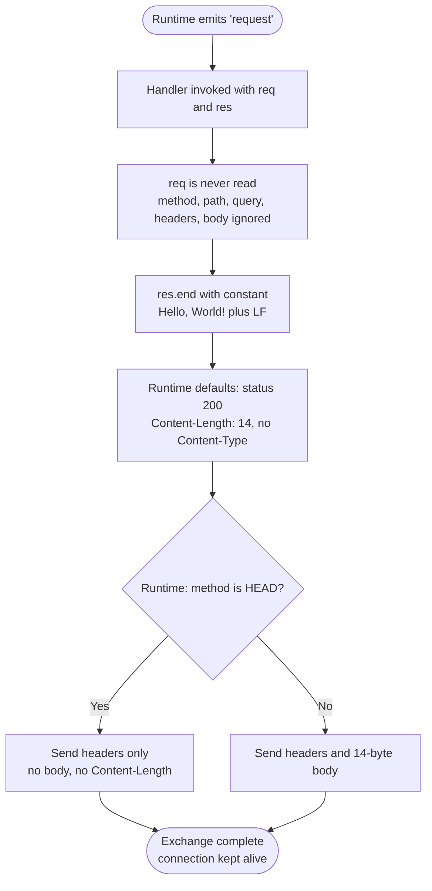
```mermaid
flowchart TD
    A(["Runtime emits 'request'"]) --> B["Handler invoked with req and res"]
    B --> C["req is never read<br/>method, path, query, headers, body ignored"]
    C --> D["res.end with constant<br/>Hello, World! plus LF"]
    D --> E["Runtime defaults: status 200<br/>Content-Length: 14, no Content-Type"]
    E --> F{"Runtime: method is HEAD?"}
    F -->|"Yes"| G["Send headers only<br/>no body, no Content-Length"]
    F -->|"No"| H["Send headers and 14-byte body"]
    G --> I(["Exchange complete<br/>connection kept alive"])
    H --> I
```

#### 4.4.2.3 F-003 Startup Readiness Notification

Related requirements: F-003-RQ-001 and F-003-RQ-002; deviations DV-001 and DV-004.

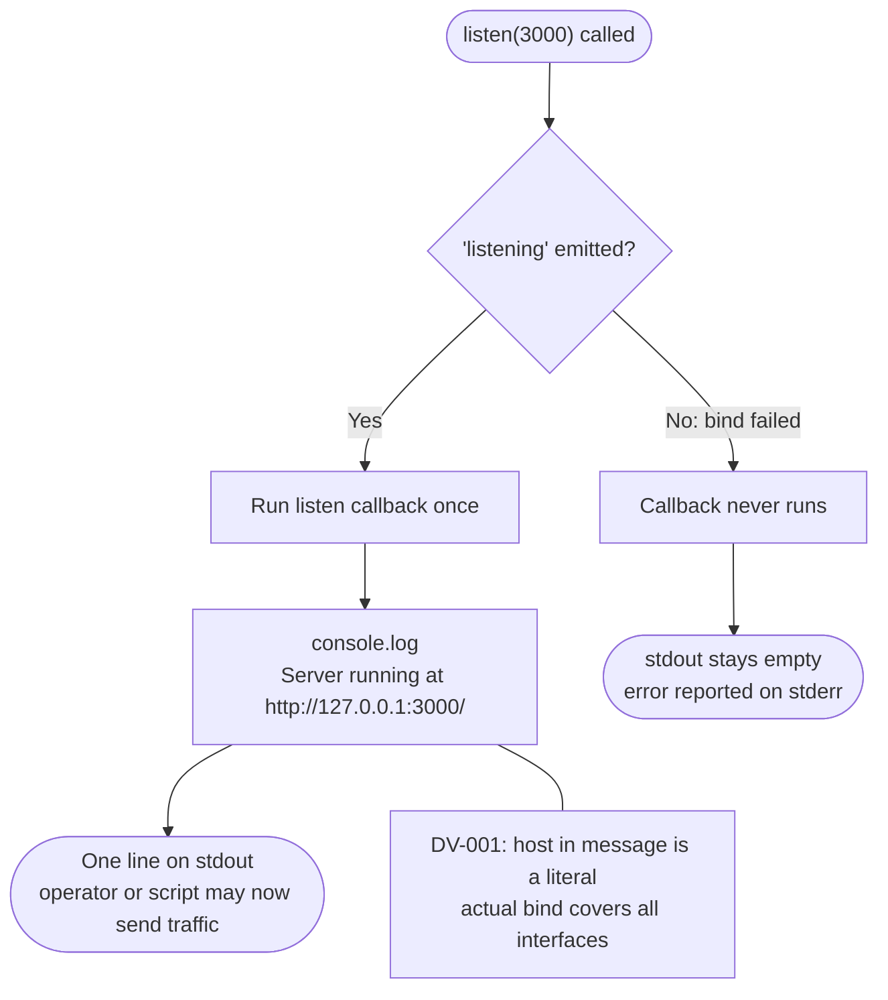
```mermaid
flowchart TD
    A(["listen(3000) called"]) --> B{"'listening' emitted?"}
    B -->|"Yes"| C["Run listen callback once"]
    C --> D["console.log<br/>Server running at http://127.0.0.1:3000/"]
    D --> E(["One line on stdout<br/>operator or script may now send traffic"])
    D --- Note1["DV-001: host in message is a literal<br/>actual bind covers all interfaces"]
    B -->|"No: bind failed"| F["Callback never runs"]
    F --> G(["stdout stays empty<br/>error reported on stderr"])
```

#### 4.4.2.4 F-004 Runtime-Provided HTTP/1.1 Protocol Behavior

Related requirements: F-004-RQ-001 to F-004-RQ-003. The runtime applies these checks while bytes arrive, and enforces the timeout on its 30 s connection sweep. The order shown is conceptual.

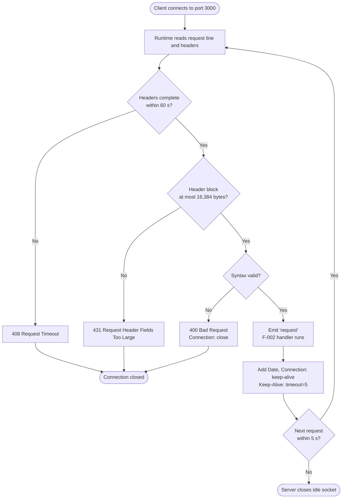
```mermaid
flowchart TD
    A(["Client connects to port 3000"]) --> B["Runtime reads request line and headers"]
    B --> C{"Headers complete<br/>within 60 s?"}
    C -->|"No"| T["408 Request Timeout"]
    C -->|"Yes"| D{"Header block<br/>at most 16,384 bytes?"}
    D -->|"No"| U["431 Request Header Fields Too Large"]
    D -->|"Yes"| E{"Syntax valid?"}
    E -->|"No"| V["400 Bad Request<br/>Connection: close"]
    E -->|"Yes"| F["Emit 'request'<br/>F-002 handler runs"]
    F --> G["Add Date, Connection: keep-alive<br/>Keep-Alive: timeout=5"]
    G --> H{"Next request<br/>within 5 s?"}
    H -->|"Yes"| B
    H -->|"No"| I(["Server closes idle socket"])
    T --> J(["Connection closed"])
    U --> J
    V --> J
```

### 4.4.3 Error Handling Flowcharts

#### 4.4.3.1 Startup Failure and Manual Recovery (E-01)

Recovery is entirely manual. Nothing retries, falls back to another port, or supervises the process (Section 4.3.2.2).

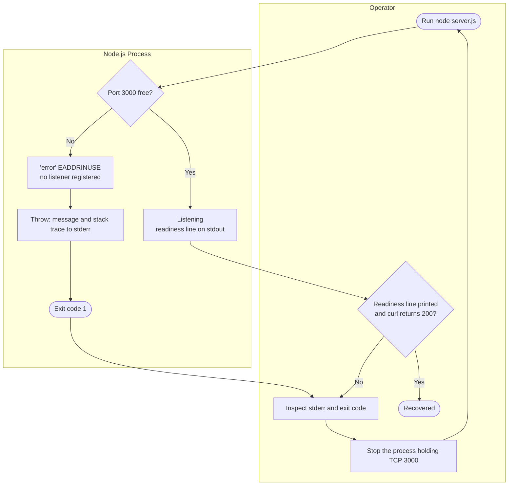
```mermaid
flowchart TD
    subgraph LaneOp["Operator"]
        S(["Run node server.js"])
        Check["Inspect stderr and exit code"]
        Free["Stop the process holding TCP 3000"]
        Verify{"Readiness line printed<br/>and curl returns 200?"}
        Done(["Recovered"])
    end
    subgraph LaneNode["Node.js Process"]
        Bind{"Port 3000 free?"}
        Ok["Listening<br/>readiness line on stdout"]
        Err["'error' EADDRINUSE<br/>no listener registered"]
        Throw["Throw: message and stack trace to stderr"]
        Exit1(["Exit code 1"])
    end
    S --> Bind
    Bind -->|"Yes"| Ok
    Ok --> Verify
    Bind -->|"No"| Err
    Err --> Throw
    Throw --> Exit1
    Exit1 --> Check
    Check --> Free
    Free --> S
    Verify -->|"Yes"| Done
    Verify -->|"No"| Check
```

#### 4.4.3.2 Request-Level Rejection and Client Recovery (E-02 to E-04)

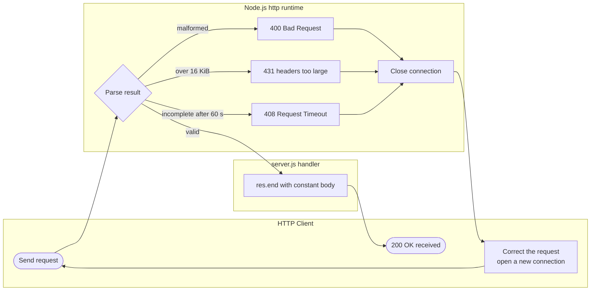
```mermaid
flowchart LR
    subgraph LaneClient["HTTP Client"]
        Req(["Send request"])
        Fix["Correct the request<br/>open a new connection"]
        Ok(["200 OK received"])
    end
    subgraph LaneRuntime["Node.js http runtime"]
        P{"Parse result"}
        R400["400 Bad Request"]
        R431["431 headers too large"]
        R408["408 Request Timeout"]
        Close["Close connection"]
    end
    subgraph LaneApp["server.js handler"]
        H["res.end with constant body"]
    end
    Req --> P
    P -->|"valid"| H
    H --> Ok
    P -->|"malformed"| R400
    P -->|"over 16 KiB"| R431
    P -->|"incomplete after 60 s"| R408
    R400 --> Close
    R431 --> Close
    R408 --> Close
    Close --> Fix
    Fix --> Req
```

#### 4.4.3.3 Termination Handling (E-05)

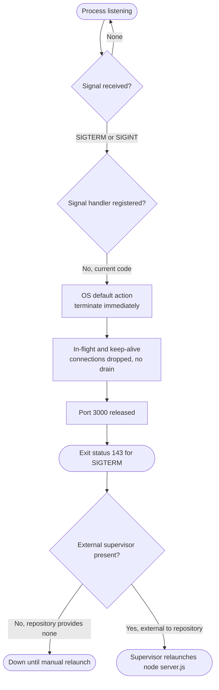
```mermaid
flowchart TD
    A(["Process listening"]) --> B{"Signal received?"}
    B -->|"None"| A
    B -->|"SIGTERM or SIGINT"| C{"Signal handler registered?"}
    C -->|"No, current code"| D["OS default action<br/>terminate immediately"]
    D --> E["In-flight and keep-alive<br/>connections dropped, no drain"]
    E --> F["Port 3000 released"]
    F --> G(["Exit status 143 for SIGTERM"])
    G --> H{"External supervisor present?"}
    H -->|"No, repository provides none"| I(["Down until manual relaunch"])
    H -->|"Yes, external to repository"| J(["Supervisor relaunches node server.js"])
```

### 4.4.4 Integration Sequence Diagrams

#### 4.4.4.1 Startup and Keep-Alive Request Exchange (W-01, W-02)

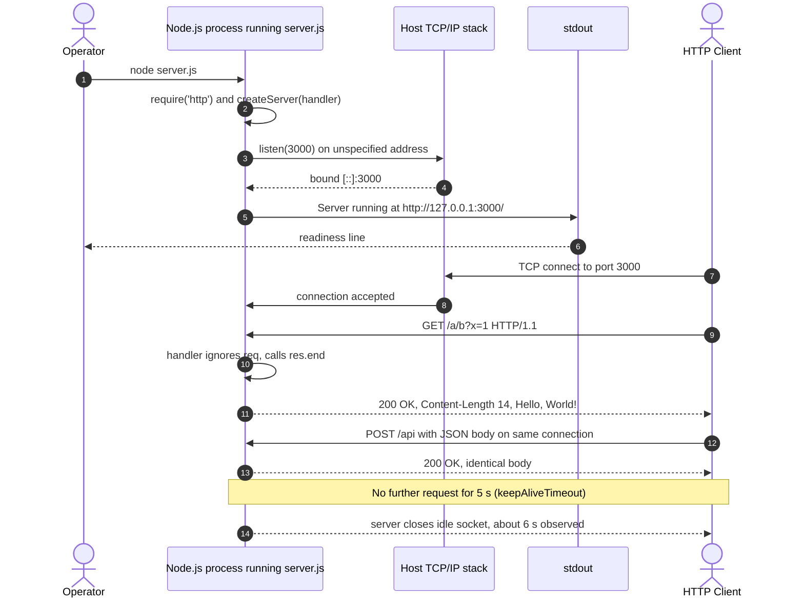
```mermaid
sequenceDiagram
    autonumber
    actor Op as Operator
    participant Proc as Node.js process running server.js
    participant OS as Host TCP/IP stack
    participant Out as stdout
    actor Cl as HTTP Client
    Op->>Proc: node server.js
    Proc->>Proc: require('http') and createServer(handler)
    Proc->>OS: listen(3000) on unspecified address
    OS-->>Proc: bound [::]:3000
    Proc->>Out: Server running at http://127.0.0.1:3000/
    Out-->>Op: readiness line
    Cl->>OS: TCP connect to port 3000
    OS->>Proc: connection accepted
    Cl->>Proc: GET /a/b?x=1 HTTP/1.1
    Proc->>Proc: handler ignores req, calls res.end
    Proc-->>Cl: 200 OK, Content-Length 14, Hello, World!
    Cl->>Proc: POST /api with JSON body on same connection
    Proc-->>Cl: 200 OK, identical body
    Note over Cl,Proc: No further request for 5 s (keepAliveTimeout)
    Proc-->>Cl: server closes idle socket, about 6 s observed
```

#### 4.4.4.2 Port Conflict on a Second Instance (E-01)

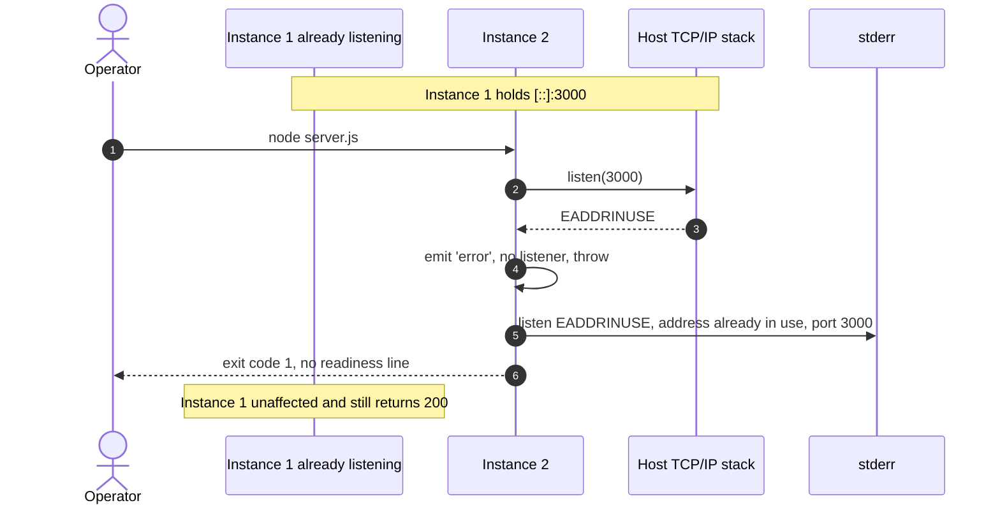
```mermaid
sequenceDiagram
    autonumber
    actor Op as Operator
    participant P1 as Instance 1 already listening
    participant P2 as Instance 2
    participant OS as Host TCP/IP stack
    participant Err as stderr
    Note over P1,OS: Instance 1 holds [::]:3000
    Op->>P2: node server.js
    P2->>OS: listen(3000)
    OS-->>P2: EADDRINUSE
    P2->>P2: emit 'error', no listener, throw
    P2->>Err: listen EADDRINUSE, address already in use, port 3000
    P2-->>Op: exit code 1, no readiness line
    Note over P1: Instance 1 unaffected and still returns 200
```

#### 4.4.4.3 Malformed and Stalled Requests (E-02, E-04)

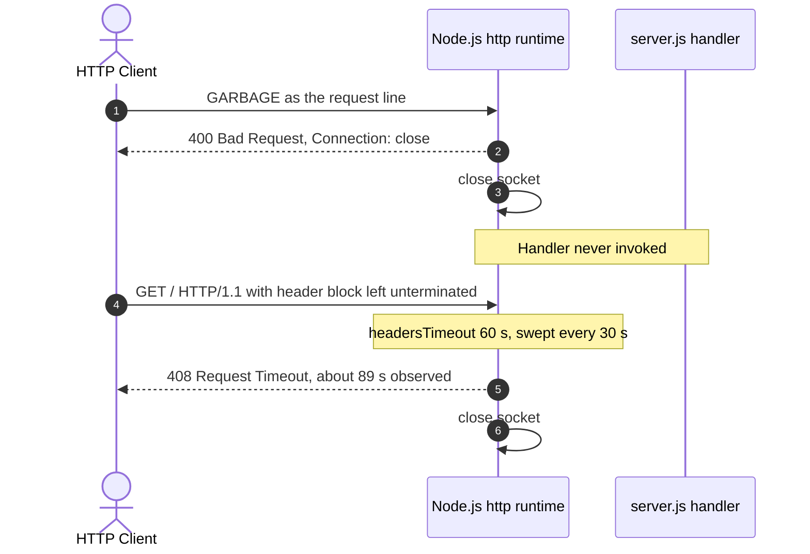
```mermaid
sequenceDiagram
    autonumber
    actor Cl as HTTP Client
    participant RT as Node.js http runtime
    participant H as server.js handler
    Cl->>RT: GARBAGE as the request line
    RT-->>Cl: 400 Bad Request, Connection: close
    RT->>RT: close socket
    Note over RT,H: Handler never invoked
    Cl->>RT: GET / HTTP/1.1 with header block left unterminated
    Note over RT: headersTimeout 60 s, swept every 30 s
    RT-->>Cl: 408 Request Timeout, about 89 s observed
    RT->>RT: close socket
```

### 4.4.5 State Transition Diagrams

#### 4.4.5.1 Process Lifecycle

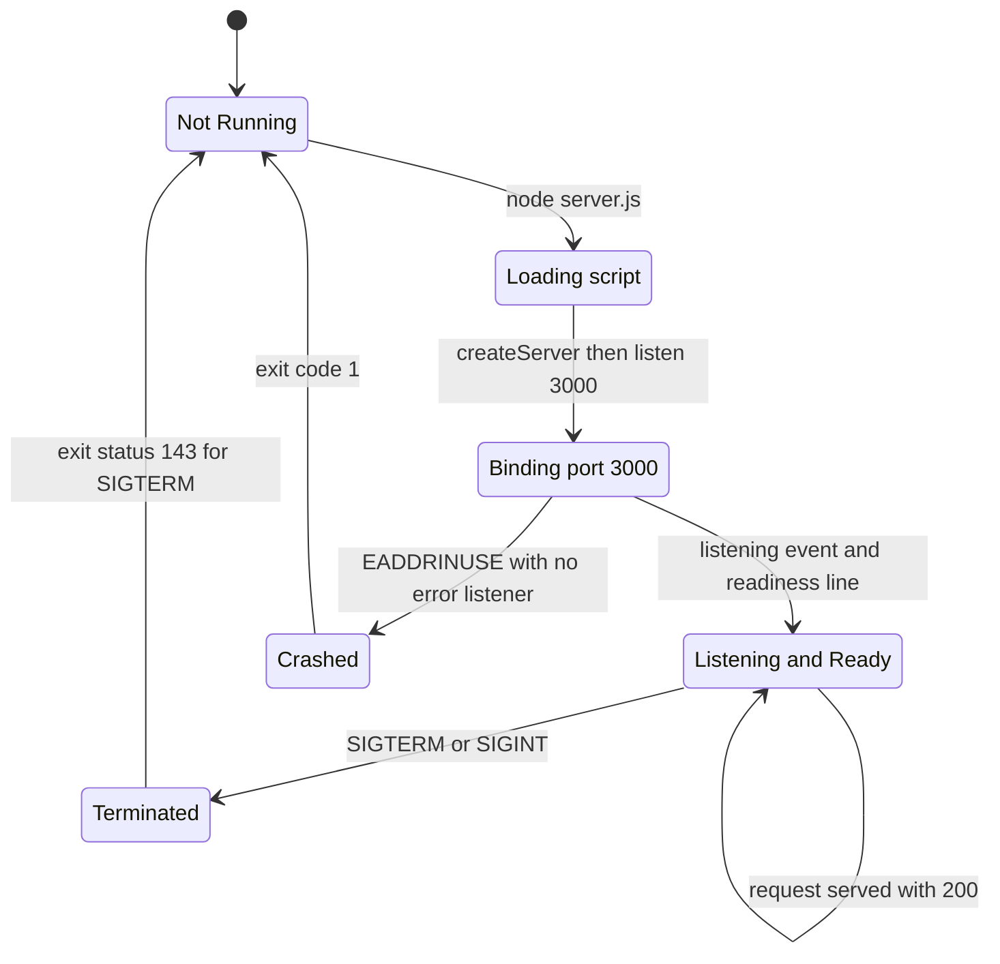
```mermaid
stateDiagram-v2
    state "Not Running" as NotRunning
    state "Loading script" as Loading
    state "Binding port 3000" as Binding
    state "Listening and Ready" as Listening
    state "Crashed" as Crashed
    state "Terminated" as Terminated
    [*] --> NotRunning
    NotRunning --> Loading : node server.js
    Loading --> Binding : createServer then listen 3000
    Binding --> Listening : listening event and readiness line
    Binding --> Crashed : EADDRINUSE with no error listener
    Listening --> Listening : request served with 200
    Listening --> Terminated : SIGTERM or SIGINT
    Crashed --> NotRunning : exit code 1
    Terminated --> NotRunning : exit status 143 for SIGTERM
```

#### 4.4.5.2 Connection Lifecycle (Runtime-Managed)

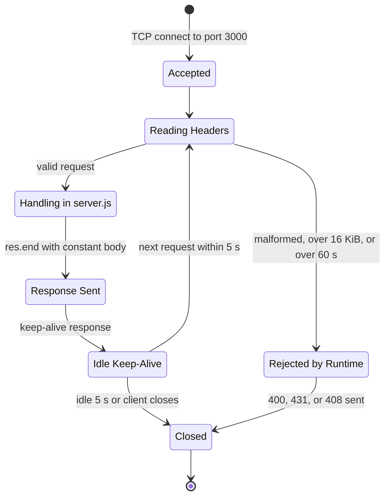
```mermaid
stateDiagram-v2
    state "Accepted" as Accepted
    state "Reading Headers" as ReadingHeaders
    state "Handling in server.js" as Handling
    state "Response Sent" as ResponseSent
    state "Idle Keep-Alive" as IdleKeepAlive
    state "Rejected by Runtime" as Rejected
    state "Closed" as Closed
    [*] --> Accepted : TCP connect to port 3000
    Accepted --> ReadingHeaders
    ReadingHeaders --> Handling : valid request
    ReadingHeaders --> Rejected : malformed, over 16 KiB, or over 60 s
    Handling --> ResponseSent : res.end with constant body
    ResponseSent --> IdleKeepAlive : keep-alive response
    IdleKeepAlive --> ReadingHeaders : next request within 5 s
    IdleKeepAlive --> Closed : idle 5 s or client closes
    Rejected --> Closed : 400, 431, or 408 sent
    Closed --> [*]
```

## 4.5 References

**Repository files and folders**

- `server.js`: The repository's only source file and the source of every workflow in this section. Its single statement creates the `http.Server` (W-01), registers the constant-response handler (W-02, F-002), binds port 3000 with no host argument (F-001, DP-01), and logs the readiness line (F-003). It registers no `'error'`, `'clientError'`, or signal handlers (E-01 to E-05) and declares no state, cache, or persistence (Section 4.3.1). Runtime verification on Node.js v22.23.3 confirmed:
  - **Responses and binding:** `200` responses for any method and path, HEAD without a body, and the `[::]:3000` listener.
  - **Runtime rejections:** `400` for malformed input, `431` for headers over 16 KiB, and `408` at about 89 s for stalled headers.
  - **Process exits:** `EADDRINUSE` exits with `1`, and SIGTERM exits with `143`.
  - **Connection handling:** idle keep-alive sockets close at about 6 s, and 100 concurrent requests all returned `200`.
  - **Runtime defaults:** `keepAliveTimeout`, `headersTimeout`, `requestTimeout`, `connectionsCheckingInterval`, and `maxHeaderSize`.
- `./` (repository root): Contains only `server.js`. There is no `.blitzyignore`, manifest, configuration, test, CI, or job definition, which supports the statements that the system has no batch processing, retries, supervision, or configuration input.

**Related Technical Specification sections**

- Section 1.2.3: The repository defines no SLA or KPI (Section 4.2.1.2).
- Section 1.3.1.1 and Section 1.3.2: The basic operator workflow, excluded capabilities, and integration points not covered.
- Section 2.1 and Section 2.2: Feature IDs F-001 to F-004, requirement IDs F-001-RQ-001 to F-004-RQ-003, and per-feature validation rules.
- Section 2.6: Assumptions A-001 to A-004, constraints C-001 to C-005, and deviations DV-001 to DV-004.
- Section 3.5: Stateless design with no storage or caching.
- Section 3.6: Manual deployment, no CI/CD or supervisor, behavior as container PID 1, and deployment integration requirements.

**External sources**

- None used.

# 5. System Architecture

## 5.1 High-Level Architecture

QuickTest's architecture consists of one tracked file, `server.js`. That file holds a single chained CommonJS statement that runs a Node.js HTTP server using only the standard library:

```javascript
require('http').createServer((req,res)=>res.end('Hello, World!\n'))
  .listen(3000,()=>console.log('Server running at http://127.0.0.1:3000/'));
```

The repository has no manifest, configuration, tests, CI, or design documents (Sections 1.2.1.2 and 3.6). Every architectural property below therefore comes either from this statement or from the Node.js runtime defaults it relies on. Runtime behavior was verified on Node.js v22.23.3. The repository does not pin a version (assumption A-003).

### 5.1.1 System Overview

#### 5.1.1.1 Architecture Style and Rationale

QuickTest is a **single-process, single-file monolith**. It follows Node.js's **event-driven, non-blocking reactor model**: one event loop accepts TCP connections, parses HTTP/1.1, and dispatches each request to one synchronous handler.

| Style Attribute | Observed Property | Evidence |
|---|---|---|
| Deployment unit | One OS process started with `node server.js` | `server.js` is the only tracked file |
| Concurrency model | One event loop; no `cluster` or `worker_threads` | No such references in `server.js` |
| Interaction style | Synchronous request/response over HTTP/1.1 | `createServer` handler calls `res.end()` |
| State model | Stateless; no variables, storage, or caches | Section 3.5; constraint C-003 |
| Configuration model | None; every value is a literal | Port `3000` and the log text are hard-coded (C-001) |

The repository records no rationale for this design. The name "QuickTest" and the fixed "Hello, World" response suggest the server is a smoke-test fixture or starting scaffold (assumption A-001). For that purpose, a dependency-free one-liner is the simplest artifact that proves a host can run Node.js and serve HTTP. This rationale is inferred from the code, not stated by the project.

#### 5.1.1.2 Key Architectural Principles and Patterns

- **Zero-dependency minimalism (C-002).** Only the built-in `http` module is loaded. There is no `package.json`, no install step, and no supply chain to manage.
- **Convention over configuration.** The code sets no status code, headers, host, or timeouts. All of these come from runtime defaults: `200`, `Date`, `Connection: keep-alive`, `Keep-Alive: timeout=5`, `Content-Length`, the unspecified bind address, and the `http.Server` timeouts.
- **Observer pattern via `EventEmitter`.** The handler passed to `createServer` becomes the `'request'` listener. The `listen` callback becomes a one-time `'listening'` listener. No `'error'` listener is registered.
- **Stateless, idempotent handling.** The handler never reads `req` and has no side effects. Every request, of any method, gets the same result, so instances are interchangeable and clients can retry safely.
- **Fail-fast, crash-only lifecycle.** There are no error, exception, or signal handlers. A bind failure terminates the process (exit `1`), and SIGTERM terminates it immediately (exit `143`). Recovery means relaunching (Section 4.3.2).

#### 5.1.1.3 System Boundaries and Major Interfaces

The architecture has three layers:

1. **Application code:** the five constructs in `server.js` (Section 5.1.2).
2. **Platform:** the Node.js runtime and its `http` module. It owns parsing, framing, keep-alive, timeouts, and client-error responses (feature F-004).
3. **Environment:** the host OS, network, operator, and any supervisor. These sit outside the repository.

| Interface | Direction | Form | Owner |
|---|---|---|---|
| HTTP listener | Inbound | HTTP/1.1, plaintext, TCP port `3000` on `[::]` (all interfaces, dual-stack) | `server.js` (`listen(3000)`) plus runtime |
| Readiness signal | Outbound | One plain-text line on stdout | `server.js` (`console.log`) |
| Failure signal | Outbound | Stack trace on stderr; process exit status | Runtime default |
| Process control | Inbound | CLI launch; POSIX signals (SIGTERM, SIGINT) | Operator or supervisor; runtime/OS defaults |

There are no outbound network calls, databases, caches, message brokers, identity providers, or file-system access (Section 1.2.1.3). The startup log names `127.0.0.1`, but the server binds every interface (deviation DV-001), so the real network boundary is set by the host firewall, not by the application (assumption A-004).

### 5.1.2 Core Components Table

The components below are the logical constructs of the single statement in `server.js`, in execution order, plus the platform runtime they depend on. Their names match Section 1.2.2.2. Because tables here are limited to four columns, the five required attributes are split across two tables.

#### 5.1.2.1 Responsibilities and Dependencies

| Component Name | Primary Responsibility | Key Dependencies |
|---|---|---|
| HTTP Module Loader (`require('http')`) | Loads Node.js's built-in HTTP implementation | Node.js runtime with CommonJS `require` |
| Server Instance (`.createServer(...)`) | Creates the `http.Server` object and registers the request handler | HTTP Module Loader |
| Request Handler (`(req,res)=>res.end('Hello, World!\n')`) | Ends every response with the constant 14-byte body; ignores the request (F-002) | `http.ServerResponse.end()` |
| Network Listener (`.listen(3000, ...)`) | Binds the server to TCP port 3000 on the unspecified address (F-001) | Host TCP/IP stack; port 3000 free |
| Startup Callback (`()=>console.log(...)`) | Prints the readiness line after a successful bind (F-003) | `console.log` → process stdout |
| Node.js HTTP Runtime (platform) | Parses requests, frames responses, manages keep-alive, timeouts, and client errors (F-004) | Node.js version on the host (unpinned) |

#### 5.1.2.2 Integration Points and Critical Considerations

| Component Name | Integration Points | Critical Considerations |
|---|---|---|
| HTTP Module Loader | Node.js module system | No version pinned. Protocol behavior can change with the host runtime (C-005). |
| Server Instance | `'request'` and `'listening'` events | Never assigned to a variable, so it cannot be closed, configured, or extended after creation (C-003) |
| Request Handler | `'request'` event; client sockets via the runtime | No `Content-Type` header (DV-002). No routing, method, or input handling. |
| Network Listener | OS socket API; inbound HTTP clients | Port hard-coded (C-001). No `'error'` listener, so `EADDRINUSE` crashes the process with exit `1` (DV-003). |
| Startup Callback | stdout consumers: terminal, launch script, log collector | Host in the message (`127.0.0.1`) does not match the actual bind (DV-001). Port is a second literal (DV-004). |
| Node.js HTTP Runtime | Sits between the OS socket layer and the Request Handler | Sole source of `400`, `431`, and `408` responses and of all timeout limits. None are set in the code. |

### 5.1.3 Data Flow Description

#### 5.1.3.1 Primary Data Flows

- **Startup flow (W-01).** The operator runs `node server.js`. The runtime evaluates the script, loads `http`, creates the server with the handler as its `'request'` listener, and calls `listen(3000)`. The OS binds `[::]:3000`. The runtime emits `'listening'`, and the Startup Callback writes `Server running at http://127.0.0.1:3000/` to stdout. That line is the only data the application produces at startup.
- **Request flow (W-02).** A client opens a TCP connection to port 3000. The runtime parses the request line and headers and emits `'request'`. The Request Handler runs synchronously and calls `res.end('Hello, World!\n')`, all in the same event-loop turn. The runtime adds the status line and headers, writes the response, and keeps the connection open for 5 s for further requests. The request method, path, query, headers, and body are never read by application code.
- **Failure flow (E-01).** If the bind fails, the runtime emits `'error'` with no listener. The resulting exception sends the error message and stack trace to stderr, and the process exits with status `1`. Nothing is written to stdout.

#### 5.1.3.2 Integration Patterns and Protocols

| Exchange | Pattern | Protocol / Format |
|---|---|---|
| Client ↔ server | Synchronous request/response; persistent connections | HTTP/1.1 over TCP, plaintext; no TLS (the `https` module is not used) |
| Runtime → application code | In-process event dispatch (`EventEmitter`) | `'request'` and `'listening'` callbacks |
| Application → operator | Fire-and-forget, one message | Unstructured UTF-8 text line on stdout |
| Runtime → operator or supervisor | Failure reporting | Stack trace on stderr; exit status `1` or `143` |

#### 5.1.3.3 Data Transformation Points

There is one transformation, and the runtime performs it. The string literal `'Hello, World!\n'` is encoded as 14 bytes and framed with `Content-Length: 14`, together with the default status `200` and the `Date`, `Connection`, and `Keep-Alive` headers. For `HEAD` requests the runtime sends the headers without the body or `Content-Length`. Inbound data is never parsed into application objects, validated, serialized, or transformed; the runtime discards it. No JSON, templating, or content negotiation occurs.

#### 5.1.3.4 Data Stores and Caches

There are none (Section 3.5). The response body is a constant compiled into the handler. Requests are not stored, logged, or carried across requests or restarts. The only memory-resident state belongs to the runtime: the listening handle, per-connection sockets, and parser state. All of it is discarded when the process exits (Section 4.3.1). HTTP keep-alive reuses TCP connections, not data, so it is not a cache.

### 5.1.4 External Integration Points

No third-party service, API, or SaaS integration exists. The external parties are the actors and host facilities that exchange data with the process. Version control on GitHub (Section 3.6.1) is development-time hosting, not a runtime integration, and is left out. The five required attributes are split across two tables.

#### 5.1.4.1 Integration Characteristics

| System Name | Integration Type | Data Exchange Pattern | Protocol/Format |
|---|---|---|---|
| HTTP clients (browser, `curl`, probes, load balancers) | Inbound network | Synchronous request/response; keep-alive reuse | HTTP/1.1 over TCP port 3000; `text` body without `Content-Type` |
| Host TCP/IP stack | Platform socket service | One-time bind at startup; per-connection accept | TCP on `[::]:3000`, dual-stack |
| stdout consumer (terminal, launch script, log collector) | Outbound log stream | One message after bind | Plain-text line |
| stderr and exit status consumer (shell, supervisor) | Outbound failure signal | Emitted on crash or termination | Node.js stack trace; exit codes `1` and `143` |
| Process manager or operator | Inbound lifecycle control | Launch command; asynchronous signals | `node server.js`; SIGTERM or SIGINT |

#### 5.1.4.2 SLA Requirements

The repository defines no SLAs, SLOs, or uptime targets. The table shows the service levels implied by the code and the runtime defaults. Section 5.4.5 covers performance in detail.

| System Name | SLA Requirements |
|---|---|
| HTTP clients | None defined. The code implies `200` for every well-formed request. Runtime limits apply: headers within 60 s, at most 16,384 header bytes, 300 s total request timeout, 5 s idle keep-alive. |
| Host TCP/IP stack | Port 3000 must be free at launch. Otherwise startup fails immediately. |
| stdout consumer | None defined. The readiness line appears only after a successful bind. |
| stderr and exit status consumer | None defined. Nothing restarts the process; supervision must be provided outside the repository (Section 3.6.5). |
| Process manager or operator | None defined. Termination is immediate with no drain. Under PID 1 in a container, an init process is required for SIGTERM to take effect (Section 3.6.3). |

## 5.2 Component Details

Each application component below is one fragment of the single statement in `server.js`. None of them is a separate module, function, class, or export. The sixth component is the Node.js HTTP runtime: `server.js` contains no code for it, but every request depends on it. Persistence is identical for every component: none (Section 3.5).

### 5.2.1 HTTP Module Loader

| Aspect | Detail |
|---|---|
| Purpose and responsibilities | Loads the built-in `http` module that supplies every later construct |
| Technologies and frameworks | CommonJS `require` on Node.js. `http` is a built-in module, resolved from the runtime, not `node_modules`. |
| Key interfaces and APIs | `require('http')` returns the module object; only `createServer` is used from it |
| Data persistence requirements | None |
| Scaling considerations | Runs once at process start. No effect on throughput. |

### 5.2.2 Server Instance

| Aspect | Detail |
|---|---|
| Purpose and responsibilities | Creates the `http.Server` and binds the Request Handler to its `'request'` event |
| Technologies and frameworks | `http.createServer(requestListener)` from the Node.js standard library |
| Key interfaces and APIs | Emits `'request'`, `'listening'`, and `'error'`. Only `'request'` (through `createServer`) and `'listening'` (through the `listen` callback) have listeners. |
| Data persistence requirements | None. The object is never assigned to a variable (C-003). |
| Scaling considerations | One instance per process. `close()` cannot be called, timeouts cannot be tuned, and listeners cannot be added after creation without changing the code. |

### 5.2.3 Request Handler

| Aspect | Detail |
|---|---|
| Purpose and responsibilities | Completes every request with the constant body `Hello, World!\n` (F-002) |
| Technologies and frameworks | ES2015 arrow function `(req,res)=>res.end('Hello, World!\n')` using `http.ServerResponse.end()` |
| Key interfaces and APIs | Input `req` (`http.IncomingMessage`) is ignored. Output `res.end(string)` uses the default status `200`; the runtime adds `Content-Length: 14`, `Date`, `Connection`, and `Keep-Alive`. No `Content-Type` is sent (DV-002). |
| Data persistence requirements | None. There is no I/O, logging, or shared state. |
| Scaling considerations | Constant-time, synchronous work, finished in one event-loop turn. It never blocks on I/O, so the event loop and network stack, not the handler, set the throughput ceiling. |

### 5.2.4 Network Listener

| Aspect | Detail |
|---|---|
| Purpose and responsibilities | Binds the server to TCP port 3000 and starts accepting connections (F-001) |
| Technologies and frameworks | `server.listen(port, callback)`, backed by the runtime's libuv socket layer |
| Key interfaces and APIs | `listen(3000, cb)` with no host argument. The listener was observed on `[::]:3000` (all interfaces, dual-stack). Bind failure emits `'error'`. |
| Data persistence requirements | None |
| Scaling considerations | The fixed port allows only one instance per network namespace. A second instance on the same host fails with `EADDRINUSE` and exit `1`. Horizontal scaling therefore needs separate hosts or containers behind an external load balancer. |

### 5.2.5 Startup Callback

| Aspect | Detail |
|---|---|
| Purpose and responsibilities | Signals readiness by printing one line after the bind succeeds (F-003) |
| Technologies and frameworks | Arrow function passed to `listen`; `console.log` to stdout |
| Key interfaces and APIs | Output `Server running at http://127.0.0.1:3000/`. Runs at most once. Never runs if the bind fails. |
| Data persistence requirements | None in the application. Log retention is up to whatever launched the process. |
| Scaling considerations | Not applicable. The message text is a literal and does not reflect the actual address or port (DV-001, DV-004). |

### 5.2.6 Node.js HTTP Runtime (Platform Component)

This component is not in the repository. It provides all protocol behavior (F-004). The values below are the `http.Server` defaults read from Node.js v22.23.3. `server.js` overrides none of them.

| Runtime Setting | Default Value | Architectural Effect |
|---|---|---|
| `keepAliveTimeout` | 5,000 ms | Idle persistent connections close after about 5 s (about 6 s observed) |
| `headersTimeout` | 60,000 ms | Incomplete headers get `408`, enforced by a 30 s connection sweep |
| `requestTimeout` | 300,000 ms | Upper bound on receiving a full request |
| `timeout` (socket idle) | 0 (disabled) | No per-socket inactivity timeout beyond the limits above |
| `maxRequestsPerSocket` | 0 (unlimited) | One connection can carry any number of requests |
| `http.maxHeaderSize` | 16,384 bytes | Larger header blocks are rejected with `431` |
| Default client-error handling | `400 Bad Request` with `Connection: close` | Malformed requests never reach the Request Handler |

### 5.2.7 System-Level Scaling Considerations

- **Vertical:** one event loop on one CPU core. `cluster`, `worker_threads`, and child processes are not used, so extra cores sit idle.
- **Horizontal:** the service is stateless and every response is identical, so instances are interchangeable and need no session affinity, shared store, or coordination. The hard-coded port limits each host or container to one instance (C-001).
- **Observed capacity (informal):** on loopback, a keep-alive client with 50 concurrent connections sent 5,000 `GET /` requests. All 5,000 returned `200` in 0.23 s, about 21,600 requests per second, with a median latency of 1.87 ms and a 99th percentile of 23.51 ms. The client ran on the same sandbox host and shared its CPU. These figures show the order of magnitude only; they are not a capacity commitment.

### 5.2.8 Component Interaction Diagram

```mermaid
flowchart LR
    subgraph ExtActors["External Actors"]
        Operator["Operator / Supervisor"]
        Client["HTTP Client"]
    end
    subgraph AppCode["Application Code: server.js"]
        Loader["HTTP Module Loader<br/>require('http')"]
        Instance["Server Instance<br/>createServer(handler)"]
        Handler["Request Handler<br/>res.end constant body"]
        Listener["Network Listener<br/>listen(3000)"]
        Callback["Startup Callback<br/>console.log readiness line"]
    end
    subgraph Runtime["Node.js HTTP Runtime"]
        Parser["HTTP/1.1 parser<br/>timeouts and size limits"]
        Framer["Response framing<br/>status 200, Date, Content-Length"]
        KeepAlive["Keep-alive manager<br/>5 s idle timeout"]
        ClientErr["Default client-error handler<br/>400 / 431 / 408"]
    end
    subgraph HostOS["Host OS"]
        Socket["TCP socket [::]:3000"]
        StdOut["stdout"]
        StdErr["stderr and exit status"]
    end
    Operator -->|"node server.js"| Loader
    Loader --> Instance
    Instance -->|"registers 'request' listener"| Handler
    Instance --> Listener
    Listener -->|"bind"| Socket
    Listener -->|"'listening'"| Callback
    Callback --> StdOut
    Listener -.->|"'error' unhandled"| StdErr
    StdOut --> Operator
    StdErr --> Operator
    Client -->|"TCP + HTTP/1.1"| Socket
    Socket --> Parser
    Parser -->|"valid: emit 'request'"| Handler
    Parser -->|"invalid or stalled"| ClientErr
    Handler --> Framer
    Framer --> KeepAlive
    KeepAlive -->|"200 OK, 14-byte body"| Client
    ClientErr -->|"error status, close"| Client
```

### 5.2.9 State Transition Diagrams

Section 4.4.5 covers the process and connection lifecycles. The diagrams below show the component-level states of the Server Instance and of each response object.

#### 5.2.9.1 Server Instance Lifecycle

There is no reference to the server object, so it can never reach a `closed` state through `server.close()`. It stops existing only when the process ends.

```mermaid
stateDiagram-v2
    state "Created" as Created
    state "Bind Pending" as BindPending
    state "Listening" as Listening
    state "Error Emitted" as ErrorEmitted
    state "Process Exited" as ProcessExited
    [*] --> Created : createServer with handler
    Created --> BindPending : listen 3000 called
    BindPending --> Listening : listening event, callback logs readiness
    BindPending --> ErrorEmitted : EADDRINUSE or other bind error
    Listening --> Listening : request event handled
    ErrorEmitted --> ProcessExited : no error listener, throw, exit 1
    Listening --> ProcessExited : SIGTERM or SIGINT, exit 143 on SIGTERM
    ProcessExited --> [*]
```

#### 5.2.9.2 Response Object Lifecycle (per request)

```mermaid
stateDiagram-v2
    state "Response Created" as Created
    state "Handler Running" as Running
    state "Ended" as Ended
    state "Headers and Body Written" as FullWrite
    state "Headers Only Written" as HeadWrite
    state "Finished" as Finished
    [*] --> Created : runtime emits request
    Created --> Running : handler invoked, req ignored
    Running --> Ended : res.end with constant string
    Ended --> FullWrite : non-HEAD method, Content-Length 14
    Ended --> HeadWrite : HEAD method, body suppressed
    FullWrite --> Finished
    HeadWrite --> Finished
    Finished --> [*] : connection returns to keep-alive idle
```

### 5.2.10 Sequence Diagrams

#### 5.2.10.1 Startup Across Components (W-01, E-01)

```mermaid
sequenceDiagram
    autonumber
    actor Op as Operator
    participant Ld as HTTP Module Loader
    participant Srv as Server Instance
    participant Lst as Network Listener
    participant OS as Host TCP/IP stack
    participant Cb as Startup Callback
    participant Out as stdout / stderr
    Op->>Ld: node server.js
    Ld->>Srv: require('http').createServer(handler)
    Srv->>Lst: listen(3000, callback)
    Lst->>OS: bind unspecified address, port 3000
    alt Port free
        OS-->>Lst: bound [::]:3000
        Lst->>Cb: emit listening
        Cb->>Out: Server running at http://127.0.0.1:3000/
        Out-->>Op: readiness line on stdout
    else Port in use
        OS-->>Lst: EADDRINUSE
        Lst->>Srv: emit error, no listener registered
        Srv->>Out: uncaught error and stack trace on stderr
        Out-->>Op: exit code 1, no readiness line
    end
```

#### 5.2.10.2 Request Handling Across Components (W-02)

```mermaid
sequenceDiagram
    autonumber
    actor Cl as HTTP Client
    participant OS as Host TCP/IP stack
    participant Rt as Node.js HTTP Runtime
    participant H as Request Handler
    Cl->>OS: TCP connect to port 3000
    OS->>Rt: connection accepted
    Cl->>Rt: request line, headers, optional body
    Rt->>Rt: parse and enforce header size and timeout limits
    alt Valid request
        Rt->>H: emit request with req and res
        H->>Rt: res.end with Hello, World! plus LF
        Rt-->>Cl: 200 OK, Date, Keep-Alive timeout=5, Content-Length 14
        Note over Cl,Rt: Connection kept open, next request may reuse it
    else Malformed, oversized, or stalled
        Rt-->>Cl: 400, 431, or 408, then close
        Note over Rt,H: Handler is never invoked
    end
```

Section 4.4.4 has more integration sequences: keep-alive reuse, a port conflict between two instances, and malformed or stalled requests.

## 5.3 Technical Decisions

The repository holds no architecture decision records, design notes, or README; the README was deleted in commit `3d00f47`. Each decision below is **reconstructed from what `server.js` does**. The rationale is inferred from the code and from the smoke-test purpose assumed in A-001. Each tradeoff is the observable consequence of the decision.

### 5.3.1 Architecture Style Decisions and Tradeoffs

| Decision | Choice in Code | Benefit | Tradeoff |
|---|---|---|---|
| Deployment shape | One file, one statement, one process | Nothing to build or install; trivially portable | No modularity, no tests, no extension points (C-003, C-004) |
| Framework | None; built-in `http` only | No dependencies or supply-chain risk (C-002) | No routing, middleware, validation, or error-handling scaffolding |
| Request logic | Fixed response; `req` never read | Deterministic output for pass/fail probes | Cannot serve different routes, methods, or content |
| Protocol settings | All runtime defaults | No configuration to manage | Behavior is tied to the unpinned Node.js version (C-005) |
| Configuration | Literals for port and log text | No env or config parsing | Changing the port means editing two literals (C-001, DV-004) |
| Concurrency | Single event loop | Simple; ample for a constant response | One CPU core; scaling out needs external orchestration |
| Failure handling | None (crash-only) | Failures are loud and immediate | No controlled messages, retries, or graceful shutdown (DV-003) |

### 5.3.2 Communication Pattern Choices

| Pattern | Where Used | Justification | Not Used |
|---|---|---|---|
| Synchronous request/response | Client ↔ server over HTTP/1.1 | Direct fit for probe-style traffic | Asynchronous messaging, queues, pub/sub, WebSockets |
| Persistent connections | Runtime keep-alive, 5 s idle | Default behavior; lets probes reuse one TCP connection | HTTP/2, pipelining tuning |
| In-process events | `'request'` and `'listening'` via `EventEmitter` | The native Node.js mechanism for server callbacks | Inter-process communication, RPC |
| Plain-text signaling | stdout readiness line; stderr and exit codes on failure | Works with any shell, supervisor, or log collector | Structured logs, health endpoints, metrics endpoints |

### 5.3.3 Data Storage Solution Rationale

The system has no data store. The only data it emits is a compile-time string constant, and it reads no input, so there is nothing to persist, query, or recover (Section 3.5).

- **Benefit:** no connection management, schema, migration, backup, or encryption-at-rest concerns. Restarts lose nothing.
- **Tradeoff:** adding any data-driven behavior would mean introducing a storage component, configuration, and error handling, none of which exist today.

### 5.3.4 Caching Strategy Justification

No cache exists, and none is justified. Building the response costs one constant `res.end()` call, so caching it would save nothing. Responses carry no `Cache-Control`, `ETag`, `Expires`, or `Last-Modified` headers, so caching by browsers, proxies, or CDNs follows each intermediary's own default behavior. The only reuse mechanism is runtime-managed HTTP keep-alive, which saves TCP connection setup, not response computation (Section 4.3.1.3).

### 5.3.5 Security Mechanism Selection

The application implements no security mechanism and leaves security to its environment (assumption A-004). The table records what the code and runtime provide.

| Security Concern | Implementation | Assessment |
|---|---|---|
| Transport encryption | None; `http`, not `https` | TLS must be terminated by a reverse proxy or load balancer (Section 3.6.5) |
| Network exposure | Binds `[::]:3000`, all interfaces | Wider than the `127.0.0.1` log message implies (DV-001). A host firewall must restrict access. |
| Authentication and authorization | None | Every request is anonymous and gets the same public response |
| Input handling | Request data never read by code | Minimal attack surface: no parsing, injection, or deserialization paths in application code |
| Resource-exhaustion limits | Runtime defaults only | 16,384-byte header limit, 60 s header timeout, 300 s request timeout |
| Information disclosure | No `Server` or `X-Powered-By` header; crash traces go to stderr only | Clients see no runtime fingerprint or stack traces |
| Security response headers | None (no `Content-Type`, `X-Content-Type-Options`, or HSTS) | Low risk for a constant plain-text body. Would need adding for any real content. |

### 5.3.6 Decision Tree Diagram

The tree below reconstructs the decision path the code implies. Each "No" branch ends at what `server.js` actually does. Each "Yes" branch names a capability the repository does not have.

```mermaid
flowchart TD
    Start(["Goal: prove a host can run Node.js and serve HTTP"]) --> Q1{"Different responses<br/>per route or method?"}
    Q1 -->|"No, current code"| D1["Single constant handler<br/>req ignored"]
    Q1 -.->|"Yes, not implemented"| A1["Router or web framework"]
    D1 --> Q2{"Third-party packages<br/>needed?"}
    Q2 -->|"No, current code"| D2["Built-in http module only<br/>no package.json"]
    Q2 -.->|"Yes, not implemented"| A2["Manifest, lockfile, install step"]
    D2 --> Q3{"Data to persist<br/>or cache?"}
    Q3 -->|"No, current code"| D3["Stateless, no store, no cache"]
    Q3 -.->|"Yes, not implemented"| A3["Database or cache component"]
    D3 --> Q4{"Runtime configuration<br/>required?"}
    Q4 -->|"No, current code"| D4["Hard-coded port 3000<br/>literal log text"]
    Q4 -.->|"Yes, not implemented"| A4["Env vars or config file"]
    D4 --> Q5{"TLS or auth<br/>in-process?"}
    Q5 -->|"No, current code"| D5["Plain HTTP on all interfaces<br/>security delegated to environment"]
    Q5 -.->|"Yes, not implemented"| A5["https module, auth middleware"]
    D5 --> Q6{"In-process failure<br/>handling?"}
    Q6 -->|"No, current code"| D6(["Crash-only: unhandled errors exit<br/>external supervisor restarts"])
    Q6 -.->|"Yes, not implemented"| A6["error, signal, and exception handlers"]
```

### 5.3.7 Architecture Decision Records

These ADRs are **implicit**: they describe decisions embodied in `server.js` as of baseline commit `6a39be4`, unchanged at HEAD `3d00f47`. They were not written by the project. Every one has status *Accepted (implicit)*.

| ADR | Title | Decision | Consequences |
|---|---|---|---|
| ADR-001 | Single-file, zero-dependency server | Implement the whole system as one CommonJS statement using only `http` | Instant startup and no install step; no modules, exports, or test seams |
| ADR-002 | Constant response for all requests | Handler ignores `req` and calls `res.end('Hello, World!\n')` | Deterministic, idempotent behavior; no routing or content negotiation (F-002) |
| ADR-003 | Delegate protocol behavior to runtime defaults | Set no status, headers, host, or timeouts | Standards-compliant framing for free; no `Content-Type` (DV-002); behavior can change with the Node.js version (C-005) |
| ADR-004 | Stateless operation without storage or caching | Keep no data in memory or on disk | Interchangeable instances, nothing to back up; no data-driven features |
| ADR-005 | Environment-provided security | Serve plain HTTP on all interfaces with no access control | Simple; firewall and TLS termination must be supplied externally (A-004) |
| ADR-006 | Hard-coded configuration | Literal port `3000` and literal log message | No config surface; one instance per host, and the log text can drift from reality (C-001, DV-001, DV-004) |
| ADR-007 | Crash-only failure model | Register no `'error'`, exception, or signal handlers | Fast, visible failure (exit `1` or `143`); recovery depends on an operator or supervisor (DV-003) |

The diagram shows how the implicit decisions depend on each other.

```mermaid
flowchart LR
    ADR001["ADR-001<br/>Single-file, zero-dependency"]
    ADR002["ADR-002<br/>Constant response"]
    ADR003["ADR-003<br/>Runtime defaults"]
    ADR004["ADR-004<br/>Stateless, no storage"]
    ADR005["ADR-005<br/>Environment-provided security"]
    ADR006["ADR-006<br/>Hard-coded configuration"]
    ADR007["ADR-007<br/>Crash-only failure model"]
    ADR001 -->|"no framework, so"| ADR003
    ADR001 -->|"no config library, so"| ADR006
    ADR001 -->|"no handlers written, so"| ADR007
    ADR002 -->|"no data needed, so"| ADR004
    ADR002 -->|"no input processed, so"| ADR005
    ADR003 -->|"default bind on all interfaces"| ADR005
    ADR004 -->|"nothing to lose on crash"| ADR007
```

## 5.4 Cross-Cutting Concerns

`server.js` implements none of the usual cross-cutting capabilities: no logging framework, metrics, tracing, authentication, error handlers, or recovery logic. The subsections below record what the code and the Node.js runtime defaults do provide, and what the surrounding environment has to supply.

### 5.4.1 Monitoring and Observability Approach

There is no in-process instrumentation: no metrics endpoint, health route, counters, or APM agent. All observability is external and black-box.

| Signal | Source | What It Indicates | Limitation |
|---|---|---|---|
| Readiness line on stdout | Startup Callback (F-003) | The bind succeeded and the server is accepting connections | Printed once. Its host text does not match the real bind (DV-001). |
| HTTP probe on any path | Request Handler (F-002) | `200` means the process is up and the event loop is responsive | Every request gets `200`, so a degraded state cannot be detected (Section 3.6.3) |
| TCP connect to port 3000 | OS listener | The port is bound | Says nothing about HTTP correctness |
| Process exit status | Runtime/OS | `1` means a crash (for example `EADDRINUSE`); `143` means SIGTERM | Seen only by the launching shell or a supervisor |
| stderr stack trace | Runtime default | Cause of a fatal error | Unstructured. Emitted only on crash. |

A supervisor or orchestrator can combine an HTTP probe on `/` with exit-status monitoring for liveness and restart decisions. Neither is configured in the repository (Section 3.6.4).

### 5.4.2 Logging and Tracing Strategy

| Log Event | Stream | Format | Emitted By |
|---|---|---|---|
| Startup readiness | stdout | `Server running at http://127.0.0.1:3000/` | `console.log` in `server.js` |
| Fatal bind error | stderr | `Error: listen EADDRINUSE: address already in use :::3000` plus stack trace | Node.js `EventEmitter` default throw |
| Per-request activity | None | — | Not implemented |

- **Format:** plain text, with no levels, timestamps, or structured fields such as JSON.
- **Persistence:** none in the application. Retention depends entirely on whatever captures stdout and stderr (Section 3.5).
- **Tracing:** no distributed tracing, correlation or request IDs, or trace-context propagation. Incoming trace headers are ignored along with the rest of `req`.
- **Accuracy caveat:** the readiness message is a literal. Its host and port do not come from the actual bind (DV-001, DV-004).

### 5.4.3 Error Handling Patterns

The system follows a **crash-only, runtime-default** pattern. No handler is registered for `'error'`, `'clientError'`, `uncaughtException`, `unhandledRejection`, SIGTERM, or SIGINT. Errors therefore fall into two groups. Protocol errors are contained by the runtime per connection. Process errors terminate the process. Section 4.3.2.1 catalogs each error.

| Error Class | Pattern | Outcome | Recovery Owner |
|---|---|---|---|
| Bind failure (E-01, `EADDRINUSE`) | Unhandled `'error'` event leads to an uncaught exception | Stack trace on stderr, exit `1`, no readiness line | Operator or supervisor |
| Malformed request (E-02) | Runtime client-error default | `400 Bad Request`, `Connection: close`; handler skipped | Client |
| Oversized headers (E-03) | Runtime header limit (16,384 bytes) | `431`, connection closed | Client |
| Stalled headers (E-04) | Runtime `headersTimeout` (60 s, 30 s sweep) | `408 Request Timeout`, connection closed | Client |
| Termination signal (E-05) | OS default action | Immediate exit with no drain; `143` for SIGTERM | Operator or supervisor |
| Uncaught exception | No process-level handler | Process terminates | Operator or supervisor |

Faults stay isolated: a rejected request affects only its own connection, and a second instance's failed bind leaves the first instance serving. Nothing retries or falls back (Sections 4.3.2.2 and 4.3.2.3).

#### 5.4.3.1 Error Handling Flow

```mermaid
flowchart TD
    subgraph StartupPhase["Startup Phase"]
        S1(["node server.js"]) --> S2{"Port 3000 bindable?"}
        S2 -->|"Yes"| S3["'listening' emitted<br/>readiness line on stdout"]
        S2 -->|"No"| S4["'error' emitted"]
        S4 --> S5{"'error' listener registered?"}
        S5 -->|"No, current code"| S6["EventEmitter throws<br/>stack trace on stderr"]
        S6 --> S7(["Exit code 1"])
    end
    subgraph RequestPhase["Request Phase (runtime-contained)"]
        R1(["Client request arrives"]) --> R2{"Headers complete<br/>within 60 s?"}
        R2 -->|"No"| R3["408 Request Timeout"]
        R2 -->|"Yes"| R4{"Headers at most<br/>16,384 bytes?"}
        R4 -->|"No"| R5["431 headers too large"]
        R4 -->|"Yes"| R6{"Syntax valid?"}
        R6 -->|"No"| R7["400 Bad Request"]
        R6 -->|"Yes"| R8["Handler: 200 with constant body"]
        R3 --> R9(["Connection closed<br/>other connections unaffected"])
        R5 --> R9
        R7 --> R9
    end
    subgraph ProcessPhase["Process-Level Faults"]
        P1(["SIGTERM, SIGINT, or uncaught exception"]) --> P2{"Handler registered?"}
        P2 -->|"No, current code"| P3["Immediate termination<br/>in-flight connections dropped"]
        P3 --> P4(["Exit 143 on SIGTERM, port released"])
    end
    S3 --> R1
    S7 --> Sup{"External supervisor present?"}
    P4 --> Sup
    Sup -->|"No, repository provides none"| Manual(["Manual relaunch by operator"])
    Sup -->|"Yes, external"| Relaunch(["Supervisor reruns node server.js"])
```

### 5.4.4 Authentication and Authorization Framework

None exists. The handler never reads headers, cookies, tokens, or client addresses, so every request is anonymous and gets the same public response. There are no users, roles, sessions, or credentials, and no identity provider (Section 1.2.1.3). Access control lives entirely outside the application:

- A host or network firewall limits who can reach `[::]:3000`. This is required because the server binds every interface (A-004, DV-001).
- A reverse proxy or load balancer handles TLS termination and any authentication, if needed (Section 3.6.5).

### 5.4.5 Performance Requirements and SLAs

The repository defines no performance requirements, SLAs, or SLOs. The targets below follow from the code, the runtime defaults, and an informal measurement. They are not project commitments.

| Metric | Value | Basis |
|---|---|---|
| Response success rate | 100% `200` for well-formed requests | No code path returns another status (Section 1.2.3.3) |
| Response payload | 14 bytes, constant | `res.end('Hello, World!\n')` |
| Handler cost | Constant time, synchronous, no I/O | Single `res.end()` call |
| Header receive limit | 60 s (`408` beyond) | `headersTimeout` default |
| Full request limit | 300 s | `requestTimeout` default |
| Header size limit | 16,384 bytes (`431` beyond) | `http.maxHeaderSize` default |
| Idle keep-alive | 5 s | `keepAliveTimeout` default; `Keep-Alive: timeout=5` header |
| Observed throughput (informal) | About 21,600 requests/s; median 1.87 ms, p99 23.51 ms | 5,000 keep-alive requests, 50 concurrent, loopback, client on the same sandbox host |

Throughput is bounded by one event loop on one CPU core (Section 5.2.7). Scaling beyond that means running more instances behind an external load balancer. The fixed port allows one instance per host or container.

### 5.4.6 Disaster Recovery Procedures

The system is stateless, so there is no data to back up, replicate, or restore.

| DR Attribute | Value | Basis |
|---|---|---|
| Recovery Point Objective (RPO) | Not applicable; no data | Section 3.5 |
| Recovery Time Objective (RTO) | Not defined. Equals the time to relaunch the process, and is manual unless a supervisor exists. | No supervisor or IaC in the repository (Section 3.6.4) |
| Redundancy | None; one process on one host | No cluster, replicas, or failover configuration |
| Source of truth | Git repository hosted on GitHub; branches `main` and `Quicktestbranch1` hold identical trees | Section 3.6.1 |

Recovery procedure:

1. **Restore the artifact** if the host is lost. Clone or copy the repository from GitHub. Only `server.js` is needed.
2. **Provision the runtime.** Install Node.js on the replacement host. No version is pinned; behavior was verified on v22.23.3 (A-003).
3. **Free the port.** Make sure TCP port 3000 is unused, or startup fails with `EADDRINUSE` (E-01).
4. **Relaunch.** Run `node server.js`. In a container, use an init process such as `docker run --init` so that SIGTERM works (Section 3.6.3).
5. **Verify.** Confirm the readiness line on stdout and a `200` response:

```bash
curl -i http://127.0.0.1:3000/   # expect: HTTP/1.1 200 OK, Content-Length: 14
```

6. **Restore exposure controls.** Reapply the firewall rules and any TLS-terminating proxy. The application does not provide them (Section 5.4.4).

## 5.5 References

### 5.5.1 Repository Files and Folders

- `server.js` - The only source file and the whole system. One CommonJS statement establishes the components (module loader, server instance, request handler, network listener, startup callback), the zero-dependency design, the hard-coded port `3000`, the constant response body, the readiness log text, and the absence of error, signal, configuration, and concurrency code. Runtime verification on Node.js v22.23.3 confirmed: bind on `[::]:3000`; default headers `Date`, `Connection: keep-alive`, `Keep-Alive: timeout=5`, `Content-Length: 14`; no `Content-Type` or `Server` header; `EADDRINUSE` crash with exit `1`; SIGTERM exit `143`; the `http.Server` timeout and size defaults; and the informal throughput and latency figures.
- `` (repository root) - Contains only `server.js`. Confirms there is no manifest, configuration, tests, CI, container, IaC, or documentation. Git history shows commits `3e40029`, `6a39be4`, and `3d00f47`, with identical trees on branches `main` and `Quicktestbranch1`.

### 5.5.2 Technical Specification Cross-References

- Section 1.2 System Overview - Current limitations, integration landscape, component names, and success criteria and KPIs
- Section 2.1 Feature Catalog - Feature IDs F-001 to F-004 mapped to components
- Section 2.6 Assumptions, Constraints, and Requirement Versioning - Assumptions A-001 to A-004, constraints C-001 to C-005, deviations DV-001 to DV-004, and baseline commits
- Section 3.5 Databases & Storage - Stateless design with no database, cache, or file storage
- Section 3.6 Development & Deployment - Hosting on GitHub, no CI/CD, container behavior (PID 1 and `--init`, liveness probing), and deployment integration requirements
- Section 4.3 Technical Implementation - Process and connection lifecycles, error catalog E-01 to E-05, notification channels, and recovery procedures
- Section 4.4 Required Diagrams - Workflow, error-handling, sequence, and state diagrams that complement Section 5.2

### 5.5.3 External Sources

No web sources were used. All runtime facts were observed directly on the Node.js v22.23.3 runtime available in the verification environment.

# 6. SYSTEM COMPONENTS DESIGN

## 6.1 Core Services Architecture

### 6.1.1 Applicability Assessment

**Core Services Architecture is not applicable for this system.**

QuickTest has no microservices, no distributed components, and no separately deployable services. The whole repository is one tracked file, `server.js`, which holds one CommonJS statement:

```javascript
require('http').createServer((req,res)=>res.end('Hello, World!\n'))
  .listen(3000,()=>console.log('Server running at http://127.0.0.1:3000/'));
```

When run, this statement starts **one Node.js process** with one event loop, one listening socket, and no outbound connections. Section 5.1.1.1 classifies the result as a single-process, single-file monolith. The Git history has never contained another service, deployment manifest, or orchestration file. The only other file ever committed, `README.md`, was deleted in commit `3d00f47`.

#### 6.1.1.1 Evidence Supporting the Verdict

| Criterion for a Services Architecture | Observed in QuickTest | Evidence |
|---|---|---|
| Multiple deployable service units | One file, one process; no child processes | `server.js`; runtime check: 0 child processes |
| Inter-service network calls | None. The process owns exactly one socket, the listener on `[::]:3000` | No `http.request`, `http.get`, `fetch`, or `net.connect` in `server.js`; socket inspection at runtime |
| Messaging or RPC between components | None. Components interact only through in-process `EventEmitter` events | Section 5.3.2 |
| Shared or distributed state | None. The system is stateless and has no data store or cache | Section 3.5; ADR-004 (Section 5.3.7) |
| Orchestration or deployment topology | No Dockerfile, Compose, Kubernetes, Helm, Procfile, PM2, serverless, or IaC files | Repository root contains only `server.js` |
| Multi-core or multi-process concurrency | No `cluster`, `worker_threads`, or `child_process` | `server.js` |
| Runtime configuration for service endpoints | None. The port and log text are literals, and `process.env` is never read | `server.js`; constraint C-001 |
| Third-party service dependencies | None | Section 5.1.4 |

#### 6.1.1.2 How the Remaining Subsections Are Organized

Sections 6.1.2 through 6.1.4 take each concern the section prompt names and record its actual status. Each entry states whether the concern exists, what the code or the Node.js runtime does instead, and whether the deployment environment would have to supply it. The diagrams show the real single-process topology. Anything outside the repository, such as a load balancer or supervisor, is drawn as an external element. None of these external elements is defined or configured in the repository.

#### 6.1.1.3 Re-evaluation Triggers

This verdict depends on the current code. It would need to be revisited if the repository ever added any of the following, because each one would create a service boundary or a distributed concern:

- A second deployable process, or use of `cluster` or `worker_threads`. Today, concurrency is a single event loop (Section 5.3.1).
- Any outbound dependency, such as a database, cache, broker, or HTTP API. Today there are none (Section 1.2.1.3).
- Deployment manifests that define replicas, a load balancer, or service discovery. Today there are none (Section 3.6.4).
- Configurable endpoints, which would mean replacing the hard-coded port `3000` (C-001, ADR-006).

### 6.1.2 Service Components

QuickTest has one runtime unit: the `node server.js` process. Its internal parts, described in Section 5.2, are fragments of one statement, not separate services. As a result, every service-component concern below either does not exist or reduces to a runtime default.

#### 6.1.2.1 Service Boundaries and Responsibilities

| Unit | Responsibility | Boundary | Evidence |
|---|---|---|---|
| `node server.js` process (the only unit) | Accept HTTP/1.1 on TCP port 3000 and answer every well-formed request with `200` and the 14-byte body `Hello, World!\n` (F-001, F-002) | Inbound: TCP `[::]:3000`, all interfaces. Outbound: one stdout readiness line, plus stderr and an exit status on failure. | `server.js`; Section 5.1.1.3 |
| Node.js HTTP runtime (platform, in-process) | Parsing, framing, keep-alive, timeouts, and `400`/`431`/`408` client-error responses (F-004) | Same process, so no network boundary | Section 5.2.6 |

No responsibility is split across processes. Routing, authentication, persistence, and any other domain capability that might justify a separate service are absent (Sections 5.3.1 and 5.4.4).

#### 6.1.2.2 Service-Pattern Status

| Concern | Status | What Exists Instead | Evidence |
|---|---|---|---|
| Inter-service communication | Not applicable | Synchronous HTTP/1.1 request/response with external clients only. Internal dispatch uses in-process `'request'` and `'listening'` events. | Sections 5.1.3.2 and 5.3.2; no outbound calls in `server.js` |
| Service discovery | Not implemented | The fixed address `<host>:3000`. Nothing registers the service or publishes health metadata. The readiness line advertises `127.0.0.1`, but the process binds every interface (DV-001), so the line is not a reliable discovery source. | `server.js`; Section 5.4.2 |
| Load balancing | Not implemented | None in the repository. An external balancer would have to be provisioned (Section 3.6.5). With keep-alive on, a TCP-level balancer keeps each client connection on one instance until it sits idle for 5 s. `maxRequestsPerSocket` is `0` (unlimited), so a busy connection is never closed to force rebalancing. | Section 5.2.6 runtime defaults |
| Health endpoint for balancer checks | No dedicated route | Every path, including `/health`, returns `200` with the same body. A probe can detect liveness but not degradation. | Runtime check: `GET /health` returned `200`; Section 5.4.1 |
| Circuit breaker | Not applicable | There are no downstream dependencies to protect. The process opens no outbound connections. | Socket inspection: only the listener socket; Section 5.1.4 |
| Retry | Not implemented | Nothing retries in-process. A bind failure (`EADDRINUSE`) ends the process with exit `1` instead of retrying. Because the handler is stateless and idempotent, clients can safely retry any request. | Sections 5.1.1.2 and 5.4.3 |
| Fallback | Not implemented | There is no alternate response path. Requests the runtime rejects get `400`, `431`, or `408`. Every other request gets the constant `200` response. | Section 5.4.3 (E-02 to E-04) |

#### 6.1.2.3 Service Interaction Diagram

The diagram shows the real runtime topology: one process, inbound traffic only, and no service-to-service edges. Dashed elements sit outside the repository.

```mermaid
flowchart LR
    subgraph Clients["External Clients"]
        Browser["Browser / curl"]
        Probe["Health probe<br/>(any path)"]
    end
    subgraph ExternalOpt["External, not in repository"]
        LB["Load balancer or<br/>reverse proxy"]
        Super["Supervisor or<br/>orchestrator"]
    end
    subgraph HostBox["Host or container (one network namespace)"]
        subgraph Proc["Process: node server.js"]
            RT["Node.js HTTP runtime<br/>parse, frame, keep-alive"]
            HD["Request handler<br/>res.end constant body"]
        end
        Sock["TCP listener [::]:3000"]
        Out["stdout: readiness line"]
        Err["stderr + exit status"]
    end
    NoDeps["No outbound dependencies<br/>no DB, cache, broker, API"]
    Browser -->|"HTTP/1.1"| Sock
    Probe -->|"HTTP/1.1"| Sock
    LB -.->|"HTTP/1.1, optional"| Sock
    Sock --> RT
    RT -->|"'request' event"| HD
    HD -->|"200, 14-byte body"| RT
    RT --> Out
    RT --> Err
    Err -.->|"exit 1 or 143"| Super
    Super -.->|"relaunch node server.js"| Proc
    Proc -.-x|"none"| NoDeps
```

### 6.1.3 Scalability Design

The repository contains no scalability design: no replica counts, auto-scaling policies, resource limits, or capacity targets. This subsection records the scaling properties that follow from `server.js` and the runtime defaults, along with informal sandbox measurements. The measurements show order of magnitude only and are not commitments.

#### 6.1.3.1 Scaling Concerns and Status

| Concern | Status | Observed Basis | Evidence |
|---|---|---|---|
| Vertical scaling | Limited to one event loop | JavaScript runs on one event loop with no `cluster` or `worker_threads`. In the sandbox (44 vCPUs), the process used about 1.25 CPU-seconds per wall-clock second under load, which is the event loop plus runtime helper threads. The remaining cores stayed idle. | `server.js`; Section 5.2.7 |
| Horizontal scaling | Possible only outside the repository | Instances are stateless and interchangeable, with no session affinity, shared store, or coordination (ADR-004). The hard-coded port allows one instance per network namespace. A second instance on the same host fails with `EADDRINUSE` and exit `1`. | Runtime check; Sections 5.2.4 and 5.2.7 |
| Auto-scaling triggers and rules | Not implemented | No manifests, metrics, or policies exist. The process exposes no metrics endpoint, so there is no load signal to scale on beyond external host or proxy metrics. | Repository root; Section 5.4.1 |
| Resource allocation | Not specified | There are no runtime flags, no `package.json` start script, and no container requests or limits. Informal RSS readings: about 47 MB idle and about 60 MB after 5,000 requests. | Repository root; sandbox measurement |
| Performance optimization | Inherent in the design; nothing tuned | The handler is constant-time and synchronous, with no I/O. Runtime keep-alive (5 s idle) avoids repeated TCP setup. No `http.Server` setting is overridden. | Sections 5.2.3, 5.2.6, and 5.3.4 |
| Capacity planning guidelines | Not defined | No SLOs or targets exist (Section 5.4.5). The per-instance baseline below is the only available data point. | Section 5.4.5 |

#### 6.1.3.2 Per-Instance Capacity Baseline (Informal)

| Measurement Run | Throughput | Latency (p50 / p99) | Conditions |
|---|---|---|---|
| Section 5.2.7 run | About 21,600 requests/s | 1.87 ms / 23.51 ms | 5,000 `GET /`, 50 concurrent keep-alive connections, loopback |
| Section 6.1 run | About 21,200 requests/s | 1.88 ms / 25.23 ms | Same workload; all 5,000 responses `200` in 0.24 s |

In both runs the load client shared the sandbox host with the server. The figures therefore show what one event loop can do with a constant response, not what a network-attached deployment would deliver.

#### 6.1.3.3 Runtime Limits Relevant to Capacity

| Setting (default, not overridden) | Value | Capacity Effect |
|---|---|---|
| `maxRequestsPerSocket` | 0 (unlimited) | A single keep-alive connection can carry unlimited requests, so it stays pinned to one instance |
| `keepAliveTimeout` | 5,000 ms | Idle connections are released after about 5 s, which frees file descriptors |
| `headersTimeout` / `requestTimeout` | 60,000 ms / 300,000 ms | Bound how long slow clients can hold a connection |
| `timeout` (socket idle) | 0 (disabled) | No extra idle cap beyond the limits above |

Source: Section 5.2.6, read from Node.js v22.23.3. The repository does not pin a runtime version (A-003, C-005), so these values can change with the host's Node.js version.

#### 6.1.3.4 Scalability Architecture Diagram

The diagram contrasts what the repository provides, one process per network namespace, with the only scale-out path the code permits. Every element of that path is external and unconfigured.

```mermaid
flowchart TB
    subgraph InRepo["Provided by repository"]
        Unit["node server.js<br/>1 process, 1 event loop<br/>port 3000 hard-coded"]
    end
    subgraph SameHost["Same host, same network namespace"]
        I1["Instance A<br/>bound [::]:3000"]
        I2["Instance B<br/>listen 3000"]
        Fail(["EADDRINUSE<br/>exit 1, Instance A unaffected"])
        I2 --> Fail
    end
    subgraph ScaleOut["Scale-out path, external, not in repository"]
        ELB["External load balancer<br/>no session affinity needed"]
        H1["Host or container 1<br/>node server.js :3000"]
        H2["Host or container 2<br/>node server.js :3000"]
        HN["Host or container N<br/>node server.js :3000"]
        ELB --> H1
        ELB --> H2
        ELB --> HN
    end
    VNote["Vertical limit: 1 core for JS<br/>no cluster or worker_threads"]
    Unit -->|"run twice on one host"| I1
    Unit -->|"second launch"| I2
    Unit -.->|"one per namespace"| H1
    Unit -.-> H2
    Unit -.-> HN
    Unit --- VNote
```

### 6.1.4 Resilience Patterns

`server.js` follows a crash-only failure model (ADR-007). It registers no `'error'`, `'clientError'`, `uncaughtException`, SIGTERM, or SIGINT handlers. Its only resilience comes from statelessness and from runtime behavior that contains faults per connection. Everything else, including restarts, redundancy, and failover, must come from the environment.

#### 6.1.4.1 Resilience Concerns and Status

| Concern | Status | Observed Behavior | Evidence |
|---|---|---|---|
| Fault tolerance | Per connection only (runtime) | Malformed, oversized, or stalled requests get `400`, `431`, or `408` and only that connection closes. Process-level faults terminate the process. | Section 5.4.3 (E-01 to E-05) |
| Fault isolation between instances | Present, by OS port exclusivity | A second instance's failed bind (exit `1`) leaves the running instance serving `200` | Runtime check |
| Disaster recovery | Manual redeploy | RPO is not applicable because there is no data. RTO equals process relaunch time and is undefined. The six-step procedure is in Section 5.4.6. | Section 5.4.6 |
| Data redundancy | Not applicable | No runtime data exists. Source redundancy comes from Git: GitHub remote `origin`, with branches `main` and `Quicktestbranch1` holding identical trees. | Sections 3.5 and 5.4.6 |
| Failover | Not implemented | There are no replicas, standby, or health-based routing. A hot standby cannot run on the same host because port `3000` is exclusive. | `server.js`; Section 5.2.4 |
| Graceful shutdown | Not implemented | SIGTERM ends the process at once (exit `143`). The listener disappears and in-flight connections drop without draining. | Runtime check; Section 4.3.2 |
| Service degradation policies | Not implemented | Behavior is binary: the process serves the constant `200` or it is down. There is no load shedding, rate limiting, or partial-function mode. Runtime timeouts and the 16,384-byte header limit are the only protective bounds. | Sections 5.2.6 and 5.4.5 |
| Self-recovery | Not implemented | Nothing restarts the process. Recovery depends on an operator or an external supervisor. Under container PID 1, an init process is needed for SIGTERM to take effect. | Sections 3.6.3, 3.6.4, and 3.6.5 |

#### 6.1.4.2 Failure Domains

| Failure Domain | Blast Radius | Recovery Owner |
|---|---|---|
| Single bad request (E-02 to E-04) | That connection only | Client |
| Port conflict at startup (E-01) | The new process only; it never becomes ready | Operator or supervisor |
| Process termination (E-05 or uncaught exception) | Entire service. This is the single point of failure. | Operator or supervisor |
| Host loss | Entire service; no data is lost | Operator, using the Section 5.4.6 procedure |

#### 6.1.4.3 Resilience Pattern Diagram

The diagram traces each fault class to its outcome and recovery path. The supervisor and load balancer are external and not configured in the repository.

```mermaid
flowchart TD
    subgraph InProcess["Inside node server.js"]
        F1{"Fault type?"}
        C1["Runtime contains fault<br/>400 / 431 / 408, close socket"]
        C2["Unhandled 'error' event<br/>stack trace on stderr"]
        C3["Default signal action<br/>no drain, listener removed"]
        OK(["Other connections keep<br/>receiving 200"])
        X1(["Exit 1"])
        X2(["Exit 143 on SIGTERM"])
        F1 -->|"bad request"| C1
        C1 --> OK
        F1 -->|"EADDRINUSE at bind"| C2
        C2 --> X1
        F1 -->|"SIGTERM, SIGINT,<br/>uncaught exception"| C3
        C3 --> X2
    end
    subgraph Environment["External environment, not in repository"]
        SupQ{"Supervisor<br/>present?"}
        Manual(["Operator relaunches<br/>node server.js"])
        Auto["Supervisor relaunches<br/>process"]
        Verify["Verify: readiness line<br/>and HTTP 200 on any path"]
        LBQ{"Other replicas behind<br/>external load balancer?"}
        Outage(["Full outage until relaunch"])
        Served(["Traffic served by<br/>remaining replicas"])
        SupQ -->|"No, repository default"| Manual
        SupQ -->|"Yes"| Auto
        Manual --> Verify
        Auto --> Verify
        LBQ -->|"No, repository default"| Outage
        LBQ -->|"Yes"| Served
    end
    X1 --> SupQ
    X2 --> SupQ
    X2 --> LBQ
```

### 6.1.5 References

#### 6.1.5.1 Repository Files and Folders

- `server.js`: The only source file and the only process entry point. It shows the single-process design, the hard-coded port `3000`, the constant handler, and the startup log line. It contains no `cluster`, `worker_threads`, `child_process`, `process.env`, outbound-client, retry, timer, error-handler, or signal-handler code. The runtime checks behind this section were run against it on Node.js v22.23.3: one process and one listening socket, no outbound connections, `EADDRINUSE` with exit `1` for a second instance, immediate stop on SIGTERM, about 21,200 requests/s informal throughput, and about 47–60 MB RSS.
- `` (repository root folder): Contains only `server.js`. It has no Dockerfile, Compose, Kubernetes, Helm, Procfile, PM2, proxy, serverless, IaC, `package.json`, `.env`, or CI files. Git history shows only `README.md` (deleted in `3d00f47`) and `server.js` were ever committed.

#### 6.1.5.2 Cross-Referenced Specification Sections

- Section 1.2.1.3: No external systems beyond inbound HTTP and stdout.
- Section 3.5: No databases, storage, or caches.
- Sections 3.6.3, 3.6.4, 3.6.5: Container PID 1 behavior, absence of supervisor and CI, and deployment integration requirements (firewall, TLS proxy, supervision).
- Section 4.3.2: Error handling, retry and fallback status, and recovery procedures.
- Sections 5.1.1 and 5.1.4: Single-process monolith style, interfaces, and absence of third-party integrations.
- Sections 5.2.4, 5.2.6, 5.2.7: Network Listener constraints, `http.Server` runtime defaults, and system-level scaling with the first capacity baseline.
- Sections 5.3.1, 5.3.2, 5.3.7: Architecture decisions, communication patterns, and ADR-001 to ADR-007.
- Sections 5.4.1, 5.4.3, 5.4.5, 5.4.6: Monitoring signals, error classes E-01 to E-05, performance figures, and disaster recovery procedure.

## 6.2 Database Design

### 6.2.1 Applicability Determination

**Database Design is not applicable to this system.**

QuickTest has no database, cache, file store, or any other persistence tier, and it keeps no application data in memory. The repository has one tracked file, `server.js`, which holds a single CommonJS statement:

```javascript
require('http').createServer((req,res)=>res.end('Hello, World!\n'))
  .listen(3000,()=>console.log('Server running at http://127.0.0.1:3000/'));
```

The handler never reads the request. It returns a string literal compiled into the code, so the system has nothing to store, query, index, replicate, migrate, or back up. Section 3.5 records the same conclusion at the technology level, and ADR-004 (Section 5.3.7) records it as an architectural decision.

#### 6.2.1.1 Evidence Supporting the Verdict

| Criterion for Database Design | Observed in QuickTest | Evidence |
|---|---|---|
| Database driver, ORM, or client library | None. The only module loaded is the built-in `http`. | `server.js` has one `require`, for `http`. No references to SQL, MongoDB, Redis, Sequelize, Prisma, Knex, TypeORM, or Mongoose. |
| Manifest that could declare a driver | None. No `package.json` or lockfile has ever been committed. | Repository root; Git history contains only `README.md` (deleted in `3d00f47`) and `server.js` |
| Schema, migration, seed, or SQL files | None, in the current tree or in any commit | A search of the full Git history for database, schema, migration, ORM, and SQL terms returns no matches |
| Connection configuration | None: no connection string, `.env`, or Compose file. `process.env` is never read. | `server.js`; repository root |
| Database connections at runtime | None. The process owns one socket, the TCP listener on `[::]:3000`, and no outbound or Unix-domain sockets. | Runtime file-descriptor inspection on Node.js v22.23.3 |
| File-based persistence | None. `fs` is never used. The only open files are the inherited stdin, stdout, and stderr, and the storage write counter did not change while requests were served. | `server.js`; runtime `/proc` inspection |
| In-memory application state | None: no variables, collections, counters, or server reference | `server.js`; Section 4.3.1 |
| Consumption of client data | None. Method, path, headers, cookies, and body are ignored. | Runtime check: three `POST /users/{n}` requests with form bodies and cookies, then a `GET`, all returned the same 14-byte `Hello, World!\n` |
| State surviving a restart | None. After SIGTERM and relaunch, the first response was identical and nothing needed restoring. | Runtime check; Section 5.4.6 |

#### 6.2.1.2 Why the System Needs No Data Store

The system's only purpose is to show that a host can run Node.js and answer HTTP (assumption A-001). That purpose needs no data:

- **Output is a constant.** The response body is fixed at load time (F-002, ADR-002), so there is nothing to look up.
- **Input is discarded.** No request data is read, so nothing could be stored, even by mistake (Section 5.3.5).
- **There is no domain model.** The code has no users, sessions, accounts, or records of any kind (Section 5.4.4).
- **Unit of work.** A unit of work is one synchronous `res.end()` call. It has no side effects to commit or roll back (Section 4.3.1.4).

The benefits and tradeoffs of this choice are covered in Section 5.3.3.

#### 6.2.1.3 Re-evaluation Triggers and Integration Constraints

This verdict holds for the current code. It must be revisited if any of the changes below are made. Each one would also run into an existing constraint that a data tier would first have to resolve.

| Trigger | Current State | Constraint a Data Tier Would Hit |
|---|---|---|
| Adding a database driver, ORM, or cache client | Zero third-party dependencies | No manifest exists to declare or pin a driver (C-002) |
| Reading request data and keeping it beyond the request | `req` is never read | The single-statement layout has no module for data access (C-003) |
| Configuring database endpoints or credentials | Port and log text are literals; `process.env` is unused | A configuration mechanism would be needed (C-001, ADR-006) |
| Depending on an external store at runtime | No outbound connections | No `'error'` handling exists, so a connection failure would crash the process (ADR-007, DV-003) |
| Adding users, sessions, or audit logging | No identity or per-request logging | Authentication and logging would have to be built first (Sections 5.4.2 and 5.4.4) |
| Writing to local files | `fs` is unused | Instances would stop being interchangeable (ADR-004; Section 6.1.3.1) |

Sections 6.2.2 and 6.2.3 cover what exists in place of a data tier. Section 6.2.2 lists the transient data the process does handle and how it flows. Section 6.2.3 takes each schema, data-management, compliance, and performance concern in the section scope and records its actual status.

### 6.2.2 Data Handling Profile

This subsection covers the only data that exists while QuickTest runs. All of it is held in memory by the Node.js runtime or written once to the standard streams, and none of it is persisted by the application.

#### 6.2.2.1 Data Inventory

| Data Item | Where It Lives | Lifetime | Persisted by the Application |
|---|---|---|---|
| Response body `Hello, World!\n` (14 bytes) | String literal in the request handler in `server.js` | The code itself; loaded at startup | No. It exists only as source code under Git. |
| Incoming request: method, URL, headers, body | Runtime HTTP parser and request object | One request/response exchange; never read by application code | No |
| Response metadata: status `200`, `Date`, `Connection`, `Keep-Alive`, `Content-Length` | Generated by the runtime for each response | One response | No |
| Connection state: socket, parser, keep-alive timer | Node.js runtime | Until the client closes, or 5 s of idle keep-alive | No |
| Listening handle on port `3000` | Runtime and operating system | Lifetime of the process | No |
| Readiness line (41 bytes, including newline) | stdout, written once by `console.log` | Startup only | No. It is kept only if the launcher captures stdout (Section 3.5). |
| Fatal error trace, such as `EADDRINUSE` | stderr, written by the runtime's default handler | Written on crash | No. It is kept only if the launcher captures stderr (Section 5.4.2). |

#### 6.2.2.2 Entity-Relationship View

The system has no persistent entities, tables, collections, keys, or constraints, so it has no database schema to diagram. The diagram below uses ERD notation only to show how the **transient runtime objects** relate during operation. These are runtime objects, not stored records: none has a primary or foreign key, and all are discarded at the end of the exchange, the connection, or the process.

```mermaid
erDiagram
    HTTP_SERVER ||--o{ CONNECTION : "accepts on port 3000"
    CONNECTION ||--o{ EXCHANGE : "carries via keep-alive"
    EXCHANGE ||--|| INCOMING_REQUEST : "receives"
    EXCHANGE ||--|| SERVER_RESPONSE : "returns"
    SERVER_RESPONSE }o--|| BODY_LITERAL : "always sends"
    HTTP_SERVER {
        int port "3000, hard-coded literal"
        string bindAddress "all interfaces, IPv6 wildcard"
    }
    CONNECTION {
        int keepAliveTimeoutMs "5000, runtime default"
        int maxRequestsPerSocket "0, unlimited"
    }
    EXCHANGE {
        string unitOfWork "one synchronous res.end call"
    }
    INCOMING_REQUEST {
        string method "never read"
        string url "never read"
        string headers "never read"
        string body "never read"
    }
    SERVER_RESPONSE {
        int statusCode "200, runtime default"
        int contentLength "14"
    }
    BODY_LITERAL {
        string value "Hello, World! plus newline"
    }
```

| Index or Constraint Type | Defined in QuickTest |
|---|---|
| Primary keys | None |
| Foreign keys | None |
| Unique constraints | None |
| Check or not-null constraints | None |
| Secondary, composite, or full-text indexes | None |

#### 6.2.2.3 Data Flow

Data moves through the system in one direction per exchange and never reaches a storage tier. Client input stops at the runtime parser. The response is built from the code literal and the runtime's default headers.

```mermaid
flowchart LR
    Client["HTTP client"]
    subgraph SourceTruth["Source of truth: Git, GitHub remote"]
        Code["server.js<br/>constant body literal"]
    end
    subgraph Proc["Process: node server.js"]
        Listener["TCP listener<br/>[::]:3000"]
        Parser["Node.js HTTP parser"]
        Handler["Request handler<br/>res.end constant"]
        Headers["Runtime response framing<br/>Date, Connection,<br/>Keep-Alive, Content-Length"]
        Ready["'listening' callback"]
    end
    Discard(["Request data discarded<br/>at end of exchange"])
    Stdout["stdout readiness line"]
    LogCap["Log collector<br/>external, optional"]
    NoStore[("No database, cache,<br/>or file storage")]
    Code -->|"loaded at startup"| Handler
    Client -->|"HTTP/1.1 request"| Listener
    Listener --> Parser
    Parser -->|"'request' event"| Handler
    Parser -.->|"method, path, headers,<br/>body never read"| Discard
    Handler -->|"14-byte body"| Headers
    Headers -->|"200 OK"| Client
    Ready -->|"once at startup"| Stdout
    Stdout -.-> LogCap
    Handler -.->|"no reads or writes"| NoStore
```

### 6.2.3 Disposition of Database Design Areas

Each area in the section scope is listed below with its actual status, what exists in its place, and the evidence. "Not applicable" means the concern cannot arise in the current code. "Not implemented" means the concern could arise, but neither the repository nor the code addresses it. "External" means it can only be met by the deployment environment, and the repository does not configure it.

#### 6.2.3.1 Schema Design

| Area | Status | What Exists Instead | Evidence |
|---|---|---|---|
| Entity relationships | Not applicable | Only transient runtime objects (Section 6.2.2.2) | `server.js` declares no entities or types |
| Data models and structures | Not applicable | One string literal; no classes, schemas, or variables | `server.js`; Section 4.3.1 |
| Indexing strategy | Not applicable | No tables, collections, or keys to index | No schema files in the tree or history |
| Indexes and constraints | None defined | See the constraint table in Section 6.2.2.2 | Same as above |
| Partitioning approach | Not applicable | No data volume; one process | `server.js`; Section 6.1.3.1 |
| Replication configuration | Not applicable | Process instances are stateless and interchangeable, and share no store (ADR-004) | Section 6.1.4.1 (data redundancy) |
| Backup architecture | Not applicable to data | Only the source code is backed up, through Git hosting | Section 5.4.6 |

#### 6.2.3.2 Data Management

| Area | Status | What Exists Instead | Evidence |
|---|---|---|---|
| Migration procedures | Not applicable | No schema to migrate. A deployment replaces `server.js` and relaunches the process. | Repository root; Section 5.4.6, steps 1–4 |
| Versioning strategy | No schema versioning | The only versioned artifact is `server.js`, in Git: baseline commit `6a39be4`, unchanged at HEAD `3d00f47` | Git history |
| Archival policies | Not applicable | No data builds up over time | Section 4.3.1.2 |
| Storage and retrieval mechanisms | None | The response comes from an in-code literal. Requests caused no storage writes. | Runtime `/proc` I/O counters |
| Caching policies | None | No in-process or external cache. Responses carry no `Cache-Control`, `ETag`, `Expires`, or `Last-Modified`, so intermediaries apply their own defaults. | Sections 4.3.1.3 and 5.3.4 |

#### 6.2.3.3 Compliance Considerations

| Area | Status | What Exists Instead | Evidence |
|---|---|---|---|
| Data retention rules | Not applicable to the application | The application keeps nothing. Retention of the stdout readiness line and stderr traces depends on the launcher. | Sections 3.5 and 5.4.2 |
| Backup and fault tolerance policies | Recovery by relaunch only | No data backup is needed. RPO is not applicable. RTO is the process relaunch time, which is manual unless a supervisor exists (crash-only model, ADR-007). | Section 5.4.6 |
| Privacy controls | Not applicable by design | No personal data is read, logged, or stored. Headers, cookies, client addresses, and bodies are ignored. | Runtime check with form-encoded `email` field and cookie: identical response, no storage writes; Section 5.4.4 |
| Audit mechanisms | Not implemented | No audit trail, per-request log, or request IDs | Section 5.4.2 |
| Access controls | External | No database accounts, roles, or grants exist. Network access to the listener must be restricted by a firewall or reverse proxy (A-004). | Sections 5.3.5 and 5.4.4 |

The server ignores client data, but that data still travels over plain HTTP. Any reverse proxy or log collector placed in front of the server may capture request metadata. The retention and privacy rules for such components belong to the deployment environment, not to this repository (Section 3.6.5).

#### 6.2.3.4 Performance Optimization

| Area | Status | What Exists Instead | Evidence |
|---|---|---|---|
| Query optimization patterns | Not applicable | No queries. The handler is constant-time with no I/O. | `server.js`; Section 5.4.5 |
| Caching strategy | Not needed | Building the response costs one `res.end()` call. HTTP keep-alive (5 s idle) reuses TCP connections, not data. | Sections 4.3.1.3 and 5.3.4 |
| Connection pooling | Not applicable | No outbound connections, so there is nothing to pool. The runtime manages inbound keep-alive connections, and `maxRequestsPerSocket` is `0` (unlimited). | Runtime socket inspection; Section 6.1.3.3 |
| Read/write splitting | Not applicable | No reads or writes against any store | Section 6.2.1.1 |
| Batch processing approach | Not implemented | No jobs, schedulers, timers, or queues. Each request is handled on its own, in one event-loop turn. | `server.js` has no `setTimeout` or worker code; Section 4.3.1.4 |

#### 6.2.3.5 Replication and Backup Architecture

The only replicated artifact is the source code. Runtime instances, which can be scaled only by external means (Section 6.1.3.4), have no data tier to replicate between them.

```mermaid
flowchart TB
    subgraph SourceRepl["Source replication: the only replicated artifact"]
        GH["GitHub remote origin<br/>branches main and Quicktestbranch1<br/>identical trees"]
        Clone["Local clone<br/>server.js only"]
        GH -->|"clone or pull"| Clone
        Clone -.->|"push"| GH
    end
    subgraph Instances["Runtime instances: external orchestration, not in repository"]
        P1["Instance 1<br/>node server.js"]
        PN["Instance N<br/>node server.js"]
    end
    NoDB[("No primary database<br/>no replicas, no data backups")]
    Recover(["Recovery: redeploy server.js<br/>and relaunch, Section 5.4.6"])
    Clone -->|"deploy file and launch"| P1
    Clone -->|"deploy file and launch"| PN
    P1 -.->|"no connection"| NoDB
    PN -.->|"no connection"| NoDB
    P1 -->|"on host loss or crash"| Recover
    Recover --> Clone
```

### 6.2.4 References

#### 6.2.4.1 Repository Files and Folders

- `server.js` - The only source file. It shows that the only module loaded is the built-in `http`, that the handler ignores the request and returns the 14-byte literal `Hello, World!\n`, and that the port `3000` and readiness text are literals. It contains no database, ORM, cache, `fs`, `process.env`, outbound-client, timer, or state-holding code. The runtime checks behind this section were run against it on Node.js v22.23.3. They found one owned socket (the listener on `[::]:3000`), no files opened beyond stdio, no storage writes while requests were served, identical responses to POSTs carrying bodies and cookies, and nothing to restore after a relaunch.
- `` (repository root folder) - Contains only `server.js`. It has no manifest, lockfile, schema, migration, seed, SQL, `.env`, or Compose file. Git history shows only `README.md` (deleted in `3d00f47`) and `server.js` (added in `6a39be4`) were ever committed, and a search of the history for database terms finds nothing.

#### 6.2.4.2 Cross-Referenced Specification Sections

- Section 3.5 - No databases, caches, or file storage; log persistence left to the launcher.
- Section 3.6.5 - Deployment integration requirements: firewall, TLS reverse proxy, stdout capture.
- Section 4.3.1 - No application state; no persistence points, caching, or transaction boundaries.
- Sections 5.3.3, 5.3.4, 5.3.5, 5.3.7 - Data storage and caching rationale, security mechanisms, and ADR-002, ADR-004, ADR-006, ADR-007.
- Sections 5.4.2, 5.4.4, 5.4.5, 5.4.6 - Logging without persistence, no authentication or authorization, performance figures, and the disaster recovery procedure (RPO not applicable, RTO equal to relaunch time).
- Sections 6.1.1, 6.1.3, 6.1.4 - Single-process verdict, the scale-out path, connection-reuse runtime limits, and data redundancy status.
- Section 2.6 - Assumptions A-001 and A-004; constraints C-001, C-002, and C-003; deviation DV-003.

## 6.3 Integration Architecture

### 6.3.1 Applicability Assessment

**Integration Architecture is not applicable for this system.**

QuickTest does not integrate with any external system or service. The repository tracks one file, `server.js`, and that file contains a single CommonJS statement:

```javascript
require('http').createServer((req,res)=>res.end('Hello, World!\n'))
  .listen(3000,()=>console.log('Server running at http://127.0.0.1:3000/'));
```

The process makes no outbound calls. It loads no SDK or client library, consumes and publishes no messages, and runs behind no gateway defined in the repository. Its only exposure is passive:

- **One inbound HTTP endpoint.** A plaintext HTTP/1.1 catch-all with no authentication and no versioning. It answers every well-formed request with `200` and the 14-byte body `Hello, World!\n`.
- **Process-level signals.** A readiness line on stdout, stack traces on stderr, and the exit status.

That surface was not built for integration. It has no routes, no contract, and no `Content-Type`, and it ignores everything the caller sends. Integration concerns such as API design, messaging, and third-party contracts have nothing in the code to act on. All runtime checks below were run against `server.js` on Node.js v22.23.3. The repository does not pin a Node.js version (A-003).

#### 6.3.1.1 Evidence Supporting the Verdict

| Integration Criterion | Observed in QuickTest | Evidence |
|---|---|---|
| Outbound calls to external services | None. The process owns exactly one socket, the listener on `[::]:3000`. | `server.js` contains no `http.request`, `http.get`, `https`, `fetch`, `net.connect`, or `dgram`. Runtime socket inspection confirmed. |
| Client libraries, SDKs, or manifests | None. Only the built-in `http` module is loaded, and no `package.json` has ever been committed. | `server.js`; Git history contains only `README.md` (deleted in `3d00f47`) and `server.js` |
| Designed API contract (routes, schemas, specification files) | None. One implicit catch-all endpoint. | `server.js`; a search of the full Git history for OpenAPI, Swagger, GraphQL, and gRPC terms returns 0 matches |
| Authentication or authorization | None. `Authorization` and `X-API-Key` headers are ignored. | Runtime check (Section 6.3.2.3); Section 5.4.4 |
| Messaging (queues, streams, pub/sub, webhooks) | None. No broker client and no broker connections. | `server.js`; history search for Kafka, RabbitMQ/AMQP, SQS, SNS, Pub/Sub, and webhook terms returns 0 matches; Section 5.3.2 |
| Batch or scheduled work | None. No timers or schedulers. | No `setTimeout`, `setInterval`, or cron usage in `server.js`; Section 4.1.2.4 |
| API gateway, proxy, or ingress configuration | None in the repository | Repository root contains only `server.js`; history search for nginx, Kong, Apigee, and gateway terms returns 0 matches |
| Third-party services | None. GitHub is used for source hosting only, never at runtime. | Section 3.4 |
| Integration configuration (endpoints, credentials) | None. The port is a literal, and `process.env` is never read. | `server.js`; constraint C-001 |

#### 6.3.1.2 How the Remaining Subsections Are Organized

Sections 6.3.2 to 6.3.4 go through each area named in the section scope and record its actual status. Four status terms are used, extending the convention of Section 6.2.3:

| Status | Meaning |
|---|---|
| Not applicable | The concern cannot arise in the current code |
| Not implemented | The concern could arise, but neither the code nor the repository addresses it |
| Runtime default | Behavior comes from the Node.js `http` module without any setting in `server.js`. It can change with the host's Node.js version (C-005). |
| External | Only the deployment environment can provide it. The repository does not configure it. |

The diagrams show the real topology. Dashed elements sit outside the repository and are drawn only to show where obligations fall.

#### 6.3.1.3 Re-evaluation Triggers

This verdict holds for the current code. Any change in the table below creates a real integration boundary and requires this section to be rewritten.

| Trigger | Current State | Integration Concern Introduced |
|---|---|---|
| Any outbound client (HTTP API, SDK, database driver) | No outbound sockets | External service contracts and timeouts. A failed connection would crash the process, because no `'error'` handling exists (DV-003). |
| Routes, request parsing, or response schemas | Catch-all endpoint; `req` is never read | API contract documentation, versioning, and a `Content-Type` header (DV-002) |
| Authentication or rate limiting in code | None (Section 5.4.4) | Identity provider integration, credential handling, quota policy |
| Broker client, webhook delivery, or scheduler | None | Message schemas, delivery guarantees, retry, and dead-letter handling |
| Gateway, proxy, or ingress files committed to the repository | None (Section 3.6.4) | API gateway configuration owned by the repository |
| A `package.json` that declares dependencies | Zero dependencies (C-002) | Third-party supply chain and version pinning |

### 6.3.2 API Design

QuickTest exposes one implicit endpoint. It was not designed as an API. Its wire behavior comes from two places: the constant handler in `server.js`, and the Node.js `http` runtime defaults that the code never overrides (feature F-004). This subsection records that behavior as a contract, so integrators know exactly what the listener does and does not support.

#### 6.3.2.1 Protocol Specifications

| Attribute | Specification | Status / Source |
|---|---|---|
| Transport | TCP on port `3000` (hard-coded), bound to `[::]`: all interfaces, dual-stack | `listen(3000)` in `server.js`; DV-001 |
| Base URL | `http://<any-host-interface>:3000` | Section 4.1.2.2 |
| Application protocol | HTTP/1.1, plaintext | Runtime default |
| HTTP/1.0 requests | The reply uses an `HTTP/1.1 200 OK` status line with `Connection: close` and no `Content-Length`. The body ends when the connection closes. A `Connection: keep-alive` request header does not change this. | Runtime default (runtime check) |
| HTTP/2 | Not supported. An h2c prior-knowledge request fails at the client (curl exit 56). | Not implemented |
| TLS / HTTPS | Not supported. A TLS handshake on port 3000 fails (curl exit 35), and the `https` module is not loaded. | Not implemented; External (Section 3.6.5) |
| WebSocket upgrade | Not supported. An `Upgrade: websocket` request is handled as an ordinary request: `200` with the constant body, never `101 Switching Protocols`. | Not implemented (runtime check) |
| `CONNECT` tunnelling | Not supported. The runtime closes the socket without sending any response. | Runtime default (runtime check) |
| `Expect: 100-continue` | The runtime sends `100 Continue`, then `200` | Runtime default (runtime check) |
| Routing | None. Every path and query string gets the same response. | `server.js` |
| Methods | Any. GET, POST, PUT, DELETE, PATCH, OPTIONS, and HEAD were verified. | Section 4.1.2.2 |
| Request body | Never read. A 1 MiB chunked `application/json` body still received `200`. | `server.js` (runtime check) |
| Content negotiation | None. `Accept: application/json` and `Accept: text/event-stream` both receive the same bytes. | Not implemented (runtime check) |
| Response body | `Hello, World!\n`, 14 bytes. No `Content-Type` header is sent (DV-002). | `server.js` |
| Response headers | `Date`, `Connection: keep-alive`, `Keep-Alive: timeout=5`, `Content-Length: 14` (HTTP/1.1, non-HEAD requests) | Runtime default |
| CORS | None. A preflight `OPTIONS` request with `Origin` and `Access-Control-Request-Method` gets `200` with no `Access-Control-*` headers, so browsers block cross-origin reads. | Not implemented (runtime check) |
| Connection reuse | Keep-alive, closed after 5 s idle; unlimited requests per socket (`maxRequestsPerSocket` `0`) | Runtime default (Section 5.2.6) |

#### 6.3.2.2 Endpoint Specification

| Request Condition | Status | Response Characteristics | Produced By |
|---|---|---|---|
| Well-formed HTTP/1.1 request, any method except HEAD or CONNECT, any path | `200 OK` | 14-byte body, `Content-Length: 14`, connection kept alive | Request handler |
| `HEAD` request | `200 OK` | Headers only; no `Content-Length` and no body | Handler and runtime |
| HTTP/1.0 request | `200 OK` (HTTP/1.1 status line) | 14-byte body, delimited by `Connection: close` | Handler and runtime |
| `Expect: 100-continue` | `100`, then `200` | Interim response, then the constant body. The request body is discarded. | Runtime, then handler |
| `CONNECT` request | None | Socket closed | Runtime |
| Malformed request line or headers (E-02) | `400 Bad Request` | `Connection: close`; handler not called | Runtime |
| Header block over 16,384 bytes (E-03) | `431` | Connection closed | Runtime |
| Headers incomplete after 60 s (E-04) | `408 Request Timeout` | Connection closed. Observed at about 89 s because of the 30 s connection-check sweep. | Runtime |

Credentials and versioned paths change nothing:

```bash
curl -i -H "Authorization: Bearer abc" http://127.0.0.1:3000/v1/users  # → 200, 14 bytes, no Content-Type
```

#### 6.3.2.3 Authentication Methods

The handler never reads `req`, so it inspects no credential of any kind. Every request is anonymous.

| Mechanism | Status | Observed Behavior |
|---|---|---|
| Bearer token or JWT | Not implemented | `Authorization: Bearer …` on `/v1/users` returned `200` with the constant body |
| API key | Not implemented | `X-API-Key` on `/v2/orders` returned `200` |
| HTTP Basic or Digest | Not implemented | The `Authorization` header is never read, so no challenge (`401`) is ever issued |
| Session cookies | Not implemented | Cookies are ignored (Section 6.2.1.1) |
| OAuth 2.0 or OIDC through an identity provider | Not implemented | No identity provider; Auth0 from the default stack is not adopted (Section 3.4) |
| Mutual TLS | Not possible in-process | There is no TLS listener (Section 6.3.2.1) |

Credentials are not validated, logged, or stored. A client that sends them still exposes them on the network, because the listener accepts only plaintext HTTP. TLS termination and any authentication have to happen in an external proxy or gateway (A-004, Section 3.6.5).

#### 6.3.2.4 Authorization Framework

None exists. There are no users, roles, scopes, ACLs, or resource ownership. In effect, the authorization boundary is network reachability: anyone who can open a TCP connection to port 3000 gets the full, and only, response. The server binds every interface even though its log line claims `127.0.0.1` (DV-001), so that boundary has to be enforced outside the process.

| Control | Required Location | Repository Status |
|---|---|---|
| Restrict who can reach `[::]:3000` | Host or network firewall | External; not configured (A-004) |
| Per-caller or per-route permissions | Reverse proxy or API gateway | External; not configured |
| Audit of access decisions | Proxy or gateway logs | External. The application logs no requests (Section 5.4.2). |

#### 6.3.2.5 Rate Limiting Strategy

No rate limiting exists in the code. In a burst of 1,000 requests sent 50 at a time, all 1,000 returned `200`. No `429` was issued, and no `Retry-After` or `RateLimit-*` headers were sent. The only protective limits come from runtime defaults. They cap slow or oversized connections, not request rates:

| Runtime Bound (not overridden) | Value | Effect on Callers |
|---|---|---|
| `http.maxHeaderSize` | 16,384 bytes | Larger header blocks receive `431` |
| `headersTimeout` | 60,000 ms | Headers that stall receive `408` (enforced on a 30 s sweep) |
| `requestTimeout` | 300,000 ms | Upper bound on receiving the whole request |
| `keepAliveTimeout` | 5,000 ms | Idle connections are released |
| `maxRequestsPerSocket` | 0 (unlimited) | One connection can send requests without limit |

The practical ceiling is one event loop, about 21,000 requests/s in informal loopback measurements (Sections 5.4.5 and 6.1.3.2). Per-client quotas, throttling, and abuse protection must be applied by an external proxy, gateway, or load balancer.

#### 6.3.2.6 Versioning Approach

None exists: no URL, header, media-type, or query-parameter versioning. Requests to `/v1/users`, `/v2/orders`, `/api/v3/x`, and `/` with `Accept-Version: 2` all received identical responses. The only versioned artifact is `server.js` in Git. It was added in commit `6a39be4` and is unchanged at HEAD `3d00f47`, and branches `main` and `Quicktestbranch1` hold identical trees.

Wire behavior can still change without any commit. Timeouts, header limits, HTTP/1.0 framing, and client-error responses all belong to the host's Node.js runtime, which the repository does not pin (A-003, C-005). An integrator who needs a stable contract has to pin the runtime version in the deployment environment.

#### 6.3.2.7 Documentation Standards

No API documentation exists in the repository. There is no OpenAPI or Swagger file, GraphQL schema, Postman collection, or code comment. The README, which held only `# QuickTest`, was deleted in commit `3d00f47`. The interface contract is recorded only in this specification: Section 4.1.2.2 and Sections 6.3.2.1 to 6.3.2.2. Responses carry no `Content-Type`, so clients must not rely on a declared media type. Under HTTP semantics, a recipient may treat such a body as `application/octet-stream` or inspect it to guess the type.

#### 6.3.2.8 API Architecture Diagram

The diagram shows the request path as it exists. The layers a typical API would have are absent from the code, and the only place they can exist is the optional external tier.

```mermaid
flowchart LR
    Client["HTTP client<br/>browser, curl, probe"]
    subgraph ExtTier["External, not in repository (optional)"]
        FW["Host or network firewall<br/>restricts reach to port 3000"]
        GW["Reverse proxy or API gateway<br/>TLS, auth, rate limits, CORS"]
    end
    subgraph Proc["Process: node server.js"]
        Listener["TCP listener [::]:3000<br/>plaintext only"]
        Runtime["Node.js HTTP runtime<br/>parse, frame, keep-alive,<br/>size and time limits"]
        Handler["Request handler<br/>res.end constant body"]
    end
    Missing["Absent from code:<br/>authentication, authorization,<br/>rate limiting, routing, versioning,<br/>content negotiation, CORS"]
    Client -->|"HTTP/1.1 direct"| FW
    Client -.->|"HTTPS, if deployed"| GW
    GW -.->|"plaintext HTTP/1.1"| FW
    FW --> Listener
    Listener --> Runtime
    Runtime -->|"'request' event"| Handler
    Handler -->|"200, 14 bytes"| Runtime
    Runtime -->|"400 / 431 / 408"| Client
    Runtime -->|"200 response"| Client
    Handler -.-|"none present"| Missing
```

#### 6.3.2.9 Key Flow: Standard Request Exchange

```mermaid
sequenceDiagram
    participant C as HTTP Client
    participant R as Node.js HTTP Runtime
    participant H as Request Handler
    C->>R: TCP connect to port 3000
    C->>R: GET /v1/users with Authorization header
    R->>R: Parse request, check 16,384-byte header limit and 60 s timeout
    alt Request well-formed and within limits
        R->>H: 'request' event (req, res)
        Note over H: req is never read
        H->>R: res.end with constant body
        R-->>C: 200 OK, Content-Length 14, Keep-Alive timeout=5
    else Malformed, oversized, or stalled
        R-->>C: 400, 431, or 408, then close connection
    end
    opt Next request within 5 s on same socket
        C->>R: POST /anything with body
        R->>H: 'request' event
        H->>R: res.end with constant body
        R-->>C: 200 OK, identical body
    end
    R-->>C: Close idle socket after about 5 s
```

#### 6.3.2.10 Key Flow: Protocol Variants

The sequence below shows how the runtime handles request types an integrator might try. None of them produces a protocol switch or a tunnel.

```mermaid
sequenceDiagram
    participant C as Client
    participant R as Node.js HTTP Runtime
    participant H as Request Handler
    alt POST with Expect 100-continue
        C->>R: Request headers with Expect 100-continue
        R-->>C: 100 Continue
        R->>H: 'request' event
        H->>R: res.end with constant body
        R-->>C: 200 OK, 14 bytes
        C->>R: Request body bytes
        Note over R: Body discarded by the runtime
    else HTTP/1.0 request
        C->>R: GET / HTTP/1.0
        R->>H: 'request' event
        H->>R: res.end with constant body
        R-->>C: HTTP/1.1 200 OK, Connection close, no Content-Length
        R-->>C: Close connection to delimit body
    else WebSocket upgrade attempt
        C->>R: GET /ws with Upgrade websocket
        R->>H: 'request' event, no upgrade listener
        H->>R: res.end with constant body
        R-->>C: 200 OK, never 101 Switching Protocols
    else CONNECT tunnel attempt
        C->>R: CONNECT example.com 443
        R-->>C: Socket closed, no response bytes
    end
```

### 6.3.3 Message Processing

QuickTest does no message processing in the integration sense: there are no brokers, queues, streams, webhooks, or jobs. The only "events" are the in-process `EventEmitter` notifications the Node.js runtime uses to call the two callbacks in `server.js`. Section 4.1.2.3 catalogs these events in full.

#### 6.3.3.1 Disposition of Message Processing Concerns

| Concern | Status | What Exists Instead | Evidence |
|---|---|---|---|
| Event processing patterns | Runtime default only | In-process `EventEmitter` dispatch. `server.js` registers a `'request'` listener (the handler) and a one-time `'listening'` listener (the readiness log). It registers no `'error'`, `'upgrade'`, `'connect'`, or `'checkContinue'` listener. | `server.js`; Section 4.1.2.3 |
| Integration events (publish/subscribe) | Not implemented | Nothing is emitted to other systems. No event schema or topic exists. | No broker or pub/sub client in `server.js`; no outbound sockets |
| Message queue architecture | Not applicable | No AMQP, Kafka, SQS, or other broker client, and no broker connections | `server.js`; Git history search returns 0 matches; runtime socket inspection |
| Stream processing design | Not implemented | Request bodies arrive as readable streams but are never consumed, and the runtime discards them. No streaming responses are produced: no SSE, WebSocket, or incremental writes. | Runtime check: 1 MiB chunked POST got `200`; `Accept: text/event-stream` got the fixed 14-byte response; `Upgrade: websocket` got `200` |
| Batch processing flows | Not implemented | No timers, schedulers, cron, or bulk jobs. The only periodic activity is the runtime's 30,000 ms connection sweep that enforces `headersTimeout` and `requestTimeout`. | No `setTimeout`, `setInterval`, or cron in `server.js`; Section 4.1.2.4 |
| Webhook reception | Not implemented, but acknowledged | Any POST to any path returns `200`. A webhook provider pointed at this server would therefore record its deliveries as successful, even though every payload is discarded. | Runtime check (Section 6.3.2.2) |
| Webhook or notification delivery | Not applicable | The process opens no outbound connections | Runtime socket inspection |
| Idempotency and deduplication | Not needed | The handler is stateless and has no side effects, so repeated or duplicated requests produce identical results | Section 5.1.1.2 |
| Ordering and delivery guarantees | Not applicable | Each request is finished in a single event-loop turn by one synchronous `res.end()` call. Nothing is enqueued. | Section 4.3.1.4 |

#### 6.3.3.2 Message Flow Diagram

The diagram traces every unit of data the process handles: request bytes, the response, and lifecycle events. No path leads to a broker, queue, or store.

```mermaid
flowchart TD
    subgraph Inbound["Per-request flow, in-process"]
        Bytes["Client socket bytes<br/>on [::]:3000"]
        Parser["Node.js HTTP parser"]
        Valid{"Well-formed and<br/>within size and<br/>time limits?"}
        Reject["400 / 431 / 408<br/>connection closed"]
        ReqEvt["'request' event<br/>EventEmitter dispatch"]
        Handler["Handler: res.end<br/>constant body"]
        Frame["Runtime framing<br/>200, default headers,<br/>14-byte body"]
        Drop(["Body chunks, headers,<br/>path discarded"])
        Bytes --> Parser
        Parser --> Valid
        Valid -->|"No"| Reject
        Valid -->|"Yes"| ReqEvt
        ReqEvt --> Handler
        Handler --> Frame
        Parser -.->|"never read by code"| Drop
    end
    subgraph Lifecycle["Process lifecycle events"]
        Listening["'listening' event"]
        Ready["stdout: readiness line"]
        ErrEvt["'error' event<br/>no listener registered"]
        Crash["stderr stack trace<br/>exit 1"]
        Signal["SIGTERM or SIGINT<br/>no handler registered"]
        Term["Immediate termination<br/>exit 143 on SIGTERM"]
        Listening --> Ready
        ErrEvt --> Crash
        Signal --> Term
    end
    ClientOut["HTTP client"]
    NoBroker[("No broker, queue,<br/>stream, or scheduler")]
    Frame --> ClientOut
    Reject --> ClientOut
    Handler -.->|"nothing published"| NoBroker
```

#### 6.3.3.3 Error Handling Strategy

No message-level error handling exists. There are no retries, backoff, dead-letter queues, poison-message handling, or circuit breakers, because nothing is consumed from or sent to another system. Errors fall into the classes defined in Section 5.4.3. The table states what each one means to an integrating party.

| Failure | In-Process Handling | Consequence for Integrators |
|---|---|---|
| Bind failure, `EADDRINUSE` (E-01) | Unhandled `'error'` event is thrown: stack trace on stderr, exit `1` | No readiness line appears. A supervisor must detect exit `1`, and the port must be freed before relaunch. |
| Malformed request (E-02) | Runtime sends `400` and closes the connection; handler skipped | The client must correct the request. Other connections are unaffected. |
| Oversized headers (E-03) | Runtime sends `431` | A proxy that adds large cookies or tokens can trigger this. Keep forwarded headers within 16,384 bytes. |
| Stalled headers (E-04) | Runtime sends `408` after 60–90 s | Slow clients, or proxies that buffer headers, must finish sending headers within 60 s |
| `CONNECT` request | Runtime closes the socket | Clients configured to use this server as a forward proxy fail without a response |
| Termination signal (E-05) | Default OS action; no drain | In-flight requests are dropped. Clients can safely retry because the response never changes. |
| Uncaught exception | No process-level handler; process terminates | Same as E-05, and recovery depends on an external supervisor (Section 3.6.5) |

The recommended client strategy follows from the code: a client may retry any request, of any method, after a connection error or a timeout. Every successful response is identical, and the server keeps no state that a duplicate could corrupt (ADR-004).

### 6.3.4 External Systems

QuickTest connects to no third-party service, legacy system, or gateway. The external parties it deals with are the host platform and environment actors that start it, reach it, or read its output. This subsection lists those dependencies and the contract each relies on. It also sets out the constraints the code places on any gateway an operator might add.

#### 6.3.4.1 Third-Party and Legacy Integration Status

| Integration Category | Status | Evidence |
|---|---|---|
| Third-party APIs and SaaS | Not applicable | No HTTP clients or SDKs, and no outbound sockets at runtime (Section 3.4) |
| npm packages | None | No `package.json` or lockfile has ever been committed (C-002) |
| Identity provider | Not implemented. Auth0 from the default stack is not adopted. | Section 3.4 |
| Monitoring, APM, or log shipping | Not implemented | No agent or exporter; only a stdout line and stderr traces (Section 5.4.1) |
| Cloud provider services | Not implemented. AWS from the default stack is not adopted. | Sections 3.4 and 3.6.6 |
| Legacy system interfaces | Not applicable | No file drops, FTP, SOAP, database links, or adapters. `fs` is never used (Section 6.2.1.1). |
| API gateway, ingress, or service mesh | External; none configured | No proxy or ingress files in the tree; a Git history search for gateway terms returns 0 matches |
| Source hosting | GitHub, development time only | The `origin` remote is `github.com/brichardsblitzy/QuickTest`; nothing contacts it at runtime (Section 3.6.1) |

#### 6.3.4.2 External Dependency Inventory

There are zero third-party packages. Every dependency is a platform service or an environment actor.

| Dependency | Kind | When Required | Version or Contract |
|---|---|---|---|
| Node.js runtime | Platform | Launch and all of runtime | Unpinned; verified on v22.23.3 (A-003) |
| Built-in `http` module | Standard library | Module load | Ships with the runtime. All protocol behavior follows the runtime version (C-005). |
| Host TCP/IP stack | Operating system | Bind and accept | Port 3000 must be free; binds the IPv6 wildcard `[::]`, dual-stack |
| stdout consumer (terminal, launch script, collector) | Environment | Startup | One plain-text line, `Server running at http://127.0.0.1:3000/` |
| stderr and exit-status consumer (shell, supervisor) | Environment | Failure or termination | Node.js stack trace; exit `1` (crash) or `143` (SIGTERM) |
| Process manager or operator | Environment | Launch, stop, restart | `node server.js`; SIGTERM or SIGINT. An init process is required under container PID 1 (Section 3.6.3). |
| Firewall | Environment, required whenever the host is reachable | Whenever the process is reachable from a network | Must restrict access to `[::]:3000` (A-004) |
| Reverse proxy, gateway, or load balancer | Environment, optional | When TLS, authentication, rate limiting, or scale-out is needed | Forwards plaintext HTTP/1.x to port 3000 (Section 6.3.4.3) |
| GitHub | Development | Retrieving the source to deploy | Hosts `server.js`; branches `main` and `Quicktestbranch1` are identical |

#### 6.3.4.3 API Gateway Configuration

The repository contains no gateway, reverse proxy, or ingress configuration. An external gateway is the only way to add TLS, authentication, rate limiting, or CORS without changing the code. Anyone who deploys one must respect the following constraints, which come from `server.js` and the runtime defaults:

| Gateway Setting | Constraint Imposed by QuickTest | Basis |
|---|---|---|
| Upstream target | `<host>:3000`. In a container, only the host-side port mapping can differ. | C-001; Section 3.6.3 |
| Upstream protocol | Plaintext HTTP/1.1 or HTTP/1.0. Do not use HTTP/2, TLS, WebSocket, or `CONNECT` toward the upstream. | Section 6.3.2.1 |
| Upstream keep-alive idle timeout | Set it below the server's 5 s `keepAliveTimeout`, so the gateway never reuses a socket the server is closing | `keepAliveTimeout` 5,000 ms; idle close observed at about 6 s (Section 4.1.1.3, DP-06) |
| Forwarded header size | Total header block of at most 16,384 bytes, or the server returns `431` | `http.maxHeaderSize` |
| Upstream time limits | Headers within 60 s; full request within 300 s | `headersTimeout`, `requestTimeout` |
| Health check | Any path returns `200`. This proves liveness only and cannot show degradation. | Section 5.4.1 |
| Response `Content-Type` | Not sent by the upstream. If consumers need one, the gateway must add it, for example `text/plain`. | DV-002 |
| TLS, authentication, rate limiting, CORS | Must all be enforced at the gateway; the upstream provides none | Sections 6.3.2.3 to 6.3.2.5 |

#### 6.3.4.4 External Service Contracts

No SLA, SLO, or formal interface agreement is defined (Section 5.1.4.2). The table states what the code guarantees to each party and what each party must provide in return.

| Party | QuickTest Provides | Party Must Provide |
|---|---|---|
| HTTP clients | `200` and the 14-byte body for every well-formed request, with no `Content-Type`. Responses are identical and safe to retry. | Valid HTTP/1.x within the header and time limits. The client must not rely on body semantics or on any credential check. |
| Firewall and gateway | Plain HTTP on every interface (`[::]:3000`) | Access restriction, TLS termination, authentication, and rate limiting |
| Log collector | One readiness line after a successful bind. Its host text (`127.0.0.1`) does not reflect the real bind (DV-001). | Capture and retention of stdout and stderr (Section 5.4.2) |
| Supervisor or orchestrator | Exit `1` on bind failure and `143` on SIGTERM, with no graceful drain | Restart policy, an init process under PID 1, and probing (Section 3.6.5) |
| Deployer | One self-contained file with no install or build step | Node.js on the host, port 3000 free, and a manual clone or copy from GitHub (Section 5.4.6) |

#### 6.3.4.5 Integration Flow Diagram

```mermaid
flowchart LR
    subgraph DevTime["Development time only"]
        Dev["Developer"]
        GH["GitHub remote origin<br/>main and Quicktestbranch1"]
        Dev -->|"web upload or commit"| GH
    end
    subgraph Callers["Inbound callers"]
        Cli["HTTP clients"]
        Probe["Liveness probe<br/>any path"]
    end
    subgraph EnvExt["Environment, not in repository"]
        FW["Host or network firewall"]
        Proxy["TLS proxy, gateway,<br/>or load balancer"]
        Sup["Supervisor or operator"]
        LogC["Log collector or<br/>launching shell"]
    end
    subgraph HostRt["Host with pre-installed Node.js"]
        Proc["node server.js<br/>listener on all interfaces, port 3000"]
    end
    ThirdParty["Third-party APIs, SaaS,<br/>legacy systems, brokers"]
    GH -->|"manual clone or copy"| Proc
    Cli -->|"HTTP/1.1"| FW
    Cli -.->|"HTTPS, if deployed"| Proxy
    Proxy -.->|"plaintext HTTP/1.1"| FW
    Probe -->|"HTTP/1.1"| FW
    FW --> Proc
    Proc -->|"stdout readiness line"| LogC
    Proc -->|"stderr trace, exit 1 or 143"| Sup
    Sup -.->|"launch, SIGTERM, relaunch"| Proc
    Proc -.-x|"no outbound calls"| ThirdParty
```

#### 6.3.4.6 Key Flow: Lifecycle Integration with the Environment

This sequence covers every exchange between the process and the environment actors that start it, check it, and stop it.

```mermaid
sequenceDiagram
    participant S as Supervisor or Operator
    participant P as node server.js
    participant OS as Host TCP/IP Stack
    participant L as Log Consumer
    S->>P: Launch node server.js
    P->>OS: Bind port 3000 on all interfaces
    alt Port 3000 free
        OS-->>P: Bound, 'listening' emitted
        P->>L: stdout readiness line naming 127.0.0.1
        S->>P: HTTP probe on any path
        P-->>S: 200 OK, 14 bytes
        S->>P: SIGTERM
        P-->>S: Exit 143, no drain, port released
    else Port 3000 in use
        OS-->>P: EADDRINUSE
        P->>L: stderr stack trace
        P-->>S: Exit 1, no readiness line
    end
    Note over S: Restart policy is external and not defined in the repository
```

#### 6.3.4.7 Key Flow: Gateway-Fronted Request (External Configuration)

This sequence shows where the controls absent from QuickTest would sit if an operator adds a gateway. Everything the gateway does is external and unconfigured in the repository. QuickTest's own behavior is the same as in Section 6.3.2.9.

```mermaid
sequenceDiagram
    participant C as Client
    participant G as External Gateway or Proxy
    participant Q as QuickTest on port 3000
    C->>G: HTTPS request with credentials
    G->>G: Terminate TLS, authenticate, apply rate limit
    alt Rejected by gateway policy
        G-->>C: 401, 403, or 429 issued by gateway
    else Accepted
        G->>Q: Plaintext HTTP/1.1, headers within 16,384 bytes
        Note over Q: Credentials and body ignored
        Q-->>G: 200 OK, 14 bytes, no Content-Type
        G-->>C: 200 OK, Content-Type added if configured
    end
    Note over G,Q: Upstream idle timeout must stay below 5 s
```

### 6.3.5 References

#### 6.3.5.1 Repository Files and Folders

- `server.js` - The only source file and the only integration surface. It shows:
  - The single built-in `http` dependency.
  - The catch-all handler, which ignores `req` and returns the 14-byte body with no `Content-Type`.
  - The hard-coded port `3000`, bound to all interfaces, and the readiness log line.
  - The absence of outbound clients, `https`, authentication, rate limiting, versioning, broker, timer, `process.env`, and error-handler or signal-handler code.

  The runtime checks behind this section were run on Node.js v22.23.3 against a copy of the file:
  - Credentials and versioned paths are ignored, and there are no CORS headers.
  - HTTP/1.0 replies are delimited by connection close.
  - There is no HTTP/2, TLS, WebSocket upgrade, or `CONNECT` support.
  - The runtime handles `100 Continue`, and a 1 MiB chunked body is discarded.
  - A burst of 1,000 requests returned 1,000 `200` responses and no `429`.
  - The process holds one listener socket and no outbound connections.
- `` (repository root folder) - Contains only `server.js`. There is no manifest, lockfile, API specification, gateway or proxy configuration, broker configuration, `.env`, or CI file. Git history shows that only `README.md` (added in `3e40029`, deleted in `3d00f47`) and `server.js` (added in `6a39be4`) were ever committed. A search of the history for API-specification, messaging, identity, and gateway terms returns 0 matches.

#### 6.3.5.2 Cross-Referenced Specification Sections

- Section 2.6 - Assumptions A-003 (unpinned runtime) and A-004 (security provided externally); constraints C-001, C-002, and C-005; deviations DV-001, DV-002, and DV-003.
- Section 3.4 - No third-party services; Auth0 and AWS not adopted; GitHub used only for development.
- Sections 3.6.1, 3.6.3, 3.6.4, 3.6.5, 3.6.6 - GitHub hosting, container PID 1 behavior, absence of CI and supervision, and deployment integration requirements (firewall, TLS proxy, stdout capture, supervision).
- Sections 4.1.1.3, 4.1.2.2, 4.1.2.3, 4.1.2.4 - Decision points (including keep-alive close at about 6 s), the catch-all API interaction table, the in-process event catalog, and the absence of batch processing.
- Section 4.3.1.4 - The unit of work is one synchronous `res.end()` call.
- Sections 5.1.1.2, 5.1.4.2 - Stateless, idempotent handling, and no defined SLAs.
- Sections 5.2.6, 5.3.2 - `http.Server` runtime defaults and the absence of asynchronous messaging; ADR-004 (Section 5.3.7) on statelessness.
- Sections 5.4.1, 5.4.2, 5.4.3, 5.4.4, 5.4.5, 5.4.6 - Monitoring signals, logging, error classes E-01 to E-05, no authentication or authorization, performance figures, and the recovery procedure.
- Sections 6.1.1, 6.1.3.2 - The not-applicable verdict pattern and the per-instance throughput baseline.
- Sections 6.2.1.1, 6.2.3 - Cookies and bodies ignored at runtime, and the status-term convention extended in Section 6.3.1.2.

## 6.4 Security Architecture

### 6.4.1 Applicability Assessment

**Detailed Security Architecture is not applicable for this system.**

QuickTest has nothing a security architecture would protect: no identities, credentials, sessions, protected resources, stored data, or secrets. The repository tracks one file, `server.js`, and it holds a single statement:

```javascript
require('http').createServer((req,res)=>res.end('Hello, World!\n'))
  .listen(3000,()=>console.log('Server running at http://127.0.0.1:3000/'));
```

The handler never dereferences `req`. No request data reaches application code, whether headers, cookies, credentials, path, query, or body. Every caller receives the same public 14-byte response. The system's security posture therefore comes from three sources, none of which is an application security framework:

1. **The code's minimal attack surface.** It processes no input, has no dependencies, and holds no secrets.
2. **Protections built into the Node.js `http` runtime.** These are strict parsing plus size and time limits, which the code never overrides.
3. **Controls the deployment environment must supply.** These are network restriction, TLS, authentication, rate limiting, and audit (ADR-005, assumption A-004).

The subsections that follow list the standard practices that apply, give the status of every area in the section scope, and state what the environment must provide. All runtime checks were run against a copy of `server.js` on Node.js v22.23.3. The repository does not pin a runtime version (A-003).

#### 6.4.1.1 Evidence Supporting the Verdict

| Security Criterion | Observed in QuickTest | Evidence |
|---|---|---|
| Identity or credential processing | None. `Authorization`, `Cookie`, and API-key headers have no effect. | `server.js` never reads `req`. Runtime check: `Authorization: Basic` plus `Cookie` on `/admin` returned the constant `200`. |
| Protected resources | None. One public, constant response for every path and method. | `server.js`; Section 6.3.2.2 |
| Stored or processed data | None. No database, file, cache, or in-memory state. | Section 6.2.1.1 |
| Secrets, keys, or certificates | None in the tree or in Git history | The root holds only `server.js`. There is no `.env`, `*.pem`, `*.key`, or `*.crt`. A history search for password, secret, API-key, token, private-key, and credential terms returns 0 matches. |
| Cryptography | None. `https`, `tls`, and `crypto` are never loaded. | `server.js` has one `require`, for `http` |
| Security libraries or middleware | None. No `package.json` has ever been committed. | Constraint C-002 |
| Security configuration surface | None. `process.env` is never read, and `setHeader` and `writeHead` are never called. | `server.js`; constraint C-001 |
| Security event handling | None. No `'error'`, `'clientError'`, exception, or signal handlers. | `server.js`; Section 5.4.3 |

#### 6.4.1.2 Standard Security Practices Followed

Instead of a dedicated security architecture, QuickTest relies on the standard practices below. Each row shows where the practice comes from: the code, the runtime, or the environment.

| Practice | How It Applies to QuickTest | Provided By |
|---|---|---|
| Minimize the attack surface | The code has no routing, parsing, deserialization, file access, or outbound calls | Code (ADR-001, ADR-002) |
| Never reflect untrusted input | The response is a compile-time literal. `<script>` payloads in the query string, an `X-Secret` header on `TRACE`, and a spoofed `Host` header were all absent from the response. | Code |
| Keep secrets out of source control | There are no credentials in the tree or in any commit | Repository |
| Minimize supply-chain exposure | Zero third-party packages; only the built-in `http` module | Code (C-002) |
| Avoid information disclosure | No `Server` or `X-Powered-By` header. Runtime error replies (`400`, `431`) have no body. Stack traces go only to stderr. | Code and runtime default |
| Parse HTTP strictly | `400` is returned for ambiguous framing (`Content-Length` with `Transfer-Encoding`, or duplicate `Content-Length`), for an HTTP/1.1 request without `Host`, and for a bare CR in a header value | Runtime default; `--insecure-http-parser` is not set |
| Bound per-connection resource use | Headers limited to 16,384 bytes (`431`); 60 s header timeout (`408`); 300 s request timeout; 5 s keep-alive idle timeout | Runtime default |
| Restrict network reachability | Required, because the server binds `[::]:3000` on every interface while logging `127.0.0.1` (DV-001) | External (A-004) |
| Encrypt traffic in transit | Required wherever traffic crosses an untrusted network. TLS must terminate in a proxy. | External (Section 3.6.5) |
| Run with least privilege | Port 3000 is unprivileged, so root is never needed. The code drops no privileges, so the process has whatever rights the launching account has. | External |
| Keep the runtime patched | Every protocol protection belongs to the host's Node.js version, which is not pinned | External (C-005) |

#### 6.4.1.3 Status Terms and Re-evaluation Triggers

This section uses the four status terms defined in Section 6.3.1.2: **Not applicable**, **Not implemented**, **Runtime default**, and **External**.

The verdict holds only for the current code. Each change below would create a real security boundary inside the application, and this section would then have to be rewritten as a full security architecture.

| Trigger | Current State | Security Concern Introduced |
|---|---|---|
| Reading request data (headers, path, query, body) | `req` is never read | Input validation, output encoding, injection and deserialization risk |
| Returning dynamic or non-public content | A constant public literal | Authentication, authorization, `Content-Type` and `X-Content-Type-Options` (DV-002), cache controls |
| Adding users, sessions, cookies, or tokens | No identity concepts | Identity management, session lifecycle, credential storage, MFA, password policy |
| Loading `https` or `tls`, or reading configuration | Plain HTTP; literals only | Certificate and key management, secret handling, TLS policy |
| Declaring dependencies in a `package.json` | Zero dependencies | Supply-chain review, version pinning, vulnerability scanning |
| Persisting or logging client data | Nothing is stored or logged per request | Data classification, masking, retention, privacy compliance |
| Opening outbound connections | One listener socket only | Service credentials, egress control, SSRF exposure |

### 6.4.2 Authentication Framework

QuickTest has no authentication framework. Every request is anonymous and is handled the same way, with or without credentials. If a deployment needs authentication, the only place it can live is an external reverse proxy or gateway in front of port 3000 (Sections 3.6.5 and 6.3.4.3). Section 6.3.2.3 gives the tested result for each credential mechanism: bearer token, API key, Basic, cookies, OAuth/OIDC, and mutual TLS.

#### 6.4.2.1 Authentication Control Status

| Area | Status | Current Behavior | Basis |
|---|---|---|---|
| Identity management | Not implemented | No users, accounts, service identities, or identity provider. Auth0 from the default stack is not adopted. | `server.js`; Section 3.4 |
| Multi-factor authentication | Not applicable | There is no primary authentication to add a factor to | `server.js` |
| Session management | Not implemented | No session store, no session timeout, and `Set-Cookie` is never sent. Keep-alive connections reuse the transport only. They carry no identity and close after 5 s idle. | Runtime check; Section 5.2.6 |
| Token handling | Not implemented | Tokens are never issued, validated, signed, refreshed, or revoked. Tokens that clients send are never read. | `server.js` |
| Password policies | Not applicable | No passwords exist, so there is no complexity, rotation, hashing, or lockout policy | `server.js` |
| Authentication challenge | Not implemented | `401` and `WWW-Authenticate` are never sent | Runtime check |
| Service-to-service authentication | Not applicable | The process makes no outbound calls and has no privileged callers | Section 6.3.1.1 |
| Operator authentication | External | Host OS accounts control who can start and stop the process. Nothing in the repository controls it. | Sections 3.6.2 and 3.6.4 |
| Source-control access | External | Code changes reach GitHub over HTTPS through the `origin` remote. Account protections, such as MFA and branch protection, are configured on GitHub, not in the repository. | Section 3.6.1 |

#### 6.4.2.2 Credential Handling Behavior

The code has no authentication framework, but how it treats credentials that clients send is still well defined:

- **Not validated.** A request to `/admin` with `Authorization: Basic` (`admin:admin`) and `Cookie: sid=abc` got the same `200` and 14-byte body as an anonymous `GET /`.
- **Not logged.** There is no per-request logging, and stderr stayed empty through every probe (Section 5.4.2).
- **Not stored or forwarded.** Nothing is persisted, and there are no outbound sockets (Sections 6.2.1.1 and 6.3.1.1).
- **Not reflected.** Header values never appear in a response, including for `TRACE`.
- **Exposed in transit.** The listener speaks only plaintext HTTP. Any credentials a client sends cross the network unencrypted, so clients must not send real credentials directly to port 3000.

#### 6.4.2.3 Authentication Flow Diagram

The diagram shows the authentication path as implemented and the only place authentication could be added. Dashed paths are external and not configured in the repository. When no firewall exists, every source that can route to the host passes the firewall decision.

```mermaid
flowchart TD
    Start(["Client request<br/>with or without credentials"])
    subgraph ExtControls["External controls, not in repository"]
        GwTls["Gateway terminates TLS<br/>optional"]
        GwAuth{"Gateway:<br/>credentials valid?"}
        Fw{"Firewall:<br/>source allowed to<br/>reach [::]:3000?"}
    end
    subgraph AppProc["Process: node server.js"]
        Parse{"Runtime parser:<br/>well-formed and<br/>within limits?"}
        Handler["Request handler<br/>req never read<br/>no identity check"]
    end
    Start -->|"direct, current topology"| Fw
    Start -.->|"via gateway, if deployed"| GwTls
    GwTls -.-> GwAuth
    GwAuth -.->|"No"| Deny401(["401 issued by gateway"])
    GwAuth -.->|"Yes"| Fw
    Fw -->|"No"| Blocked(["Connection blocked"])
    Fw -->|"Yes, or no firewall"| Parse
    Parse -->|"No"| Reject(["400 / 431 / 408<br/>connection closed"])
    Parse -->|"Yes"| Handler
    Handler --> Anon(["200, constant 14-byte body<br/>caller stays anonymous"])
```

### 6.4.3 Authorization System

QuickTest has no authorization system. The application's policy is effectively "allow all": any caller that can open a TCP connection to port 3000 receives the full, and only, response. Network reachability is the only real access boundary, and it has to be enforced outside the process (Section 6.3.2.4).

#### 6.4.3.1 Authorization Control Status

| Area | Status | Current Behavior | Basis |
|---|---|---|---|
| Role-based access control | Not implemented | No roles, groups, or role assignments | `server.js` |
| Permission management | Not implemented | No permissions, scopes, ACLs, or policy store, so there is nothing to administer | `server.js` |
| Resource authorization | Not applicable | The only resource is the public constant body. `/admin` and an unnormalized `/../../etc/passwd` returned the same body. `fs` is never used, so no file can be reached. | Runtime check |
| Method restriction | Not implemented | Every method gets `200`, including `TRACE`, `PUT`, and `DELETE`. None of them has side effects. | Runtime check; Section 6.3.2.1 |
| Cross-origin policy (CORS) | Not implemented | No `Access-Control-*` headers are sent, so browsers block cross-origin reads by default | Section 6.3.2.1 |
| Proxy misuse | Runtime default | An absolute-form request (`GET http://example.com/...`) gets the constant body and opens no outbound connection. A `CONNECT` request is closed without a response. | Runtime check; Section 6.3.2.1 |
| Policy enforcement points | External, plus runtime protocol checks | Section 6.4.3.2 | — |
| Audit logging | Not implemented | Section 6.4.3.3 | Section 5.4.2 |

#### 6.4.3.2 Policy Enforcement Points

| Enforcement Point | Location | Policy Enforced | Status |
|---|---|---|---|
| Firewall or security group | Host or network edge | Which sources may reach port 3000 | External; not configured (A-004) |
| Reverse proxy or API gateway | In front of the process | TLS, authentication, per-route permissions, rate limits, CORS | External, optional; not configured (Section 6.3.4.3) |
| OS socket bind | Host kernel | Listens on `[::]:3000`: every interface, dual-stack. One instance per network namespace. | Code: `listen(3000)` with no host argument |
| Node.js HTTP parser | In process, before the handler | Protocol validity; 16,384-byte header limit; 60 s header timeout and 300 s request timeout | Runtime default |
| Request handler | In process | No policy; every request that reaches it is allowed | Code |

The application's own authorization decision is unconditional. The access boundary has to sit outside the process, and it matters more than the readiness log suggests: the bind is wider than the `127.0.0.1` the log claims (DV-001).

#### 6.4.3.3 Audit Logging

The application keeps no audit trail.

| Security-Relevant Event | Logged by QuickTest | Output |
|---|---|---|
| Process start (successful bind) | Yes | One stdout line with no timestamp. Its `127.0.0.1` host text is inaccurate (DV-001). |
| Bind failure (`EADDRINUSE`) | Yes, by runtime default | Stack trace on stderr; exit `1` |
| Individual requests, including credentialed or unusual ones | No | — |
| Rejected requests (`400`, `431`, `408`) | No | stderr stayed empty during the probes |
| Process termination (SIGTERM, SIGINT) | No | Exit status `143` only, visible to the launcher |
| Access-control decisions | Not applicable in process | Available only from firewall or gateway logs, if those exist |

Log lines carry no timestamps, levels, request IDs, or client addresses, so they cannot support forensic reconstruction (Section 5.4.2). Any audit requirement has to be met by the firewall, gateway, or supervisor, with timestamps added by the log collector.

#### 6.4.3.4 Authorization Flow Diagram

Each decision is labeled with its policy enforcement point and who provides it. Dashed paths exist only if the optional gateway is deployed.

```mermaid
flowchart TD
    Req(["Incoming connection<br/>to port 3000"]) --> Pep1{"PEP 1, External:<br/>firewall permits source?"}
    Pep1 -->|"No"| Blocked(["Blocked before<br/>reaching the process"])
    Pep1 -->|"Yes, or no firewall"| Pep2{"PEP 2, External, optional:<br/>gateway permits caller,<br/>route, and rate?"}
    Pep2 -.->|"No"| GwDeny(["403 or 429<br/>issued by gateway"])
    Pep2 -->|"Yes, or no gateway"| Pep3{"PEP 3, Runtime default:<br/>valid request within<br/>size and time limits?"}
    Pep3 -->|"No"| RtDeny(["400 / 431 / 408<br/>connection closed"])
    Pep3 -->|"Yes"| Pep4["PEP 4, Code:<br/>handler applies no policy"]
    Pep4 --> Allow(["Allowed: 200 constant body<br/>any method, any path"])
    Pep4 -.->|"no record written"| NoAudit[("No audit log")]
```

### 6.4.4 Data Protection

The only data the application owns is a public string literal. Nothing from clients is read, stored, or logged. In practice, data protection comes down to two things: protecting traffic in transit, and protecting the operational output streams. Both are the environment's responsibility.

#### 6.4.4.1 Data Classification

| Data Item | Classification | Handling in QuickTest | Protection Concern |
|---|---|---|---|
| Response body `Hello, World!\n` | Public | Compile-time literal, sent to every caller | None. Its integrity depends on the source in Git. |
| Incoming request data: headers, cookies, credentials, body | Untrusted; sensitive if clients include secrets | Parsed by the runtime, never read by the code, and discarded at the end of the exchange | Sent in plaintext. External proxies or collectors may capture it. |
| Readiness line on stdout | Internal, operational | Written once at startup | The host text is misleading (DV-001). It contains nothing sensitive. |
| Crash stack trace on stderr | Internal, operational | Written by the runtime on a fatal error. It includes the absolute path of `server.js` and runtime-internal frames. | Visible only to whoever reads stderr; never sent to clients |
| Source code `server.js` | Non-secret | Hosted on GitHub; no embedded secrets | Integrity depends on GitHub account security |

#### 6.4.4.2 Encryption Standards

| Scope | Status | Current State | Required Action |
|---|---|---|---|
| In transit, client to server | Not implemented; External | Plaintext HTTP only. `https` and `tls` are not loaded, and a TLS handshake to port 3000 fails (curl exit 35). | Terminate TLS at a reverse proxy or load balancer, and set protocol versions and cipher suites there |
| In transit, proxy to server | Not implemented | The upstream hop is plaintext | Keep the proxy and server on the same host or a trusted network segment |
| At rest | Not applicable | Nothing is stored (Section 6.2.1.1) | Nothing in the application. Log stores are external. |
| Application-level encryption, hashing, or signing | Not applicable | `crypto` is not loaded, and no data needs it | None |
| HTTP Strict Transport Security | Not implemented | No `Strict-Transport-Security` header. It would have no effect without TLS at the origin. | Set it at the TLS-terminating proxy if HTTPS is offered |

#### 6.4.4.3 Key Management

| Key or Secret Type | Status | Current State | Owner |
|---|---|---|---|
| TLS private keys and certificates | Not applicable to the repository | None exist | The TLS-terminating proxy, if one is deployed: issuance, storage, and rotation |
| Application secrets: API keys, database credentials, signing keys | Not applicable | None exist. `process.env` is never read, and there is no `.env` file. | — |
| Secrets in Git history | None found | A search of all three commits returned 0 matches | — |
| Source-control credentials | External | Kept in local Git configuration or a credential store, outside the tracked tree | Developers; GitHub account controls |
| Commit signatures | Present, not enforced | All three commits carry an embedded `gpgsig` signature, as expected of GitHub web-UI commits. The repository defines no verification policy or CI check. | GitHub |

#### 6.4.4.4 Data Masking Rules

The application has no masking rules and needs none. It never logs or returns request data, and the only values it outputs are the static readiness line and runtime stack traces, which contain no client data. Masking matters only in external components that may record request metadata:

| Component | Data It May Capture | Rule the Environment Must Apply |
|---|---|---|
| Reverse proxy or gateway access logs | Client IP addresses, URLs and query strings, `Authorization` and `Cookie` headers | Redact credential headers and cookies, and treat client addresses as personal data where applicable |
| Collector for stdout and stderr | Readiness line; stack traces with absolute file paths | Restrict read access to operators |
| Network captures on a plaintext hop | Full request and response bytes | Avoid them by terminating TLS at the edge and keeping the upstream hop local |

#### 6.4.4.5 Secure Communication

| Channel | Protocol | Protection | Status |
|---|---|---|---|
| Client to listener `[::]:3000` | Plaintext HTTP/1.1 or HTTP/1.0 | None in the process beyond the runtime's strict parser and limits | External TLS is required on untrusted networks |
| Gateway to listener | Plaintext HTTP/1.x | Network placement only | External |
| Process to stdout and stderr consumers | Local pipes or terminal | Host OS file and process permissions | External |
| Supervisor to process | OS signals (SIGTERM, SIGINT) | Host OS process permissions | External |
| Developer to GitHub | HTTPS, via the `origin` remote | TLS provided by GitHub | External; development time only |
| Process to any external service | None | No outbound sockets exist | Not applicable |

The runtime enforces the following protocol protections. All were verified on v22.23.3, and none is configured in `server.js`:

| Attack Vector | Runtime Response | Status |
|---|---|---|
| Request smuggling: `Content-Length` together with `Transfer-Encoding: chunked` | `400 Bad Request`, connection closed | Runtime default |
| Duplicate `Content-Length` headers | `400 Bad Request` | Runtime default |
| HTTP/1.1 request without `Host` | `400 Bad Request` | Runtime default |
| Bare CR inside a header value (header injection) | `400 Bad Request` | Runtime default |
| Header block over 16,384 bytes | `431 Request Header Fields Too Large`, connection closed | Runtime default |
| Slow header delivery (Slowloris-style) | `408` after 60 s, enforced by a 30 s sweep | Runtime default. The number of concurrent slow connections is not capped. |
| Malformed request line | `400`, with no body and no diagnostic detail | Runtime default |

Response security headers:

| Header | Sent | Implication |
|---|---|---|
| `Server`, `X-Powered-By` | No | No runtime fingerprint is disclosed |
| `Content-Type` | No (DV-002) | Clients may sniff the type. Low risk for a constant plain-text body. |
| `X-Content-Type-Options` | No | MIME sniffing is not prevented |
| `Content-Security-Policy`, `X-Frame-Options`, `Referrer-Policy` | No | Not needed for a constant, non-HTML body; required if HTML is ever served |
| `Strict-Transport-Security` | No | See Section 6.4.4.2 |
| `Cache-Control` | No | Intermediaries apply their own caching rules. Acceptable because the body is public and constant. |
| `Set-Cookie`, `WWW-Authenticate`, `Access-Control-*` | No | No sessions, authentication challenges, or cross-origin grants exist |

#### 6.4.4.6 Security Zone Diagram

The diagram shows the trust zones around the process. Without a firewall, Zone 1 connects directly to Zone 4, because the listener binds every interface. Dashed paths are optional and external.

```mermaid
flowchart LR
    subgraph Zone1["Zone 1: Untrusted network"]
        Clients["HTTP clients<br/>browsers, scripts, probes"]
        AnyHost["Any host that can<br/>route to the server"]
    end
    subgraph Zone2["Zone 2: Perimeter, external, not in repository"]
        FwNode["Firewall or security group<br/>restricts port 3000"]
        GwNode["TLS proxy or gateway<br/>auth, rate limits, headers<br/>optional"]
    end
    subgraph Zone3["Zone 3: Host, operator-controlled"]
        subgraph Zone4["Zone 4: Process node server.js, launching user's rights"]
            Lst["Listener [::]:3000<br/>plaintext"]
            Rt["Node.js HTTP runtime<br/>strict parser and limits"]
            Hd["Request handler<br/>constant body, req unread"]
        end
        Streams["stdout and stderr<br/>readiness line, stack traces"]
        SupNode["Supervisor or operator<br/>signals and exit status"]
    end
    subgraph Zone5["Zone 5: Development, GitHub"]
        RepoNode["Repository<br/>server.js only, no secrets"]
    end
    Clients -->|"plaintext HTTP"| FwNode
    AnyHost -->|"plaintext HTTP"| FwNode
    Clients -.->|"HTTPS, if deployed"| GwNode
    GwNode -.->|"plaintext HTTP/1.1"| FwNode
    FwNode -->|"trust boundary"| Lst
    Lst --> Rt
    Rt -->|"'request' event"| Hd
    Hd -->|"200, 14 bytes"| Rt
    Hd -.->|"process output"| Streams
    SupNode -.->|"launch, SIGTERM"| Lst
    RepoNode -.->|"manual clone or copy"| Hd
```

| Zone | Contents | Trust Level | Controls Present |
|---|---|---|---|
| Zone 1: Untrusted network | Clients and any routable host | Untrusted | None; all callers are anonymous |
| Zone 2: Perimeter | Firewall; optional TLS proxy or gateway | Trusted, if deployed | External; none configured in the repository |
| Zone 3: Host | OS, Node.js runtime, output streams, supervisor | Operator-trusted | OS accounts and file permissions (External) |
| Zone 4: Process | Listener, HTTP runtime, request handler | Trusted code handling untrusted input | Runtime parser and limits only; no application controls |
| Zone 5: Development | GitHub repository | Trusted for code integrity | GitHub account controls and signed web-UI commits (External) |

### 6.4.5 Security Control Matrix and Compliance Requirements

This subsection gathers every control discussed in Sections 6.4.1 to 6.4.4 into one matrix. It then assesses threat exposure, records the compliance position, and lists the security obligations that fall to the deployment environment.

#### 6.4.5.1 Security Control Matrix

| Control Domain | Control | Status | Provided By and Evidence |
|---|---|---|---|
| Network | Restrict access to port 3000 | External; required | Firewall or security group (A-004) |
| Network | Bind only the intended interface | Not implemented | `listen(3000)` binds `[::]`, but the log says `127.0.0.1` (DV-001) |
| Transport | TLS encryption | External | Reverse proxy or load balancer (Section 3.6.5) |
| Identity | Authentication | Not implemented | Section 6.4.2 |
| Access | Authorization | Not implemented | Section 6.4.3 |
| Abuse | Rate limiting and quotas | Not implemented; External | A burst of 1,000 requests drew no `429` (Section 6.3.2.5) |
| Abuse | Per-connection size and time limits | Runtime default | 16,384-byte headers; 60 s header and 300 s request timeouts |
| Protocol | Rejection of request smuggling and header injection | Runtime default | Strict parser returns `400` (Section 6.4.4.5) |
| Input | Validation and sanitization | Not applicable | `req` is never read |
| Output | Encoding and escaping | Not applicable | Constant literal; no input reflected |
| Disclosure | Suppression of fingerprints and error details | Code and runtime default | No `Server` header; `400` and `431` replies have no body; traces go to stderr only |
| Secrets | Secret management | Not applicable | No secrets exist (Section 6.4.4.3) |
| Supply chain | Dependency control | Code | Zero packages (C-002) |
| Supply chain | Runtime version pinning and patching | Not implemented; External | No `engines` field or `.nvmrc` (A-003, C-005) |
| Logging | Security-event and audit logging | Not implemented | Section 6.4.3.3 |
| Process | Least-privilege execution | External | The process runs as the launching user. The test sandbox launched it as root. |
| Availability | Restart after a crash | External | Crash-only model (ADR-007); no supervisor (Section 3.6.4) |
| Assurance | Security testing, scanning, and CI gates | Not implemented | No tests or CI (C-004) |

#### 6.4.5.2 Threat Exposure Assessment

| Threat | Exposure in Current Code | Mitigation and Owner |
|---|---|---|
| Injection, XSS, deserialization | None. No input reaches the code, and nothing is reflected. | Code, by design |
| Path traversal or file disclosure | None. `fs` is unused, and `/../../etc/passwd` returned the constant body. | Code |
| HTTP request smuggling | Rejected with `400` | Runtime default; may change with the Node.js version |
| Eavesdropping or man-in-the-middle | High on untrusted networks, because all traffic is plaintext | External TLS proxy |
| Unintended network exposure | The server binds every interface, contrary to its log line (DV-001) | External firewall, or a code change that passes a host to `listen` |
| Request flood (volumetric DoS) | No rate limiting. One event loop caps throughput at about 21,000 requests/s in informal loopback tests. | External gateway or load balancer (Section 5.4.5) |
| Slow-connection exhaustion | Header timeout of 60–90 s. Concurrent connections are not capped, and `maxRequestsPerSocket` is unlimited. | Partly the runtime; an external proxy for the rest |
| Credential leakage | Credentials that clients send are exposed in transit. The server never stores or logs them. | Clients, plus external TLS |
| Information disclosure | No fingerprint headers. Stack traces appear only on stderr. | Code and runtime; access to stderr logs must be restricted externally |
| Open proxy or SSRF | None. Absolute-form requests get the constant body, `CONNECT` is closed, and there are no outbound sockets. | Code and runtime |
| Supply-chain compromise | No packages. The runtime comes from the host. | External: trusted runtime provenance |
| Privilege misuse | The handler has no code-execution path, but the process inherits the launching user's rights | External: run under an unprivileged account |
| Source tampering | Integrity depends on GitHub access. Commits are signed, but no verification or review gate exists in the repository. | External GitHub controls |

#### 6.4.5.3 Compliance Requirements

The repository defines no compliance requirements. It has no `SECURITY.md`, threat model, data-processing documentation, or control mapping, and the README was deleted in commit `3d00f47`. The table below assesses common frameworks against the data profile in Section 6.4.4.1.

| Framework or Area | Applicability to QuickTest | Rationale | Owner |
|---|---|---|---|
| Personal-data privacy (for example GDPR, CCPA) | No personal data is processed by the application | Request data is never read, stored, or logged (Section 6.2.3.3). Client IP addresses in external proxy or firewall logs may still count as personal data. | Deployment environment |
| Payment card data (PCI DSS) | Not applicable | The application handles no cardholder data. Inside a cardholder-data environment, segmentation and TLS would have to come from the environment. | Deployment environment |
| Health information (HIPAA) | Not applicable | The application handles no health data | — |
| Security control frameworks (SOC 2, ISO/IEC 27001) | Not addressed in the repository | No evidence of access control, audit logging, or change-management controls such as CI or required review | Hosting organization |
| Secure transport baseline | Not met in process | Plain HTTP only; TLS must be supplied at the edge | Deployment environment |
| Audit trail and retention | Not implemented | No audit log; retention of stdout and stderr depends on the launcher (Sections 5.4.2 and 6.2.3.3) | Deployment environment |

#### 6.4.5.4 Environment Security Obligations

These obligations follow from the code and the runtime defaults. None of them is configured in the repository.

| # | Obligation | Reason | Reference |
|---|---|---|---|
| 1 | Restrict who can reach TCP port 3000 | The server binds every interface and authenticates no one | DV-001, A-004 |
| 2 | Terminate TLS at a proxy for any untrusted network, and keep the upstream hop local or on a trusted segment | The listener is plaintext only | Sections 3.6.5 and 6.4.4.2 |
| 3 | Set the proxy's upstream keep-alive below 5 s, and keep forwarded header blocks within 16,384 bytes | Prevents reuse of sockets the server is closing, and avoids `431` rejections | Section 6.3.4.3 |
| 4 | Enforce authentication, authorization, rate limiting, and CORS at the gateway when the endpoint must be restricted | The application provides none of them | Sections 6.4.2 and 6.4.3 |
| 5 | Run the process under a dedicated unprivileged account. In containers, use a non-root user and an init process such as `docker run --init`. | The code drops no privileges, and PID 1 ignores SIGTERM without an init process | Section 3.6.3 |
| 6 | Pin and patch the Node.js runtime | Every protocol protection is a runtime default | A-003, C-005 |
| 7 | Capture stdout and stderr with timestamps, restrict access to them, and keep firewall or gateway logs as the audit trail | The application writes no audit records | Section 6.4.3.3 |
| 8 | Protect the GitHub repository with account MFA, branch protection, and review | Source code is the only artifact, and nothing verifies changes | Sections 3.6.4 and 6.4.4.3 |

### 6.4.6 References

#### 6.4.6.1 Repository Files and Folders

- `server.js` - The only source file and the entire security surface. It establishes the following:
  - The single built-in `http` dependency. `https`, `tls`, and `crypto` are never loaded.
  - A handler that never reads `req` and always returns the public 14-byte literal.
  - `listen(3000)` with no host argument, which binds all interfaces, and a log line that claims `127.0.0.1`.
  - The absence of `process.env`, `setHeader`, `writeHead`, and any authentication, session, token, error-handler, or signal-handler code.

  The runtime checks behind this section were run against a copy of the file on Node.js v22.23.3:
  - Credentials, cookies, script payloads, path traversal, `TRACE`, spoofed `Host`, and absolute-form requests all returned the constant `200`.
  - A TLS handshake failed; there is no HTTPS.
  - No security or fingerprint headers were sent.
  - The runtime returned `400` for smuggling and header-injection probes and `431` for oversized headers, both with no body.
  - stderr stayed empty during the probes.
  - The process owned a single listener socket and ran as the launching user.
- `` (repository root folder) - Contains only `server.js`. There is no `package.json`, `.env`, `SECURITY.md`, Dockerfile, `.github/`, `.npmrc`, or certificate or key file. The history has three commits: `README.md` added in `3e40029` and deleted in `3d00f47`, and `server.js` added in `6a39be4`. Each commit carries a `gpgsig` signature. A search of the history for secrets and credentials returns 0 matches. The `origin` remote uses HTTPS to GitHub.

#### 6.4.6.2 Cross-Referenced Specification Sections

- Section 2.6 - Assumptions A-003 (unpinned runtime) and A-004 (network exposure controlled externally); constraints C-001, C-002, C-004, and C-005; deviations DV-001, DV-002, and DV-003.
- Section 3.4 - No third-party services; Auth0 not adopted.
- Sections 3.6.1, 3.6.2, 3.6.3, 3.6.4, 3.6.5 - GitHub hosting, manual launch, container PID 1 behavior, absence of CI and supervision, and deployment integration requirements (firewall, TLS proxy, stdout capture).
- Sections 5.2.6, 5.4.2, 5.4.3, 5.4.4, 5.4.5 - Runtime defaults, logging without audit, error classes, absence of authentication and authorization, and throughput figures.
- Sections 5.3.5, 5.3.7 - Security mechanism selection and ADR-001, ADR-002, ADR-005, and ADR-007.
- Sections 6.2.1.1, 6.2.3.3 - No stored data, and compliance considerations (privacy, audit, access control).
- Sections 6.3.1.1, 6.3.1.2, 6.3.2.1 to 6.3.2.5, 6.3.4.3 - Integration evidence, status terms, protocol specification, endpoint behavior, authentication methods, authorization boundary, rate limiting, and API gateway constraints.

## 6.5 Monitoring and Observability

### 6.5.1 Applicability Assessment

**Detailed Monitoring Architecture is not applicable for this system.**

QuickTest runs as one Node.js process that answers every well-formed request with the same 14-byte body. It has no dependencies, no state, no business transactions, and no service-level commitments. Its health has only two meaningful states: serving, or not running (Section 6.1.4.1). The single statement in `server.js` contains no instrumentation:

```javascript
require('http').createServer((req,res)=>res.end('Hello, World!\n'))
  .listen(3000,()=>console.log('Server running at http://127.0.0.1:3000/'));
```

The only signals the process emits are one readiness line on stdout at startup and, when it stops, a stack trace on stderr and an exit status. Monitoring therefore reduces to basic external checks: an HTTP liveness probe, exit-status supervision, captured output streams, and host resource metrics. This section documents those practices, the signals behind them, proposed alert thresholds, and incident procedures. Everything beyond the three signals the code emits belongs to the deployment environment and is not configured in the repository.

All runtime checks were run against a copy of `server.js` on Node.js v22.23.3, with clients on the same sandbox host over loopback. The figures are informal baselines, not commitments. The repository does not pin a runtime version (A-003).

#### 6.5.1.1 Evidence Supporting the Verdict

| Monitoring Criterion | Observed in QuickTest | Evidence |
|---|---|---|
| Metrics instrumentation | None. No counters, histograms, or timers, and no Prometheus, StatsD, or OpenTelemetry client. `perf_hooks` and `diagnostics_channel` are never loaded. | `server.js` has one `require`, for `http`. No `package.json` has ever been committed (C-002). |
| Health, readiness, or metrics endpoint | None. `/health`, `/healthz`, `/ready`, `/metrics`, `/status`, and `/` all return `200` with the constant 14-byte body. | Runtime check |
| Application logging | One `console.log` at startup. No `console.error`, no per-request logging, no error logging. | After 100 requests plus one `400` and one `431` rejection, stdout was still 41 bytes (the readiness line) and stderr was 0 bytes |
| Trace context | None. `req` is never read, so `traceparent` and similar headers are ignored and never propagated. | `server.js` contains no `req.` reference |
| Lifecycle and error hooks | None. No `process.on`, `'error'`, `'clientError'`, or signal listeners, and no `setInterval` heartbeat. | `server.js`; Section 5.4.3 |
| Monitoring configuration | None. No Dockerfile `HEALTHCHECK`, Kubernetes probes, PM2 ecosystem file, Prometheus, Alertmanager, or OpenTelemetry collector configuration, dashboards, or runbooks. | The repository root holds only `server.js`. A Git history search for common monitoring, logging, and alerting tool names, and for `SLA` or `SLO`, returns 0 matches. |
| Downstream dependencies to watch | None. The process owns one listener socket and no outbound connections. | Sections 6.1.1.1 and 6.3.1.1 |
| Business transactions | None. No data is read, stored, or changed. | Sections 4.3.1 and 6.2 |
| Service-level objectives | None defined | Section 5.4.5 |

#### 6.5.1.2 Basic Monitoring Practices Followed

In place of a monitoring architecture, QuickTest relies on the basic practices below. The Provided By column shows whether each comes from the code, the runtime, or the environment.

| Practice | How It Applies to QuickTest | Provided By |
|---|---|---|
| HTTP liveness probe | `GET /` must return `200` with body `Hello, World!\n`. Any path works. | Code answers; the prober is External |
| Readiness detection | Wait for the stdout line `Server running at http://127.0.0.1:3000/`. It is printed only after the bind succeeds, but its host text is a literal and does not match the real bind (DV-001). | Code (F-003); the launcher is External |
| Exit-status supervision | Every stop has a distinct exit code (Section 6.5.3.1) | Runtime and OS; the supervisor is External |
| Port check | A TCP connect to port 3000 confirms the listener is bound | OS; the prober is External |
| Output-stream capture | Capture stdout and stderr, add timestamps, keep multi-line stack traces whole, and restrict read access | External (Section 3.6.5; obligation 7 in Section 6.4.5.4) |
| Host resource metrics | CPU time, resident memory, thread count, and open file descriptors, read from OS per-process counters | External host agent |
| Edge traffic metrics | Request rate, status codes, and latency from reverse-proxy or load-balancer logs. This is the only possible source of per-request data. | External, and only if a proxy is deployed |
| On-demand diagnostics | A Node.js diagnostic report on signal (`--report-on-signal`) or HTTP debug tracing (`NODE_DEBUG=http`). Both are enabled from the launch command, with no code change. | Runtime opt-in; not configured |

#### 6.5.1.3 Status Terms and Re-evaluation Triggers

This section uses the status terms defined in Section 6.3.1.2: **Not applicable**, **Not implemented**, **Runtime default**, and **External**.

The verdict holds only for the current code. Each change below would add something worth observing inside the application, and this section would then need a full monitoring architecture.

| Trigger | Current State | Monitoring Concern Introduced |
|---|---|---|
| Routing, or reading request data | One constant handler; `req` unread | Per-route request rate, latency, and access logging |
| Returning non-`200` statuses or dynamic content | Always `200` with a literal body | Error-rate metrics and alerting; response validation |
| Adding an outbound dependency (database, cache, API) | No outbound sockets | Dependency health checks, distributed tracing, timeout and retry metrics |
| Adding state or persistence | Stateless | Storage capacity, data integrity, and backup monitoring |
| Running several instances, or using `cluster` or `worker_threads` | One process, one event loop | Cross-instance log aggregation, per-instance labels, trace correlation |
| Defining an SLA or SLO | None | Service-level indicator collection, error budgets, burn-rate alerts |
| Adding a dedicated health or metrics route | None | Separate liveness and readiness semantics; scrape-based metrics |


### 6.5.2 Monitoring Infrastructure

The repository defines no monitoring infrastructure. This subsection records, for each infrastructure concern in the section scope, what the process actually exposes and which external component would have to collect it. Metric and panel names below are descriptive. The repository defines none of them.

#### 6.5.2.1 Infrastructure Component Status

| Component | Status | Current State | Environment Responsibility |
|---|---|---|---|
| Metrics collection | Not implemented in process; External | No metrics are produced in process. Every measurement must be taken from outside, by black-box probing and OS counters. | Prober, host agent, and optional proxy metrics (Section 6.5.2.2) |
| Log aggregation | Not implemented; External | Two plain-text streams with no timestamps, levels, or structure. Output occurs only at startup and on a crash. | Collector that captures and timestamps stdout and stderr (Section 6.5.2.3) |
| Distributed tracing | Not applicable | One process, one hop, no outbound calls; trace headers are ignored | At most an edge-only span from a proxy (Section 6.5.2.4) |
| Alert management | Not implemented; External | No rules, receivers, or on-call configuration | External rule engine using the matrix in Section 6.5.4.1 |
| Dashboards | Not implemented; External | None exist | Proposed layout in Section 6.5.2.7 |
| Health endpoint | Not implemented | No dedicated route; every path returns `200` | Probe `GET /` (Section 6.5.3.1) |
| Process supervision | Not implemented; External | Nothing restarts the process or records its exit status | Supervisor, init system, or orchestrator (Section 3.6.5) |

#### 6.5.2.2 Metrics Collection

No metric is emitted in process. Each metric below can be derived externally from a signal the process already produces.

| Metric | Type | Signal Source | Collection Method |
|---|---|---|---|
| Probe success (up or down) | Gauge, 0 or 1 | HTTP `GET /` returns `200` | External HTTP prober |
| Probe latency | Histogram, ms | Round-trip time of the probe | External HTTP prober |
| Body match | Gauge, 0 or 1 | Body equals `Hello, World!\n`, 14 bytes | Prober content check. Requires `GET`, because `HEAD` returns no body and no `Content-Length`. |
| Port open | Gauge, 0 or 1 | TCP connect to port 3000 | External TCP prober |
| Process up and uptime | Gauge; seconds | Process presence and start time | Supervisor or host agent |
| Exit events by code | Counter, labeled by exit code | Exit status `1`, `129`, `130`, `137`, or `143` | Supervisor or launcher |
| Restart count | Counter | Relaunches after exit | Supervisor; nothing restarts the process today |
| CPU time | Counter, CPU-seconds | OS per-process user and system time | Host agent |
| Resident memory | Gauge, MB | OS per-process RSS | Host agent |
| Threads and open file descriptors | Gauges | OS per-process counters | Host agent |
| stderr line count | Counter | Lines written to stderr | Log collector. stderr is empty in normal operation. |
| Request rate, status codes, edge latency | Counter and histogram | Proxy or load-balancer access logs | External proxy, if deployed. This is the only per-request source. |

The process exposes none of the following: request counts, in-process latency, event-loop delay, garbage-collection statistics, heap usage, or active connection counts. A diagnostic report taken on demand (Section 6.5.2.3) captures heap, resource-usage, and libuv handle data for troubleshooting, but it is a point-in-time snapshot, not a time series.

#### 6.5.2.3 Log Aggregation

**Log inventory**

| Event | Stream | Content | Frequency |
|---|---|---|---|
| Startup readiness | stdout | `Server running at http://127.0.0.1:3000/` (41 bytes) | Once per successful start |
| Fatal bind error (E-01) | stderr | `node:events:497` banner, `Error: listen EADDRINUSE: address already in use :::3000`, and a stack trace that includes the absolute path of `server.js` | Once, then exit `1`. No stdout output. |
| Signal termination (E-05) | None | Exit status only | Per stop |
| Runtime client errors (`400`, `431`, `408`) | None | Sent only to the requesting client | Never logged |
| Individual requests | None | — | Never logged |

**Requirements for the external collector**

- **Timestamp at ingestion.** No line carries a timestamp, level, request ID, or client address (Section 5.4.2).
- **Keep stack traces whole.** The E-01 trace spans several lines and needs a multi-line rule keyed on the `node:events` banner.
- **Treat the readiness line's URL as a literal.** The real bind is `[::]:3000` on every interface (DV-001).
- **Restrict access.** Stack traces expose the absolute file path and runtime-internal frames (Section 6.4.4.1).
- **Expect low volume.** A running instance writes one line in total. Log volume becomes significant only if the opt-in diagnostics below are enabled.

**Opt-in runtime diagnostics (not configured)**

| Mechanism | Activation | Output | Caution |
|---|---|---|---|
| HTTP debug tracing | `NODE_DEBUG=http` environment variable | stderr lines per connection, such as `HTTP <pid>: SERVER new http connection` and `server socket close` | The runtime warns that it "can expose sensitive data (such as passwords, tokens and authentication headers)". Use only for short troubleshooting sessions. |
| Diagnostic report | `node --report-on-signal --report-signal=SIGUSR2 server.js`, then `kill -USR2 <pid>` | JSON file `report.<date>.<time>.<pid>.0.001.json` with JavaScript and native stacks, heap, resource usage, libuv handles, user limits, and environment variables. The server keeps serving. | The report includes environment variables. Store and share it as sensitive. |

#### 6.5.2.4 Distributed Tracing

Distributed tracing does not apply. A request makes one hop, from client to process, and the process calls nothing downstream (Section 6.3.1.1). The handler never reads `req`, so incoming `traceparent`, `tracestate`, or vendor trace headers are discarded, and no trace context appears in the response or the logs. A tracing-capable reverse proxy could record a single edge span covering the upstream call. No child span can exist without code changes.

#### 6.5.2.5 Alert Management

No alerting exists: there are no alert rules, notification receivers, silences, or on-call schedules. Alerts must be defined in an external system that evaluates the metrics in Section 6.5.2.2. Section 6.5.4.1 gives the proposed thresholds, and Sections 6.5.4.2 to 6.5.4.4 give routing and escalation.

#### 6.5.2.6 Monitoring Architecture Diagram

The diagram shows the three signal sources the process provides and the external components needed to collect, store, and act on them. Solid edges are signals that exist today. Every component outside the process box is external and unconfigured. Dashed edges exist only if an optional reverse proxy is deployed.

```mermaid
flowchart LR
    subgraph HostZone["Host or container"]
        subgraph ProcZone["Process: node server.js"]
            Lsn["Listener [::]:3000<br/>any path returns 200"]
            OutS["stdout<br/>readiness line, once"]
            ErrS["stderr<br/>stack trace on crash only"]
            ExitS["Exit status<br/>1, 129, 130, 137, 143"]
        end
        OsCtr["OS per-process counters<br/>CPU, RSS, threads, fds"]
    end
    subgraph CollectZone["External collection, not in repository"]
        Prober["HTTP and TCP prober<br/>GET / expects 200 and 14 B"]
        LogCol["Log collector<br/>adds timestamps"]
        SupNode["Supervisor<br/>exit codes, restarts"]
        HostAgent["Host metrics agent"]
        ProxyM["Reverse proxy access logs<br/>optional"]
    end
    subgraph AnalyzeZone["External analysis, not in repository"]
        Tsdb[("Metrics store")]
        LogStore[("Log store")]
        Rules["Alert rules<br/>Section 6.5.4.1"]
        Dash["Dashboard<br/>Section 6.5.2.7"]
    end
    OnCall(["Operator or on-call"])
    Prober -->|"probe"| Lsn
    ProxyM -.->|"proxied traffic"| Lsn
    OutS --> LogCol
    ErrS --> LogCol
    ExitS --> SupNode
    OsCtr --> HostAgent
    Prober --> Tsdb
    HostAgent --> Tsdb
    SupNode --> Tsdb
    ProxyM -.-> Tsdb
    LogCol --> LogStore
    Tsdb --> Rules
    LogStore --> Rules
    Tsdb --> Dash
    LogStore --> Dash
    Rules -->|"notify"| OnCall
    Dash --> OnCall
```

#### 6.5.2.7 Dashboard Design

No dashboard exists. The proposed layout below uses only the signals listed in Section 6.5.2.2. It covers one instance, because the hard-coded port allows one instance per host or container (Section 6.1.3.1). Rows run from overall status at the top to optional edge detail at the bottom, and each arrow marks the drill-down path an operator follows during an incident.

```mermaid
flowchart TB
    subgraph DashFrame["QuickTest operations dashboard, proposed, not in repository"]
        subgraph RowA["Row 1: Availability status tiles"]
            A1["Liveness probe<br/>up or down"]
            A2["Body match<br/>constant 14 B"]
            A3["Port 3000<br/>TCP open"]
            A4["Process uptime<br/>since last start"]
        end
        subgraph RowB["Row 2: Latency and success"]
            B1["Probe latency<br/>p50 and p99 time series"]
            B2["Probe success ratio<br/>rolling 30 days"]
        end
        subgraph RowC["Row 3: Resources, single process"]
            C1["CPU as percent<br/>of one core"]
            C2["Resident memory<br/>MB"]
            C3["Open fds and<br/>connections"]
        end
        subgraph RowD["Row 4: Lifecycle events"]
            D1["Exit events<br/>by exit code"]
            D2["Restart count"]
            D3["stderr log panel"]
        end
        subgraph RowE["Row 5: Edge traffic, only with a proxy"]
            E1["Request rate"]
            E2["Status codes<br/>200, 400, 408, 431, 502"]
            E3["Edge latency"]
        end
    end
    A1 -->|"drill down"| B1
    B1 -->|"drill down"| C1
    C1 -->|"drill down"| D1
    D1 -->|"drill down"| E1
```

| Panel | Signal | Visualization | Reading |
|---|---|---|---|
| Liveness probe | Probe success | Status tile | Red means the process is down or not answering |
| Body match | Body equals the constant | Status tile | Red with liveness green means something other than QuickTest answers on port 3000, or an intermediary rewrote the response |
| Port 3000 open | TCP connect | Status tile | Open but probe failing means the event loop is stuck, or a non-HTTP listener holds the port |
| Process uptime | Supervisor or host agent | Single stat | A reset marks a restart |
| Probe latency | Probe round-trip | Time series, p50 and p99 | A rise with flat traffic points to host contention; a rise with traffic points to event-loop saturation |
| Probe success ratio | Probe success | Single stat, 30 days | The availability figure for Section 6.5.3.4 |
| CPU, memory, file descriptors | Host agent | Time series | Compare against the baselines in Section 6.5.3.5 |
| Exit events and restarts | Supervisor | Event bars by code | Code `1` is a crash; `137` is a forced kill, for example by an out-of-memory killer |
| stderr panel | Log collector | Log list | Empty in normal operation; any line is significant |
| Edge panels | Proxy logs | Time series | The only view of client-facing status codes and request volume |


### 6.5.3 Observability Patterns

Each pattern below is described by what the current code allows an external observer to see. Where a value is a proposal, not a repository fact, the text says so.

#### 6.5.3.1 Health Checks

**Available checks**

| Check | Method | Healthy Result | Limitation |
|---|---|---|---|
| Liveness | `GET /` on port 3000 | `200 OK`, `Content-Length: 14`, body `Hello, World!\n` | Every path and method returns `200`, so the probe can tell "up" from "down" but cannot detect degradation (Section 4.3.2.3) |
| Startup readiness | Watch stdout for the readiness line | Line present. It appeared about 26 ms after launch in the sandbox. | Printed once. Absent when the bind fails (E-01). The host text is a literal (DV-001). |
| Port binding | TCP connect to port 3000 | Connection accepted | Confirms the bind only, not HTTP correctness |
| Process presence | Supervisor watches the child process | Process running, no exit event | Exit status is visible only to the parent process |

**Exit-status interpretation**

All codes were observed on a copy of `server.js` started from a shell.

| Exit Status | Cause | Output | Monitoring Interpretation |
|---|---|---|---|
| `1` | Uncaught exception, such as E-01 `EADDRINUSE` | Stack trace on stderr; no readiness line | Crash. Critical. |
| `143` | SIGTERM | None | Planned stop or orchestrator shutdown. In-flight connections drop with no drain. |
| `130` | SIGINT (Ctrl+C) | None | Interactive operator stop |
| `129` | SIGHUP | None | Usually the launching terminal closed. Unplanned for any long-running deployment. |
| `137` | SIGKILL | None | Forced kill, for example by an out-of-memory killer or a stop timeout. Critical if unplanned. |

**Probe design notes**

- **Use `/` as the probe path.** No dedicated route exists, and all paths behave identically.
- **Use `GET`, not `HEAD`, for content checks.** `HEAD` returns `200` with no body and no `Content-Length`.
- **Probes add no log noise.** No request is ever logged.
- **Allow for keep-alive closure.** The server closes idle connections after 5 s. A prober that reuses connections must tolerate that, or open a new connection per probe, which also exercises the accept path.
- **Containers need explicit configuration.** No Dockerfile `HEALTHCHECK` or Kubernetes probe exists. Under container PID 1, an init process is needed for SIGTERM to take effect (Section 3.6.3).

**Suggested probe settings (proposal, not in repository)**

| Setting | Suggested Value | Basis |
|---|---|---|
| Interval | 10 s | A constant-time handler makes probes nearly free |
| Timeout | 1 s | Unloaded probe maximum was 0.633 ms, and p99 at saturating load was under 26 ms in every run |
| Failure threshold | 3 consecutive failures | Absorbs a single dropped connection without masking a real outage |
| Initial delay | Start after the readiness line, or 1 s after launch | Readiness was observed about 26 ms after launch |

#### 6.5.3.2 Performance Metrics

The process measures nothing about itself. The table defines the performance metrics an observer can take and gives the informal sandbox baselines. In every run the client shared the host with the server over loopback, so real deployments will add network round-trip time.

| Metric | Definition | Observed Baseline (Informal) | Basis |
|---|---|---|---|
| Startup time | From `node server.js` to the readiness line | About 26 ms | This section's run |
| Probe latency, new connection | 200 sequential `GET /` requests, one connection each | p50 0.133 ms, p95 0.249 ms, p99 0.366 ms, max 0.633 ms; 200 of 200 correct | This section's run |
| Saturation throughput | 5,000 `GET /`, 50 concurrent keep-alive connections | About 21,400 requests/s. Earlier runs measured about 21,600 and 21,200. | This run; Sections 5.4.5 and 6.1.3.2 |
| Latency at saturation | Same workload | p50 1.91 ms, p95 4.26 ms, p99 19.46 ms | This section's run |
| CPU cost per request | Process CPU time divided by requests served | About 64 µs (0.32 CPU-seconds for 5,000 requests) | This section's run |
| Idle CPU | Process CPU time with no traffic | 0 ticks over 5 s | This section's run |
| Response size on the wire | Status line, headers, and body | 137 bytes: 123 bytes of status line and headers plus a 14-byte body | Response headers (Section 1.2.2.1) |
| Success rate | Share of well-formed requests answered `200` | 100% in every run | All runs |

Signals the process does not expose include event-loop delay, garbage-collection pauses, heap usage over time, and active connection counts. Probe latency is the practical stand-in for event-loop health: the handler does no I/O, so latency above network round-trip time means the loop is saturated or the host is contended.

#### 6.5.3.3 Business Metrics

QuickTest has no business domain: no users, transactions, conversions, or content. The only outcome-level indicators are the smoke-test KPIs from Section 1.2.3.3, and all of them must be measured externally.

| KPI | Definition | Target Implied by Code | Measurement Source |
|---|---|---|---|
| Startup success rate | Share of launches that print the readiness line | 100% when port 3000 is free | Launcher output and exit status |
| Response success rate | Share of requests answered `200` | 100%; no code path returns another status | Prober, or proxy status codes |
| Payload match rate | Share of responses whose body is exactly `Hello, World!\n` | 100%; the body is a constant | Prober content check |

Because each target is 100% by construction, any shortfall is an incident to investigate, not a trend to manage.

#### 6.5.3.4 SLA Monitoring and Requirements

The repository defines no SLA, SLO, or service-level indicator (Sections 5.1.4.2 and 5.4.5). The table records the requirement status of each common SLA attribute, what the code implies, and how it would be measured.

| SLA Attribute | Repository Requirement | Code-Implied Behavior | Monitoring Method |
|---|---|---|---|
| Availability | None | One process, no redundancy, no automatic restart. Any exit is a full outage until relaunch (Section 6.1.4.2). | Probe success ratio over the reporting window |
| Latency | None | Constant-time handler; loopback p99 0.366 ms when unloaded | Probe latency p99 |
| Correctness and error rate | None | `200` with the constant body for every well-formed request. Only malformed requests receive `400`, `431`, or `408`. | Probe body match; proxy status codes |
| Throughput | None | About 21,000 requests/s per instance at most (informal) | Proxy request rate compared with the baseline |
| Recovery time (RTO) | None | Manual relaunch. Startup itself takes about 26 ms. | Time from the exit event to the next successful probe |
| Recovery point (RPO) | Not applicable | No data exists | — |
| Planned maintenance | None | SIGTERM drops in-flight connections with no drain | Exit `143` events matched against change records |

**Guidance for adopting an availability target (proposal, not in repository)**

| Monthly Target | Allowed Downtime per 30 Days | Minimum Operating Model Needed |
|---|---|---|
| 99% | 432 min (7.2 h) | Manual relaunch with liveness alerting |
| 99.9% | 43.2 min | An automatic supervisor and paging on critical alerts |
| 99.99% | 4.32 min | Several instances behind an external load balancer, because every restart or redeploy of a single process counts as downtime |

Measure any adopted SLA from outside the host. The process cannot report its own outages.

#### 6.5.3.5 Capacity Tracking

No capacity targets exist (Section 6.1.3.1). The table lists each resource the process consumes, the limit that governs it, the informal baseline, and the signal to track.

| Resource | Limit or Default | Observed Baseline (Informal) | Tracking Signal |
|---|---|---|---|
| CPU | One event loop, so JavaScript uses one core; no `cluster` or `worker_threads` | 0 when idle; about 64 µs per request; saturates near 21,000 requests/s | CPU as a percentage of one core, not of the host |
| Memory | No heap flags; the runtime default heap limit applies | RSS about 47 MB idle (Section 6.1.3.1), 56 MB after probes, 61 MB after 5,000 requests | RSS trend. The handler holds no state, so steady growth is abnormal. |
| Connections and file descriptors | `maxConnections` unset (no cap); `maxRequestsPerSocket` 0 (unlimited) | 22 open descriptors at idle; the sandbox limit was 1,048,576 (host-specific) | Open descriptors compared with the process limit (`ulimit -n`) |
| Connection lifetime | Keep-alive 5 s; header timeout 60 s; request timeout 300 s | Idle sockets closed about 6 s after the last response (Section 4.3.1.1) | Proxy or host connection counts |
| Threads | Managed by the runtime | 7 OS threads, stable | Thread count gauge |
| Instances per host | One per network namespace, because port `3000` is hard-coded | A second instance exits with status `1` | Instance count from the supervisor or orchestrator |
| Disk | The process writes no files | No files created | Growth of the external log store: one line per start |
| Network egress | 137 bytes per response | About 2.9 MB/s at 21,400 requests/s | Interface or proxy byte counters |

Track CPU per instance against one core. On the 44-vCPU sandbox host, a fully saturated instance would show as only about 2.3% of total host CPU, which would hide saturation in host-level averages. Capacity grows only by adding hosts or containers behind an external load balancer (Section 6.1.3.4).


### 6.5.4 Incident Response

The repository defines no incident-response process: no alert rules, on-call rotation, escalation policy, runbooks, post-mortem template, or issue templates. It has no `CODEOWNERS` file or contact information, and the README was deleted in commit `3d00f47`. This subsection consolidates the recovery procedures already specified (Sections 4.3.2.5 and 5.4.6) and the signals in Section 6.5.2 into a minimal operating model. Every threshold, route, and tier below is a proposal for the deployment environment, derived from observed behavior. None is configured in the repository.

#### 6.5.4.1 Alert Threshold Matrix

| Alert | Warning Threshold | Critical Threshold | Signal and Basis |
|---|---|---|---|
| Liveness probe failure | 1 failed probe | 3 consecutive failures (about 30 s at a 10 s interval) | HTTP prober (Section 6.5.3.1) |
| Body mismatch | — | Any response body other than `Hello, World!\n` | Prober content check. The body is a constant, so a mismatch means a different listener or a rewriting intermediary. |
| Port 3000 closed | — | TCP connect refused on 3 consecutive checks | TCP prober |
| Crash exit (status `1`) | — | Any occurrence | Supervisor; E-01 or an uncaught exception |
| Forced kill (status `137`) | — | Any unplanned occurrence | Supervisor; out-of-memory killer or stop timeout |
| Unplanned stop (status `129`, `130`, or `143` outside a change window) | Any occurrence | Covered by the liveness alert if the process stays down | Supervisor; Section 6.5.3.1 |
| Startup readiness missing | — | No readiness line within 5 s of launch | Launcher or log collector. Readiness normally appears in about 26 ms. |
| Restart loop | 2 restarts within 15 min | 3 or more restarts within 15 min | Supervisor restart counter |
| Probe latency | p99 above 50 ms for 5 min | Probe timeout above 1 s, counted as a failure | Prober. Loopback p99 was 0.366 ms unloaded and under 26 ms at saturation. Add the environment's network round-trip time. |
| CPU, as percent of one core | Above 70% for 10 min | Above 90% for 5 min | Host agent. One event loop saturates near 21,000 requests/s. |
| Resident memory | Above 120 MB, about twice the baseline | Above 240 MB, or growth that never levels off | Host agent. The baseline is 47 to 61 MB, and the handler holds no state. |
| Open file descriptors | Above 70% of the process limit | Above 90% of the process limit | Host agent; there is no connection cap (Section 6.5.3.5) |
| stderr output | Any line from a running instance | An `Error:` line followed by process exit | Log collector. stderr stays empty in normal operation. |
| Edge `5xx` responses | Above 1% of requests for 5 min | `502` or `504` sustained for 1 min | Proxy logs, if a proxy exists. The application never returns `5xx`, so every `5xx` comes from the proxy and means the upstream is unreachable. |
| Edge `400`, `408`, or `431` rate | A sustained rise above the edge baseline | — | Proxy logs. Points to malformed clients or to forwarded headers above 16,384 bytes (Section 6.3.4.3). |

**Severity definitions**

| Severity | Meaning | Response Target (Proposal) | Notification |
|---|---|---|---|
| Critical | Service down, wrong content served, or process crashed | Acknowledge within 15 min | Page the on-call operator |
| Warning | Degradation risk or unexpected event while the service still answers | Review the same business day | Non-paging channel or ticket |
| Info | Planned events, such as exit `143` during a change window | None | Event log only |

#### 6.5.4.2 Alert Routing

| Alert Class | Route | Receiver | Status |
|---|---|---|---|
| Critical availability and correctness alerts | Paging channel | On-call operator for the host | External; not configured |
| Warning resource and latency alerts | Chat channel or ticket queue | Operating team | External; not configured |
| Info lifecycle events | Event log | None | External; not configured |
| Defects that need a code change | Repository issue | Repository owner (the only identifiable code owner) | External; the repository has no issue templates |

**Grouping and suppression rules**

- **Group by instance.** One outage usually fires liveness failure, port closed, and crash exit together. Route them as one incident.
- **Inhibit symptoms during an outage.** Suppress latency and resource warnings while a liveness critical alert is active.
- **Silence planned stops.** Mark exit `143` and `130` as Info during announced change windows, because SIGTERM intentionally drops in-flight connections.
- **Route edge `5xx` with availability alerts.** They describe the same failure seen from the client side.

#### 6.5.4.3 Alert Flow Diagram

The flow begins at the signals listed in Section 6.5.2.2. Every element is external to the repository. The left branch shows the repository default, where no supervisor exists.

```mermaid
flowchart TD
    Sig(["Signal: probe result, exit status,<br/>stderr line, or host metric"]) --> Eval{"External rule engine:<br/>threshold breached?<br/>Section 6.5.4.1"}
    Eval -->|"No"| Keep(["Continue monitoring"])
    Eval -->|"Yes"| Sev{"Severity?"}
    Sev -->|"Info"| EvLog(["Record in event log"])
    Sev -->|"Warning"| Ticket["Notify operating team<br/>non-paging"]
    Sev -->|"Critical"| SupQ{"Supervisor present?"}
    SupQ -->|"No, repository default"| Page["Page on-call operator"]
    SupQ -->|"Yes"| AutoR["L0: supervisor relaunches<br/>node server.js"]
    AutoR --> Healthy{"Probe healthy<br/>after relaunch?"}
    Healthy -->|"Yes"| NotifyOp["Notify operator<br/>record restart"]
    Healthy -->|"No, restart loop"| Page
    Page --> Ack{"Acknowledged<br/>within 15 min?"}
    Ack -->|"No"| Secondary["Escalate to<br/>secondary responder"]
    Ack -->|"Yes"| Runbook["L1: apply runbook<br/>Section 6.5.4.5"]
    Secondary --> Runbook
    Ticket --> Runbook
    Runbook --> Fixed{"Resolved by runbook?"}
    Fixed -->|"Yes"| Verify["Verify: readiness line and<br/>200 with 14-byte body"]
    Fixed -->|"No, code change needed"| L2["L2: code owner<br/>edits server.js"]
    Fixed -->|"No, host or network"| L3["L3: platform owner<br/>host, firewall, proxy, runtime"]
    L2 --> Verify
    L3 --> Verify
    NotifyOp --> Verify
    Verify --> Close(["Close alert; post-mortem<br/>for Critical incidents"])
```

#### 6.5.4.4 Escalation Procedures

| Level | Trigger | Responder | Action |
|---|---|---|---|
| L0, automatic | Critical exit or liveness failure, when a supervisor exists | Supervisor or orchestrator | Relaunch `node server.js`, and stop retrying once the restart-loop threshold is reached |
| L1, operator | Any page; an L0 restart loop; or any Critical alert when no supervisor exists | On-call operator | Apply the matching runbook in Section 6.5.4.5 and verify recovery |
| L2, code owner | The fix needs a code change: a different port (C-001, DV-004), a narrower bind address (DV-001), or error handling (DV-003) | Repository owner | Edit `server.js`, commit to GitHub, and redeploy by hand, since no CI exists (Section 3.6.4) |
| L3, platform owner | Host, network, firewall, proxy, or Node.js runtime faults | Infrastructure team | Repair the environment and restore exposure controls (Section 5.4.6, step 6) |

Time-based escalation (proposal): a Critical alert unacknowledged after 15 min goes to a secondary responder. A Critical incident unresolved after 60 min goes to L2 or L3, depending on the suspected cause.

#### 6.5.4.5 Runbooks

| Runbook | Trigger | Diagnosis | Resolution |
|---|---|---|---|
| RB-01 Service down | Liveness or port-closed critical | Check whether the process exists and read its last exit status and stderr | Follow RB-02 or RB-03 according to the exit status, relaunch, then verify |
| RB-02 Startup failure (E-01) | Exit `1` with `EADDRINUSE` on stderr; no readiness line | Identify what holds TCP port 3000, for example with `ss -ltnp` | Stop the holder, or run on another host. Changing the port means editing both literals in `server.js` (C-001, DV-004), which is an L2 escalation. |
| RB-03 Unexpected termination | Unplanned exit `129`, `130`, `137`, or `143` | Match against change records. For `137`, check the kernel log for the out-of-memory killer. For `129`, check for a closed launching terminal. | Relaunch under a supervisor rather than an interactive shell. In containers, use an init process such as `docker run --init` (Section 3.6.3). |
| RB-04 Latency or CPU saturation | Probe latency warning, or CPU above 70% of one core | Compare the edge request rate with the roughly 21,000 requests/s per-instance baseline, and check for host contention | Add instances behind an external load balancer, or rate-limit at the proxy. The application has no rate limiting (Section 6.3.2.5). |
| RB-05 Body mismatch | Probe body differs from the constant | Find which process owns port 3000, and check for an intermediary that rewrites responses | Stop the wrong listener, and restore `server.js` from GitHub (Section 5.4.6, steps 1 to 5) |
| RB-06 Memory growth | Resident-memory warning or critical | If the process was launched with `--report-on-signal`, send SIGUSR2 to capture a diagnostic report (Section 6.5.2.3) | Restart. The service is stateless, so nothing is lost. Escalate to L3 with the report, because the handler itself holds no state. |
| RB-07 Edge client errors | Sustained rise in `400`, `408`, or `431` | Check that the proxy forwards header blocks under 16,384 bytes and keeps upstream idle connections under 5 s | Adjust the proxy configuration (Section 6.3.4.3) |
| RB-08 Container does not stop | SIGTERM has no effect on a containerized process | Check whether Node.js runs as PID 1 without an init process | Run with an init process (Section 3.6.3) |

Every runbook ends with the same verification, matching Section 4.3.2.5:

```bash
curl -s -w '%{http_code} %{size_download}\n' http://127.0.0.1:3000/
# expect: Hello, World!  then  200 14

```

#### 6.5.4.6 Post-Mortem Processes

No post-mortem process is defined. The table lists the evidence a post-mortem could draw on and the gaps in it.

| Evidence | Source | Limitation |
|---|---|---|
| Outage start and end | Prober history | Resolution equals the probe interval |
| Crash cause | stderr stack trace | Only for exit `1`. Timestamped only if the collector adds timestamps. |
| Stop type | Exit status | Recorded only if a supervisor captured it |
| Client impact | Proxy access logs | The application logs no requests |
| Resource state | Host-agent metrics; diagnostic report if one was captured | No in-process metrics |
| Change history | Git commits on GitHub | No CI or deployment records, because deployments are manual |

**Proposed process**

1. **Trigger.** Hold a post-mortem for every Critical incident and every breach of an adopted SLA.
2. **Timeline.** Build it from prober, supervisor, and collector timestamps. The application's own output carries none.
3. **Root cause.** Classify it against error classes E-01 to E-05 or the uncaught-exception case (Section 4.3.2.1), or against an environment fault.
4. **Detection review.** Record which alert fired and the time to detect, and whether a threshold in Section 6.5.4.1 needs tuning.
5. **Actions.** Record each corrective action in the improvement backlog (Section 6.5.4.7), with an owner from the escalation tiers.

#### 6.5.4.7 Improvement Tracking

The repository has no issue templates, project board, or tracking configuration; no `.github/` directory exists. The backlog below collects the observability gaps found in this section, so that post-mortem actions have a defined home. None of these items is addressed in the current code.

| ID | Observability Gap | Proposed Improvement | Related Item |
|---|---|---|---|
| MI-01 | No dedicated health route | Add a liveness route such as `/healthz`, leaving `/` unchanged | Section 6.5.3.1 |
| MI-02 | The readiness line misreports the bind | Log the address returned by `server.address()` | DV-001, DV-004 |
| MI-03 | Logs have no timestamps, levels, or structure | Emit structured, timestamped log lines | Section 5.4.2 |
| MI-04 | No access logging | Log each request, or rely on proxy logs by design | Section 6.4.3.3 |
| MI-05 | Bind errors are unhandled | Add an `'error'` listener that logs a clear message and exits deliberately | DV-003 |
| MI-06 | Shutdown is silent and drops connections | Handle SIGTERM: log, call `server.close()`, drain, then exit | Section 6.1.4.1 |
| MI-07 | No in-process metrics | Expose request count, latency, and event-loop delay | Section 6.5.2.2 |
| MI-08 | No supervisor or container health check | Supply a supervisor configuration or a `HEALTHCHECK` | Sections 3.6.4 and 3.6.5 |
| MI-09 | No service-level objectives | Define availability and latency SLOs | Section 6.5.3.4 |
| MI-10 | No automated verification | Add a CI smoke test that asserts `200` and the 14-byte body | C-004 |
| MI-11 | Runtime defaults can change with the host's Node.js version | Pin the Node.js version | A-003, C-005 |

Review the backlog after each post-mortem. Any item that adds instrumentation or a new route is also a re-evaluation trigger for this section (Section 6.5.1.3).


### 6.5.5 References

#### 6.5.5.1 Repository Files and Folders

- `server.js` - The only source file and the only emitter of monitoring signals. It establishes the following:
  - The single built-in `http` dependency, with no metrics, tracing, or logging library.
  - One `console.log` readiness line, and no `console.error`, `process.on`, error, or signal listeners.
  - A handler that never reads `req`, so every path returns `200` and no dedicated health or metrics route exists.
  - `listen(3000)` with no host argument, while the log text claims `127.0.0.1`.

  The runtime checks behind this section were run against a copy of the file on Node.js v22.23.3:
  - Readiness in about 26 ms, and `200` with the 14-byte body on `/health`, `/healthz`, `/ready`, `/metrics`, `/status`, and `/`.
  - No stdout or stderr output from 100 requests or from `400` and `431` rejections.
  - `EADDRINUSE` stack trace on stderr with exit `1`.
  - Exit statuses `143`, `130`, `129`, and `137` for SIGTERM, SIGINT, SIGHUP, and SIGKILL.
  - Probe latency p50 0.133 ms and p99 0.366 ms; about 21,400 requests/s with p99 19.46 ms at saturation; about 64 µs CPU per request.
  - RSS 56 to 61 MB, 7 threads, and 22 file descriptors.
  - Behavior of the opt-in `NODE_DEBUG=http` and `--report-on-signal` diagnostics.
- `` (repository root folder) - Contains only `server.js`. There is no Dockerfile `HEALTHCHECK`, Kubernetes probe, PM2, Prometheus, Alertmanager, or OpenTelemetry configuration, no dashboards, runbooks, `CODEOWNERS`, `package.json`, or `.github/` directory. A Git history search for monitoring, logging, and alerting tool names and for `SLA` or `SLO` returns 0 matches.

#### 6.5.5.2 Cross-Referenced Specification Sections

- Section 1.2.3 - Measurable objectives, critical success factors, and the smoke-test KPIs used as business metrics.
- Section 2.6 - Assumptions A-003 and A-004; constraints C-001, C-002, C-004, and C-005; deviations DV-001 to DV-004.
- Sections 3.6.3, 3.6.4, 3.6.5 - Container PID 1 behavior, the root path as a liveness probe, absence of CI and supervision, and the requirement to capture stdout.
- Sections 4.3.1.1, 4.3.2.1, 4.3.2.3, 4.3.2.4, 4.3.2.5 - Process and connection lifecycles, the error catalog E-01 to E-05, absence of fallback, error notification channels, and recovery procedures.
- Sections 5.1.4.2, 5.4.1, 5.4.2, 5.4.3, 5.4.5, 5.4.6 - No defined SLA, existing monitoring signals, logging and tracing, error classes, performance figures, and the disaster recovery procedure.
- Sections 6.1.3.1, 6.1.3.2, 6.1.3.4, 6.1.4.1, 6.1.4.2 - Scaling status, earlier capacity baselines, the scale-out path, resilience status, and failure domains.
- Sections 6.2, 6.3.1.1, 6.3.1.2, 6.3.2.5, 6.3.4.3 - No stored data, integration evidence, status terms, absence of rate limiting, and API gateway constraints.
- Sections 6.4.3.3, 6.4.4.1, 6.4.5.4 - Audit logging gaps, classification of operational output, and the environment obligation to capture and timestamp output streams.


## 6.6 Testing Strategy

### 6.6.1 Applicability Assessment

**Detailed Testing Strategy is not applicable for this system.**

QuickTest is a single 142-character statement in `server.js`. V8 coverage counts one line, two functions (the request handler and the `listen` callback), and three branch ranges in it. There is no user interface, no data store, no outbound integration, no configuration surface, and no state. The 14 baseline requirements (Section 2.6.5) all concern start-up, one constant response, and Node.js runtime defaults. A layered programme of contract tests, database fixtures, browser automation, environment promotion, and load campaigns would have nothing to exercise.

The repository contains **no tests of any kind** (constraint C-004). This section therefore documents:

- the current testing state, as found in the repository;
- the basic testing approach that fits the code: one in-process unit test plus one black-box process test, run with the Node.js built-in test runner and no third-party dependencies, as constraint C-002 requires;
- the automation, metrics, and diagrams for that approach.

The approach was checked against a sandbox copy of `server.js` on Node.js v22.23.3, the version used in every other section (A-003). The test files, commands, and figures below come from those runs. **None of the test files is committed to the repository.** Each one is a proposal, verified against the code as it is today.

#### 6.6.1.1 Evidence Supporting the Verdict

| Testing Criterion | Observed in QuickTest | Evidence |
|---|---|---|
| Testable code units | One statement with no exports, no named functions, and no module-level bindings (C-003). Loading the file has side effects: it creates a server and binds it. | `server.js`; lcov output reports 1 line, 2 functions, and 3 branch ranges |
| User interface | None. The response is a 14-byte plain-text body with no `Content-Type` (DV-002). | `server.js`; Section 1.2.1.2 |
| Database or persistent state | None | Sections 3.5 and 6.2 |
| External services to mock | None. The process opens no outbound sockets. | Sections 6.3.1.1 and 6.1.1.1 |
| Configuration variants | None. Port `3000` is a literal, and no environment variables are read (C-001). | `server.js` |
| Dependencies to keep up to date | None. No `package.json` has ever been committed. | Git history; Section 3.3 |
| Existing tests and tooling | None. There are no `test/`, `__tests__/`, `*.test.js`, or `*.spec.js` files, no Jest, Mocha, Vitest, c8, or nyc configuration, no Playwright or Cypress configuration, no Makefile, and no CI. | Repository root holds only `server.js`. A search of the Git history for test-tool names matches only the deleted README title `# QuickTest`. |
| Requirement surface | 14 requirements across features F-001 to F-004 | Sections 2.5.1 and 2.6.5 |

#### 6.6.1.2 Current Testing Inventory

| Testing Artifact | Status | Detail |
|---|---|---|
| Unit tests | Not implemented | No test files exist |
| Integration and API tests | Not implemented | Requirements are checked by hand or with external scripts (C-004) |
| End-to-end and UI tests | Not applicable | No UI exists |
| Performance tests | Not implemented | Only informal sandbox measurements exist (Sections 5.4.5 and 6.5.3.2) |
| Security tests | Not implemented | Behavior was probed by hand (Section 6.4) |
| Test runner and package scripts | Not implemented | No `package.json`, so there is no `npm test` (Section 3.6.1) |
| CI pipeline | Not implemented | No `.github/workflows/`, `.gitlab-ci.yml`, or `Jenkinsfile` (Section 3.6.4) |
| Coverage and quality gates | Not implemented | No coverage configuration, linting, or branch protection is defined in the repository |

#### 6.6.1.3 Status Terms and Re-evaluation Triggers

This section uses the status terms defined in Section 6.3.1.2: **Not applicable**, **Not implemented**, **Runtime default**, and **External**. It adds one more: **Proposed (verified)**. That term marks a test, command, or threshold that is not in the repository but was run successfully against a copy of the current code.

The verdict holds only for the current code. Each change below brings in a testing concern that would require a full testing strategy.

| Trigger | Current State | Testing Concern Introduced |
|---|---|---|
| Routing, or reading request data | One constant handler; `req` is never read | Per-route API tests, input validation tests, and fuzzing |
| Extracting functions or adding exports | One side-effecting statement (C-003) | Conventional unit tests without mocking `http` |
| Configuration through environment variables or flags | Port hard-coded (C-001) | Tests for each configuration variant, and parallel runs on free ports |
| Any outbound dependency (database, cache, API) | No outbound sockets | Database integration tests, service mocks or contract tests, and test-data management |
| HTML or another browser-rendered response | Plain text with no `Content-Type` | UI automation and cross-browser testing |
| Adding a `package.json` with third-party dependencies | Zero dependencies (C-002) | Dependency vulnerability scanning and lockfile verification |
| Defining an SLA or SLO | None (Section 6.5.3.4) | Formal load, soak, and capacity test campaigns |


### 6.6.2 Testing Approach

The approach uses only what ships with Node.js, which keeps the zero-dependency property (C-002). It has two layers. An in-process unit test checks how `server.js` wires the HTTP server, without opening a socket. A black-box process test runs the real file and checks its behavior on the wire. End-to-end, performance, and security checks reuse the black-box harness.

#### 6.6.2.1 Test Strategy Matrix

| Test Level | Scope in QuickTest | Approach | Status |
|---|---|---|---|
| Unit | Wiring inside the single statement: handler, port, `listen` arguments, readiness log | `node:test` with `t.mock.method` replacing `http.createServer`; no network | Proposed (verified) |
| Integration and API | HTTP behavior of the real process on `127.0.0.1:3000` | Child process plus the `http` and `net` clients | Proposed (verified) |
| End-to-end | Operator workflows: start, serve, conflict, stop | The same child-process harness; `curl` smoke check after deployment | Proposed (verified); deployment check External |
| Performance | Throughput and latency of one instance | In-runner load loop with a keep-alive `http.Agent` | Proposed (verified) |
| Security | Parser hardening, reflection, information disclosure, exposure | Raw-socket probes; external reachability check | Proposed (verified); exposure check External |
| Database integration | — | — | Not applicable |
| External service mocking | — | — | Not applicable |
| UI and cross-browser | — | — | Not applicable |

Proposed layout, matching the sandbox runs:

```text
server.js
test/unit.test.js · test/integration.test.js · test/security-perf.test.js
```

#### 6.6.2.2 Unit Testing

**Frameworks and tools**

| Tool | Purpose | Notes |
|---|---|---|
| `node:test` | Test runner, `before` and `after` hooks, and `t.mock` | Built in; started with `node --test` |
| `node:assert/strict` | Assertions | Built in; strict equality semantics |
| `--experimental-test-coverage` | V8-based line, branch, and function coverage | Built in; supports minimum thresholds per metric |
| `--test-reporter` | `spec`, `tap`, `junit`, and `lcov` output | Several reporters can write to separate destinations in one run |

No Jest, Mocha, Vitest, Sinon, Supertest, c8, or nyc is needed. Adding any of them would require a `package.json` and would end the zero-dependency property.

**Test organization**

- Test files live in `test/` beside `server.js` and are named `*.test.js`.
- `node --test` with no path argument finds them automatically. On v22.23.3, passing the directory instead (`node --test test/`) fails with `MODULE_NOT_FOUND`.
- Each file holds one test level, so the serial-execution rule for process tests (Section 6.6.3.3) can be applied per file.

**Mocking strategy**

`server.js` exports nothing and binds port 3000 as soon as it loads (C-003). A conventional unit test cannot reach the handler without starting a real server. The unit test therefore mocks the one dependency the file uses, then loads it:

1. `t.mock.method(http, 'createServer', ...)` captures the handler and returns a fake server. Its `listen` method records the arguments it receives. `require('http')` inside `server.js` returns the same module object as `require('node:http')` in the test, so the mock takes effect.
2. `t.mock.method(console, 'log', ...)` captures the readiness line.
3. The `require.cache` entry for `server.js` is deleted before loading, so every test executes the file afresh.
4. The test calls the captured handler with stub `req` and `res` objects, then calls the captured `listen` callback.
5. `t.mock` restores both methods when the test ends. No socket is opened.

```javascript
t.mock.method(http, 'createServer', (h) => { handler = h; return fakeServer; });
require(path.join(__dirname, '..', 'server.js'));
assert.equal(listenArgs[0], 3000); assert.equal(listenArgs.length, 2); // no host argument
```

**Unit assertions**

| Assertion | Requirement | Result Against Current Code |
|---|---|---|
| `createServer` is called exactly once | F-001-RQ-001 | Pass |
| `listen` receives port `3000` and exactly two arguments, so no host is passed | F-001-RQ-002, F-001-RQ-003 | Pass. Adding host `'127.0.0.1'` to a copy of the file made this the only failing test (1 of 15). |
| The handler ends a stub `POST /x?y=1` response with `'Hello, World!\n'` | F-002-RQ-002, F-002-RQ-003 | Pass |
| The `listen` callback logs `Server running at http://127.0.0.1:3000/` | F-003-RQ-001 | Pass |

**Code coverage requirements**

The unit test is the only test that produces function coverage of `server.js`. Running it alone gave 100% line, branch, and function coverage. Running only the process tests gave 100% line coverage but **0% function coverage**: the server killed by SIGTERM writes no coverage data, and the conflicting instance exits before either function runs. Targets and gate flags are in Section 6.6.4.1.

**Naming conventions**

- Files: `<level>.test.js`, for example `unit.test.js` or `integration.test.js`.
- Functional tests begin with the requirement ID from Section 2.5.1, for example `F-002-RQ-004 HEAD returns 200 with no body and no Content-Length`.
- Non-functional tests begin with `SEC:` or `PERF:`.
- The JUnit reporter writes each name into a `<testcase name="...">` element, so every report line traces back to a requirement.

**Test data management**

All test data are inline constants, and the tests need no fixtures, seed files, or generated data:

| Data Item | Value | Used By |
|---|---|---|
| Expected body and length | `'Hello, World!\n'`, `Content-Length: 14` | Unit and API tests |
| Readiness line | `Server running at http://127.0.0.1:3000/` plus a newline | Unit test and process start-up sync |
| Port | `3000` (C-001) | All process tests |
| HTTP methods | `GET`, `POST`, `PUT`, `DELETE`, `PATCH`, `OPTIONS`, `HEAD` | API tests |
| Malformed inputs | `GARBAGE`; a 20,000-byte header; a request with both `Content-Length` and `Transfer-Encoding` | API and security tests |

The expected values repeat the literals in `server.js` on purpose: the tests act as the executable specification. Changing the body in a copy of the file to `Hello World!` made 7 of 15 tests fail. Any deliberate change to a literal must update the test constants and start a new requirement version (Section 2.6.4).

#### 6.6.2.3 Integration Testing

**Service integration approach**

The process test treats `server.js` as a black box:

1. `before` launches `spawn(process.execPath, [server.js])`. Using `process.execPath` guarantees that the tests and the server run on the same Node.js binary.
2. The harness waits until stdout contains the readiness line. That line is the only readiness signal (F-003), and the test asserts its exact text.
3. Requests go to `127.0.0.1:3000` through `http.request` with `agent: false`, so each request opens a fresh connection. Inputs that the `http` client refuses to send, such as malformed request lines or oversized headers, go through raw `net` sockets.
4. `after` sends SIGTERM. No server process remained after any sandbox run.

```javascript
const p = spawn(process.execPath, [SERVER], { stdio: ['ignore', 'pipe', 'pipe'] });
p.stdout.on('data', (d) => { out += d; if (out.includes('Server running')) resolve(p); });
```

**API testing strategy**

| Test Case | Input | Expected Result | Requirement |
|---|---|---|---|
| Uniform response | `GET`, `POST`, `PUT`, `DELETE`, `PATCH`, `OPTIONS` on `/any/path?q=1` | `200`, exact body, `Content-Length: 14`, no `Content-Type` | F-002-RQ-001, F-002-RQ-002, DV-002 |
| Input independence | `POST /ingest` with a JSON body | `200` with the same constant body | F-002-RQ-003 |
| HEAD semantics | `HEAD /` | `200`, empty body, no `Content-Length` | F-002-RQ-004 |
| Protocol defaults | `GET /` | `Keep-Alive: timeout=5` and a `Date` header | F-004-RQ-001, F-004-RQ-002 |
| Malformed request | Raw `GARBAGE` | Response begins `HTTP/1.1 400 Bad Request` | F-004-RQ-003 |
| Oversized headers | 20,000-byte header value | `HTTP/1.1 431` | Runtime default (Section 6.4) |
| Port conflict | Second instance launched while the first runs | Exit code `1`, `EADDRINUSE` on stderr, empty stdout | F-001-RQ-004, F-003-RQ-002 |
| Stop | SIGTERM to the server | `exit` event with code `null` and signal `'SIGTERM'`; a shell reports `143` | F-001-RQ-005 |

Every case passed against a copy of the current code. Status codes other than `200` come only from the Node.js runtime, so these cases also detect protocol changes caused by an upgrade of the unpinned runtime (C-005).

**Database integration testing**

Not applicable. The process stores, reads, and changes no data (Section 6.2).

**External service mocking**

Not applicable. The process makes no outbound calls (Section 6.3.1.1). The only test double in the strategy is the unit-level mock of `http.createServer`.

**Test environment management**

| Requirement | Detail | Reason |
|---|---|---|
| Node.js runtime | The version used in deployment; the approach was verified on v22.23.3 | A-003, C-005 |
| TCP port 3000 free on the test host | Nothing else may listen on port 3000, including a developer's own running copy | C-001; otherwise `before` fails with `exited 1` |
| Serial execution of process tests | `--test-concurrency=1` | Section 6.6.3.3 |
| Loopback only | No network egress, no DNS, no external endpoints | Fully self-contained |
| No install step | No `npm install`, lockfile, or package cache | C-002 |
| Clean teardown | `after` sends SIGTERM; confirm afterwards that no `server.js` process remains | Prevents a leftover server from breaking the next run |

#### 6.6.2.4 End-to-End Testing

**E2E scenarios**

| Scenario | Steps | Pass Criteria | Workflow |
|---|---|---|---|
| E2E-01 Start and serve | Launch, wait for the readiness line, send requests | Exact readiness text; `200` with the 14-byte body | W-01, W-02 (Section 4.4) |
| E2E-02 Start-up failure | Launch a second instance while port 3000 is held | Exit `1`; stderr contains `EADDRINUSE`; no readiness line; the first instance keeps serving | W-01 failure path; E-01 |
| E2E-03 Stop | Send SIGTERM to a running instance | The process ends by signal, and the port is released | W-03 |
| E2E-04 Deployment smoke | From the deployment host: `curl -s -w '%{http_code} %{size_download}\n' http://127.0.0.1:3000/` | Body `Hello, World!`, then `200 14` | Section 6.5.4.5 verification |
| E2E-05 Exposure check | From a host that should not have access, connect to port 3000 | Refused or filtered, as the firewall policy requires | A-004, DV-001; External |

E2E-01 to E2E-03 run inside the process test file. E2E-04 and E2E-05 run against a deployed host. No deployment pipeline exists to run them automatically (Section 3.6.4).

**UI automation approach**

Not applicable. There are no pages, scripts, or forms. The body is plain text with no `Content-Type`, so browser automation tools such as Playwright or Cypress would test nothing that the API cases do not already cover.

**Test data setup and teardown**

Setup is a single process launch. Teardown is a single SIGTERM. The server writes no files and keeps no state (Section 6.2), so nothing needs seeding, resetting, or cleaning between tests or runs. Test output exists only in the runner's reporters (Section 6.6.3.4).

**Performance testing requirements**

A performance smoke test runs inside the runner, with no external load tool:

```javascript
const agent = new http.Agent({ keepAlive: true, maxSockets: 50 });
await Promise.all(Array.from({ length: 50 }, async () => { while (sent++ < N) await one(); }));
assert.equal(ok, N); assert.ok(p99 < 50);
```

| Run | Workload | Result (Informal, Loopback) |
|---|---|---|
| Performance test without coverage | 5,000 `GET /`, 50 concurrent keep-alive connections | All 5,000 returned `200`; about 17,241 requests/s; p50 2.39 ms; p99 26.14 ms |
| Same test, coverage enabled | Same workload | About 11,494 requests/s; p50 3.62 ms; p99 25.32 ms |
| Earlier baselines | Same workload, separate scripts | About 21,200 to 21,600 requests/s; p99 19 to 25 ms (Sections 5.4.5 and 6.5.3.2) |

Coverage instrumentation cut throughput by about a third. Throughput also varies between runs on the same host. The performance test should therefore run without coverage, and its gate should rest on correctness and tail latency, not on throughput (Section 6.6.4.3). Formal load, soak, or stress campaigns are not required while no SLA exists (Section 6.5.3.4).

**Cross-browser testing strategy**

Not applicable, for the same reason as UI automation.

#### 6.6.2.5 Security Testing

| Security Test | Input or Method | Expected Result | Status |
|---|---|---|---|
| Request smuggling | `POST` carrying both `Content-Length` and `Transfer-Encoding: chunked` | `400` from the strict runtime parser | Proposed (verified) |
| Header-size limit | 20,000-byte header | `431`; the limit is 16,384 bytes | Proposed (verified) |
| Malformed request line | `GARBAGE` | `400` with `Connection: close` and no body | Proposed (verified) |
| Reflection and XSS | `<script>` in the path; `X-Secret` header | Neither value appears anywhere in the response | Proposed (verified) |
| Information disclosure | Inspect response headers | No `Server` or `X-Powered-By` header | Proposed (verified) |
| Duplicate `Content-Length`; HTTP/1.1 without `Host` | Raw socket | `400` | Observed by hand (Section 6.4); can be added to the suite |
| Transport | `https://` to port 3000 | TLS handshake fails, since the server speaks plain HTTP only | Observed by hand (Section 6.4); TLS is External |
| Network exposure | Connect from a host that should not have access | Blocked by the firewall | External (A-004, DV-001) |
| Secrets in history | Search the Git history for credential patterns | No matches | Observed (Section 6.4); repeatable in CI |
| Dependency scanning | — | — | Not applicable while there are no dependencies (C-002) |

These tests guard runtime defaults that the code relies on but does not set (ADR-003, C-005). They matter most when the host's Node.js version changes.


### 6.6.3 Test Automation

#### 6.6.3.1 Current State

Nothing is automated. The repository has no `.github/workflows/` directory, no other CI configuration, and no `package.json` scripts. GitHub hosts the code but runs no jobs (Sections 3.6.4 and 3.6.6). Commits reach `main` and `Quicktestbranch1` through the GitHub web UI with no verification. The rest of this subsection describes the minimal automation the verified approach would need. All of it is **Not implemented**.

#### 6.6.3.2 CI/CD Integration

The default technology stack names GitHub Actions, and the code is already on GitHub, so a single workflow file, such as `.github/workflows/test.yml`, is the natural home. The job needs no install or build step:

| Stage | Command or Action | Gate |
|---|---|---|
| 1. Checkout and runtime | Check out the commit and set up the Node.js version chosen for deployment | The runtime version is pinned in the workflow (A-003, C-005) |
| 2. Syntax check | `node --check server.js` | Non-zero exit fails the job |
| 3. Functional, security, and coverage run | Command below | Any failed test, or coverage below threshold, fails the job |
| 4. Performance smoke | `node --test --test-name-pattern="^PERF:" test/security-perf.test.js` | All responses `200`, and p99 under the threshold in Section 6.6.4.3 |
| 5. Publish reports | Upload `junit.xml` and `lcov.info` as job artifacts | Informational |

Stage 3 command, verified to exit `0` with 14 of 14 tests passing and 100% coverage on all three metrics:

```bash
node --test --test-concurrency=1 --test-skip-pattern="^PERF:" --experimental-test-coverage \
  --test-coverage-include=server.js --test-coverage-lines=100 --test-coverage-functions=100 --test-coverage-branches=100
```

Running performance separately keeps coverage overhead out of the latency figures (Section 6.6.2.4). Deployment stays manual. After each deployment, the E2E-04 smoke check and the E2E-05 exposure check run against the deployed host (Section 6.6.2.4).

#### 6.6.3.3 Automated Test Triggers

| Trigger | Scope | Purpose |
|---|---|---|
| Push to `main` or `Quicktestbranch1` | Stages 1 to 5 | Verify every change to the two existing branches |
| Pull request targeting `main` | Stages 1 to 5 | Block merges that fail a gate (Section 6.6.4.4) |
| Change of the target Node.js version | Stages 1 to 5 on the new version | Detect drift in runtime defaults the code relies on, such as the `431` limit, the keep-alive timeout, and parser strictness (C-005) |
| Scheduled run, for example weekly | Stages 1 to 4 | Catch changes in the runner image or a floating runtime version when no commits are made |
| Manual dispatch | Stages 1 to 5 | Re-run on demand during an incident (Section 6.5.4) |

#### 6.6.3.4 Parallel Test Execution

**Process tests must run serially.** Every process test binds the hard-coded port `3000` (C-001). In the sandbox, a second copy of the integration file was run under the default concurrency (8 test processes on that host). Of 24 tests, 12 failed, because one file's `before` hook could not start the server (`exited 1`). With `--test-concurrency=1`, all 23 tests passed.

| Option | Applicability | Reason |
|---|---|---|
| Parallel test files on one host | Not applicable for process tests | One instance per network namespace (Section 6.1.3.1) |
| Parallel unit tests | Possible but unnecessary | The full suite finishes in about 0.2 s |
| Sharding (`--test-shard`) | Not needed | Too few tests to split |
| Parallel CI jobs, such as a Node.js version matrix | Supported | Each job runs on its own runner host, with its own port `3000` |

#### 6.6.3.5 Test Reporting Requirements

One run can feed several reporters, each to its own destination. The sandbox run below produced all three outputs together:

```bash
node --test --test-concurrency=1 --experimental-test-coverage --test-coverage-include=server.js \
  --test-reporter=spec --test-reporter-destination=stdout --test-reporter=junit --test-reporter-destination=junit.xml \
  --test-reporter=lcov --test-reporter-destination=lcov.info
```

| Report | Content | Consumer |
|---|---|---|
| `spec` on stdout | Readable pass or fail line per test, with duration | CI job log |
| `junit.xml` | One `<testcase>` per test; the names carry requirement IDs. The sandbox run wrote 12 test cases. | CI test summary; requirement traceability (Section 6.6.4.5) |
| `lcov.info` | `server.js`: 1 of 1 line, 2 of 2 functions, 3 of 3 branch ranges hit | Coverage summary or badge |
| Performance line | `rps`, `p50`, and `p99`, written as runner diagnostics | Trend comparison against Section 6.5.3.2 |

#### 6.6.3.6 Failed Test Handling

| Failure Situation | Handling |
|---|---|
| Any assertion fails | The runner exits non-zero, which fails the CI job and blocks the merge |
| Server fails to start in `before` | The hook rejects with the exit code (for example `exited 1`), and every dependent test fails. The harness should print the child's stderr, so the `EADDRINUSE` trace appears in the log. |
| Teardown after a failed start | Guard the SIGTERM call (`proc?.kill('SIGTERM')`): the process handle is assigned only after readiness, so the guard stops the `after` hook from raising a second error |
| Leftover handles or a hung server | Add `--test-force-exit` so the runner cannot stall the job. Check that no `server.js` process remains. |
| Coverage below threshold | The runner exits non-zero. Without `--test-coverage-include=server.js`, the test files count towards the threshold. In the sandbox they pulled function coverage down to 97.14% and failed a 100% gate that `server.js` itself met. |
| Performance threshold missed | Re-run stage 4 once to rule out runner noise. A second miss fails the job and is investigated against RB-04 (Section 6.5.4.5). |

#### 6.6.3.7 Flaky Test Management

In the sandbox, 20 consecutive serial runs of the full suite all passed, taking 203 ms per run on average. The remaining flakiness risks come from the environment, not from the code:

| Flakiness Source | Symptom | Mitigation |
|---|---|---|
| Port `3000` held by another process | `before` fails with `exited 1` | Use a clean runner; check the port with `ss -ltn` before the run; keep serial execution |
| Start-up slower than expected | Readiness wait never resolves | Bound the wait, for example at 5 s, the readiness threshold in Section 6.5.4.1. Start-up normally takes about 26 ms. |
| Reused keep-alive sockets | Connection reset after the server's 5 s idle timeout | Use `agent: false` for functional requests; give performance runs their own agent and destroy it afterwards |
| Shared-runner CPU contention | Higher p99 in the performance test | Gate on p99 with a wide margin (Section 6.6.4.3). Never gate on throughput. Allow one re-run of the performance stage only. |
| Runtime upgrade | Protocol cases (`400`, `431`, keep-alive) change result | Treat as a real regression, not flakiness. Pin the version and review it (C-005). |

Functional, security, and coverage tests are deterministic, because the handler is constant. They are never retried automatically: a failure is always a real change in code, runtime, or environment.


### 6.6.4 Quality Metrics

The repository defines no quality metrics, coverage targets, or gates (Section 6.6.1.2). The targets below are proposals, sized to a one-statement codebase. Each one was met by the sandbox suite against the current code.

#### 6.6.4.1 Code Coverage Targets

| Metric (`server.js` only) | Target | Sandbox Result | Note |
|---|---|---|---|
| Function coverage | 100% | 100% (2 of 2: request handler and `listen` callback) | The meaningful metric. Only the in-process unit test produces it (Section 6.6.2.2). |
| Branch coverage | 100% | 100% (3 of 3 V8 branch ranges) | Enforced with `--test-coverage-branches=100` |
| Line coverage | 100% | 100% (1 of 1) | No signal on its own: the whole program is one line, so any execution reports 100% |
| Test files | Excluded | — | Use `--test-coverage-include=server.js` so harness code does not affect the gate |

Coverage is measured with the built-in V8 coverage (`--experimental-test-coverage`). The flag is experimental on v22.23.3, so the gate depends on the pinned runtime version (C-005).

#### 6.6.4.2 Test Success Rate Requirements

| Measure | Requirement | Observed |
|---|---|---|
| Functional, security, and coverage stage | 100% pass on every run; failures are never retried | 14 of 14, 15 of 15, and 12 of 12 in the respective sandbox configurations |
| Run-to-run stability | 100% of consecutive serial runs pass | 20 of 20 runs |
| Performance responses | 100% of requests return `200` | 5,000 of 5,000 in every performance run |
| Requirement coverage | Every Must-Have and Should-Have requirement has at least one passing automated test | 11 of 11 covered by the sandbox files (Section 6.6.4.5) |

The handler is constant, so anything below 100% means a real change, not statistical noise. This matches the smoke-test KPIs in Section 1.2.3.3.

#### 6.6.4.3 Performance Test Thresholds

| Metric | Threshold | Basis |
|---|---|---|
| Response correctness under load | 5,000 of 5,000 `GET /` return `200` at 50 concurrent keep-alive connections | Constant handler; observed in every run |
| Tail latency | p99 below 50 ms, measured without coverage | Same as the p99 warning threshold in Section 6.5.4.1. Observed p99 was 26.14 ms and 31.99 ms without coverage, and 19 to 26 ms in earlier runs. |
| Throughput | Recorded for trends; no gate | Observed 17,123 to 21,600 requests/s, and about 11,494 with coverage enabled. The variance between runs is too large to gate on. |
| Start-up readiness | Readiness line within 5 s of launch | Same as the readiness threshold in Section 6.5.4.1; about 26 ms observed |

All figures are informal loopback measurements on a shared sandbox host. They are not service-level commitments (Section 6.5.3.4).

#### 6.6.4.4 Quality Gates

| Gate | Pass Criterion | CI Stage |
|---|---|---|
| G1 Syntax | `node --check server.js` exits `0` | 2 |
| G2 Functional and API | Every requirement-ID test passes | 3 |
| G3 Security | Every `SEC:` test passes: smuggling `400`, header-size `431`, no reflection, no `Server` or `X-Powered-By` header | 3 |
| G4 Coverage | 100% function, branch, and line coverage of `server.js` | 3 |
| G5 Performance | Thresholds in Section 6.6.4.3, with at most one re-run | 4 |
| G6 Traceability | Every new or changed requirement in Section 2.5.1 has a test whose name carries its ID | Code review |
| G7 Specification sync | A change to a literal in `server.js`, such as the body, port, or log text, updates the test constants and creates a new requirement version (Section 2.6.4) | Code review |
| G8 Deployment smoke | E2E-04 returns `200 14`, and E2E-05 confirms the firewall policy | After each manual deployment |

G1 to G5 can be enforced as required status checks on `main`. No branch protection exists today.

#### 6.6.4.5 Requirement Coverage Matrix

| Requirement (Priority) | Test Level | Test Case | Sandbox Result |
|---|---|---|---|
| F-001-RQ-001 (Must) | Unit; Integration | `createServer` called once; the suite runs with no install step | Pass |
| F-001-RQ-002 (Must) | Unit; Integration | `listen` port `3000`; every request connects to port 3000 | Pass |
| F-001-RQ-003 (Should) | Unit; E2E-05 | `listen` gets two arguments, so no host; external exposure check | Unit pass; E2E-05 External |
| F-001-RQ-004 (Should) | Integration | Second instance: exit `1`, `EADDRINUSE` | Pass |
| F-001-RQ-005 (Could) | E2E-03 | SIGTERM: `exit` code `null`, signal `'SIGTERM'` | Pass in a separate check; to be added to the suite |
| F-002-RQ-001 (Must) | Integration | Seven methods on `/any/path?q=1` return `200` | Pass |
| F-002-RQ-002 (Must) | Unit; Integration | Exact body and `Content-Length: 14` | Pass |
| F-002-RQ-003 (Must) | Unit; Integration | Stub `POST /x?y=1`; varied path and query; JSON body on `/ingest` | Pass. The JSON-body case ran as a separate check. |
| F-002-RQ-004 (Should) | Integration | `HEAD`: empty body, no `Content-Length` | Pass |
| F-003-RQ-001 (Should) | Unit; Integration | Exact readiness line | Pass |
| F-003-RQ-002 (Should) | Integration | Empty stdout on port conflict | Pass |
| F-004-RQ-001 (Could) | Integration | `Keep-Alive: timeout=5` | Pass |
| F-004-RQ-002 (Could) | Integration | `Date` header present | Pass |
| F-004-RQ-003 (Should) | Integration | Raw `GARBAGE` returns `400` | Pass |

Deviations DV-001 and DV-002 are recorded as assertions about current behavior: the `listen` call takes no host, and responses carry no `Content-Type`. A deliberate fix to either one must update its assertion under gate G7.

#### 6.6.4.6 Documentation Requirements

| Item | Requirement |
|---|---|
| How to run the tests | Document the stage 3 and stage 4 commands (Section 6.6.3.2). With no README or `package.json`, there is nowhere to record them today. An optional `package.json` holding only `scripts.test` and `engines` would add a manifest but no dependencies, so C-002 still holds. |
| Test-to-requirement mapping | Test names begin with requirement IDs. Section 2.5.1 and Section 6.6.4.5 are updated whenever a test is added or changed. |
| Runtime version | Each CI report records the Node.js version used (A-003, C-005) |
| Thresholds | Any change to a threshold in Sections 6.6.4.1 to 6.6.4.3 is recorded with its reason, so that Section 6.5.4.1 stays consistent |
| Known deviations | Tests that pin deviations DV-001 to DV-004 reference those IDs in their names or comments |

#### 6.6.4.7 Test Environment and Resource Requirements

| Resource | Requirement | Observed in Sandbox |
|---|---|---|
| Software | The pinned Node.js runtime. `curl` for E2E-04; `ss` optional, for checking the port. | Node.js v22.23.3; no package install |
| CPU | One core is enough | 1.47 CPU-seconds for the full 15-test suite with coverage |
| Memory | About 128 MB free per job (proposal, about twice the observed peak) | Largest process peaked at 70.0 MB resident |
| Wall time | Under 1 min per CI job, including checkout | Suite: about 0.2 s; 0.78 s with coverage and performance |
| Network | Loopback; TCP port 3000 free; no egress | No outbound connections from the server or the tests |
| Disk | Test files plus `junit.xml` and `lcov.info` | The server writes no files |
| Isolation | One suite per host or network namespace at a time | A parallel second copy of the integration file failed 12 of 24 tests (Section 6.6.3.4) |


### 6.6.5 Required Diagrams

The diagrams show the proposed, sandbox-verified approach. The repository contains none of the test files, the workflow, or the reports drawn here (Section 6.6.1.2).

#### 6.6.5.1 Test Execution Flow

A CI run passes through gates G1 to G5 (Section 6.6.4.4). Test files run one at a time, because each process test binds port `3000`.

```mermaid
flowchart TD
    Trig(["Trigger: push, pull request,<br/>runtime change, schedule, or manual"]) --> Setup["Checkout and set up<br/>pinned Node.js"]
    Setup --> Syn{"G1: node --check<br/>server.js exits 0?"}
    Syn -->|"No"| FailJob(["Job fails, merge blocked"])
    Syn -->|"Yes"| PortQ{"TCP port 3000<br/>free on runner?"}
    PortQ -->|"No"| FailEnv(["Environment failure:<br/>fix the runner, do not retry tests"])
    PortQ -->|"Yes"| RunCmd["Stage 3: node --test<br/>concurrency 1, skip PERF tests,<br/>coverage of server.js only"]
    subgraph StageThree["Stage 3: one test file process at a time"]
        IntF["integration.test.js<br/>spawn server.js, wait for readiness line"]
        Cases["API and E2E cases:<br/>200, HEAD, 400, 431, EADDRINUSE"]
        TearA["after hook: SIGTERM to server"]
        SecF["security-perf.test.js SEC cases:<br/>smuggling, reflection, headers"]
        TearB["after hook: SIGTERM to server"]
        UnitF["unit.test.js:<br/>mock http.createServer and console.log,<br/>then require server.js"]
        IntF --> Cases
        Cases --> TearA
        TearA --> SecF
        SecF --> TearB
        TearB --> UnitF
    end
    RunCmd --> IntF
    UnitF --> Gate3{"G2 and G3 all pass,<br/>G4 coverage 100%?"}
    Gate3 -->|"No"| Publish
    Gate3 -->|"Yes"| Perf["Stage 4: PERF test only<br/>5,000 GET at 50 concurrency,<br/>no coverage"]
    Perf --> Gate5{"G5: all 200 and<br/>p99 under 50 ms?"}
    Gate5 -->|"No, first miss"| Perf
    Gate5 -->|"No, second miss"| Publish
    Gate5 -->|"Yes"| Publish["Stage 5: publish<br/>junit.xml and lcov.info"]
    Publish --> Result{"All gates passed?"}
    Result -->|"No"| FailJob
    Result -->|"Yes"| PassJob(["Job passes,<br/>status checks green"])
    PassJob -.->|"after manual deployment"| Smoke["G8: E2E-04 smoke and<br/>E2E-05 exposure check"]
```

The lifecycle of one process-test file, matching the harness in Section 6.6.2.3:

```mermaid
sequenceDiagram
    participant R as Test runner
    participant T as integration.test.js
    participant S as server.js child
    participant C as Conflict child
    R->>T: Run file, concurrency 1
    T->>S: spawn process.execPath server.js
    S-->>T: stdout readiness line
    T->>S: HTTP requests and raw TCP probes
    S-->>T: 200, 400, and 431 responses
    T->>C: spawn second instance
    C-->>T: stderr EADDRINUSE, exit code 1
    T->>S: SIGTERM from after hook
    S-->>T: exit code null, signal SIGTERM
    T-->>R: Results, pass or fail
```

#### 6.6.5.2 Test Environment Architecture

Everything in the CI runner box runs on a single host, over loopback, with no egress. The deployment host is checked separately, by hand, through E2E-04 and E2E-05.

```mermaid
flowchart LR
    subgraph SrcZone["GitHub"]
        Repo["QuickTest repository<br/>server.js, test files proposed"]
        Wf["Workflow file<br/>proposed, not in repository"]
    end
    subgraph RunnerHost["CI runner host, one suite at a time"]
        NodeBin["Pinned Node.js binary<br/>shared through process.execPath"]
        RunnerN["node test runner<br/>reporters: spec, junit, lcov"]
        subgraph FileProcs["Test file processes, concurrency 1"]
            IntP["integration.test.js"]
            SecP["security-perf.test.js"]
            UnitP["unit.test.js<br/>server.js loaded with mocked http,<br/>no socket"]
        end
        subgraph SrvProcs["Server child processes"]
            SrvA["node server.js<br/>listener [::]:3000"]
            SrvB["Conflict instance<br/>exits 1 with EADDRINUSE"]
        end
        Lo["Loopback 127.0.0.1"]
        Art[("junit.xml and lcov.info<br/>job artifacts")]
    end
    subgraph DeployZone["Deployment host, manual"]
        Fw["Host firewall<br/>External"]
        DepSrv["node server.js<br/>deployed instance"]
        CurlN["curl smoke check<br/>E2E-04"]
    end
    Outsider["Host without access<br/>E2E-05 probe"]
    Repo --> Wf
    Wf -->|"triggers"| NodeBin
    NodeBin --> RunnerN
    RunnerN -->|"spawns"| IntP
    RunnerN -->|"spawns"| SecP
    RunnerN -->|"spawns"| UnitP
    IntP -->|"spawn"| SrvA
    IntP -->|"spawn"| SrvB
    SecP -->|"spawn"| SrvA
    IntP -->|"HTTP and raw TCP"| Lo
    SecP -->|"raw TCP and load"| Lo
    Lo --> SrvA
    SrvB -.->|"bind fails on port 3000"| Lo
    RunnerN --> Art
    CurlN -->|"GET / on loopback"| DepSrv
    Outsider -->|"connect to port 3000"| Fw
    Fw -.->|"must block"| DepSrv
```

| Environment | Purpose | Status |
|---|---|---|
| Developer workstation | Run `node --test` locally before committing. Port 3000 must not be held by a running copy of the server. | Proposed (verified in sandbox) |
| CI runner host | Gates G1 to G5 on every trigger | Not implemented |
| Deployment host | Gate G8 after each manual deployment | Not implemented; firewall is External |
| Staging or pre-production | None needed. One build, no configuration variants, and no data. | Not applicable |

#### 6.6.5.3 Test Data Flow

All test data starts as inline constants and ends as report artifacts. Nothing is seeded, persisted, or cleaned up.

```mermaid
flowchart LR
    subgraph InputsZone["Inline test data"]
        Const["Expected constants:<br/>body, length 14,<br/>readiness line, port 3000"]
        Inp["Request inputs:<br/>7 methods, paths and queries,<br/>JSON body, GARBAGE,<br/>20,000-byte header, CL plus TE"]
        Stub["Stub req and res:<br/>POST /x?y=1"]
    end
    subgraph SutZone["System under test"]
        SrvD["server.js child process"]
        Mocked["server.js under mocks<br/>in the unit test process"]
    end
    subgraph ObsZone["Observed outputs"]
        Resp["HTTP responses:<br/>status, headers, body"]
        OutD["stdout readiness line"]
        ErrD["stderr EADDRINUSE trace"]
        ExitD["Exit code or signal"]
        Calls["Captured calls:<br/>createServer, listen args,<br/>res.end, console.log"]
        Cov["V8 coverage data"]
    end
    Asrt{"node:assert/strict<br/>compare with constants"}
    subgraph RptZone["Reports"]
        SpecR["spec output on stdout"]
        Junit[("junit.xml")]
        Lcov[("lcov.info")]
    end
    NoPersist["No persistent data:<br/>no fixtures, seeds,<br/>database, or written files"]
    Inp --> SrvD
    Stub --> Mocked
    SrvD --> Resp
    SrvD --> OutD
    SrvD --> ErrD
    SrvD --> ExitD
    SrvD -.-> NoPersist
    Mocked --> Calls
    Mocked --> Cov
    Resp --> Asrt
    OutD --> Asrt
    ErrD --> Asrt
    ExitD --> Asrt
    Calls --> Asrt
    Const --> Asrt
    Asrt --> SpecR
    Asrt --> Junit
    Cov --> Lcov
```

| Data Path | Source | Sink | Lifetime |
|---|---|---|---|
| Expected values | Literals in the test files, copied from `server.js` | Assertions | Source-controlled with the tests (gate G7) |
| Wire inputs and responses | Test harness | Assertions | In memory, for one test |
| Process signals | Server stdout, stderr, and exit status | Readiness sync and assertions | In memory, for one test file |
| Coverage | V8, in the unit test process | `lcov.info` and the coverage gate | One CI run, then a job artifact |
| Results | Runner | `spec`, `junit.xml` | One CI run, then a job artifact |


### 6.6.6 References

#### 6.6.6.1 Repository Files and Folders

- `server.js` - The only source file and the only code under test. It establishes:
  - one `require`, for the built-in `http` module, and no exports, so testing it needs either a mock of `http.createServer` or a black-box child process;
  - the constant body `Hello, World!\n`, the port literal `3000`, a `listen` call with no host argument, and the readiness text `Server running at http://127.0.0.1:3000/`;
  - 1 line, 2 functions, and 3 branch ranges under V8 coverage.

  Every test, command, and figure in this section was verified against a sandbox copy of the file on Node.js v22.23.3:
  - unit and integration suites with 12 of 12, 14 of 14, and 15 of 15 passing, and 20 of 20 consecutive serial runs passing;
  - 100% coverage with `--test-coverage-include=server.js`;
  - 12 of 24 failures when two process-test files ran in parallel;
  - mutation checks: a changed body failed 7 of 15 tests, and an added host argument failed 1 of 15;
  - performance runs at about 17,100 to 17,200 requests/s with p99 from 26 to 32 ms;
  - a suite peak of 70.0 MB resident memory and 1.47 CPU-seconds.
- `` (repository root folder) - Contains only `server.js`. There are no test directories or files, no `package.json`, and no test-runner, coverage, linting, browser-automation, Makefile, Docker, or CI configuration. A search of the Git history for test-tool names matches only the deleted README title `# QuickTest`.

#### 6.6.6.2 Cross-Referenced Specification Sections

- Sections 1.2.1.2, 1.2.3.1, 1.2.3.3 - Limitations, including no tests or CI; measurable objectives; smoke-test KPIs.
- Sections 2.5.1, 2.5.2 - Requirement-to-implementation traceability and verification methods for F-001-RQ-001 to F-004-RQ-003.
- Section 2.6 - Assumptions A-001 and A-003, constraints C-001 to C-005, deviations DV-001 to DV-004, requirement versioning, and the 14-requirement baseline with priorities.
- Sections 3.3, 3.5, 3.6.1, 3.6.4, 3.6.6 - Zero dependencies, no storage, no testing framework, no CI, and GitHub Actions not adopted.
- Section 4.4 - Workflows W-01 to W-03, used by the E2E scenarios.
- Sections 5.4.5, 6.1.3.1 - Earlier performance baselines and the one-instance-per-network-namespace limit.
- Sections 6.2, 6.3.1.1, 6.3.1.2 - No stored data, no outbound integrations, and the status terms.
- Section 6.4 - Manually observed security behavior: parser rejections, no TLS, no information-disclosure headers, and no secrets in history.
- Sections 6.5.3.2, 6.5.3.4, 6.5.4.1, 6.5.4.5, 6.5.4.7 - Performance baselines, absence of an SLA, the alert thresholds the test thresholds are aligned with, runbooks, and backlog item MI-10.

#### 6.6.6.3 Cross-Reference Corrections

Three references inside Section 6.6.2 point to the wrong subsection:

- The serial-execution rule cited as Section 6.6.3.3, in 6.6.2.2 and 6.6.2.3, is in Section 6.6.3.4.
- The reporter outputs cited as Section 6.6.3.4, in 6.6.2.4, are in Section 6.6.3.5.


# 7. User Interface Design

## 7.1 User Interface Applicability

**No user interface required.**

QuickTest has no graphical, web, or command-line user interface. Its only tracked file, `server.js`, is one statement that returns a constant plain-text body to every HTTP request:

```javascript
require('http').createServer((req,res)=>res.end('Hello, World!\n'))
  .listen(3000,()=>console.log('Server running at http://127.0.0.1:3000/'));
```

The checks below support this finding. Behavior was verified on Node.js v22.23.3.

| UI Concern | Finding | Evidence |
|---|---|---|
| UI technologies and assets | No HTML, CSS, templates, client scripts, images, or frontend frameworks, now or in any commit | Repository tree and full Git history contain only `server.js` and a deleted one-line `README.md` |
| Screens and routes | None. Every path returns the same body, including `/index.html`, `/static/app.css`, and `/login` | Live requests: `200 OK`, 14-byte `Hello, World!\n` |
| Browser rendering | The response has no `Content-Type` header and no markup. A browser shows the raw text | Response headers are `Date`, `Connection`, `Keep-Alive`, and `Content-Length` only (deviation DV-002) |
| User input | Forms, query strings, headers, CLI arguments, and stdin are never read. A form `POST` gets the same constant response | `req` is never dereferenced in `server.js`; no `process.argv` or stdin use |
| Localization and visual design | None. The body is a fixed English string | `server.js`; Section 1.3.1.2 |

The system's interfaces are the HTTP listener on port 3000, the startup line on stdout, failure output on stderr with an exit status, and process launch and signals (Section 5.1.1.3). These are machine and operator interfaces, not user interfaces. Section 1.3.2.4 lists serving an application as an unsupported use case.

## 7.2 References

### 7.2.1 Repository Files and Folders

- `server.js` - Sole source file: one statement that returns the constant body `Hello, World!\n` with no `Content-Type`, no markup, and no input handling.
- `` (repository root) - Contains only `server.js`. No UI assets, templates, stylesheets, frontend manifests, or subfolders, now or in any commit (the only other file ever committed, `README.md`, was deleted in `3d00f47`).

### 7.2.2 Cross-Referenced Specification Sections

- Section 1.3 Scope - User groups (operators and anonymous HTTP clients), fixed English response, and the unsupported "serving an application" use case.
- Section 5.1 High-Level Architecture - System interfaces (HTTP listener, stdout readiness line, stderr and exit status, process control) and the absence of templating or content negotiation.
- Section 2.6 Assumptions, Constraints, and Requirement Versioning - Deviation DV-002 (no `Content-Type` header).

# 8. Infrastructure

## 8.1 Applicability Assessment

**Detailed Infrastructure Architecture is not applicable for this system.**

QuickTest is a standalone, single-process Node.js program. The repository tracks one 142-byte file, `server.js`, which holds a single statement:

```javascript
require('http').createServer((req,res)=>res.end('Hello, World!\n'))
  .listen(3000,()=>console.log('Server running at http://127.0.0.1:3000/'));
```

The file runs as committed, with `node server.js`, on any host that already has Node.js. It declares no hosting target, environments, configuration, dependencies, containers, pipelines, or monitoring, and nothing like them appears anywhere in the Git history. The only infrastructure the system needs is one host with a Node.js runtime, a free TCP port `3000`, and the network controls the operator supplies. A deployment architecture would have nothing to provision, configure, promote, or scale.

This section therefore covers only:

- the minimal **build** requirements (Section 8.2);
- the minimal **distribution** and deployment requirements (Section 8.3);
- the minimal **runtime host** requirements, with the resource sizing, external dependencies, cost drivers, monitoring, maintenance, and disaster-recovery notes the format calls for (Section 8.4).

Every figure comes from a clean clone of the `main` branch run on Node.js v22.23.3 (linux x64), the version used in all other sections (A-003). The repository itself pins no runtime version.

### 8.1.1 Evidence Supporting the Verdict

| Infrastructure Area | Observed in QuickTest | Status | Evidence |
|---|---|---|---|
| Deployment environment | No hosting target, region, or host specification. The process binds `[::]:3000` on whatever host launches it. | Not implemented; External | `server.js`; Sections 3.6.5 and 3.6.6 |
| Infrastructure as Code | No Terraform, Pulumi, CDK, Ansible, or Vagrant files | Not implemented | Repository root holds only `server.js` |
| Configuration management | No configuration surface. `process.env` is never read, and the port is the literal `3000` (C-001). | Not applicable | `server.js` |
| Environment promotion | No environments or per-environment settings. Branches `main` and `Quicktestbranch1` have the same Git tree. | Not applicable | Tree hash `717cd75f…` on `main`, `Quicktestbranch1`, and `origin/main` |
| Cloud services | None. AWS from the default stack is not adopted. The process opens no outbound connections. | Not implemented | Sections 3.4, 3.6.6, and 6.3.1.1 |
| Containerization | No `Dockerfile`, `Containerfile`, compose file, or `.dockerignore` | Not implemented | Section 3.6.3 |
| Orchestration | No Kubernetes, Helm, PM2, systemd, or Procfile configuration. One process with one hard-coded port. | Not implemented | Sections 6.1.1.1 and 6.1.3.1 |
| CI/CD pipeline | No `.github/workflows/`, `.gitlab-ci.yml`, `Jenkinsfile`, or other CI file | Not implemented | Section 3.6.4 |
| Build tooling | No `package.json`, lockfile, `Makefile`, `.nvmrc`, or `.node-version` | Not applicable | Section 3.6.1 |
| Infrastructure monitoring | No health route, probes, agents, or dashboards | Not implemented; External | Section 6.5.1.1 |
| Backup and disaster recovery | No data to back up. The Git repository on GitHub is the only source of truth. | Not applicable | Sections 3.5 and 5.4.6 |

A check for 43 common infrastructure and manifest files, including those named above plus `serverless.yml`, `fly.toml`, `render.yaml`, `vercel.json`, `netlify.toml`, `app.yaml`, `azure-pipelines.yml`, `.circleci`, `.travis.yml`, `bitbucket-pipelines.yml`, `ecosystem.config.js`, `.env`, and `.env.example`, found none of them. A search of the full Git history for container, orchestration, cloud, IaC, CI, and deployment terms returned 0 matches.

### 8.1.2 Why No Infrastructure Architecture Is Required

| System Property | Infrastructure Consequence |
|---|---|
| Stateless; no storage, cache, or files written (Section 6.2) | No volumes, databases, backups, or replication to provision |
| No outbound dependencies (Section 6.3.1.1) | No service endpoints, credentials, egress rules, or cloud services |
| No configuration surface (C-001) | No configuration management, secrets store, or per-environment settings |
| Zero third-party packages (C-002) | No install step, registry access, dependency cache, or build stage |
| One artifact, identical on every branch | Nothing differs between environments, so there is nothing to promote |
| One process, one event loop, fixed port (Section 6.1.3.1) | One instance per host or network namespace. No cluster or scheduler to manage. |
| Plaintext HTTP, no authentication (Section 6.4) | Network restriction and TLS are perimeter concerns owned by the environment, not by repository infrastructure |

### 8.1.3 Status Terms and Re-evaluation Triggers

This section uses the status terms defined in Section 6.3.1.2: **Not applicable**, **Not implemented**, **Runtime default**, and **External**. It also uses **Proposed (verified)** from Section 6.6.1.3, for a procedure that the repository does not contain but that was run successfully against the current code.

The verdict holds only for the current code. Each change below brings in a concern that would require a full infrastructure architecture.

| Trigger | Current State | Infrastructure Concern Introduced |
|---|---|---|
| Adding a `package.json` with third-party dependencies | Zero dependencies | Install stage, dependency caching, artifact build and storage, vulnerability scanning |
| Reading configuration from environment variables or files | Literals only | Configuration management, per-environment values, secrets storage |
| Choosing a hosting target, such as a cloud provider | None defined | IaC, cloud service selection, cost management, provider compliance |
| Packaging as a container image | No container files | Base-image strategy, image registry, image versioning, image scanning, an init process for PID 1 |
| Adopting an availability target above 99.9% (Section 6.5.3.4) | One process, no redundancy | Several hosts behind a load balancer, orchestration, rolling or blue-green deployment |
| Adding persistent state | Stateless | Backup, replication, a recovery point objective, data residency |
| Committing a CI workflow (Section 6.6.3.2) | No CI | Build and deployment pipeline design, runner sizing, artifact retention |
| Defining an SLA or SLO | None (Section 5.4.5) | Infrastructure monitoring, alert routing, capacity planning |

## 8.2 Minimal Build Requirements

QuickTest has no build. The committed file is the file that runs: nothing is compiled, transpiled, bundled, minified, or installed before launch (Section 3.6.2). "Building" therefore reduces to obtaining `server.js` and confirming that the target runtime can parse and run it.

### 8.2.1 Build Pipeline Status

| Build Pipeline Concern | Current State | Status |
|---|---|---|
| Source control triggers | None. Commits reach GitHub through the web UI, for example "Add files via upload", and start no jobs. | Not implemented |
| Build environment | Any host with Node.js. No compiler, package manager, or build tool is invoked. | External |
| Dependency management | No dependencies to resolve. The only `require` is the built-in `http` module. | Not applicable |
| Compilation or transpilation | None. Plain CommonJS JavaScript, with no TypeScript or Babel configuration. | Not applicable |
| Artifact generation | None. The source file is the deployable unit (Section 8.3.1). | Not applicable |
| Artifact storage | The Git repository on GitHub. No package registry, container registry, or release assets. | External |
| Quality gates | None. No tests, linting, or required status checks (C-004). | Not implemented |

### 8.2.2 Build Environment Requirements

| Requirement | Minimum | Basis |
|---|---|---|
| Node.js runtime | Any version that provides the built-in `http` module and ES2015 arrow functions. No version is pinned; behavior was verified on v22.23.3 (LTS line "Jod", V8 12.4, linux x64). | A-003, C-005; Section 3.2 |
| Package manager | None. `npm` is not used, because there is no `package.json`. | Section 3.6.1 |
| Source retrieval | A Git client, or any tool that can download a GitHub archive | Section 8.3.1 |
| Network during build | None. Nothing is fetched from a registry. | C-002 |
| Disk | 142 bytes for the source, plus the Node.js installation. The verified Node.js binary is 124,827,920 bytes (about 119 MiB). | Sandbox measurement |
| CPU and memory | Negligible. Only the syntax check runs. | — |

The runtime is the only real build input. Every HTTP protocol behavior the system shows, such as the `400`, `431`, and `408` responses and the 5 s keep-alive timeout, comes from the Node.js version installed on the host (Section 5.2.6). Choosing and pinning that version is therefore the one build decision with lasting effect. Backlog item MI-11 (Section 6.5.4.7) proposes pinning it.

### 8.2.3 Dependency Management

| Dependency Layer | Content | Management Approach |
|---|---|---|
| Application packages | None. No `package.json` has ever been committed. | Not applicable while C-002 holds |
| Built-in modules | `http` only | Supplied by the runtime; versioned with Node.js |
| Runtime | Node.js | Installed on the host by the operator; unpinned (no `engines` field, `.nvmrc`, or `.node-version`) |
| Operating system | Any platform with Node.js and a TCP/IP stack | The code contains nothing OS-specific; verified on linux x64 |

Pinning the runtime does not require any third-party dependency. One option, noted in Section 6.6.4.6, is a `package.json` that holds only an `engines` field and a `test` script. Another is a `.nvmrc` file. Either option adds a manifest without adding a package.

### 8.2.4 Build Verification

The repository runs no verification. The checks below are the minimum that confirms a host can run the artifact. All were run against a clean clone of `main`.

| Check | Command | Pass Criterion | Status |
|---|---|---|---|
| Runtime present | `node --version` | Prints a version (`v22.23.3` in verification) | Proposed (verified) |
| Syntax check | `node --check server.js` | Exit code `0` | Proposed (verified) |
| Start-up | `node server.js` | stdout shows `Server running at http://127.0.0.1:3000/`. It appeared in 29 ms. | Proposed (verified) |
| Response | `curl -s -w '%{http_code} %{size_download}\n' http://127.0.0.1:3000/` | Body `Hello, World!`, then `200 14` | Proposed (verified) |

```bash
node --check server.js && node server.js &
curl -s -w '%{http_code} %{size_download}\n' http://127.0.0.1:3000/   # Hello, World!  200 14
```

The full automated quality gates G1 to G8, a proposed GitHub Actions workflow with stages 1 to 5, and its triggers are defined in Sections 6.6.3.2, 6.6.3.3, and 6.6.4.4. None of them is committed. Of the build checks above, only the syntax check (G1) is part of that proposed pipeline.

## 8.3 Minimal Distribution Requirements

QuickTest is distributed as source code only. No package, image, binary, or release is produced. A deployment copies `server.js` from GitHub to a host and launches it by hand (Section 3.6.4).

### 8.3.1 Distribution Channel and Artifact

| Attribute | Value | Evidence |
|---|---|---|
| Channel | The GitHub-hosted `QuickTest` repository, reached through the `origin` remote over HTTPS | `git remote`; Section 6.4.4.5 |
| Deployable artifact | `server.js`, 142 bytes. No other file is needed at run time. | `git ls-files` |
| Integrity reference | SHA-256 `7ea2abcb0805c59850e394c643ba07919e2086f7b04d367f5dc804dc47c8ccaa`; Git blob `2886290f56dfe2483a8f29f7dfcb89796a6fca00` | Matched in the working tree and in a fresh clone |
| Branches | `main` (default, `origin/HEAD`) and `Quicktestbranch1`. Both have tree `717cd75f35fed3ed15f55e0c3853eb7ee6dbb8cb`. | `git rev-parse <branch>^{tree}` |
| Transfer size | A source archive of `main` is 318 bytes as `.tar.gz` or 298 bytes as `.zip`. A full clone's `.git` directory is about 188 KiB. | `git archive`; `git clone` |
| Package registries | None. No npm package, container image, or GitHub release. | Section 8.1.1 |
| Commit provenance | All three commits carry a `gpgsig` signature from the GitHub web UI. The repository defines no verification policy. | Section 6.4.4.3 |

Ways to obtain the artifact:

| Method | Command | When to Use |
|---|---|---|
| Clone a branch | `git clone --branch main <origin-url>` | Hosts with Git installed; makes rollback by commit simple |
| Archive export | `git archive --format=tar.gz -o quicktest.tar.gz main` | Hosts without Git, or air-gapped transfer |
| Single-file copy | Copy `server.js` and compare its SHA-256 with the integrity reference | Minimal hosts and container build contexts |

### 8.3.2 Versioning and Release Management

The repository has no tags, releases, changelog, or version field. Its history holds three commits: `3e40029` added `README.md`, `6a39be4` added `server.js`, and `3d00f47` deleted `README.md`. `server.js` has never been modified since it was added, so only one version of the artifact exists.

| Release Concern | Current State | Minimal Practice |
|---|---|---|
| Version identifier | None | Use the commit SHA of the deployed tree as the version. Annotated tags are optional. |
| Release approval | None. Commits land on both branches through the web UI with no review (Section 6.6.3.1). | Branch protection and review on `main` (environment obligation 8, Section 6.4.5.4) |
| Release notes | None; the README was deleted | Record the deployed SHA and date in the operator's change log |
| Runtime version | Not recorded | Record the Node.js version with each deployment, because it decides protocol behavior (C-005) |

### 8.3.3 Deployment Procedure and Strategy

**Deployment pipeline status**

| Deployment Concern | Current State | Status |
|---|---|---|
| Deployment strategy | Manual stop and relaunch on one host | Not implemented as automation |
| Environment promotion | None; one artifact with no configuration variants (Section 8.3.4) | Not applicable |
| Rollback | Relaunch a previous commit's `server.js` | Not implemented as automation |
| Post-deployment validation | Smoke check E2E-04 and exposure check E2E-05 (gate G8, Section 6.6.4.4) | Proposed (verified) for E2E-04; External for E2E-05 |
| Release management | Commit SHA only (Section 8.3.2) | Not implemented |

**Strategy options**

The port literal allows one instance per host or network namespace. A second instance started on the same port exits with code `1` and `EADDRINUSE` (E-01), so a new version cannot start alongside the old one on the same host.

| Strategy | Feasible Today | Requirement or Effect |
|---|---|---|
| Recreate (stop, then start) | Yes. This is the only single-host strategy. | SIGTERM drops in-flight connections, with no drain (exit `143`). Downtime is the stop time plus start-up, which took 29 ms on first launch and 51 ms on relaunch in verification. |
| Rolling | Only with two or more hosts | An external load balancer that removes each host from rotation before its restart |
| Blue-green | Only with two hosts or network namespaces | An external load balancer or DNS switch between a "blue" and a "green" instance, each on its own port `3000` |
| Canary | Only with two or more hosts | A load balancer with weighted routing. Because the body is constant, a canary can only show a difference if the code changes. |

**Deployment procedure**

1. **Obtain the artifact.** Clone, export, or copy it (Section 8.3.1), and compare its SHA-256 with the expected value.
2. **Confirm the runtime.** Run `node --version` and `node --check server.js`. Record the version.
3. **Stop the running instance**, if one exists. Send SIGTERM and wait for exit `143`. Plan this inside a change window, because in-flight requests are dropped.
4. **Confirm the port is free.** Use `ss -ltn` to check that nothing listens on TCP port 3000.
5. **Launch under supervision.** Run `node server.js` under a supervisor or init system. In a container, use an init process such as `docker run --init` (Section 3.6.3).
6. **Wait for readiness.** The readiness line should appear within 5 s (threshold in Section 6.5.4.1). If it does not, read stderr and follow runbook RB-02 (Section 6.5.4.5).
7. **Validate.** Run E2E-04 on the host and expect `200 14`. Run E2E-05 from a host that should be blocked.
8. **Restore exposure controls**, if they changed. Reapply the firewall rules and the TLS proxy (Section 5.4.6, step 6).

**Rollback procedure**

Rollback reruns the procedure with an earlier commit: `git checkout <previous-sha> -- server.js`, then steps 2 to 7. The service holds no state, so a rollback loses nothing and needs no data migration. Because `server.js` has only one version so far, no earlier artifact exists yet to roll back to.

**Coverage of the build checks by the proposed pipeline**

The proposed CI pipeline (Section 6.6.3.2) covers all four checks in Section 8.2.4. Stage 1 sets up the runtime. Gate G1 runs the syntax check. The integration tests under gate G2 assert the readiness line and the `200` response with its 14-byte body. Only the deployment-host checks in step 7 remain manual.

#### 8.3.3.1 Deployment Workflow Diagram

```mermaid
flowchart TD
    Commit(["Change committed to GitHub<br/>main or Quicktestbranch1"]) --> CiQ{"CI workflow present?"}
    CiQ -->|"No, current repository"| Fetch["Operator obtains server.js<br/>clone, archive, or copy"]
    CiQ -.->|"Proposed, Section 6.6.3.2"| Gates["Gates G1 to G5<br/>on CI runner"]
    Gates -.-> Fetch
    Fetch --> Sha{"SHA-256 matches<br/>expected value?"}
    Sha -->|"No"| Abort(["Abort and investigate source"])
    Sha -->|"Yes"| Check{"node --check<br/>exits 0?"}
    Check -->|"No"| Abort
    Check -->|"Yes"| Running{"Instance already<br/>running?"}
    Running -->|"Yes"| Stop["SIGTERM, wait for exit 143<br/>in-flight requests dropped"]
    Running -->|"No"| Port
    Stop --> Port{"TCP port 3000 free?"}
    Port -->|"No"| RbTwo["RB-02: find and stop<br/>the port holder"]
    RbTwo --> Port
    Port -->|"Yes"| Launch["Launch node server.js<br/>under supervisor or --init"]
    Launch --> Ready{"Readiness line<br/>within 5 s?"}
    Ready -->|"No"| Rollback["Roll back: previous commit's<br/>server.js, relaunch"]
    Ready -->|"Yes"| Smoke{"E2E-04 returns<br/>200 14?"}
    Smoke -->|"No"| Rollback
    Smoke -->|"Yes"| Expo{"E2E-05: blocked host<br/>cannot connect?"}
    Expo -->|"No"| Fw["Fix firewall or proxy<br/>Section 5.4.6, step 6"]
    Fw --> Expo
    Expo -->|"Yes"| Done(["Deployment complete<br/>record SHA and Node.js version"])
    Rollback --> Launch
```

### 8.3.4 Environment Promotion

The repository defines no environments. With one artifact, no configuration, and no data, every environment runs byte-identical code, so promotion means moving the same commit from one host to the next. The two branches act as one stream of changes, not as separate environments: their trees are identical.

| Environment | Purpose | Status |
|---|---|---|
| Developer workstation | Edit `server.js`, run it locally, and run the proposed test suite. Port 3000 must not already be in use. | External |
| CI runner | Gates G1 to G5 on every push and pull request (Section 6.6.3.3) | Not implemented |
| Staging or pre-production | No differences to rehearse: one build, no configuration variants, no data | Not applicable |
| Deployment host | Runs the service. Gate G8 runs after each deployment. | External; provisioned by hand |

#### 8.3.4.1 Environment Promotion Flow

Solid edges exist today. Dashed edges are proposals from Section 6.6 and are not in the repository.

```mermaid
flowchart LR
    subgraph DevEnv["Developer workstation"]
        Edit["Edit server.js"]
        LocalRun["node server.js<br/>local smoke check"]
    end
    subgraph SrcHost["GitHub, source of truth"]
        BranchQ["Quicktestbranch1"]
        BranchM["main<br/>same tree 717cd75f"]
    end
    subgraph CiEnv["CI runner, proposed"]
        GateSet["Gates G1 to G5"]
    end
    subgraph ProdEnv["Deployment host, manual"]
        Deploy["Deployment procedure<br/>Section 8.3.3"]
        Verify["Gate G8:<br/>E2E-04 and E2E-05"]
    end
    Edit --> LocalRun
    LocalRun -->|"web upload or push"| BranchQ
    LocalRun -->|"web upload or push"| BranchM
    BranchQ -.->|"pull request, proposed"| BranchM
    BranchM -.->|"push trigger"| GateSet
    GateSet -.->|"required checks green"| Deploy
    BranchM -->|"manual clone or copy"| Deploy
    Deploy --> Verify
```

## 8.4 Minimal Runtime Environment

The runtime environment is whatever host the operator chooses. The repository constrains it in only four ways: a Node.js runtime must be installed, TCP port `3000` must be free, the process binds every interface, and nothing restarts the process if it exits. This subsection records the minimum host profile that follows from those constraints and from measured behavior.

### 8.4.1 Target Environment Assessment

| Attribute | Requirement | Basis |
|---|---|---|
| Environment type | Not defined. Any on-premises host, cloud VM, or container that can run Node.js. There is no cloud, hybrid, or multi-cloud design. | Section 8.1.1 |
| Operating system | Any platform supported by Node.js. The code has no OS-specific calls. Verified on linux x64. | `server.js`; Section 3.1 |
| Geographic distribution | None required. One instance in one location. The system stores no data, so no data-residency constraint applies. | Sections 6.2 and 5.4.6 |
| Compute, memory, storage, network | One core at most, about 128 MiB of memory, about 150 MiB of disk, and inbound TCP 3000 only | Section 8.4.2 |
| Compliance and regulation | The repository defines none. The application handles no personal, payment, or health data. Transport security, audit, and access control are environment obligations. | Sections 6.4.5.3 and 6.4.5.4 |
| Availability | No target. One process with no redundancy; any exit is an outage until relaunch. | Sections 6.5.3.4 and 6.1.4.2 |

**Hosting options and their minimum requirements**

| Hosting Option | Minimum Requirements from Current Code | Status |
|---|---|---|
| Bare host or VM | Node.js installed; a supervisor or init system to relaunch on exit; a host firewall restricting port 3000 | External |
| Container | Image with a pinned Node.js version and `server.js`; container port `3000`; an init process (`--init`) so SIGTERM works under PID 1; a non-root user; liveness probe on `GET /` | Not implemented (Section 3.6.3) |
| Container orchestrator | Each pod has its own network namespace, so replicas do not collide on port `3000`. Probes use `GET /`. Rolling updates need at least two replicas, because each restart drops in-flight requests. | Not implemented |
| Platform-as-a-service | The platform must route traffic to fixed port `3000`. Platforms that assign the listening port through an environment variable need a code change first, because `process.env` is never read (C-001). | Not implemented |

#### 8.4.1.1 Infrastructure Architecture Diagram

Only the process box and the GitHub repository come from the repository. Every other component is external and not configured. Dashed edges are optional or recommended.

```mermaid
flowchart TB
    Clients["HTTP clients<br/>browsers, scripts, probes"]
    subgraph SourceLayer["Source and distribution"]
        GhRepo["GitHub repository QuickTest<br/>server.js, 142 bytes"]
    end
    subgraph PerimeterLayer["Perimeter, External"]
        FwEdge["Firewall or security group<br/>restricts TCP 3000"]
        TlsEdge["TLS proxy or load balancer<br/>optional"]
    end
    subgraph HostLayer["Deployment host, any OS with Node.js"]
        SupHost["Supervisor or init system<br/>External, recommended"]
        subgraph RuntimeLayer["Node.js runtime, unpinned, v22.23.3 verified"]
            ProcNode["node server.js<br/>1 process, 1 event loop<br/>listener [::]:3000"]
        end
        StreamsHost["stdout and stderr<br/>readiness line, crash trace"]
        AgentHost["Host metrics agent<br/>External"]
    end
    subgraph OpsLayer["Operations, External"]
        ProberOps["HTTP prober<br/>GET / expects 200 and 14 bytes"]
        LogOps["Log collector<br/>adds timestamps"]
    end
    GhRepo -->|"manual clone, archive, or copy"| ProcNode
    Clients -->|"plaintext HTTP"| FwEdge
    Clients -.->|"HTTPS"| TlsEdge
    TlsEdge -.->|"plaintext HTTP upstream"| FwEdge
    FwEdge -->|"TCP 3000"| ProcNode
    SupHost -.->|"launch, SIGTERM, relaunch"| ProcNode
    ProcNode --> StreamsHost
    StreamsHost -.-> LogOps
    AgentHost -.->|"CPU, RSS, fds"| ProcNode
    ProberOps -.->|"probe"| FwEdge
```

### 8.4.2 Resource Sizing Guidelines

All figures are informal measurements on a shared 44-vCPU sandbox host, with the client on the same host over loopback. They are not commitments. Real deployments add network round-trip time.

| Resource | Observed | Sizing Guideline per Instance |
|---|---|---|
| CPU | 0 when idle. About 64 µs per request on keep-alive connections (Section 6.5.3.2). About 165 µs per request with a new connection each time: 0.33 CPU-seconds for 2,000 `curl` requests. One event loop saturates one core near 21,000 requests/s. | 0.25 vCPU covers light traffic. 1 vCPU is the useful maximum, because JavaScript runs on one core. Extra cores add nothing without more instances. |
| Memory | RSS about 47.5 MiB idle, 56.8 MiB after 2,000 requests, and 61 MB after 5,000 (Section 6.5.3.5). The handler holds no state. | Reserve 128 MiB. Set the limit at 256 MiB, above the 240 MB critical alert in Section 6.5.4.1. |
| Disk | Source: 142 bytes. Node.js binary: about 119 MiB. The process writes no files. stdout: 41 bytes per start. | About 150 MiB for the runtime and source, plus the OS. Log storage is external. |
| Network | 137 bytes per response on the wire. About 2.9 MB/s at 21,400 requests/s. | Bandwidth = expected request rate × 137 bytes, plus request bytes |
| File descriptors | 22 at idle. No connection cap (`maxConnections` unset). | `ulimit -n` above peak concurrent connections plus the idle baseline |
| Threads | 7 OS threads, stable | No tuning needed |
| Instances per host | One per network namespace, because the port is fixed | Scale out by adding hosts or containers behind an external load balancer (Section 6.1.3.4) |

**Scalability requirements.** The repository defines none. Vertical scaling stops at one core. Horizontal scaling is straightforward because instances are stateless and interchangeable, but it needs infrastructure the repository does not provide: several hosts or namespaces and a load balancer. When CPU is tracked, track it as a percentage of one core. On the sandbox host, one saturated instance appears as only about 2.3% of total host CPU (Section 6.5.3.5).

### 8.4.3 Network Architecture

The listener binds `[::]:3000`, which is dual-stack and covers every interface, while the readiness line says `127.0.0.1` (DV-001). The process opens no outbound connections. The host itself reaches GitHub only if the operator clones at deployment time.

```mermaid
flowchart LR
    subgraph NetUntrusted["Untrusted networks"]
        RemoteC["Remote clients"]
        Blocked["Hosts without access<br/>E2E-05 probe"]
    end
    subgraph NetEdge["Perimeter, External"]
        FwRule{"Firewall:<br/>source allowed<br/>to TCP 3000?"}
        TlsProxy["TLS proxy<br/>HTTPS port chosen by operator<br/>optional"]
    end
    subgraph NetHost["Deployment host network namespace"]
        IfV4["IPv4 interfaces<br/>including 127.0.0.1"]
        IfV6["IPv6 interfaces<br/>including ::1"]
        Lsn3000["Listener [::]:3000<br/>plaintext HTTP/1.x"]
        LocalProbe["Local smoke check<br/>curl 127.0.0.1:3000"]
        OpShell["Operator shell<br/>git clone at deploy time"]
        NoEgress["Process: no outbound sockets<br/>no egress rules needed"]
    end
    subgraph NetDev["Development"]
        GitHubSvc["GitHub over HTTPS"]
    end
    RemoteC -->|"HTTP to TCP 3000"| FwRule
    RemoteC -.->|"HTTPS"| TlsProxy
    TlsProxy -.->|"HTTP to TCP 3000<br/>idle keep-alive under 5 s"| FwRule
    Blocked --> FwRule
    FwRule -->|"No"| Dropped(["Refused or filtered"])
    FwRule -->|"Yes"| IfV4
    FwRule -->|"Yes"| IfV6
    IfV4 --> Lsn3000
    IfV6 --> Lsn3000
    LocalProbe --> IfV4
    Lsn3000 -.-> NoEgress
    OpShell -->|"HTTPS, deploy time only"| GitHubSvc
```

| Network Flow | Protocol and Port | Direction | Control |
|---|---|---|---|
| Client to listener | Plaintext HTTP/1.1 or HTTP/1.0 on TCP 3000 | Inbound | Firewall must restrict sources (environment obligation 1) |
| Client to TLS proxy | HTTPS on a port the operator chooses | Inbound | TLS terminates at the proxy (obligation 2) |
| Proxy to listener | Plaintext HTTP/1.x on TCP 3000 | Inbound, same host or trusted segment | Idle keep-alive under 5 s; forwarded headers no larger than 16,384 bytes (obligation 3) |
| Prober to listener | HTTP `GET /` on TCP 3000 | Inbound | The firewall must admit the monitoring source |
| Host to GitHub | HTTPS | Outbound, at deployment time only | GitHub account controls (obligation 8) |
| Process to any service | None | — | No egress rules needed |

On the IPv6 socket, IPv4 clients appear as IPv4-mapped addresses, for example `::ffff:127.0.0.1`. Firewall rules must therefore cover IPv4 and IPv6 both.

### 8.4.4 External Dependencies

| Dependency | Role | Need | Status |
|---|---|---|---|
| Node.js runtime | Runs `server.js` and supplies every HTTP protocol behavior | Required | External; unpinned (A-003, C-005) |
| Host OS and TCP/IP stack | Process execution, socket bind, signal delivery | Required | External |
| GitHub | Source hosting and the only distribution channel | Needed at deployment and recovery time only | External |
| Git client | Clone or export the source | Optional; a downloaded archive or file copy also works | External |
| Firewall or security group | Restrict who can reach TCP 3000 | Required on any shared or untrusted network (A-004) | External; not configured |
| TLS proxy or load balancer | TLS, authentication, rate limiting, multi-instance routing | Required wherever traffic is untrusted or more than one instance runs | External; not configured |
| Supervisor or init system | Relaunch on exit; an init process for PID 1 in containers | Recommended (Section 3.6.5) | External; not configured |
| Log collector | Capture and timestamp stdout and stderr | Recommended (obligation 7) | External; not configured |
| HTTP prober and host agent | Liveness, latency, and resource metrics | Recommended (Section 6.5.2) | External; not configured |

The system has no package registry, container registry, database, cache, message broker, identity provider, DNS dependency, or cloud API dependency (Sections 3.3, 3.4, and 3.5).

### 8.4.5 Infrastructure Cost Estimates

The repository defines no billable resource, and nothing in it drives a cost by itself. Every cost comes from the host and perimeter the operator chooses. Provider prices vary by provider, region, and contract, and none were verified for this document, so the estimates below are given as resource quantities. Multiplying them by the chosen provider's rates gives a monetary figure.

| Cost Item | Driver | Estimate per Instance |
|---|---|---|
| Compute | At most 1 vCPU and 128 to 256 MiB of memory | The smallest compute class any provider offers, or a shared slot on an existing host. CPU time is about 64 to 165 CPU-seconds per million requests. |
| Storage | Node.js runtime plus 142 bytes of source; no data | About 150 MiB, which is negligible |
| Network egress | 137 bytes per response | 137 MB per million responses. Upper bound at sustained saturation: about 7.6 TB per 30 days. |
| Software licences | Node.js is open source; zero third-party packages | None |
| Source hosting | The existing GitHub repository | No added cost. No CI minutes are used today. |
| CI, if adopted | Under 1 minute, 1 core, and about 128 MB per job (Section 6.6.4.7) | Job count × 1 runner-minute |
| Perimeter | Host firewall; optional managed TLS proxy or load balancer | Usually free on the host. A managed load balancer, if chosen, is likely the largest single item. |
| Monitoring and logs | One 41-byte stdout line per start; stderr only on crash | Negligible log volume. Prober and agent costs depend on the external tools chosen. |

**Cost optimization**

- **Co-locate.** Run the instance on an existing host or a fractional-CPU slot. A dedicated large instance wastes all but one core.
- **Scale by instance count only.** Add instances only when measured traffic approaches the per-instance ceiling in Section 8.4.2. Larger hosts add no throughput.
- **Add a managed load balancer only when needed.** Use it when TLS, authentication, or more than one instance is required. A host firewall alone meets the minimum exposure obligation.
- **Keep the zero-build model.** It avoids registry, image-storage, and build-minute costs. Adding container images or dependencies would introduce them (Section 8.1.3).

### 8.4.6 Infrastructure Monitoring

Infrastructure monitoring is entirely external. Section 6.5 defines the signals, metrics, alert thresholds, and runbooks. This table maps the infrastructure monitoring scope onto them.

| Monitoring Area | Approach | Status |
|---|---|---|
| Resource monitoring | A host agent reads per-process CPU (as a percentage of one core), RSS, threads, and open file descriptors. Thresholds are in Section 6.5.4.1. | External; not configured |
| Performance metrics | Probe latency on `GET /` and, if a proxy exists, edge request rate, status codes, and latency (Section 6.5.2.2) | External; not configured |
| Cost monitoring | The repository has no billable resources. Host, egress, and load-balancer charges appear only in the operator's provider billing. Track egress against 137 bytes per response. | Not applicable in repository; External |
| Security monitoring | Firewall and proxy logs are the only record of access. The application logs no requests or rejections (Section 6.4.3.3). | External; not configured |
| Compliance auditing | No audit trail, control mapping, or retention policy exists in the repository (Section 6.4.5.3) | Not implemented; External |
| Availability | Prober success ratio, plus exit statuses `1`, `129`, `130`, `137`, and `143` recorded by a supervisor (Section 6.5.3.1) | External; not configured |

Suggested probe settings (proposal, Section 6.5.3.1): a 10 s interval, a 1 s timeout, 3 consecutive failures before alerting, and a first probe after the readiness line.

### 8.4.7 Maintenance Procedures

| Task | Trigger | Procedure |
|---|---|---|
| Runtime patching | A Node.js security release, or a change of the target version | Install the new version. Run gates G1 to G5 on it (Section 6.6.3.3), redeploy with the recreate strategy (Section 8.3.3), and record the version. Retest the `400`, `431`, and keep-alive behavior, because they belong to the runtime (C-005). |
| Code change | A new commit on `main` | Deployment procedure in Section 8.3.3, then gate G8 |
| Planned restart or host OS patching | Change window | SIGTERM, then relaunch. Mark exit `143` as Info during the window (Section 6.5.4.2). In-flight requests are dropped. |
| Port change | Port `3000` conflicts with another service | Edit both literals in `server.js`: the `listen` argument and the log URL (C-001, DV-004). This is an L2 code change (Section 6.5.4.4). |
| Log management | Ongoing | The collector rotates and retains stdout and stderr. Volume is one 41-byte line per start, plus a stack trace per crash. |
| TLS certificate rotation | Certificate expiry | At the TLS proxy only. The process needs no restart. |
| Exposure review | Periodically, and after any network change | Rerun E2E-05 from a host that should be blocked (Section 6.6.2.4) |
| Source protection | Periodically | Check GitHub MFA, branch protection, and review settings (obligation 8, Section 6.4.5.4) |

### 8.4.8 Disaster Recovery

The system is stateless, so disaster recovery reduces to restoring one file and relaunching it. Section 5.4.6 gives the six-step recovery procedure, and Section 8.3.3 gives the deployment steps it reuses.

| DR Attribute | Value | Basis |
|---|---|---|
| Recovery point objective | Not applicable; no data | Section 3.5 |
| Recovery time objective | Not defined. Recovery takes host provisioning time plus start-up (29 ms on first launch, 51 ms on relaunch in verification). It is manual unless a supervisor exists. | Section 5.4.6; this section's measurement |
| Backup of the artifact | The GitHub repository. Any clone, or the 318-byte `.tar.gz` archive, is a complete backup. | Section 8.3.1 |
| Redundancy | None; one process on one host | Section 6.1.4.2 |

| Failure Scenario | Impact | Recovery |
|---|---|---|
| Process crash or exit | Full outage until relaunch | Supervisor relaunch, or a manual relaunch through runbook RB-01 (Section 6.5.4.5) |
| Host loss | Full outage | Provision a new host with Node.js, restore `server.js` from GitHub or a backup copy, then follow Section 5.4.6 steps 1 to 6 |
| Port 3000 taken by another process | Start-up fails with exit `1` | Runbook RB-02 |
| GitHub unavailable | Running instances keep serving. New deployments wait. | Deploy from any existing clone or archive. Its SHA-256 must match the integrity reference in Section 8.3.1. |
| Runtime damaged or changed | Start-up fails, or protocol behavior changes | Reinstall the recorded Node.js version, then rerun the checks in Section 8.2.4 |
| Firewall or proxy lost | The listener is exposed on every interface, or HTTPS is unavailable | Reapply exposure controls (Section 5.4.6, step 6), then rerun E2E-05 |

Keeping at least one copy of `server.js` outside GitHub, together with its SHA-256, removes the source host as a single point of failure for recovery.

## 8.5 References

### 8.5.1 Repository Files and Folders

- `server.js` - The only source file and the entire deployable artifact. It establishes:
  - one `require`, for the built-in `http` module, with no third-party dependencies, which means no install or build step;
  - `listen(3000)` with no host argument, so the listener binds `[::]:3000` on every interface, while the log text claims `127.0.0.1`;
  - no `process.env`, `cluster`, signal, or `'error'` handling, so there is no configuration surface, one instance per network namespace, and crash-only behavior;
  - 142 bytes, SHA-256 `7ea2abcb0805c59850e394c643ba07919e2086f7b04d367f5dc804dc47c8ccaa`, Git blob `2886290f56dfe2483a8f29f7dfcb89796a6fca00`.

  Checks behind this section were run against a clean clone of `main` on Node.js v22.23.3 (linux x64):
  - `node --check` passed; the readiness line appeared in 29 ms, and in 51 ms on relaunch; `GET /` returned `200` with a 14-byte body;
  - RSS was about 47.5 MiB idle and 56.8 MiB after 2,000 requests, with 7 threads and 22 file descriptors;
  - 0.33 CPU-seconds were used for 2,000 new-connection requests;
  - SIGTERM gave exit `143` and released the port;
  - `git archive` produced 318 bytes as `.tar.gz` and 298 bytes as `.zip`;
  - the Node.js binary is 124,827,920 bytes.
- `` (repository root folder) - Contains only `server.js`. None of 43 checked infrastructure and manifest files exists, including any Dockerfile, compose, Kubernetes, Helm, Terraform, CI, Procfile, PaaS, `package.json`, `.nvmrc`, `.env`, or `Makefile` file. A search of the Git history for container, orchestration, cloud, IaC, CI, and deployment terms returns 0 matches. The history has three commits (`3e40029`, `6a39be4`, `3d00f47`) and no tags. Branches `main`, `Quicktestbranch1`, and `origin/main` share tree `717cd75f35fed3ed15f55e0c3853eb7ee6dbb8cb`.

### 8.5.2 Cross-Referenced Specification Sections

- Section 2.6 - Assumptions A-003 and A-004; constraints C-001, C-002, C-004, and C-005; deviations DV-001 and DV-004.
- Sections 3.1, 3.2, 3.3, 3.4, 3.5 - Language, runtime, zero dependencies, no third-party services, and no storage.
- Sections 3.6.1 to 3.6.6 - Development tools, the absence of a build, container behavior, the absence of CI and IaC, deployment integration requirements, and default-stack items not adopted.
- Sections 5.2.6, 5.4.5, 5.4.6 - Runtime defaults, performance figures, and the disaster recovery procedure.
- Sections 6.1.1.1, 6.1.3.1, 6.1.3.4, 6.1.4.2 - Single-process evidence, one instance per network namespace, the scale-out path, and failure domains.
- Sections 6.2, 6.3.1.1, 6.3.1.2 - No stored data, no outbound integrations, and the status terms.
- Sections 6.4.3.3, 6.4.4.3, 6.4.4.5, 6.4.5.3, 6.4.5.4 - Audit gaps, commit signatures, secure communication, compliance position, and environment security obligations 1 to 8.
- Sections 6.5.1.1, 6.5.2, 6.5.3.1, 6.5.3.2, 6.5.3.4, 6.5.3.5, 6.5.4.1, 6.5.4.2, 6.5.4.4, 6.5.4.5, 6.5.4.7 - Monitoring evidence, external monitoring components, probe settings, performance and capacity baselines, availability guidance, alert thresholds, routing, escalation, runbooks RB-01 and RB-02, and backlog item MI-11.
- Sections 6.6.1.3, 6.6.2.4, 6.6.3.1 to 6.6.3.3, 6.6.4.4, 6.6.4.6, 6.6.4.7 - The Proposed (verified) status term, checks E2E-04 and E2E-05, the proposed CI workflow and its triggers, quality gates G1 to G8, documentation requirements, and CI runner resources.

# 9. Appendices

## 9.1 Additional Technical Information

This appendix records repository facts that Sections 1 to 8 do not state. It also gathers values and identifiers that are spread across those sections into single tables. Every fact was checked against `server.js` and the Git metadata at HEAD `3d00f47`. Runtime observations used Node.js v22.23.3, the version used throughout this document (A-003).

### 9.1.1 Source File Characteristics

| Property | Value in `server.js` | Consequence |
|---|---|---|
| Size and layout | 142 bytes: one 141-character statement plus a trailing LF. There is no whitespace outside string literals and there are no comments. | The "142-character line" in Section 1.1.1 includes the newline. The file is already minimal, so minifying it would gain nothing. |
| Character encoding | ASCII only: no bytes above `0x7F` and no byte-order mark | The file reads the same whether it is decoded as UTF-8 or as any ASCII-compatible encoding |
| Line endings | LF only (no CR bytes) | No `.gitattributes` file defines end-of-line normalization, so line endings depend on each contributor's Git settings |
| Interpreter directive | None. The file starts with `require`, not `#!`. | Combined with Git mode `100644` (not executable), this means the file cannot be run as `./server.js`. It must be started as `node server.js` (Section 3.6.2). |
| Strict mode | No `'use strict'` directive, so the CommonJS module runs in sloppy (non-strict) mode | The statement contains no assignments, so strict-mode checks would change nothing today. They would matter only if variables were added. |
| Module exports | `require('./server.js')` returns the default empty `module.exports` object (`{}`) and binds port 3000 as a side effect | Nothing can be imported from the file. This is why the unit test in Section 6.6.2.2 mocks `http.createServer` before it loads the file. |
| Licensing | No `LICENSE`, `COPYING`, or `NOTICE` file | The repository states no terms for reuse or redistribution. Section 8.4.5 covers licensing costs only: Node.js is open source and there are no third-party packages. |

### 9.1.2 Annotated Source Map

The table maps each 1-based column of the single line to the logical component it implements (Section 1.2.2.2) and to the items that cite it. A `node:events` stack trace cites column 69, the `listen` identifier.

| Column | Construct | Role | Related Items |
|---|---|---|---|
| 1 | `require('http')` | HTTP module loader. The file's only dependency. | C-002, ADR-001 |
| 16 | `.createServer(` | Creates the `http.Server` instance, which is never stored in a variable | F-001, C-003 |
| 30 | `(req,res)=>` | Request handler, the first of two functions counted by V8 coverage. `req` is never read. | F-002, ADR-002 |
| 41 | `res.end(` | Sends the runtime-default status `200`, default headers, and the body | F-002, ADR-003 |
| 49 | `'Hello, World!\n'` | 14-byte response body literal | F-002-RQ-002 |
| 68–69 | `.listen(` | Network listener. Column 69 is the `server.js:1:69` frame in the `EADDRINUSE` trace. | F-001, E-01, DV-003 |
| 76 | `3000` | First port literal, used for the bind. No host argument follows it. | C-001, DV-001, DV-004 |
| 81 | `()=>` | Startup callback, the second function counted by V8 coverage | F-003 |
| 85 | `console.log(` | Writes the readiness line to stdout | F-003 |
| 97 | `'Server running at …'` | Readiness line literal, 41 bytes when written with its newline | F-003-RQ-001 |
| 123 | `127.0.0.1` | Host text that appears only in the log message, never in the bind | DV-001 |
| 133 | `3000` | Second port literal, used only in the log URL | DV-004 |
| 140–142 | `);` and LF | End of the statement and the file | — |

Changing the port means editing columns 76 and 133 together. If only one is changed, the readiness line misreports the port (DV-004).

### 9.1.3 Wire-Level Response Reference

These are the exact bytes on the wire for a `GET /`, captured from a raw TCP socket (`\r\n` marks CRLF):

```text
HTTP/1.1 200 OK\r\nDate: Mon, 05 Oct 2026 14:17:16 GMT\r\nConnection: keep-alive\r\nKeep-Alive: timeout=5\r\nContent-Length: 14\r\n\r\nHello, World!\n
```

| Request Variant | Status Line and Headers, in Order | Body | Bytes on Wire |
|---|---|---|---|
| HTTP/1.1, default (keep-alive) | `HTTP/1.1 200 OK`, `Date`, `Connection: keep-alive`, `Keep-Alive: timeout=5`, `Content-Length: 14` | 14 bytes | 137: a 123-byte head plus the 14-byte body |
| HTTP/1.1 with `Connection: close` | `HTTP/1.1 200 OK`, `Date`, `Connection: close`, `Content-Length: 14`. No `Keep-Alive` header, and the server closes the socket after sending. | 14 bytes | 109 |
| `HEAD` | `HTTP/1.1 200 OK`, `Date`, `Connection: keep-alive`, `Keep-Alive: timeout=5`. No `Content-Length`. | None | Head only (DP-05) |
| HTTP/1.0 | `HTTP/1.1 200 OK` status line, `Date`, `Connection: close`. No `Content-Length`, so the body ends when the connection closes. | 14 bytes | Section 6.3.2.1 |

The `Date` value uses the fixed-length IMF-fixdate format in GMT, for example `Mon, 05 Oct 2026 14:17:16 GMT`. Because its length never changes, every default keep-alive response is exactly 137 bytes. That constant is the basis for the egress figures in Sections 6.5.3.5 and 8.4.2. No response carries `Content-Type`, `Server`, or any caching header (DV-002, Section 6.4.4.5).

### 9.1.4 Version-Control Metadata

| Attribute | Value | Note |
|---|---|---|
| Object format | SHA-1 (`repositoryformatversion` 0) | The commit, tree, and blob IDs in this document are SHA-1. The artifact integrity reference in Section 8.3.1 is a separate SHA-256 hash of the file content. |
| Default branch | `main` (`origin/HEAD` → `origin/main`) | `Quicktestbranch1` is checked out locally and has the same tree as `main`: `717cd75f…` |
| Branch refs | Local: `main`, `Quicktestbranch1`. Remote: `origin/main`, `origin/Quicktestbranch1`. | No tags exist |
| Commit timeline | `3e40029` 08:44:59, `6a39be4` 08:45:42, `3d00f47` 08:46:25, all on 2026-10-05 (UTC−04:00) | The whole history spans 86 seconds |
| Authorship | One author account (`brichardsblitzy`). Every commit's committer is recorded as GitHub. | Consistent with web-UI commits that carry `gpgsig` signatures (Section 6.4.4.3) |
| Path history | `README.md` added in `3e40029` and deleted in `3d00f47`; `server.js` added in `6a39be4` and never modified | Exactly one version of the artifact exists (Section 8.3.2) |
| Governance files | None: no `LICENSE`, `CONTRIBUTING.md`, `CHANGELOG.md`, `CODEOWNERS`, `.gitattributes`, or `.editorconfig` | No contribution, ownership, formatting, or release conventions are declared |

### 9.1.5 Consolidated Reference Values

| Parameter | Value | Origin | Sections |
|---|---|---|---|
| Listening port | `3000`, written as two literals | Code | 2.6.2 (C-001), 2.6.3 (DV-004) |
| Bind address | `[::]`: every interface, dual-stack. `0.0.0.0` when IPv6 is unavailable. | Runtime default | 3.2.4, 8.4.3 |
| Response body | `Hello, World!\n`, 14 bytes | Code | 2.1.2 |
| Readiness line | `Server running at http://127.0.0.1:3000/`, 41 bytes with its newline | Code | 2.1.3, 6.5.2.3 |
| `keepAliveTimeout` | 5,000 ms; idle sockets observed closing at about 6 s | Runtime default | 4.1.1.3 (DP-06) |
| `headersTimeout` | 60,000 ms; `408` observed at about 89 s | Runtime default | 4.1.1.3 (DP-04) |
| `requestTimeout` | 300,000 ms | Runtime default | 5.3.5, 6.3.2.5 |
| `connectionsCheckingInterval` | 30,000 ms, the sweep that enforces the two timeouts above | Runtime default | 4.1.2.4 |
| `timeout` and `maxRequestsPerSocket` | `0`: no socket idle timeout, and unlimited requests per connection | Runtime default | 6.3.2.5 |
| `maxConnections` | Unset, so connections are not capped | Runtime default | 6.5.3.5 |
| `http.maxHeaderSize` | 16,384 bytes; larger header blocks get `431` | Runtime default | 4.1.1.3 (DP-03) |
| Exit statuses | `1` uncaught error; `129` SIGHUP; `130` SIGINT; `137` SIGKILL; `143` SIGTERM | Runtime and OS | 6.5.3.1 |
| Start-up to readiness | About 26 ms (Section 6.5); 29 ms on first launch and 51 ms on relaunch (Section 8) | Observed, informal | 6.5.3.2, 8.3.3 |
| Saturation throughput | 21,200–21,600 req/s with standalone load scripts; 17,100–17,200 req/s inside the test runner; about 11,500 req/s with coverage enabled | Observed, informal | 5.4.5, 6.5.3.2, 6.6.2.4 |
| Resident memory, threads, descriptors | RSS 47–61 MiB; 7 OS threads; 22 open file descriptors at idle | Observed, informal | 6.5.3.5, 8.4.2 |
| Proposed probe settings | 10 s interval, 1 s timeout, 3 consecutive failures | Proposal | 6.5.3.1 |
| Proposed key thresholds | Readiness within 5 s; p99 under 50 ms; RSS warning at 120 MB and critical at 240 MB | Proposal | 6.5.4.1, 6.6.4.3 |

### 9.1.6 Identifier Registry

| Identifier Family | Meaning | Range in Use | Defined In |
|---|---|---|---|
| `F-NNN` | Features | F-001 to F-004 | 2.1 |
| `F-NNN-RQ-NNN` | Functional requirements, baseline version 1.0 | 14 IDs, F-001-RQ-001 to F-004-RQ-003 | 2.2, 2.6.5 |
| `A-NNN` / `C-NNN` | Assumptions / constraints | A-001 to A-004 / C-001 to C-005 | 2.6.1, 2.6.2 |
| `DV-NNN` | Known deviations in the current code | DV-001 to DV-004 | 2.6.3 |
| `W-NN` | Workflows: startup, request handling, termination | W-01 to W-03 | 4.1.1.1 |
| `DP-NN` | Workflow decision points | DP-01 to DP-07 | 4.1.1.3 |
| `E-NN` | Error paths and error classes | E-01 to E-05, plus the unnumbered uncaught-exception case | 4.1.1.4, 5.4.3 |
| `ADR-NNN` | Implicit architecture decision records | ADR-001 to ADR-007 | 5.3.7 |
| PEP *n* / Zone *n* | Policy enforcement points / security trust zones | PEP 1 to 4 / Zone 1 to 5 | 6.4.3.4, 6.4.4.6 |
| Obligation *n* | Security obligations of the deployment environment | 1 to 8 | 6.4.5.4 |
| `RB-NN` | Runbooks | RB-01 to RB-08 | 6.5.4.5 |
| `MI-NN` | Monitoring improvement backlog | MI-01 to MI-11 | 6.5.4.7 |
| `L0`–`L3` | Escalation levels: automatic, operator, code owner, platform owner | L0 to L3 | 6.5.4.4 |
| `E2E-NN` | End-to-end scenarios | E2E-01 to E2E-05 | 6.6.2.4 |
| `G1`–`G8` | Quality gates | G1 to G8 | 6.6.4.4 |
| `SEC:` / `PERF:` | Name prefixes for non-functional tests | — | 6.6.2.2 |
| Stage *n* | Stages of the proposed CI workflow | Stages 1 to 5 | 6.6.3.2 |

`E-NN` (error paths) and `E2E-NN` (test scenarios) are separate families. Node labels inside diagrams, such as `E1` in the dashboard layout of Section 6.5.2.7, are local to their diagram and are not identifiers.

The diagram shows how the identifier families trace into one another across the document.

```mermaid
flowchart LR
    subgraph ReqGroup["Requirements, Section 2"]
        FeatN["F-001 to F-004<br/>Features"]
        ReqN["F-XXX-RQ-YYY<br/>14 requirements"]
        AsmN["A-001 to A-004<br/>C-001 to C-005"]
        DevN["DV-001 to DV-004<br/>Deviations"]
    end
    subgraph BehGroup["Behavior and design, Sections 4 and 5"]
        WfN["W-01 to W-03<br/>Workflows"]
        DpN["DP-01 to DP-07<br/>Decision points"]
        ErrN["E-01 to E-05<br/>Error paths"]
        AdrN["ADR-001 to ADR-007"]
    end
    subgraph OpsGroup["Operations, Section 6.5"]
        RbN["RB-01 to RB-08<br/>Runbooks"]
        EscN["L0 to L3<br/>Escalation"]
        MiN["MI-01 to MI-11<br/>Backlog"]
    end
    subgraph QualGroup["Quality, Section 6.6"]
        TestN["Tests named by requirement ID<br/>plus SEC and PERF tests"]
        E2eN["E2E-01 to E2E-05"]
        GateN["G1 to G8<br/>Quality gates"]
    end
    FeatN --> ReqN
    ReqN -->|"test names"| TestN
    TestN --> GateN
    E2eN -->|"gate G8"| GateN
    AdrN -->|"consequences"| AsmN
    DevN -.->|"involve"| ReqN
    DevN -->|"remedies proposed"| MiN
    WfN --> DpN
    DpN --> ErrN
    WfN -->|"exercised by"| E2eN
    ErrN -->|"handled by"| RbN
    RbN --> EscN
```

### 9.1.7 Specification Consistency Notes

| Location | Statement | Resolution |
|---|---|---|
| Section 2.6.4 versus Section 2.6.5 | Section 2.6.4 states the 1.0 baseline has 18 requirements. Section 2.6.5 counts 14. | 14 is correct. It matches Section 2.6.5's inventory and the coverage matrix in Section 6.6.4.5. |
| Sections 6.6.2.2 to 6.6.2.4 | Cross-references to Sections 6.6.3.3 and 6.6.3.4 | Section 6.6.6.3 corrects these: the serial-execution rule is in Section 6.6.3.4, and the reporter outputs are in Section 6.6.3.5 |
| Memory units | Sections 6.1, 6.5, and 6.6 give resident memory in MB. Section 8.4.2 gives the same per-process counter in MiB: 48,636 kB is about 47.5 MiB. | The OS reports this counter in kibibytes, so the MB labels are approximate, about 5% low. No threshold or sizing conclusion changes. |
| Throughput figures | About 21,600 (Section 5.4.5), 21,200 (Section 6.1), 21,400 (Section 6.5), and 17,100–17,200 req/s (Section 6.6) | These come from separate informal runs and different load harnesses. None of them is a service-level commitment (Section 6.5.3.4). |
| Verified HTTP methods | Section 1.2.2.1 lists five methods. Sections 2.1.2.2 and 4.1.2.2 list seven, adding `PATCH` and `OPTIONS`. | The later list is a superset, so the two do not conflict |
| Readiness timing | 26 ms (Section 6.5) versus 29 ms and 51 ms (Section 8) | Normal variance between runs. The proposed 5 s readiness threshold is unaffected. |

## 9.2 Glossary

Terms are grouped by domain. Each definition describes the term as this document uses it for QuickTest. The Sections column names where the term is introduced or used most.

### 9.2.1 Project and Specification Conventions

| Term | Definition | Sections |
|---|---|---|
| QuickTest | The project's name. It comes from the repository directory and from the `# QuickTest` heading of the deleted `README.md`. | 1.1.1 |
| Smoke-test fixture | A minimal program whose only job is to show that a runtime, a port bind, and a network path work. This is QuickTest's assumed purpose (A-001). | 1.1.2, 2.6.1 |
| Scaffold | A starting skeleton meant to be extended. The other possible reading of the repository's purpose. | 1.2.1.1 |
| Default technology stack | The reference stack each section compares against: AWS, Docker, Terraform, GitHub Actions, Python/Flask, Auth0, React/TailwindCSS, and others. QuickTest adopts none of it. | 3.1.5, 3.2.5, 3.6.6 |
| Requirement baseline | Version 1.0 of the requirements: `server.js` as added in `6a39be4`, unchanged at HEAD `3d00f47` | 2.6.4 |
| Deviation | A discrepancy between what the code does and what it implies, recorded as `DV-NNN`. Deviations are not planned work. | 2.6.3 |
| Implicit ADR | An architecture decision reconstructed from the code, not written by the project. Its status is *Accepted (implicit)*. | 5.3.7 |
| Applicability verdict | The bold opening statement of Sections 6.1 to 6.6 and 8.1, which declares a detailed architecture not applicable. Evidence, practices followed, and re-evaluation triggers follow it. | 6.1.1, 8.1 |
| Re-evaluation trigger | A code change that would invalidate an applicability verdict and require the section to be rewritten in full | 6.3.1.3, 8.1.3 |
| Not applicable | Status term: the concern cannot arise in the current code | 6.3.1.2 |
| Not implemented | Status term: the concern could arise, but neither the code nor the repository addresses it | 6.3.1.2 |
| Runtime default | Status term: the behavior comes from the Node.js `http` module with no setting in `server.js`, and can change with the runtime version (C-005) | 6.3.1.2 |
| External | Status term: only the deployment environment can provide it, and the repository does not configure it | 6.3.1.2 |
| Proposed (verified) | Status term: a test, command, or threshold that is not in the repository but was run successfully against a copy of the current code | 6.6.1.3 |
| Environment obligation | A security or operations control the deployment environment must supply because the code does not. There are eight, numbered 1 to 8. | 6.4.5.4 |
| Informal baseline | A sandbox measurement taken over loopback. It is a reference point, not a commitment. | 5.4.5, 6.5.3.2 |

### 9.2.2 Code and Runtime Terms

| Term | Definition | Sections |
|---|---|---|
| Node.js | The JavaScript runtime that runs `server.js`. No version is pinned; v22.23.3 was verified. | 3.2.1 |
| LTS line "Jod" | The long-term-support release line that Node.js v22.23.3 belongs to, as reported by `process.release.lts` | 3.2.1 |
| CommonJS | Node.js's original module system, using `require` and `module.exports`. Node.js uses it for `.js` files when no `package.json` sets `"type": "module"`. | 3.1.2, 3.1.4 |
| Built-in module | A module that ships inside the Node.js binary, such as `http`. It needs no installation. | 3.2.2 |
| Single-expression design | The whole program is one method-chained statement, with no variables, named functions, or exports | 1.2.2.3, C-003 |
| Arrow function | ES2015 function syntax (`=>`). It is used for the request handler and for the startup callback. | 3.1.2 |
| Sloppy mode | JavaScript's non-strict execution mode. CommonJS code runs in it unless the file contains `'use strict'`, which `server.js` does not. | 9.1.1 |
| `http.Server` | The server object returned by `createServer`. It emits `'request'`, `'listening'`, and `'error'`. | 1.2.2.2 |
| Request handler | The arrow function `(req,res)=>res.end('Hello, World!\n')`, registered as the `'request'` listener | 2.1.2 |
| Startup callback | The `listen` callback that prints the readiness line. It is registered as a one-time `'listening'` listener. | 2.1.3 |
| `res.end()` | The `http.ServerResponse` method that sends the default status, the headers, and the body, then finishes the response | 2.1.2.3 |
| EventEmitter | Node.js's in-process publish-and-subscribe mechanism. When an `'error'` event has no listener, EventEmitter throws it. | 4.1.2.3 |
| Unhandled `'error'` event | An `'error'` emitted with no listener registered, such as `EADDRINUSE`. It is thrown, prints a stack trace, and the process exits with code `1`. | 4.1.1.4 |
| Event loop | The single libuv loop on which all JavaScript in the process runs. It limits the process to one CPU core. | 5.3.1 |
| V8 | The JavaScript engine bundled with Node.js. It also supplies the coverage data used in Section 6.6. | 3.2.1, 6.6.4.1 |
| llhttp | The HTTP/1.1 parser bundled with Node.js. It rejects malformed requests with `400`. | 3.2.1 |
| libuv | The library that provides Node.js's event loop and TCP socket I/O | 3.2.1 |
| `engines` field | A `package.json` entry that declares supported Node.js versions. QuickTest has none. | 1.2.1.2 |
| Diagnostic report | A JSON snapshot of stacks, heap, resources, and libuv handles, written on a signal when Node.js is started with `--report-on-signal` | 6.5.2.3 |
| `NODE_DEBUG=http` | An environment variable that turns on per-connection HTTP debug output on stderr. It may expose sensitive data. | 6.5.2.3 |

### 9.2.3 Networking and HTTP Terms

| Term | Definition | Sections |
|---|---|---|
| Unspecified address (`[::]`) | The IPv6 wildcard address. Binding to it accepts connections on every interface. It is the default bind when `listen` is given no host. | 1.2.1.2, 3.2.4 |
| Dual-stack | A single IPv6 socket that also accepts IPv4 connections | 2.1.1.2 |
| IPv4-mapped address | The form an IPv4 client takes on a dual-stack socket, for example `::ffff:127.0.0.1` | 8.4.3 |
| Loopback | The host-internal interface (`127.0.0.1`, `::1`). The readiness line names it, but the bind is wider (DV-001). | 1.3.2.4 |
| Network namespace | An isolated network stack, such as a container's. With a fixed port, it limits the system to one instance per namespace. | 6.1.3.1 |
| `EADDRINUSE` | The OS error returned when the port is already bound. It causes E-01. | 4.1.1.4 |
| Catch-all endpoint | The single implicit endpoint that gives the same response to every method, path, and query | 4.1.2.2 |
| Keep-alive (persistent connection) | Reusing one TCP connection for several requests. The runtime closes an idle connection after 5 s. | 1.2.2.1, 5.3.2 |
| `keepAliveTimeout` / `headersTimeout` / `requestTimeout` | Runtime limits on idle connections (5 s), header delivery (60 s), and receipt of the whole request (300 s) | 5.2.6, 6.3.2.5 |
| `connectionsCheckingInterval` | The 30 s runtime sweep that enforces the header and request timeouts, so a stalled request is rejected after 60 to 90 s | 4.1.2.4 |
| `http.maxHeaderSize` | The 16,384-byte runtime limit on a request's header block. Larger blocks get `431`. | 4.1.1.3 |
| Content-Length framing | Marking the end of the body with a `Content-Length` header. The runtime adds it automatically, except for `HEAD` and HTTP/1.0. | 2.1.4.2 |
| Close-delimited body | A body whose end is signalled by closing the connection. Used for HTTP/1.0 replies. | 6.3.2.1 |
| IMF-fixdate | The fixed-length GMT date format of the `Date` header | 9.1.3 |
| Chunked transfer encoding | A request body sent in length-prefixed chunks. The runtime accepts it, and the handler discards it. | 6.3.2.1 |
| Interim response (`100 Continue`) | The runtime's reply to `Expect: 100-continue`, sent before the final `200` | 6.3.2.1 |
| Absolute-form request | A request line that carries a full URL, as sent to a forward proxy. QuickTest answers it with the constant body and opens no outbound connection. | 6.4.3.1 |
| `CONNECT` tunnelling | A request to open a TCP tunnel. The runtime closes the socket without responding. | 6.3.2.1 |
| Protocol upgrade | A switch to another protocol, such as WebSocket, with status `101`. Not supported: such requests get `200`. | 6.3.2.1 |
| h2c prior knowledge | Cleartext HTTP/2 started without negotiation. Not supported. | 6.3.2.1 |
| Content negotiation | Choosing a representation from `Accept` headers. Not implemented. | 6.3.2.1 |
| MIME sniffing | A client inferring the media type from content when no `Content-Type` is sent (DV-002) | 6.4.4.5 |
| In-flight connection | A connection with an exchange in progress. It is dropped without draining on SIGTERM. | 4.1.1.1 |
| Draining | Finishing open requests before exit (`server.close()`). Not implemented. Backlog item MI-06. | 6.5.4.7 |

### 9.2.4 Architecture and Operations Terms

| Term | Definition | Sections |
|---|---|---|
| Stateless | Holding no data in memory or on disk between requests, so instances are interchangeable (ADR-004) | 5.3.7 |
| Idempotent | Giving the same result however many times a request is repeated. This makes client retries safe. | 5.1.1.2, 6.3.3.3 |
| Crash-only failure model | No error, exception, or signal handlers: failures end the process, and recovery is external (ADR-007) | 5.3.1 |
| Reverse proxy / API gateway | An external component in front of port 3000 that can terminate TLS, authenticate, rate-limit, and add headers | 3.6.5, 6.3.4.3 |
| TLS termination | Decrypting HTTPS at a proxy or load balancer and forwarding plaintext HTTP upstream | 6.4.4.2 |
| Firewall / security group | A host or network control that restricts which sources can reach TCP port 3000 (A-004) | 6.4.3.2 |
| Supervisor | A process manager, init system, or orchestrator that launches the process, records its exit status, and restarts it | 3.6.5, 6.5.4.4 |
| Init process (PID 1) | A minimal init, such as `docker run --init`, that forwards signals. Node.js needs one to stop on SIGTERM when it runs as container PID 1. | 3.6.3 |
| Readiness line | The single stdout message `Server running at http://127.0.0.1:3000/`, printed after a successful bind | 2.1.3 |
| Liveness probe | A periodic external `GET /` that expects `200` and the 14-byte body. It can tell up from down, but not degraded from healthy. | 6.5.3.1 |
| Black-box probing | Observing the process only from outside, through HTTP, TCP, OS counters, and exit status | 6.5.2.1 |
| Body match | A probe check that the response body is exactly `Hello, World!\n` | 6.5.2.2 |
| Restart loop | Repeated supervisor relaunches that fail. It has its own alert threshold. | 6.5.4.1 |
| Change window | An announced period in which planned stops, such as exit `143`, are classed as Info | 6.5.4.2 |
| Severity | Alert class: Critical (page), Warning (non-paging), or Info (event log) | 6.5.4.1 |
| Escalation level | Responder tiers: L0 automatic supervisor, L1 operator, L2 code owner, L3 platform owner | 6.5.4.4 |
| Runbook | A documented diagnosis-and-resolution procedure, `RB-NN` | 6.5.4.5 |
| Post-mortem | A structured review after a Critical incident | 6.5.4.6 |
| Error budget / burn rate | The SLO-derived allowance for failure, and the rate at which it is used up. Both apply only once an SLO is defined. | 6.5.1.3 |
| Out-of-memory killer | The kernel mechanism that ends a process with SIGKILL (exit `137`) under memory pressure | 6.5.3.1 |
| Saturation | The load at which the single event loop uses one full CPU core, about 21,000 req/s in informal tests | 6.5.3.5 |
| Vertical / horizontal scaling | Adding resources to one instance (capped at one core here) / adding instances behind an external load balancer | 6.1.3, 8.4.2 |
| Failure domain | The scope affected by a single failure. Here it is the whole service, because there is one process on one host. | 6.1.4.2 |
| Recreate / rolling / blue-green / canary | Deployment strategies: stop then start; replace hosts one at a time; switch between two parallel instances; route a weighted share of traffic to the new version. Only recreate is possible on a single host. | 8.3.3 |
| Integrity reference | The SHA-256 hash of `server.js`, used to check a copied artifact | 8.3.1 |
| Source of truth | The GitHub repository, the only authoritative copy of the artifact | 5.4.6, 8.4.8 |

### 9.2.5 Security Terms

| Term | Definition | Sections |
|---|---|---|
| Attack surface | The code paths an attacker can reach. It is minimal here, because no request data is read. | 5.3.5, 6.4.1 |
| Trust zone | A region with one trust level: Zone 1 untrusted network, Zone 2 perimeter, Zone 3 host, Zone 4 process, Zone 5 development | 6.4.4.6 |
| Policy enforcement point | A place where an access decision is made. PEP 1 is the firewall, PEP 2 the gateway, PEP 3 the runtime parser, and PEP 4 the handler (which applies no policy). | 6.4.3.2 |
| Request smuggling | Ambiguous message framing, such as `Content-Length` together with `Transfer-Encoding`, used to desynchronize intermediaries. The runtime rejects it with `400`. | 6.4.4.5 |
| Header injection | Inserting control characters, such as a bare CR, into header values. The runtime rejects it with `400`. | 6.4.4.5 |
| Slowloris-style attack | Holding connections open by sending headers slowly. The runtime bounds it at 60 to 90 s per connection. | 6.4.4.5 |
| Open proxy | A server that relays requests for clients. QuickTest is not one. | 6.4.5.2 |
| Strict parsing | The runtime's default rejection of ambiguous HTTP. It would be relaxed by the `--insecure-http-parser` flag, which is not set. | 6.4.1.2 |
| Least privilege | Running with only the rights needed. Port 3000 is unprivileged, so root is never required. | 6.4.1.2 |
| Supply-chain exposure | Risk from third-party code. QuickTest has none, because it has zero packages (C-002). | 6.4.1.2 |
| Runtime fingerprint | Headers such as `Server` or `X-Powered-By` that disclose the software in use. None is sent. | 5.3.5 |
| Commit signature (`gpgsig`) | A cryptographic signature embedded in each web-UI commit. Nothing in the repository enforces verification. | 6.4.4.3 |
| Branch protection | GitHub rules that require review or status checks before merging. Not configured. | 6.4.5.4, 6.6.4.4 |

### 9.2.6 Testing and Quality Terms

| Term | Definition | Sections |
|---|---|---|
| `node:test` | The Node.js built-in test runner, started with `node --test`. It needs no dependencies. | 6.6.2.2 |
| `t.mock.method` | The built-in mocking API used to replace `http.createServer` and `console.log` in the unit test | 6.6.2.2 |
| In-process unit test | A test that loads `server.js` under mocks and opens no socket. It is the only test that measures function coverage. | 6.6.2.2 |
| Black-box process test | A test that spawns the real `server.js` and checks its behavior on the wire | 6.6.2.3 |
| Branch range | A V8 coverage unit. `server.js` has three. | 6.6.4.1 |
| Reporter | A test-runner output format: `spec`, `tap`, `junit`, or `lcov` | 6.6.3.5 |
| Quality gate | A pass criterion that blocks a merge or a deployment, `G1` to `G8` | 6.6.4.4 |
| Required status check | A CI result that must pass before GitHub allows a merge | 6.6.4.4 |
| Mutation check | Changing a copy of the code deliberately to confirm that the tests detect the change | 6.6.2.2 |
| Executable specification | Tests whose expected constants deliberately repeat the literals in `server.js` (gate G7) | 6.6.2.2 |
| Serial execution | Running process tests one at a time (`--test-concurrency=1`), because each one binds port 3000 | 6.6.3.4 |
| Flaky test | A test that passes and fails without a code change. The remaining risks come from the environment, not the code. | 6.6.3.7 |
| Requirement traceability | Linking each requirement ID to its implementation and its tests | 2.5, 6.6.4.5 |
| Soak test | A long-duration load test. It is not required while no SLA exists. | 6.6.1.3 |

## 9.3 Acronyms

Acronyms are grouped by domain and listed alphabetically within each group. The third column notes how each one applies to QuickTest.

### 9.3.1 Protocols, Networking, and Data Formats

| Acronym | Expansion | Usage in This Document |
|---|---|---|
| AMQP | Advanced Message Queuing Protocol | A messaging protocol; no broker client exists (Section 6.3) |
| API | Application Programming Interface | The implicit catch-all HTTP endpoint and the Node.js core APIs |
| ASCII | American Standard Code for Information Interchange | The encoding of every byte in `server.js` (Section 9.1.1) |
| BOM | Byte Order Mark | Absent from `server.js` |
| CDN | Content Delivery Network | Caching intermediary; responses carry no cache headers (Section 5.3.4) |
| CL / TE | `Content-Length` / `Transfer-Encoding` | Sent together in a request ("CL plus TE"), the request-smuggling probe that is rejected with `400` |
| CORS | Cross-Origin Resource Sharing | Not implemented; no `Access-Control-*` headers are sent |
| CR / LF / CRLF | Carriage Return / Line Feed / Carriage Return plus Line Feed | HTTP line terminators; LF-only line endings in `server.js`; bare-CR header injection |
| DNS | Domain Name System | Not used by the process; possible blue-green switch mechanism |
| FTP | File Transfer Protocol | Legacy interface type; not present |
| GMT | Greenwich Mean Time | Time zone of the `Date` response header |
| gRPC | gRPC Remote Procedure Calls | API style searched for in the history; not present |
| h2c | HTTP/2 over cleartext TCP | Not supported (curl exit 56) |
| HTTP | Hypertext Transfer Protocol | HTTP/1.1, the only application protocol served; HTTP/1.0 is answered close-delimited |
| HTTP/2 | Hypertext Transfer Protocol version 2 | Not supported |
| HTTPS | HTTP Secure (HTTP over TLS) | Not supported in process; must be terminated externally |
| I/O | Input/Output | No file, database, or outbound I/O exists |
| IMF | Internet Message Format | IMF-fixdate, the format of the `Date` header |
| IP / IPv4 / IPv6 | Internet Protocol / versions 4 and 6 | Dual-stack `[::]:3000` listener; firewall rules must cover both versions |
| JSON | JavaScript Object Notation | Test request bodies; diagnostic report format |
| MIME | Multipurpose Internet Mail Extensions | Media types; MIME sniffing happens because no `Content-Type` is sent |
| mTLS | Mutual Transport Layer Security | Not possible, because there is no TLS listener |
| NoSQL | Non-relational ("not only SQL") database | Integration not covered (Section 1.3.2.3) |
| RPC | Remote Procedure Call | Communication pattern not used |
| SNS / SQS | Simple Notification Service / Simple Queue Service (AWS) | Messaging services searched for in the history; not present |
| SOAP | Simple Object Access Protocol | Legacy interface type; not present |
| SSE | Server-Sent Events | Streaming responses; not supported |
| TCP | Transmission Control Protocol | Transport for the listener on port 3000 |
| TCP/IP | Transmission Control Protocol / Internet Protocol suite | The host network stack used for the bind |
| TLS | Transport Layer Security | Absent in process; required at an external proxy |
| URL | Uniform Resource Locator | Base URL `http://<any-host-interface>:3000`; the URL in the readiness line |
| UTF-8 | Unicode Transformation Format, 8-bit | Encoding compatible with the ASCII-only source |
| XML | Extensible Markup Language | Format of the proposed `junit.xml` report |
| YAML | YAML Ain't Markup Language | Format of the CI and compose files checked for and not found (`*.yml`) |

### 9.3.2 Platform, Language, and Tooling

| Acronym | Expansion | Usage in This Document |
|---|---|---|
| AI | Artificial Intelligence | Default-stack Langchain item; not adopted |
| AWS | Amazon Web Services | Default-stack cloud platform; not adopted |
| CDK | Cloud Development Kit | IaC tool checked for; not present |
| CI / CD | Continuous Integration / Continuous Delivery or Deployment | Not implemented; a GitHub Actions workflow is proposed (Section 6.6.3.2) |
| CLI | Command-Line Interface | Launch with `node server.js`; no CLI arguments are read |
| CPU / vCPU | Central Processing Unit / virtual CPU | One core per event loop; sizing in vCPU (Section 8.4.2) |
| E2E | End-to-End | Test scenarios E2E-01 to E2E-05 |
| ECMAScript / ES2015 | ECMA International's JavaScript standard / its 2015 edition | Minimum language level, because of the arrow functions |
| GPG | GNU Privacy Guard | Signature format behind the `gpgsig` commit header |
| IaC | Infrastructure as Code | Not used; Terraform not adopted |
| JSX | JavaScript XML | Syntax not used in `server.js` |
| LLM | Large Language Model | Default-stack Langchain item; not adopted |
| LTS | Long-Term Support | The Node.js v22 release line "Jod" |
| npm | Node.js package manager (originally "Node Package Manager") | Not used; there is no `package.json` |
| nvm | Node Version Manager | `.nvmrc` pin file; absent |
| OS | Operating System | Supplies the socket bind, signals, and process counters |
| PaaS / SaaS | Platform as a Service / Software as a Service | A hosting option needing a fixed port / third-party services; none integrated |
| PID | Process Identifier | PID 1 in containers needs an init process |
| PM2 | Process Manager 2 (Node.js process manager) | Supervisor configuration checked for; absent |
| SDK | Software Development Kit | No client SDKs are loaded |
| SHA / SHA-1 / SHA-256 | Secure Hash Algorithm / 160-bit and 256-bit variants | Git object IDs (SHA-1); artifact integrity reference (SHA-256) |
| SQL | Structured Query Language | Database query language; no database exists |
| TAP | Test Anything Protocol | Built-in test-runner reporter format |
| lcov | LTP GCOV extension coverage format | `lcov.info` coverage report |
| UI | User Interface | None exists (Section 7) |
| UTC | Coordinated Universal Time | Commit timestamps at UTC−04:00 |
| VM | Virtual Machine | Hosting option (Section 8.4.1) |
| x64 | 64-bit x86 architecture | Verified platform: linux x64 |

### 9.3.3 Operations, Reliability, and Measurement

| Acronym | Expansion | Usage in This Document |
|---|---|---|
| APM | Application Performance Monitoring | Not integrated |
| DR | Disaster Recovery | Stateless; recovery means restoring one file and relaunching (Section 8.4.8) |
| fd | File Descriptor | 22 open at idle; no connection cap |
| KPI | Key Performance Indicator | Startup success, response success, and payload match rates (Section 1.2.3.3) |
| p50 / p95 / p99 | 50th / 95th / 99th percentile | Latency baselines and the p99 under 50 ms threshold |
| req/s, rps | Requests per second | Throughput baselines, about 21,000 per instance |
| RPO | Recovery Point Objective | Not applicable; there is no data |
| RSS | Resident Set Size | Process memory, about 47 to 61 MiB |
| RTO | Recovery Time Objective | Not defined; relaunch is manual |
| SLA / SLO / SLI | Service-Level Agreement / Objective / Indicator | None defined (Section 6.5.3.4) |
| SIGTERM / SIGINT / SIGHUP / SIGKILL / SIGUSR2 | Termination / Interrupt / Hangup / Kill / User-defined signal 2 | Exit statuses `143`, `130`, `129`, `137`; SIGUSR2 triggers a diagnostic report |
| 5xx | HTTP server-error status class (`500`–`599`) | Never produced by the application; at the edge it comes only from a proxy |
| ms / µs / s | Millisecond / microsecond / second | Timeouts and latency figures |
| B / kB / KiB / MB / MiB / TB | Byte / kilobyte / kibibyte (1,024 B) / megabyte / mebibyte (1,048,576 B) / terabyte | Sizes, memory, and egress (see the unit note in Section 9.1.7) |

### 9.3.4 Security and Compliance

| Acronym | Expansion | Usage in This Document |
|---|---|---|
| ACL | Access Control List | Not implemented |
| CCPA | California Consumer Privacy Act | Privacy framework; no personal data is processed in the application |
| DoS | Denial of Service | Volumetric flood risk; no rate limiting |
| GDPR | General Data Protection Regulation | Privacy framework; proxy logs may hold personal data |
| HIPAA | Health Insurance Portability and Accountability Act | Not applicable; there is no health data |
| HSTS | HTTP Strict Transport Security | Header not sent; set it at the TLS proxy |
| ISO/IEC | International Organization for Standardization / International Electrotechnical Commission | ISO/IEC 27001; not addressed in the repository |
| JWT | JSON Web Token | Bearer token type; never read |
| MFA | Multi-Factor Authentication | Not applicable in the application; recommended for GitHub accounts |
| OAuth / OIDC | Open Authorization / OpenID Connect | Identity protocols; not implemented (Auth0 not adopted) |
| PCI DSS | Payment Card Industry Data Security Standard | Not applicable; there is no cardholder data |
| PEP | Policy Enforcement Point | PEP 1 to 4 (Section 6.4.3.4) |
| RBAC | Role-Based Access Control | Not implemented |
| SOC 2 | System and Organization Controls 2 | Control framework; not addressed |
| SSO | Single Sign-On | Integration not covered |
| SSRF | Server-Side Request Forgery | Not possible; there are no outbound sockets |
| XSS | Cross-Site Scripting | Not possible; no input is reflected |

### 9.3.5 Specification Identifier Prefixes

| Prefix | Expansion | Usage in This Document |
|---|---|---|
| A / C | Assumption / Constraint | A-001 to A-004; C-001 to C-005 (Section 2.6) |
| ADR | Architecture Decision Record | ADR-001 to ADR-007 (Section 5.3.7) |
| DP | Decision Point | DP-01 to DP-07 (Section 4.1.1.3) |
| DV | Deviation | DV-001 to DV-004 (Section 2.6.3) |
| E | Error path | E-01 to E-05 (Section 4.1.1.4) |
| F / RQ | Feature / Requirement | F-001 to F-004; F-XXX-RQ-YYY (Sections 2.1 and 2.2) |
| G | Quality Gate | G1 to G8 (Section 6.6.4.4) |
| L | Escalation Level | L0 to L3 (Section 6.5.4.4) |
| MI | Monitoring Improvement | MI-01 to MI-11 (Section 6.5.4.7) |
| RB | Runbook | RB-01 to RB-08 (Section 6.5.4.5) |
| SEC / PERF | Security test / Performance test | Test-name prefixes (Section 6.6.2.2) |
| W | Workflow | W-01 to W-03 (Section 4.1.1.1) |

Section 9.1.6 gives the full ranges and the relationships between these families.

## 9.4 References

### 9.4.1 Repository Files and Folders

- `server.js` - The only source file. It establishes the following:
  - Size and form: 142 bytes, ASCII only, LF line ending, no byte-order mark, no shebang, no `'use strict'`, and Git mode `100644`.
  - The column positions of every construct, including `listen` at column 69, the frame cited in the `EADDRINUSE` stack trace.
  - The two `3000` literals, at columns 76 and 133.
  - The empty `module.exports` returned when the file is required.

  The runtime checks behind Section 9.1 were run against a sandbox copy on Node.js v22.23.3:
  - The exact wire bytes: 137 bytes for a default keep-alive response, and 109 bytes with `Connection: close`.
  - The header order.
  - The `http.Server` default values.
- `` (repository root folder) - Contains only `server.js`. There is no `.blitzyignore`, `LICENSE`, `COPYING`, `NOTICE`, `CHANGELOG.md`, `CONTRIBUTING.md`, `CODEOWNERS`, `.gitattributes`, or `.editorconfig`. The Git metadata shows the following:
  - SHA-1 object format and default branch `main`.
  - No tags.
  - Three commits spanning 86 seconds on 2026-10-05, from one author account, all committed through GitHub.
  - `README.md` added and later deleted; `server.js` added once and never modified.

### 9.4.2 Cross-Referenced Specification Sections

- Sections 1.1, 1.2, 1.3 - Project identity, logical components, success criteria, KPIs, scope, and the terms used in the glossary.
- Sections 2.1, 2.6 - Feature IDs F-001 to F-004, the requirement ID scheme, assumptions, constraints, and deviations. Also the 18 versus 14 requirement-count discrepancy between Sections 2.6.4 and 2.6.5.
- Sections 3.1, 3.2, 3.6 - Language features and CommonJS mode, runtime component versions (V8, llhttp, libuv), the default-stack items not adopted, and container and CI terminology.
- Section 4.1 - Workflows W-01 to W-03, decision points DP-01 to DP-07, error paths E-01 to E-05, and runtime timeout values.
- Section 5.3 - ADR-001 to ADR-007, communication patterns, and security mechanism terms.
- Section 6.3 - Definitions of the status terms, HTTP protocol-variant behavior, and integration acronyms.
- Section 6.4 - Trust zones, policy enforcement points, environment obligations, and security and compliance acronyms.
- Section 6.5 - Runbooks RB-01 to RB-08, backlog MI-01 to MI-11, escalation levels L0 to L3, exit statuses, baselines, and proposed thresholds.
- Section 6.6 - The *Proposed (verified)* status term, gates G1 to G8, scenarios E2E-01 to E2E-05, testing terms, throughput variance, and the cross-reference corrections in Section 6.6.6.3.
- Sections 8.1, 8.2, 8.3, 8.4 - The infrastructure verdict, the integrity reference, deployment strategies, sizing in MiB, network terms, and disaster-recovery values.

